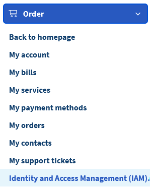

> [!primary]
> Esta tradução foi automaticamente gerada pelo nosso parceiro SYSTRAN. Em certos casos, poderão ocorrer formulações imprecisas, como por exemplo nomes de botões ou detalhes técnicos. Recomendamos que consulte a versão inglesa ou francesa do manual, caso tenha alguma dúvida. Se nos quiser ajudar a melhorar esta tradução, clique em "Contribuir" nesta página.
>

## Objetivo

A OVHcloud permite-lhe criar utilizadores locais com permissão de leitura ou escrita na Área de Cliente. Assim, os membros da sua empresa podem ter acesso aos seus serviços OVHcloud. E isto sem que haja necessidade de recorrer a práticas pouco seguras como a partilha de palavras-passe ou de códigos de dupla autenticação.

> [!primary]
>
> A gestão dos utilizadores é diferente da gestão dos contactos. Um utilizador terá acesso a todas as secções da Área de Cliente em função do nível de direitos que lhe é concedido.
>
> Já a gestão de contactos visa delegar a administração completa dos aspetos administrativos, técnicos ou de faturação de um ou vários serviços associados à sua conta OVHcloud. Para mais informações acerca da gestão de contactos, consulte [este guia](/pages/account_and_service_management/account_information/managing_contacts).
>

**Este guia explica os diferentes privilégios de que um utilizador local pode dispor, bem como o método de criação e de gestão de utilizadores.**

## Requisitos

- Ter uma conta OVHcloud ativa.
- Ter acesso à Área de Cliente.

## Instruções

### Apresentação das identidades

Os utilizadores locais são um dos tipos de identidades que podem ser implementadas na sua conta OVHcloud. Outros tipos de conta são descritos em [documentação associada](/pages/manage_and_operate/iam/identities-management).

### Gestão dos utilizadores

#### Adicionar um utilizador

Clique no nome da sua conta no canto superior direito e, a seguir, no seu nome na barra lateral.

{.thumbnail}

Pode aceder ao menu IAM através da entrada dedicada na sua Área de Cliente.

{.thumbnail}

De seguida, clique no separador `Identidades`{.action} para aceder à gestão dos utilizadores locais.

{.thumbnail}

De seguida, pode clicar em `Adicionar utilizador`{.action}.

Na janela que se abrir, complete os campos obrigatórios. Clique em `Validar`{.action} para criar o utilizador.

{.thumbnail}

| Campo | Detalhes |
|--|--|
| ID de utilizador | Introduza, por exemplo, o nome do utilizador ou a sua função. |
| E-mail | Introduza o endereço de e-mail do utilizador. |
| Palavra-passe | Defina a palavra-passe do utilizador. Mais tarde, ele poderá alterar esta palavra-passe.  Sugerimos que consulte [o guia sobre a gestão de palavras-passe](/pages/account_and_service_management/account_information/manage-ovh-password){.external} antes de a definir. |
| Grupo | Escolha um dos grupos disponíveis (ver quadro abaixo). |
| Descrição | Pode acrescentar uma descrição do utilizador. Por exemplo, a função que desempenha. |

**Detalhes do grupo predefinido:**

| Papel | Detalhes |
|--|--|
| UNPRIVILEGED (Apenas leitura) | Dá acesso de leitura à Área de Cliente OVHcloud e a todas as suas secções. |
| DEFAULT (Administrador restrito) | Dá acesso de escrita à Área de Cliente OVHcloud e a todas as suas secções, **à exceção** da gestão de** utilizadores. |
| ADMIN (Administrador) | Dá acesso de escrita à Área de Cliente OVHcloud e a todas as suas secções, **incluindo** a gestão dos utilizadores. |

O utilizador receberá um ID próprio, composto pelo ID digital da conta (indicado no menu «Gestão de utilizadores») e pelo nome de utilizador, com as duas referências separadas por uma barra.

Por exemplo: **1234-567-89/johnsmith**.

{.thumbnail}

O utilizador em causa poderá desde logo aceder à [Área de Cliente OVHcloud](https://www.ovh.com/auth/?action=gotomanager&from=https://www.ovh.pt/&ovhSubsidiary=pt){.external} por meio desse ID de utilizador. 

Ele poderá igualmente alterar a sua própria palavra-passe e proteger o seu próprio acesso à conta ativando uma medida de dupla autenticação (esta última só será aplicada ao acesso desse utilizador). Para esse efeito, aconselhamos a consulta do [guia respeitante à implementação da dupla autenticação](/pages/account_and_service_management/account_information/secure-ovhcloud-account-with-2fa){.external}.

#### Gerir os utilizadores

Pode alterar, desativar/ativar ou suprimir um utilizador clicando nas reticências `...`{.action} que surgem à direita.

{.thumbnail}

A alteração do utilizador permite atualizar o seu endereço de e-mail, os seus privilégios e a sua descrição.

{.thumbnail}

### Gestão dos grupos

#### Adicionar um grupo

No separador `Identitades`{.action}, clique em `Declarar um grupo`{.action}.

{.thumbnail}

Aparecerá uma janela e deverá preencher os campos necessários. Clique em `Validar`{.action} para criar o grupo.

{.thumbnail}

Os grupos atribuem um nível de privilégio por defeito aos utilizadores que contêm, em função do papel que escolhe:

| Papel | Detalhes |
|--|--|
| Nenhum | Não dá acesso à Área de Cliente OVHcloud se não for implementada uma política IAM. |
| Apenas leitura | Dá acesso de leitura à Área de Cliente OVHcloud e a todas as suas secções. |
| Administrador restrito | Dá acesso de escrita à Área de Cliente OVHcloud e a todas as suas secções, **à exceção** da gestão de** utilizadores. |
| Administrador | Dá acesso de escrita à Área de Cliente OVHcloud e a todas as suas secções, **incluindo** a gestão dos utilizadores. |

#### Gerir os grupos

Pode atualizar ou eliminar um grupo ao clicar no botão `...`{.action} à direita do nome do grupo.

{.thumbnail}

Quando alterar um grupo, pode modificar a sua descrição e o seu papel.

{.thumbnail}

### Gestão de permissões

Além do papel associado aos grupos de utilizadores, pode melhorar os privilégios de acesso ao IAM OVHcloud.

Consulte o nosso guia sobre [gestão das políticas IAM da OVHcloud](/pages/account_and_service_management/account_information/iam-policy-ui).

## Quer saber mais?

Fale com a nossa comunidade de utilizadores em <https://community.ovh.com/en/>.