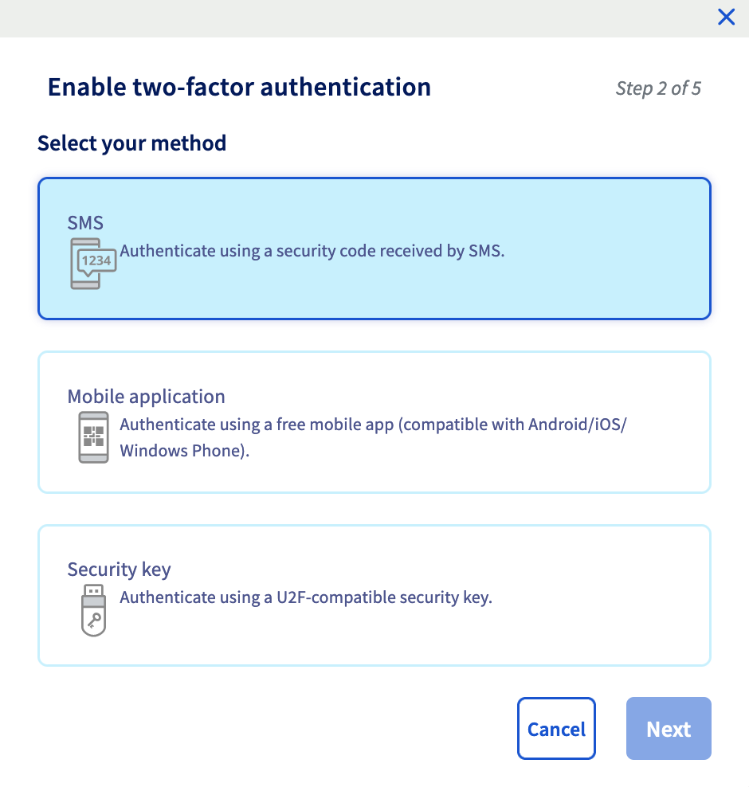
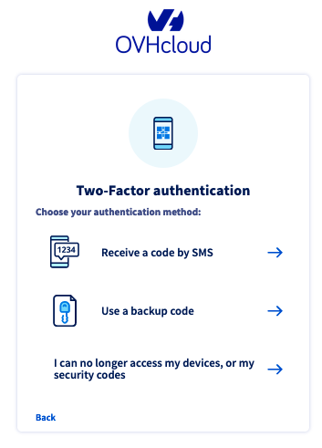

> [!primary]
> Diese Übersetzung wurde durch unseren Partner SYSTRAN automatisch erstellt. In manchen Fällen können ungenaue Formulierungen verwendet worden sein, z.B. bei der Beschriftung von Schaltflächen oder technischen Details. Bitte ziehen Sie im Zweifelsfall die englische oder französische Fassung der Anleitung zu Rate. Möchten Sie mithelfen, diese Übersetzung zu verbessern? Dann nutzen Sie dazu bitte den Button "Beitragen" auf dieser Seite.
>

## Ziel

OVHcloud stellt mit der Zwei-Faktor-Authentifizierung (2FA) Möglichkeiten zur Verfügung, um die Sicherheit Ihres Accounts und Ihrer Dienste zu erhöhen.
2FA ergänzt Ihre Anmeldung im Kundencenter mit Kennung und Passwort mithilfe eines zusätzlichen Geräts: z.B. Mobiltelefon, Tablet oder USB-Sicherheitsschlüssel.  

**Diese Anleitung erklärt die verschiedenen Sicherheitsmethoden und deren Aktivierung.**

Diese Anleitung gliedert sich folgendermaßen:

- [Die verschiedenen Methoden der Zwei-Faktor-Authentifizierung](#instructions)
- [Erste Zwei-Faktor-Authentifizierung aktivieren](#enabling-2fa)
- [Anmelden mit Zwei-Faktor-Authentifizierung](#login-2fa)
- [Vorgehen bei Verlust/Diebstahl/Beschädigung Ihres Telefons/Tablets/Schlüssels](#lost-device)
- [Wie kann die Zwei-Faktor-Authentifizierung vollständig deaktiviert werden?](#disable-2fa)

## Voraussetzungen

- Sie haben Zugriff auf Ihr [OVHcloud Kundencenter](https://www.ovh.com/auth/?action=gotomanager&from=https://www.ovh.de/&ovhSubsidiary=de).
- Sie haben ein Mobiltelefon (für die Methode per SMS), ein Smartphone oder Tablet (für die Methode über mobile Applikation) oder einen “Universal Second Factor (U2F)” Sicherheitsschlüssel.
- Sie haben die [Empfehlungen zur Verwaltung des Zugangspassworts für Ihren Kunden-Account](/pages/account_and_service_management/account_information/manage-ovh-password) zur Kenntnis genommen.

## In der praktischen Anwendung 

Sie können eine oder mehrere Methoden der Zwei-Faktor-Authentifizierung aktivieren, um den Zugang zu Ihrem Kundencenter abzusichern und zu steuern.

Wir bieten vier verschiedene Methoden an (klicken Sie jeweils auf die Tabs, um deren Erläuterung anzuzeigen):

> [!tabs]
> SMS
>> 
>> Für diese Methode müssen Sie Ihre Mobiltelefonnummer angeben.
>> Sie erhalten bei jedem Versuch, sich mit Ihrem OVHcloud-Konto zu verbinden, einen Einmalcode per SMS zugesandt.
>>
>> Der Hauptvorteil dieser Methode ist, dass Codes an ein Gerät separat von Ihrem Computer gesendet werden. Bei einer Kompromittierung Ihres Systems, zum Beispiel über Malware, bliebe Ihr Account dennoch abgesichert.
>> Sie müssen jedoch über eine ausreichende Netzwerkabdeckung verfügen, um SMS empfangen zu können.
>>
> Mobil-App
>> 
>> Für diese Methode müssen Sie eine **OTP App** auf Ihrem Android oder iOS Smartphone oder Tablet installieren.
>> Es gibt zahlreiche OTP-Anwendungen (es wurden keine OTP-Anwendungen von OVHcloud entwickelt), die Sie aus dem Google Play Store für Android oder aus dem Apple Store für iOS herunterladen können. Die folgenden beiden Anwendungen sind kostenlos:
>>
>> - FreeOTP für Android
>> - OTP Auth für iOS
>>
>> Sobald die App mit Ihrem OVHcloud-Account verbunden ist, generiert sie einen für wenige Sekunden gültigen Einmalcode für jeden Verbindungsversuch.
>>
>> > [!success]
>> > **Vorteile dieser Methode**:
>> >
>> > - Sobald die App Ihrem Account zum ersten Mal zugewiesen wurde, ist es nicht mehr notwendig, mit dem Internet auf Ihrem Smartphone/Tablet verbunden zu sein, damit die Codes generiert werden.
>> > - Sie können eine einzige OTP-Anwendung für alle Ihre Dienste oder Websites verwenden, die eine Zwei-Faktor-Authentifizierung erfordern.
>>
> USB-Token
>> 
>> Für diese Methode benötigen Sie einen USB-"Schlüssel" **U2F**, den Sie bei jeder Verbindung mit Ihrem OVHcloud Kunden-Account an einen USB-Port Ihres Computers anschließen. Die Authentifizierung erfolgt dann automatisch.
>>
>> Diese Methode bietet ein höheres Sicherheitsniveau, da sie auf einem separaten physischen Sicherheitsfaktor basiert, der vollständig von Ihrem Computer, Smartphone oder Tablet getrennt ist und weniger anfällig für Hacks ist.
> Notfall-Codes
>> 
>> Wenn Sie eine Zwei-Faktor-Authentifizierung konfigurieren (zum ersten Mal mit **SMS**, **OTP App** oder **U2F**), werden Ihnen im Kundencenter 10 Notfall-Codes zur **Einmalverwendung*** angezeigt.
>>
>> Diese Methode der Zwei-Faktor-Authentifizierung ergänzt eine bereits aktivierte Methode (mit **SMS**, **OTP App** oder **U2F**) und kann nicht alleinstehend aktiviert werden.
>>
>> Bei jedem Anmeldeversuch können Sie einen der 10 Einmalcodes eingeben.
>> Es ist wichtig, immer mindestens einen Notfall-Code übrig zu haben. Denken Sie daran, diese über Ihr Kundencenter zu erneuern, wenn Sie alle verwendet oder sie verloren haben.

### Schritt 1: Aktivieren Sie Ihre erste Methode der Zwei-Faktor-Authentifizierung 

Verbinden Sie sich mit dem [OVHcloud Kundencenter](https://www.ovh.com/auth/?action=gotomanager&from=https://www.ovh.de/&ovhSubsidiary=de){.external}, klicken Sie oben rechts auf Ihren Namen (1) und dann auf Ihre Initialen (2). Klicken Sie dann auf `Sicherheit`{.action} (3) und schließlich auf `Die Zwei-Faktor-Authentifizierung aktivieren`{.action} (4).

{.thumbnail}

**Klicken Sie auf den Tab für die gewünschte Methode:**

> [!tabs]
> SMS
>> Wählen Sie die Methode SMS aus und klicken Sie auf `Weiter`{.action}.
>>
>>{.thumbnail width="400"} 
>> Geben Sie Ihre Mobiltelefonnummer im internationalen Format ein (zum Beispiel +33612345678 für ein Mobiltelefon in Frankreich) und bestätigen Sie.
>> Ein Validierungscode wird dann per SMS an die von Ihnen angegebene Nummer gesendet.
>>
>>{.thumbnail width="400"} 
>> Geben Sie diesen Code in das dafür vorgesehene Feld ein. 
>> Sie können auch eine Beschreibung für die angegebene Telefonnummer hinzufügen.
>>
>>{.thumbnail width="400"} 
>> Die Zwei-Faktor-Authentifizierung ist nun aktiviert. Sie können auch weitere Nummern hinzufügen.
> Mobil-App
>> Wählen Sie die Methode mobile Applikation aus und klicken Sie auf `Weiter`{.action}.
>>
>>{.thumbnail width="400"} 
>> Ein QR-Code wird generiert, scannen Sie ihn über Ihre OTP-Anwendung. Wenn Ihre OTP-Anwendung diese Option nicht anbietet, klicken Sie auf `Geheimnis anzeigen`{.action}, um einen Code anzuzeigen, der in der OTP-Anwendung eingegeben werden muss. 
>> Die Anwendung generiert dann einen Einmalcode.
>> Geben Sie diesen Code in das dafür vorgesehene Feld ein (rechts neben dem QR-Code). Sie können auch eine Beschreibung für diese Authentifizierungsmethode hinzufügen.
>>
>>{.thumbnail width="400"} 
>> Die Zwei-Faktor-Authentifizierung ist nun aktiviert.
> USB-Token
>> Wählen Sie die Methode USB-Token und klicken Sie auf `Weiter`{.action}.
>>
>>{.thumbnail width="400"} 
>> Schließen Sie Ihren USB-Token an, wenn Sie dazu aufgefordert werden. Falls vorhanden, drücken Sie den Knopf auf dem Gerät.
>>
>>{.thumbnail width="400"}
>>
>> > [!warning]
>> > Es wird ein Popup-Fenster geöffnet, in dem Sie zur Validierung des Schlüssels aufgefordert werden. Wenn dieses Fenster nicht angezeigt wird, überprüfen Sie Ihren Browser, um sicherzustellen, dass Popups nicht blockiert werden.
>>
>> Nach dem Erkennen des Schlüssels können Sie auch eine Beschreibung hinzufügen.
>> Die Zwei-Faktor-Authentifizierung ist nun aktiviert.

Nachdem Sie die erste Methode hinzugefügt haben, können Sie auch **eine oder zwei weitere Methoden hinzufügen**, um mehrere Optionen zur Anmeldung bei Ihrem Konto zu haben.

### Schritt 2: Speichern Sie die Sicherheitscodes  

Wenn Sie zum ersten Mal eine Zwei-Faktor-Authentifizierung hinzufügen, werden Ihnen im Kundencenter 10 **Notfall-Codes** zur einmaligen Verwendung angezeigt.

**Bewahren Sie diese gut auf**. Wir empfehlen Ihnen, sie in einem Passwort-Manager wie [Keepass](https://keepass.info/){.external} oder [Bitwarden](https://bitwarden.com/) zu speichern (beide Apps sind kostenlos).

{.thumbnail width="544"}

Sie können die Notfall-Codes über Ihr Kundencenter neu generieren oder löschen:

{.thumbnail}

> [!warning]
>
> Es wird dringend empfohlen, **diese Notfall-Codes** zu sichern und sicherzustellen, dass sie gültig sind.
> Ohne Sicherheitscode in Ihrem Besitz und im Falle eines Diebstahls oder Verlusts Ihres Telefons/Smartphones/Tablets oder Ihres USB-Tokens kann der Zugang zu Ihrem Kundencenter und Ihren Diensten gesperrt werden.
>

### Schritt 3 - Loggen Sie sich mit der Zwei-Faktor-Authentifizierung in Ihr OVHcloud Kundencenter ein 

Gehen Sie auf die [Authentifizierungsseite im OVHcloud Kundencenter](https://www.ovh.com/auth/?action=gotomanager&from=https://www.ovh.de/&ovhSubsidiary=de){.external} und geben Sie Ihre Kundenkennung (oder Ihre Haupt-E-Mail-Adresse) und Ihr Passwort ein.

Im Anmeldebildschirm wird die zuletzt verwendete oder aufgefüllte Methode der Zwei-Faktor-Authentifizierung angezeigt. Wenn Sie eine andere Methode verwenden möchten, klicken Sie auf den Button `Eine andere Methode verwenden`{.action}.

{.thumbnail width="400"}

Alle aktivierten Methoden werden angezeigt, einschließlich der Notfall-Codes.

{.thumbnail width="400"}

Wenn Sie diese Methode wählen, müssen Sie nur einen Ihrer Notfall-Codes eingeben.

{.thumbnail width="400"}

### Was passiert, wenn eines meiner Peripheriegeräte verloren geht/gestohlen wird oder nicht mehr funktioniert? 

Wenn Ihr Peripheriegerät (Mobiltelefon/Smartphone/Sicherheitsschlüssel) verloren geht, gestohlen wird oder nicht mehr funktioniert:

- Verwenden Sie [die aktiven Notfall-Codes](#codes), die Sie gesichert haben.
- Sie können ein anderes Gerät zur Zwei-Faktor-Authentifizierung verwenden, wenn Sie mehrere Geräte zur Zwei-Faktor-Authentifizierung aktiviert haben.
- [Die Zwei-Faktor-Authentifizierung deaktivieren](#desactivation).

> [!warning]
>
> Wenn eines Ihrer Geräte verloren gegangen ist oder gestohlen wurde, kann dies die Sicherheit Ihres OVHcloud-Accounts gefährden.
> Sobald Sie wieder Zugang zu Ihrem Kundencenter haben, entfernen Sie **dieses Gerät aus der Liste der Geräte, die für die Zwei-Faktor-Authentifizierung verwendet werden**.
>
> Weitere Informationen zum Entfernen eines Geräts finden Sie im nächsten Abschnitt.
>

#### Gerät löschen 

> [!warning]
>
> Bevor Sie ein Gerät entfernen und den Zugriff auf Ihren Kunden-Account nicht blockieren, stellen Sie sicher, dass Sie über folgende Optionen verfügen:
>
> - Ein anderes funktionsfähiges Gerät
> - Eine andere funktionalen Methode der Zwei-Faktor-Authentifizierung
> - Gültige Notfall-Codes.
>

Um ein Gerät zu entfernen, loggen Sie sich in Ihrem [OVHcloud Kundencenter](https://www.ovh.com/auth/?action=gotomanager&from=https://www.ovh.com/de/&ovhSubsidiary=de){.external} ein. Klicken Sie oben rechts auf Ihren Namen und dann auf Ihre Initialen.

Klicken Sie dann auf `Sicherheit`{.action}, dann auf die `...`{.action} rechts vom zu löschenden Gerät und schließlich auf `Löschen`{.action}.

{.thumbnail}

Anschließend wird ein letzter Bestätigungscode an das zu löschende Gerät gesendet. Geben Sie diesen Code in das angezeigte Fenster ein und klicken Sie auf `Bestätigen`{.action}, um den Löschvorgang abzuschließen.

Wenn Sie keinen Zugriff mehr auf das Gerät haben, das Sie löschen möchten, können Sie es nicht selbst aus dem OVHcloud Kundencenter löschen.
In diesem Fall **kontaktieren Sie unsere Support-Teams direkt**, indem Sie [ein Ticket über das Help Center erstellen](https://help.ovhcloud.com/csm?id=csm_get_help) oder indem Sie den unten beschriebenen Vorgang ausführen [#2FA-deletion].

> [!warning]
>
> Das Löschen eines einzelnen Geräts deaktiviert nicht die Zwei-Faktor-Authentifizierung für Ihren OVHcloud Kunden-Account.

### Die Zwei-Faktor-Authentifizierung vollständig deaktivieren 

#### Wenn Sie noch Zugriff auf Ihr OVHcloud Kundencenter haben

Um die Zwei-Faktor-Authentifizierung für Ihren OVHcloud Kunden-Account vollständig zu deaktivieren, müssen **alle** hierfür registrierten Geräte gelöscht **und die Notfall-Codes deaktiviert werden**.

Um die Peripheriegeräte zu entfernen, lesen Sie den [entsprechenden Abschnitt dieser Anleitung](#delete-device).

Wenn alle Ihre Geräte gelöscht sind, deaktivieren Sie die Notfall-Codes, indem Sie auf den Button `2FA-Codes deaktivieren`{.action} klicken.

{.thumbnail}

#### Wenn Sie keinen Zugriff mehr auf Ihr OVHcloud Kundencenter haben 

Wenn Sie über keine gültigen Geräte oder Notfall-Codes mehr verfügen, müssen Sie die Deaktivierung der Zwei-Faktor-Authentifizierung anfordern. Geben Sie hierzu die für Ihren OVHcloud-Account erforderlichen Identitätsnachweise an.

Gehen Sie zunächst auf [die Authentifizierungsseite im OVHcloud Kundencenter](/links/manager).

Geben Sie Ihre OVHcloud ID und Ihr Passwort ein, um auf den Schritt der Zwei-Faktor-Authentifizierung zuzugreifen. Klicken Sie nun auf den Button `Nie mam dostępu do telefonu komórkowego, klucza bezpieczeństwa U2F ani kodów zapasowych`{.action}. 
Wenn diese Schaltfläche nicht angezeigt wird, klicken Sie auf die Schaltfläche `Andere Methode testen`{.action} und dann auf `Nie mam dostępu do telefonu komórkowego, klucza bezpieczeństwa U2F ani kodów zapasowych`{.action}.

Über das folgende Interface können Sie die notwendigen Dokumente hochladen und an unsere Teams senden, um die Zwei-Faktor-Authentifizierung für Ihren Account zu deaktivieren.

> [!warning]
>
> - Achtung, stellen Sie bitte sicher, dass alle Dokumente korrekt und lesbar sind, bevor Sie sie versenden.
> - **Akzeptierte Formate**: jpg, jpeg, pdf, png. Die maximale Dateigröße für jedes Dokument beträgt 10 MB.
> - Bei ungültigen Dokumenten wird dieser Vorgang abgebrochen und Sie müssen einen neuen durchführen.

Innerhalb von 72 Stunden erhalten Sie eine Bestätigung der Deaktivierung der Zwei-Faktor-Authentifizierung per E-Mail.

/// Details | Liste der Belege

|OVHcloud Account-Typ|Vorzulegende Nachweise|
|---|---|
|Privatperson|- Beidseitige Kopie eines Identitätsnachweises (Personalausweis, Führerschein, Reisepass), ausgestellt auf den Inhaber des OVHcloud Kunden-Accounts|
|Unternehmen|- Identitätsnachweis (Personalausweis, Führerschein, Reisepass) der zur Vetretung des Unternehmens berechtigten Person (sensible Daten können unkenntlich gemacht werden, nur der vollständige Name und das Ablaufdatum müssen sichtbar sein)  - Handelsregisterauszug des Unternehmens|

///

Kontaktieren Sie den OVHcloud Support unter +49 681 906730, sobald Ihre entsprechenden Nachweise vollständig vorliegen.

> [!warning]
>
>  Die Dokumente müssen uns von einer E-Mail-Adresse aus übermittelt werden, die in Ihrem OVHcloud Kunden-Account hinterlegt ist.

> [!success]
>
> Nach Überprüfung Ihrer Unterlagen kann ein Support-Mitarbeiter die Zwei-Faktor-Authentifizierung manuell aus Ihrem OVHcloud Kunden-Account entfernen.

## Weiterführende Informationen

Kontaktieren Sie für spezialisierte Dienstleistungen (SEO, Web-Entwicklung etc.) die [OVHcloud Partner](https://partner.ovhcloud.com/de/directory/).

Wenn Sie Hilfe bei der Nutzung und Konfiguration Ihrer OVHcloud Lösungen benötigen, beachten Sie unsere [Support-Angebote](https://www.ovhcloud.com/de/support-levels/).

Für den Austausch mit unserer User Community gehen Sie auf <https://community.ovh.com/en/>.
