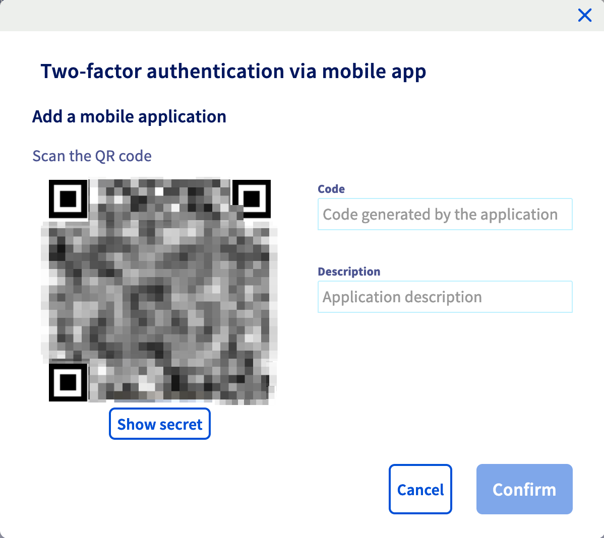

> [!primary]
> Tłumaczenie zostało wygenerowane automatycznie przez system naszego partnera SYSTRAN. W niektórych przypadkach mogą wystąpić nieprecyzyjne sformułowania, na przykład w tłumaczeniu nazw przycisków lub szczegółów technicznych. W przypadku jakichkolwiek wątpliwości zalecamy zapoznanie się z angielską/francuską wersją przewodnika. Jeśli chcesz przyczynić się do ulepszenia tłumaczenia, kliknij przycisk "Zgłóś propozycję modyfikacji" na tej stronie.
>

## Wprowadzenie

OVHcloud oddaje do Twojej dyspozycji narzędzia pozwalające zwiększyć bezpieczeństwo Twojego konta i naszych usług.
Możesz aktywować uwierzytelnianie z wykorzystaniem weryfikacji dwuetapowej (2FA). Metoda ta stanowi uzupełnienie loginu i hasła. Można z niej korzystać za pośrednictwem posiadanego urządzenia: telefonu, tabletu lub klucza sprzętowego. 

**Poznaj różne oferowane metody weryfikacji dwuetapowej i sposoby ich aktywacji.**

Z tego przewodnika dowiesz się:

- [Poznaj różne metody weryfikacji dwuetapowej](#instructions)
- [Aktywuj Twoją pierwszą metodę weryfikacji dwuetapowej](#enabling-2fa)
- [Dowiedz się, jak się zalogować przy użyciu weryfikacji dwuetapowej](#login-2fa)
- [Poznaj kroki, jeśli Twój telefon/tablet/klucz został zgubiony(a) / skradziony(e) / uszkodzony(e)](#lost-device)
- [Dowiedz się, jak całkowicie wyłączyć weryfikację dwuetapową](#disable-2fa)

## Wymagania początkowe

- Dostęp do [panelu klienta OVHcloud](/links/manager).
- Posiadanie telefonu komórkowego (w przypadku metody SMS-owej), smartfona lub tabletu (w przypadku aplikacji mobilnej), bądź klucza sprzętowego Universal Second Factor (U2F).
- Zapoznanie się z [zaleceniami dotyczącymi zarządzania hasłem dostępu do konta](/pages/account_and_service_management/account_information/manage-ovh-password).

## W praktyce 

Możesz aktywować jedną lub więcej metod weryfikacji dwuetapowej, aby zabezpieczyć i kontrolować dostęp do Twojego panelu klienta.

Proponujemy cztery różne metody (kliknij na poniższe zakładki, aby wyświetlić ich prezentację):

> [!tabs]
> SMS
>>  
>> W przypadku tej metody należy podać numer telefonu komórkowego.
>> Otrzymasz kod jednorazowy SMS-em przy każdej próbie zalogowania się na Twoje konto OVHcloud.
>>
>> Główną zaletą tej metody jest korzystanie z kodu przesyłanego na inne urządzenie niż Twój komputer. W razie włamania na komputer, np. za sprawą oprogramowania malware, Twoje konto pozostanie bezpieczne.
>> Musisz jednak dysponować wystarczającym zasięgiem sieci, aby móc otrzymywać SMS-y.
>>
> Aplikacja mobilna
>>  
>> W przypadku tej metody należy zainstalować aplikację **OTP** na smartfonie lub tablecie z systemem Android lub iOS.
>> Istnieje wiele aplikacji OTP (OVHcloud nie opracowała żadnej aplikacji OTP), które można pobrać ze Sklepu Google Play dla Androida lub z Apple Store dla iOS. Następujące dwie aplikacje są darmowe:
>>
>> - FreeOTP dla Androida
>> - OTP Auth dla systemu iOS
>>
>> Po połączeniu aplikacji z kontem OVHcloud aplikacja generuje kod jednorazowy, który zachowuje ważność przez krótki czas (kilka sekund) przy każdej próbie logowania.
>>
>> > [!success]
>> > **Zalety tej metody**:
>> >
>> > - Po pierwszym powiązaniu aplikacji z Twoim kontem dostęp smartfona/tabletu do Internetu nie będzie już konieczny, aby wygenerować kody.
>> > - Możesz używać jednej aplikacji OTP do obsługi wszystkich usług lub stron wymagających weryfikacji dwuetapowej.
>>
> Klucz bezpieczeństwa
>>  
>> Metoda ta wymaga fizycznego klucza **U2F**, który należy podłączyć do portu USB komputera przy każdym połączeniu z kontem OVHcloud. Uwierzytelnienie zostanie wówczas przeprowadzone automatycznie.
>>
>> Metoda ta zapewnia wyższy poziom bezpieczeństwa, ponieważ opiera się na niezależnym urządzeniu zabezpieczającym, całkowicie odseparowanym od komputera, smartfona lub tabletu, dzięki czemu jest mniej narażone na ryzyko włamania.
> Kody zapasowe
>>  
>> Jeśli po raz pierwszy skonfigurujesz weryfikację dwuetapową (za pomocą **SMS**, **Aplikacja mobilna** lub **Klucz bezpieczeństwa**), w Panelu klienta wyświetli się 10 kodów zapasowych **jednorazowych**.
>>
>> Ta metoda weryfikacji dwuetapowej jest uzupełnieniem metody już aktywowanej (przez **SMS**, **Aplikacja mobilna** lub **Klucz bezpieczeństwa**). Metody tej nie można aktywować samodzielnie.
>>
>> Przy każdej próbie zalogowania możesz wpisać jeden z 10 kodów jednorazowych.
>> Bardzo ważne jest, aby zawsze dysponować co najmniej jednym pozostałym kodem zapasowym. Pamiętaj, aby wygenerować je ponownie w Panelu klienta, jeśli już z nich korzystałeś lub je utraciłeś.

### Etap 1 - Aktywuj Twoją pierwszą metodę weryfikacji dwuetapowej 

Zaloguj się do [Panelu klienta OVHcloud](/links/manager){.external}, kliknij Twoją nazwę w prawym górnym rogu (1), a następnie Twoje inicjały (2). Następnie kliknij przycisk `Bezpieczeństwo`{.action} (3), a na koniec `Włącz weryfikację dwuetapową`{.action} (4).

{.thumbnail}

**Kliknij na zakładkę wybranej przez Ciebie metody:**

> [!tabs]
> SMS
>> Wybierz metodę SMS-ową i kliknij na `Dalej`{.action}.
>>
>> {.thumbnail width="400"} 
>> Wprowadź numer telefonu komórkowego w formacie międzynarodowym (na przykład +33612345678 na telefon komórkowy we Francji) i zatwierdź.
>> Na podany numer otrzymasz wiadomość SMS z kodem zatwierdzenia.
>>
>> {.thumbnail width="400"} 
>> Wpisz ten kod w odpowiednim polu. 
>> Możesz również dodać opis podanego numeru telefonu.
>>
>> {.thumbnail width="400"} 
>> Weryfikacja dwuetapowa jest teraz aktywna. Można też dodać kolejne numery.
> Aplikacja Mobilna
>> Wybierz metodę za pomocą aplikacji mobilnej i kliknij przycisk `Dalej`{.action}.
>>
>> {.thumbnail width="400"} 
>> Wygenerowany jest kod QR. Zeskanuj go za pomocą aplikacji OTP. Jeśli Twoja aplikacja OTP nie oferuje tej opcji, kliknij `Wyświetl klucz`{.action}, aby wyświetlić kod, który należy wprowadzić w aplikacji OTP. 
>> Aplikacja generuje kod jednorazowy.
>> Wpisz ten kod w odpowiednim polu (po prawej stronie kodu QR). Możesz również dodać opis dla tej metody uwierzytelniania.
>>
>> {.thumbnail width="400"} 
>> Weryfikacja dwuetapowa jest teraz aktywna.
> Klucz bezpieczeństwa
>> Wybierz metodę z wykorzystaniem klucza sprzętowego i kliknij na `Dalej`{.action}.
>>
>> {.thumbnail width="400"} 
>> Podłącz klucz sprzętowego, gdy otrzymasz taki monit. Jeśli jest on wyposażony w przycisk, naciśnij go.
>>
>> {.thumbnail width="400"}
>>
>> > [!warning]
>> > Otworzy się okno pop-up z prośbą o zatwierdzenie klucza. Jeśli to okno nie pojawi się, sprawdź, czy Twoja przeglądarka nie blokuje okien pop-up.
>>
>> Po rozpoznaniu klucza możesz także dodać opis.
>> Weryfikacja dwuetapowa jest teraz aktywna.

Po dodaniu pierwszej metody możesz również **dodać jedną lub dwie inne metody**, aby mieć więcej sposobów logowania się do swojego konta.

### Etap 2 - Zapisz kody zapasowe 

Przy pierwszym dodaniu weryfikacji dwuetapowej w Panelu klienta wyświetlanych jest 10 jednorazowych kodów zapasowych **jednorazowych**.

**Zachowaj je w bezpiecznym miejscu**. Zalecamy, aby przechowywać je w menedżerze haseł, takim jak [KeePass](https://keepass.info/){.external} lub [Bitwarden](https://bitwarden.com/) (obie aplikacje są bezpłatne).

{.thumbnail width="544"}

Możesz wygenerować lub usunąć kody zapasowe w Panelu klienta:

{.thumbnail}

> [!warning]
>
> Stanowczo zaleca się wykonanie kopii zapasowej tych kodów zapasowych** i upewnienie się, że są one prawidłowe.
> Bez posiadanego kodu bezpieczeństwa, w przypadku kradzieży lub utraty telefonu/smartfona/tabletu lub klucza sprzętowego, dostęp do Twojego panelu klienta i usług może zostać zablokowany.
>

### Etap 3 - Logowanie do Panelu klienta OVHcloud z weryfikacją dwuetapową 

Przejdź do [strony uwierzytelniania w Panelu klienta OVHcloud](/links/manager){.external} i wpisz swój identyfikator (lub główny adres e-mail) oraz hasło.

Na ekranie identyfikacji wyświetlana jest ostatnia użyta lub podana metoda weryfikacji dwuetapowej. Jeśli chcesz skorzystać z innej metody, kliknij przycisk `Wypróbuj inną metodę`{.action}.

{.thumbnail width="400"}

Pojawią się wówczas wszystkie aktywowane przez Ciebie metody, w tym metoda kodów zapasowych.

{.thumbnail width="400"}

Wybierając tę ostatnią metodę, wystarczy wpisać jeden z kodów zapasowych.

{.thumbnail width="400"}

### Co zrobić, jeśli jedno z moich urządzeń zostanie zgubione/skradzione lub przestanie działać? 

Jeśli Twoje urządzenie (telefon komórkowy/smartfon/klucz sprzętowy) zostanie zgubione, skradzione lub przestanie działać, możesz:

- używać [kody zapasowe](#codes) aktywnych, które zapisałeś;
- korzystać z innego dostępnego urządzenia do weryfikacji dwuetapowej, jeśli aktywowałeś kilka takich urządzeń;
- [wyłącz weryfikację dwuetapową](#2FA-deletion).

> [!warning]
>
> W przypadku zgubienia lub kradzieży jednego z Twoich urządzeń może być zagrożone bezpieczeństwo konta OVHcloud.
> Po ponownym uzyskaniu dostępu do Panelu klienta należy **usunąć to urządzenie z listy urządzeń używanych do weryfikacji dwuetapowej**.
>
> Więcej informacji na temat usuwania urządzenia można znaleźć w następnym rozdziale tego przewodnika.
>

### Usuń urządzenie 

> [!warning]
>
> Aby nie zablokować dostępu do Twojego konta, przed usunięciem urządzenia upewnij się, że dysponujesz co najmniej jedną z poniższych metod:
>
> - innego działającego urządzenia;
> - inną działającą metodą weryfikacji dwuetapowej;
> - prawidłowymi kodami zapasowymi.
>

Aby usunąć urządzenie, zaloguj się do [Panelu klienta OVHcloud](/links/manager){.external}. Kliknij Twoją nazwę w prawym górnym rogu, a następnie Twoje inicjały.

Następnie kliknij przycisk `Bezpieczeństwo`{.action}, po czym kliknij `...`{.action} po prawej stronie Twojego urządzenia do usunięcia, a na koniec wybierz `Usuń`{.action}.

{.thumbnail}

Na urządzeniu, które chcesz usunąć, zostanie wysłany ostatni kod weryfikacyjny. W wyświetlonym oknie wpisz ten kod, a następnie kliknij `Zatwierdź`{.action}, aby zakończyć usuwanie.

Jeśli nie masz dostępu do urządzenia, które chcesz usunąć, nie będziesz mógł usunąć go samodzielnie z Panelu klienta OVHcloud.
W takim przypadku **skontaktuj się bezpośrednio** z naszymi zespołami pomocy, [tworząc zgłoszenie z Centrum pomocy](https://help.ovhcloud.com/csm?id=csm_get_help) lub postępując zgodnie z procedurą opisaną [poniżej](#2FA-deletion).

> [!warning]
>
> Usunięcie pojedynczego urządzenia nie powoduje dezaktywacji weryfikacji dwuetapowej na koncie OVHcloud.

### Wyłącz w pełni weryfikację dwuetapową 

#### Jeśli masz dostęp do Panelu klienta OVHcloud

Aby w pełni wyłączyć weryfikację dwuetapową na Twoim koncie OVHcloud, usuń **wszystkie** wskazane urządzenia **i wyłącz kody zapasowe**.

Aby usunąć każde urządzenie, zapoznaj się z [częścią niniejszego przewodnika](#delete-device).

Po usunięciu wszystkich urządzeń, wyłącz kody zapasowe, klikając przycisk `Wyłącz kody 2FA`{.action}.

{.thumbnail}

#### Jeśli nie masz już dostępu do Panelu klienta OVHcloud 

Jeśli nie dysponujesz już prawidłowymi urządzeniami lub prawidłowymi kodami zapasowymi, poproś o dezaktywację weryfikacji dwuetapowej, dostarczając dokumenty potwierdzające tożsamość powiązane z Twoim kontem OVHcloud.

Najpierw przejdź do [strony uwierzytelniania w Panelu klienta OVHcloud](/links/manager).

Aby przejść do etapu weryfikacji dwuetapowej, wprowadź identyfikator OVHcloud i hasło. Kliknij przycisk `Nie mam dostępu do telefonu komórkowego, klucza bezpieczeństwa U2F ani kodów zapasowych`{.action}. 
Jeśli nie widzisz tego przycisku, kliknij przycisk `Wypróbuj inną metodę`{.action}, a następnie `Nie mam dostępu do telefonu komórkowego, klucza bezpieczeństwa U2F ani kodów zapasowych`{.action}.

Poniższy interfejs umożliwia przesłanie i wysłanie do naszych pracowników dokumentów niezbędnych do wyłączenia weryfikacji dwuetapowej na Twoim koncie.

> [!warning]
>
> - Uwaga: upewnij się, że wszystkie dokumenty są poprawne i czytelne przed wysłaniem.
> - **Akceptowane formaty** : jpg, jpeg, pdf, png. Maksymalny rozmiar pliku dla każdego dokumentu to 10 MB.
> - W przypadku nieprawidłowych dokumentów procedura ta zostanie anulowana i będziesz musiał przeprowadzić nową procedurę.

W ciągu 72 godzin otrzymasz e-mail z potwierdzeniem dezaktywacji weryfikacji dwuetapowej.

/// details | Lista dokumentów potwierdzających

|Typ konta OVHcloud|Wymagane dokumenty|
|---|---|
|Osoba prywatna|- Dowód tożsamości (dowód tożsamości, prawo jazdy, paszport) zawierający nazwisko, datę urodzenia i datę ważności na nazwisko posiadacza konta OVHcloud|
|Firma|- Dokument potwierdzający tożsamość (dowód tożsamości, prawo jazdy, paszport) zawierający nazwisko, datę urodzenia i datę ważności, osoby upoważnionej do reprezentowania firmy.  - Dokumenty potwierdzające dane firmy - kopia nadania NIPu lub Regonu lub aktualny odpis z KRS, wydruk z CEIDG|

///

Po skomplementowaniu dokumentów skontaktuj się z pomocą OVHcloud +48 71 750 02 00.

> [!warning]
>
> Dokumenty należy przesłać z adresu e-mail przypisanego do konta klienta OVHcloud.

Po sprawdzeniu dokumentów konsultant może ręcznie wyłączyć weryfikację dwuetapową na Twoim koncie OVHcloud.

> [!success]
>
> Ze względów bezpieczeństwa, po przywróceniu dostępu do konta, zalecamy jak najszybsze ponowne włączenie weryfikacji dwuetapowej.

## Sprawdź również

W przypadku wyspecjalizowanych usług (pozycjonowanie, rozwój, etc.) skontaktuj się z [partnerami OVHcloud](https://partner.ovhcloud.com/pl/directory/).

Jeśli chcesz otrzymywać wsparcie w zakresie konfiguracji i użytkowania Twoich rozwiązań OVHcloud, zapoznaj się z naszymi [ofertami pomocy](https://www.ovhcloud.com/pl/support-levels/).

Dołącz do społeczności naszych użytkowników na stronie <https://community.ovh.com/en/>. 