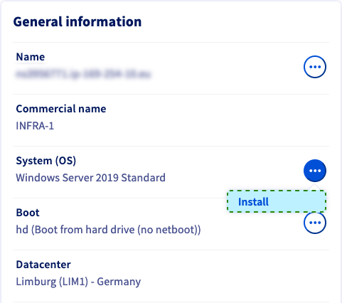

## Objective

With [OVHcloud dedicated servers](https://www.ovhcloud.com/asia/bare-metal/), you can freely [configure partitioning](/pages/bare_metal_cloud/dedicated_servers/partitioning_ovh). This gives customers a wide range of options when installing an operating system. ESXi is an exception because it is a UNIX-based, proprietary system with a proprietary installer.<br />
OVHcloud installations of ESXi are therefore compliant with the configuration set by the software publisher. Since ESXi 7.0, it is possible to choose between 4 different predefined partitioning layouts. This guide will show you how to select a partitioning layout in the [OVHcloud Control Panel](https://ovh.com/manager/#/dedicated/configuration) or via the [OVHcloud API](https://ca.api.ovh.com/).

> [!primary]
>
> ESXi 7.0 is often used as an example but this documentation is valid for any further versions of ESXi as well.
>

## Requirements

- A [dedicated server](https://www.ovhcloud.com/asia/bare-metal/) **ready to be installed/reinstalled** in your OVHcloud account that is compatible with ESXi
- Access to the [OVHcloud Control Panel](https://ovh.com/manager/#/dedicated/configuration) and/or the [OVHcloud API](https://ca.api.ovh.com/)

> [!alert]
>
> Reinstalling a dedicated server deletes all data currently stored on it.
>

## Instructions

ESXi 7.0 introduced a [boot option to configure the size of ESXi system partitions](https://kb.vmware.com/s/article/81166) because the increased size of the system partition could cause issues, especially on systems with small disks. OVHcloud includes this feature in the [OVHcloud Control Panel](https://ovh.com/manager/#/dedicated/configuration) and the [OVHcloud API](https://ca.api.ovh.com/).

Even with multiple disks available on a server, the ESXi OS installation uses only the first disk of the targeted disk group (see [Choosing the disk group to install an operating system](/pages/bare_metal_cloud/dedicated_servers/install_hybrid)). Other disks may be configured afterwards to be used for virtual machines (see [How to add a datastore](/pages/bare_metal_cloud/dedicated_servers/hgrstor2_system_configuration#add-datastore)).

There are 4 different values:

|Value|System size¹|Datastore³|
|---|---|---|
|`default`|130 GiB|All remaining space²|
|`min`|32 GiB|All remaining space²|
|`small`|64 GiB|All remaining space²|
|`max`|All available space²|❌⁴|

¹ On the first disk of the targeted disk group for the OS installation.<br />
² Space on the disk on which the OS will be installed.<br />
³ A datastore is a disk partition (sometimes also called "container") that ESXi will use to store the virtual machines. [More details](https://docs.vmware.com/en/VMware-vSphere/7.0/com.vmware.vsphere.storage.doc/GUID-5EE84941-366D-4D37-8B7B-767D08928888.html).<br />
⁴ Customers can still [add a datastore](/pages/bare_metal_cloud/dedicated_servers/hgrstor2_system_configuration#add-datastore) afterwards on the other disks.

As you can see, no datastore is created on the first disk with the `max` partitioning layout.

> [!primary]
>
> Did you know?
>
> [VMware on OVHcloud solutions](https://www.ovhcloud.com/asia/hosted-private-cloud/vmware/) are based on ESXi with the partitioning layout `small`.
>

### How to select the partitioning scheme

The `default` partitioning scheme will be used unless another one is selected.

#### Via the OVHcloud Control Panel

> [!primary]
>
> The procedure is very similar [to other operating systems](/pages/bare_metal_cloud/dedicated_servers/getting-started-with-dedicated-server), with the exception that you cannot tick the checkbox `Customise the partitioning configuration`{.action} and that you have a dropdown menu to choose the partitioning layout at the fourth and final step.
>

Log in to the [OVHcloud Control Panel](https://ca.ovh.com/auth/?action=gotomanager&from=https://www.ovh.com/asia/&ovhSubsidiary=asia). From the `General information`{.action} tab, click the `...`{.action} button next to the operating system and then click `Install`{.action}.

{.thumbnail}

In the popup window, select `Install from an OVHcloud template`{.action}

Click `Next`{.action} to continue.

{.thumbnail}

Then choose `Virtualisation`{.action}, `UNIX`{.action} and select the version of ESXi you want to install on your dedicated server.

> [!primary]
>
> The `Customise the hardware RAID configuration`{.action} option is only available if your dedicated server has a hardware RAID controller.
>

> [!primary]
>
> The `Customise the partition configuration`{.action} option is not available, for the above reasons.
>

Choose the disk group on which you want ESXi to be installed. Note that only the first disk of this group will be used to install the OS. Find more information in [this guide](/pages/bare_metal_cloud/dedicated_servers/install_hybrid).

Click `Next`{.action} to continue.

{.thumbnail}

In the `Partitioning scheme`{.action} dropdown menu, select the desired partitioning scheme. The overview is updated as soon as you select another partitioning scheme, so you can get an idea of how the partitioning will look like on your dedicated server.

Fill in the other details and click `Confirm`{.action} to start the ESXi installation on your dedicated server.

> [!primary]
>
>  The `Number of disks partitioned`{.action} field is greyed out and set to 1, even if your server has more than 1 disk on the target disks group for OS installation, as explained above.
>

{.thumbnail}

#### Via the OVHcloud API

When triggering an OS installation, the customer can optionally provide a `partitionSchemeName` in order to specify which partitioning layout must be used:

> [!api]
>
> @api {POST} /dedicated/server/{serviceName}/install/start
>

Example of payload:

```json
{
    "templateName": "esxi70_64",
    "partitionSchemeName": "small",
    "userMetadata": []
}
```

To list the different available partitioning schemes for an OVHcloud template, you can use the following API call:

> [!api]
>
> @api {GET} /dedicated/installationTemplate/{templateName}/partitionScheme
>

For example, for `esxi70_64` it will return:

```json
[
"default"
"max"
"small"
"min"
]
```

In order to get the details of the partitioning scheme dynamically, you can use the following API call:

> [!api]
>
> @api {GET} /dedicated/installationTemplate/{templateName}/partitionScheme/{schemeName}/partition
>

You can use the following API call to get the details for each partition:

> [!api]
>
> @api {GET} /dedicated/installationTemplate/{templateName}/partitionScheme/{schemeName}/partition/{mountpoint}
>

## Go further <a name="gofurther"></a>

[Boot option to configure the size of ESXi system partitions](https://kb.vmware.com/s/article/81166)

[Getting started with a dedicated server](/pages/bare_metal_cloud/dedicated_servers/getting-started-with-dedicated-server)

[Getting started with a Kimsufi, So You Start or Rise dedicated server](/pages/bare_metal_cloud/dedicated_servers/getting-started-with-dedicated-server-eco)

[OVHcloud API & Partitioning](/pages/bare_metal_cloud/dedicated_servers/partitioning_ovh)

[Choosing the disk group to install an operating system](/pages/bare_metal_cloud/dedicated_servers/install_hybrid)

[Managing hardware RAID](/pages/bare_metal_cloud/dedicated_servers/raid_hard)

[Hot Swap - Hardware RAID](/pages/bare_metal_cloud/dedicated_servers/hotswap_raid_hard)

Join our community of users on <https://community.ovh.com/en/>.
