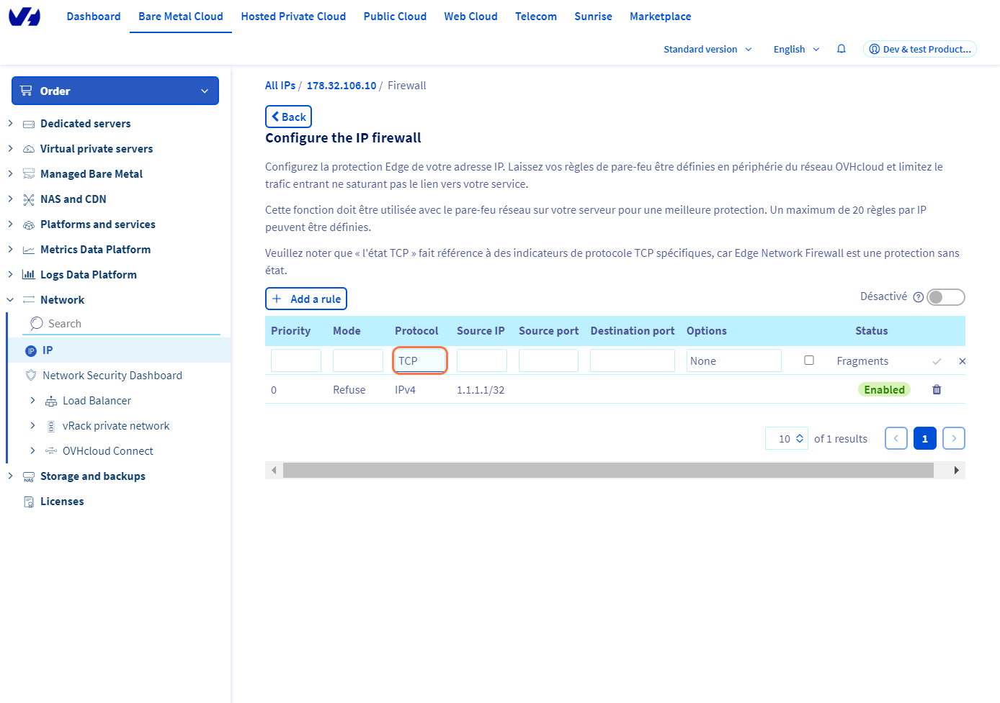
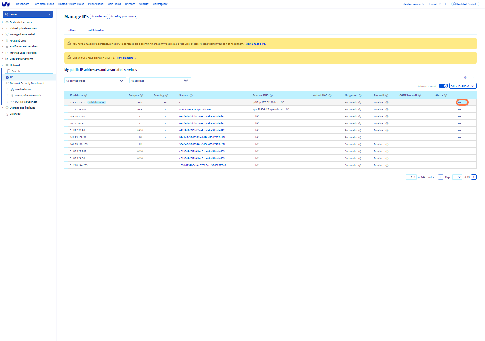
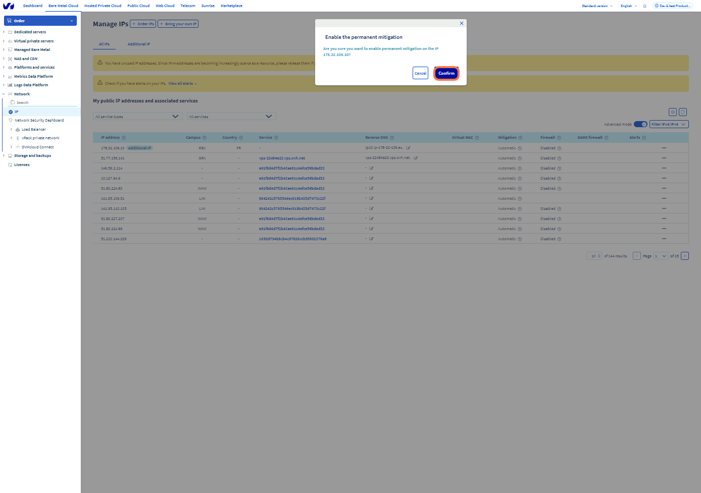

## Objective

To protect all means exposed on public IP addresses, OVHcloud offers a firewall that can be configured and integrated with the **Anti-DDoS Infrastructure** : the Edge Network Firewall. This is an option you can use to limit your service's exposure to attacks from the public internet.

**This guide will show you how to configure Edge Network Firewall for your services**

> [!primary]
>
> You can read more information on our Anti-DDoS solution here: <https://www.ovhcloud.com/en-gb/security/anti-ddos/>.
> 

|  | 
|:--:| 
| How DDoS mitigation is performed at OVHcloud |

## Requirements

- An OVHcloud service exposed using dedicated public IP address ([Dedicated Server](https://www.ovhcloud.com/en-gb/bare-metal/), [VPS](https://www.ovhcloud.com/en-gb/vps/), [Public Cloud instance](https://www.ovhcloud.com/en-gb/public-cloud/), [Hosted Private Cloud](https://www.ovhcloud.com/en-gb/enterprise/products/hosted-private-cloud/), [Additional IP](https://www.ovhcloud.com/en-gb/network/additional-ip/), etc.)
- Access to the [OVHcloud Control Panel](https://www.ovh.com/auth/?action=gotomanager&from=https://www.ovh.co.uk/&ovhSubsidiary=GB)

> [!warning]
> This feature might be unavailable or limited on servers of the [**Eco** product line](https://eco.ovhcloud.com/en-gb/about/).
>
> Please visit our [comparison page](https://eco.ovhcloud.com/en-gb/compare/) for more information.

## Instructions

OVHcloud has recently enhanced its security offering with the introduction of Edge Network Firewall. This advanced feature reduces exposure to network attacks from the Internet by moving firewall rules from the server to the edge of the OVHcloud network. This blocks incoming attacks as close as possible to their origin, reducing the risk of server or rack connectivity saturation for larger attacks. Managing firewall rules can be complex, but thanks to the recent update to the Edge Network Firewall interface, this task is now simpler and more intuitive.

### Enable Edge Network Firewall

> [!primary]
>
> The Edge Network Firewall protects particular IP associated with a server (or service). As a result, if you have a server with multiple IP addresses, you need to configure each IP separately.
> 

In the OVHcloud Control Panel, click on the `Bare Metal Cloud`{.action} section, next click on the `Network`.{action} menu and open `Public IP Adresses`{.action}. You can use the drop-down menu underneath **"My public IP addresses and associated services"** to filter your services according to category.

{.thumbnail}

Next, click the `...`{.action} button to the right of the relevant IPv4 and first select `Create Firewall`{.action}.

{.thumbnail}

You will then be asked to confirm.

{.thumbnail}

> [!primary]
> The `Create Firewall`{.action} button will only be available for IPs that have never configured a firewall. If it is not the first time you are configuring your firewall, you can skip this step. 
>

|  | 
|:--:| 
| Then click `Edge Network Firewall configuration`{.action} to start configuring it. |

On this page you can choose to **Enable** or **Disable** the firewall using the switch button. 

You can set up to **20 rules per IP**.

> [!warning]
>
> The Edge Network Firewall is enabled automatically whenever a DDoS attack was detected, and cannot be disabled before the attack ends. As a result, all the rules configured in the firewall are applied during attack time frame. This logic offers our customers capability to offload server's firewall rules to the edge of OVHcloud network for the time of an attack. We highly recommend to use it together with firewall (or ACL) on your server (or service) for best protection.
> If you have configured some rules, we recommend checking them regularly, even if the firewall is disabled.
>

> [!primary]
>
> - The UDP fragmentation is blocked (DROP) by default. When you enable the Edge Network Firewall, if you use a VPN, remember to configure your maximum transmission unit (MTU) correctly. For example, on OpenVPN, you can tick `MTU test`{.action}.
> - The Edge Network Firewall is not taken into account within the OVHcloud network, so the rules set up do not affect the connections withing OVHcloud ecosystem.
>

### Configure the Edge Network Firewall

> [!warning]
> Please note that the OVHcloud Edge Network Firewall cannot be used to open ports on a server. To open ports on a server, you must go through the firewall of the operating system installed on the server. 
> For more information, please refer to the following guides: [Configuring the firewall on Windows](/pages/bare_metal_cloud/dedicated_servers/activate-port-firewall-soft-win) and [Configuring the firewall on Linux with iptables](/pages/bare_metal_cloud/dedicated_servers/firewall-Linux-iptable).
>

To add a rule :

|  | 
|:--:| 
| click on `Add a rule`{.action}. |

For each rule (excluding TCP), you must choose :

|  | 
|:--| 
| &bull; A priority (from 0 to 19, 0 being the first rule to be applied, followed by the others)  &bull; An action (`Accept`{.action} or `Deny`{.action})  &bull; The protocol  &bull; Source IP (optional) |

For each **TCP** rule, you must choose :

|  | 
|:--| 
| &bull; A priority (from 0 to 19, 0 being the first rule to be applied, followed by the others)  &bull; An action (`Accept`{.action} or `Deny`{.action})  &bull; The protocol  &bull; Source IP (optional)  &bull; The source port  &bull; The destination port  &bull; The TCP state  &bull; Fragments|

> [!primary]
>
> - Priority 0: we advise authorising TCP protocol on all the IPs with an `established`{.action} option. With the established option, you can verify that the packet is part of a session that has previously been opened (already started). If you do not authorise it, the server will not receive the TCP protocol feedback from the SYN/ACK requests.
> - Priority 19: we advise to refuse all IPv4 protocol traffic that has not been accepted by any earlier rule.
> 

> [!warning]
> Firewall setups with only "Accept" mode rules are not effective at all. There must be an instruction what to be dropped by the firewall. You will see warning unless such "Deny" rule is created.
> 

### Configuration example

To make sure that only the SSH (22), HTTP (80), HTTPS (443) and UDP (10,000) ports are left open when authorising the ICMP, follow the rules below:

{.thumbnail}

The rules are sorted from 0 (the first rule read) to 19 (the last). The chain stops being scanned as soon as a rule is applied to the packet.

For example, a packet for TCP port 80 will be captured by rule 2, and the rules that come after will not be applied. A packet for TCP port 25 will only be captured at the last rule (19) which will block it, because the Firewall does not authorise communication on port 25 in the previous rules.

> [!warning]
> As stated, the configuration above is just an example and should only be used as reference if the rules do not apply to services hosted on your server. It is absolutely necessary to configure the rules in your firewall according to the services hosted on your server. Improper configuration of your firewall rules can cause legitimate traffic to be blocked and server services to be inaccessible. 
> 

### Mitigation

#### **Global Attack Filtering Capacity: Advanced Protection**

OVHcloud stands out in the management of digital threats with a DDoS attack filtering capacity of over 17 Tbit/s. This robust infrastructure effectively identifies and neutralises attacks before they impact customer servers. Distributed across OVHcloud's global network, this capacity ensures constant protection, regardless of where servers are located.

Designed to absorb a large volume of malicious traffic, this infrastructure guarantees the continuity of business operations, even in the event of major DDoS attacks. It forms an essential part of OVHcloud's security strategy, reinforcing existing measures such as firewalls and anti-intrusion systems.

In short, OVHcloud's global attack filtering capability plays a crucial role in the security of customer data and services, providing reliable protection against modern cyber attacks.

#### **Rapid detection and mitigation of DDoS attacks**

OVHcloud has put in place an advanced system to detect and counter DDoS attacks in a matter of seconds, essential to minimising their impact. This system reacts automatically, effectively distinguishing between legitimate and malicious traffic, without requiring manual intervention or increasing workload.

Even in the event of an attack, quality of service is maintained, enabling OVHcloud customers to continue their operations with minimal disruption. This rapid and effective response is a pillar of security at OVHcloud, ensuring that customer data and services are protected and accessible in the face of cyber attacks.

#### **Anti-DDoS mitigation modes**

Our Anti-DDoS Infrastructure (VAC) includes three operation modes: automatic, permanent or forced. The mitigation process is OVHcloud's automatic scrubbing center. This is the place where our advanced technology is taking a deep look into packets and malicious traffic (DDoS or other known vulnerabilities) is removed while allowing legitimate traffic to pass through.

- **Automatic mitigation**: By default, all OVHcloud IPs are under automatic mitigation. Automatic mitigation will be enabled only if the traffic is detected as "unusual" compared to the normal traffic usually received by the server. We **recommend** using this mode as best automations are applied during malicious traffic mitigation.

- **Permanent mitigation**: This mode can be enabled or disabled via the OVHcloud Control Panel. With permanent mitigation, you permanently apply first level of filtering through our Shield hardware. 
All traffic permanently gets through the mitigation system before reaching the server. We do not recomend enabling this permanently, unless you experience a latency jitter due to Scrubbing Center traffic redirection is enabled/disabled often.

Please note that enabling this mode is **not** increasing level of protection compared to automatic mode.

To enable it follow these steps: 

|  | 
|:--:| 
| Click on the `Bare Metal Cloud`{.action} menu |

|  | 
|:--:| 
| Select `Network`{.action} section |

|  | 
|:--:| 
| Go to `IP`{.action} section |

|  | 
|:--:| 
|  Next, click on the `...`{.action} button to the right of the relevant IPv4 |

|  | 
|:--:| 
|  Select `Mitigation: permanent mode`{.action} |

|  | 
|:--:| 
|  And `Confirm`{.action} |

- **Forced mitigation**: This mode is automatically enabled once an attack is detected on the server. Once enabled on our Anti-DDoS infrastructure, it cannot be disabled. In order to protect our infrastructure, it will be enabled throughout the attack until it is completely mitigated.

> [!success]
> **Tips**
> You can create attack-only firewall rules that will apply only after an attack is detected. To do that, Edge Network Firewall rules must be created but disabled.
>

> [!warning]
> If our Anti-DDoS infrastructure mitigates an attack, your Edge Network Firewall rules will eventually be applied, even if you have disabled the firewall. If you have disabled your firewall, remember to delete your rules as well.
> 
> Please note that Anti-DDoS Infrastucture cannot be disabled on a service. All OVHcloud products are delivered within the scope of protection and this cannot be changed.
>

## Network Security Dashboard

You can read more information about our [Network Security Dashboard](/pages/bare_metal_cloud/dedicated_servers/network_security_dashboard) in order to get more details about your traffic.

### Conclusion

Having read this tutorial, you should now be able to configure the Edge Network Firewall to enhance the security of your OVHcloud services.

## Go further

- [Protecting a GAME server with the application firewall](/pages/bare_metal_cloud/dedicated_servers/firewall_game_ddos)

Join our community of users on <https://community.ovh.com/en/>.