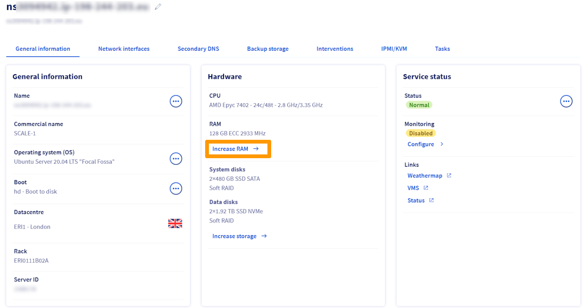
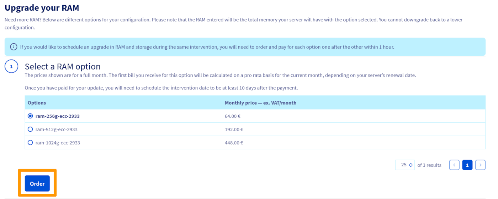
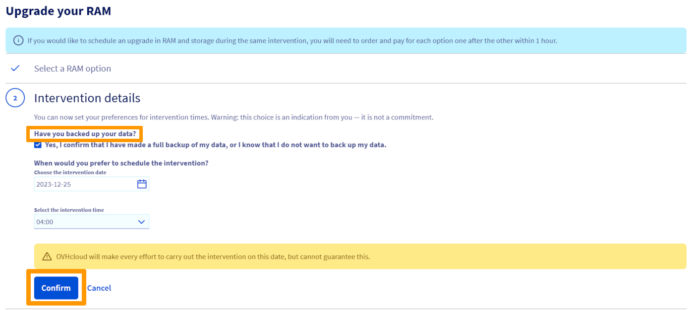
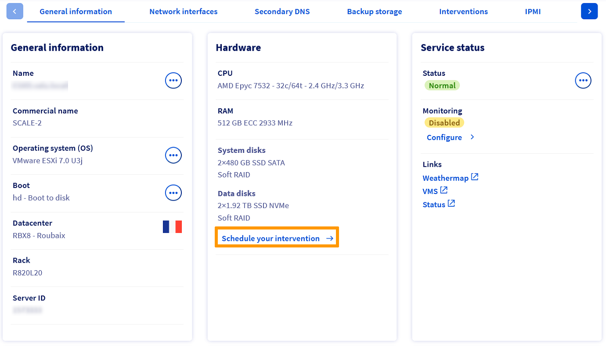

> [!primary]
> Questa traduzione è stata generata automaticamente dal nostro partner SYSTRAN. I contenuti potrebbero presentare imprecisioni, ad esempio la nomenclatura dei pulsanti o alcuni dettagli tecnici. In caso di dubbi consigliamo di fare riferimento alla versione inglese o francese della guida. Per aiutarci a migliorare questa traduzione, utilizza il pulsante "Contribuisci" di questa pagina.
>

## Obiettivo

I nostri server High Grade e Scale offrono un'opzione di scalabilità che permette di aumentare lo spazio disco e la RAM.

**Lo scopo di questa guida è di guidarti nel processo di richiesta dell'upgrade dell'hardware sui server dedicati High Grade e SCALE OVHcloud.**

> [!primary]
> Gli step di questa guida riguardano solo le nostre nuove gamme (High Grade e Scale). Per le gamme meno recenti, la richiesta deve essere effettuata tramite ticket all'assistenza clienti.

## Prerequisiti

- Un server [High Grade](/links/bare-metal/bare-metalhigh-grade/) o [SCALE](/links/bare-metal/bare-metalscale/)
- Avere accesso allo [Spazio Cliente OVHcloud](/links/manager)

## In pratica

Accedi allo [Spazio Cliente OVHcloud](/links/manager).

Nella sezione `Bare Metal Cloud`{.action}, seleziona il tuo server tra i **Server dedicati**.

### Aumenta la RAM

Nella scheda `Hardware`{.action}, clicca su `Aumenta la RAM`{.action}.

{.thumbnail}

Nella scheda seguente, seleziona l’opzione di RAM e clicca su `Ordina`{.action}.

{.thumbnail}

Una volta effettuato il pagamento, riceverai un’email di conferma con un link per pianificare l’intervento di aggiornamento della RAM.

Clicca sul link presente nell’email per essere reindirizzato alla dashboard del server dedicato. Questa volta clicca su `Pianifica il tuo intervento`{.action}.

{.thumbnail}

Seleziona la casella in `Hai effettuato un backup dei tuoi dati?`{.action} e seleziona data e ora tra le fasce orarie proposte. Ti ricordiamo che un intervento dei tecnici dei nostri datacenter richiede un periodo di preparazione. La prima data di disponibilità viene quindi definita dopo un periodo minimo di 10 giorni.

Clicca su `Confermare`{.action}.

{.thumbnail}

Riceverai un’email di conferma della data e dell’ora dell’intervento.

### Aumenta lo storage

Nella scheda `Hardware`{.action}, clicca su `Aumentare lo storage`{.action}.

{.thumbnail}

Nella scheda seguente, seleziona l’opzione di storage e clicca su `Ordina`{.action}.

{.thumbnail}

Una volta effettuato il pagamento, riceverai un’email di conferma con un link per pianificare l’intervento di aggiornamento dello storage.

Clicca sul link presente nell’email per essere reindirizzato alla dashboard del server dedicato. Questa volta clicca su `Pianifica il tuo intervento`{.action}.

{.thumbnail}

Seleziona la casella in `Hai effettuato un backup dei tuoi dati?`{.action} e seleziona data e ora tra le fasce orarie proposte. Ti ricordiamo che un intervento dei tecnici dei nostri datacenter richiede un periodo di preparazione. La prima data di disponibilità viene quindi definita dopo un periodo minimo di 10 giorni.

Clicca su `Confermare`{.action}.

{.thumbnail}

Riceverai un’email di conferma della data e dell’ora dell’intervento.

Per pianificare un upgrade di memoria e storage durante lo stesso intervento, è necessario ordinare ed effettuare il pagamento delle singole opzioni, una a una, entro un'ora.

## Per saperne di più 
 
Per prestazioni specializzate (referenziamento, sviluppo, ecc...), contatta i [partner OVHcloud](/links/partner).
 
Per usufruire di un supporto per l'utilizzo e la configurazione delle soluzioni OVHcloud, è possibile consultare le nostre soluzioni [offerte di supporto](https://www.ovhcloud.com/it/support-levels/).
 
Contatta la nostra Community di utenti all'indirizzo <https://community.ovh.com/en/>.