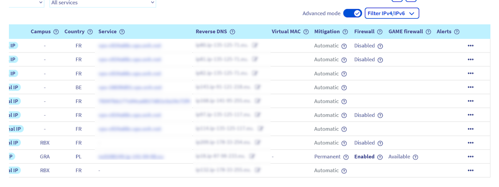
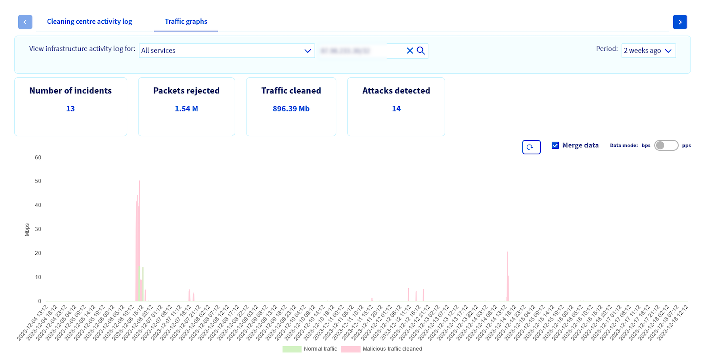

> [!primary]
> Diese Übersetzung wurde durch unseren Partner SYSTRAN automatisch erstellt. In manchen Fällen können ungenaue Formulierungen verwendet worden sein, z.B. bei der Beschriftung von Schaltflächen oder technischen Details. Bitte ziehen Sie im Zweifelsfall die englische oder französische Fassung der Anleitung zu Rate. Möchten Sie mithelfen, diese Übersetzung zu verbessern? Dann nutzen Sie dazu bitte den Button "Beitragen" auf dieser Seite.
>

## Ziel

In dieser Anleitung wird das Network Security Dashboard erläutert. Außerdem erhalten Sie einen Überblick über Gegenmaßnahmen, die von unserer DDoS-Schutzinfrastruktur ausgelöst werden, wenn angreifende Netzwerkaktivitäten erkannt werden. Hier finden Sie Details zu den Auslösern zusätzlicher Schutzmaßnahmen, die eingerichtet werden müssen, um Ihre Dienste am Laufen zu halten. Darüber hinaus stehen im Dashboard Traffic-Diagramme für Aktivitätsperioden im Scrubbing Center zur Verfügung, um die Situation besser darzustellen.

## Voraussetzungen 

- Sie haben eine OVHcloud Dienstleistung abonniert, die über eine dedizierte öffentliche IP-Adresse erreichbar ist ([Dedicated Server](/links/bare-metal/bare-metal), [VPS](https://www.ovhcloud.com/de/vps/), [Public Cloud Instanz](https://www.ovhcloud.com/de/public-cloud/), [Hosted Private Cloud](https://www.ovhcloud.com/de/hosted-private-cloud/), [Additional IP](https://www.ovhcloud.com/en-gb/network/additional-ip/), etc.).
- Sie haben Zugriff auf Ihr [OVHcloud Kundencenter](/links/manager).

## In der praktischen Anwendung

### Netzwerksicherheit 

Die DDoS-Schutz-Infrastruktur von OVHcloud ist ein mehrschichtiges, verteiltes Abwehrsystem gegen Cyber-Angriffe. Es besteht aus mehreren Edge-Standorten und Scrubbing Centern, die schädlichen Traffic analysieren und entfernen können. Zusammen mit der [Edge Network Firewall](/pages/bare_metal_cloud/dedicated_servers/firewall_network) und dem [GAME DDoS-Schutz](/pages/bare_metal_cloud/dedicated_servers/firewall_game_ddos) bietet sie qualitativ hochwertige Schutzdienste für verschiedene Fälle.

Die Anti-DDoS-Infrastruktur analysiert ständig eingehenden Traffic (Erkennungsmechanismus) und leitet diesen schließlich über unsere Scrubbing Center (*Mitigation*) um, die sich in Rechenzentren auf der ganzen Welt befinden. Eingehender Traffic wird gründlich analysiert und schließlich aus schädlichen Paketen herausgefiltert, bevor er Ihren Server oder Dienst erreicht.

#### Was passiert, wenn ein Angriff die IP meines Dienstes erreicht?

Jedes Mal, wenn ein Angriff auf eine IP-Adresse Ihres Dienstes entdeckt wird, werden Sie per E-Mail darüber informiert, dass der Traffic über die DDoS-Schutz-Infrastruktur umgeleitet wurde. Sie können diese Zeiträume auch im Network Security Dashboard mit weiteren Details überwachen.

Während eines Angriffs wird eine aktive Abwehraktion durch ein Warnsymbol auf der Seite IP-Liste (im Bereich `IPs verwalten`{.action} in Ihrem Kundencenter) angezeigt.

{.thumbnail}{.thumbnail}

> [!primary]
>
> Weitere Informationen zur OVHcloud DDoS-Abwehr finden Sie [hier](https://www.ovhcloud.com/de/security/anti-ddos/ddos-attack-Mitigation/).
>

> [!warning]
>
> Beachten Sie, dass die Schutzlogik auf öffentlichen IP-Adressen basiert, die mit einem Server (oder Dienst) verknüpft sind. Daher werden Statistiken und Diagramme auf IP-Basis angezeigt und berechnet.
> 

### Netzwerksicherheitsbenachrichtigungen

{.thumbnail}{.thumbnail}

Rufen Sie im OVHcloud Kundencenter den Bereich `Bare Metal Cloud`{.action} auf. Gehen Sie dann in der linken Seitenleiste zu `Netzwerk`{.action} und klicken Sie auf `IPs verwalten`{.action}. Stellen Sie sicher, dass der `Erweiterte Modus` aktiviert ist, um den Status der Anti-DDoS-Infrastruktur und die Konfiguration ihrer Komponenten anzuzeigen.

Die Spalten entsprechen dem Status des Anti-DDoS-Scrubbing (**Mitigation**) sowie der Verfügbarkeit von Edge Network **Firewall** und **GAME Firewall** und deren Status.

- Der Status der **Mitigation** kann sein:
    - **Automatisch** - Das Scrubbing Center befindet sich im **Automatisch**-Modus. Der empfohlene Modus ist die Umleitung des Traffics für eine gründlichere Analyse bei Bedarf.
    - **Permanent** - Das Scrubbing Center ist **permanent aktiviert**. Es wird nicht empfohlen, es dauerhaft zu aktivieren, es sei denn, zu starkes Latenzschwanken aufgrund von Umleitung des Datenverkehrs festgestellt.
    - **Erzwungen** - Dies weist darauf hin, dass das Scrubbing Center **gerade Maßnahmen anwendet**.

- In der Spalte **Firewall** wird der Status der Edge Network Firewall angegeben:
    - **Aktiviert** - Firewall ist **aktiviert** für diese IP.
    - **Deaktiviert** - Firewall ist **deaktiviert** für diese IP.
    - **(kein Status)** - Die Firewall-Konfiguration wurde nicht erstellt. Um Regeln zu konfigurieren, klicken Sie auf den Button `...`{.action} und wählen dann `Firewall erstellen`{.action}.

- Der Status der **GAME Firewall** (nur verfügbar für [OVHcloud **Game** Dedicated Server](/links/bare-metal/bare-metalprices/#filterType=range_element&filterValue=game)) kann sein:
    - **Ein** - Der Game DDoS-Schutz ist für diese IP **aktiviert**.
    - **Aus** - Die Game Firewall ist **verfügbar**, aber **deaktiviert** auf dieser IP.
    - **(kein Status)** - Die Game Firewall ist für diese IP nicht verfügbar. Dies bedeutet, dass die aufgeführte IP nicht für eine unterstützte Produktreihe konfiguriert ist.

- Die Spalte **Alerts** kann ein aktives Scrubbing Center mit einem Warnsymbol und einem entsprechenden Hinweis anzeigen.

### Dashboard Netzwerksicherheit

Im OVHcloud Kundencenter können Sie das Dashboard entweder über die IP-Liste (für eine bestimmte IP) oder direkt über das Network Security Dashboard im Menü `Network`{.action} aufrufen.

Gehen Sie in den Bereich `Bare Metal Cloud`{.action}, dann links auf `Netzwerk`{.action} und wählen Sie `Network Security Dashboard`{.action}.

Alternativ können Sie von der IP-Liste aus zugreifen (nur verfügbar, wenn das Scrubbing Center aktiv ist): Klicken Sie im OVHcloud Kundencenter auf den Bereich `Bare Metal Cloud`{.action} und anschließend auf das Menü `Netzwerk`{.action} links. Gehen Sie zum Tab `Öffentliche IP Adressen`{.action} und klicken Sie auf `...`{.action}.Öffnen Sie `Network Security Dashboard`{.action}.

Auf der Registerkarte **Scrubbing Center-Protokoll** können Sie alle Informationen zu Angriffen abrufen, die in der Vergangenheit entdeckt wurden (oder zurzeit aktiv sind).

{.thumbnail}

In der Tabelle sind die folgenden Spalten vorhanden: 

- **Erkennungszeit** - Zeitstempel der ersten Angriffserkennung
- **Endzeit** - Zeitstempel, wann das Scrubbing Center die Mitigation abgeschlossen hat
- **Ziel-IP** - Die IP, die Ziel des Angriffs war
- **Angriffsvektoren** - Stellt Informationen über erkannte Angriffstypen bereit, wie UDP- oder TCP-Angriffe etc.

> [!warning]
>
> Beachten Sie, dass Quell-IP-Adressen für erkannte Ereignisse nicht angezeigt werden, da sie in der Regel gefälscht sind (DDoS-Angriffe können auf Quellen verweisen, von denen Sie nicht stammen). Solche Informationen wären also irreführend oder nicht verwendbar.
> 

Auf der Registerkarte **Traffic Chart** sehen Sie ein Diagramm, das den Traffic zu Ihrer IP-Adresse (bps oder pps) anzeigt.

{.thumbnail}

Sie zeigt schädlichen Datenverkehr, der verworfen wurde (**in rot**) und gesäuberten Datenverkehr, der an Ihre IP-Adresse übertragen wurde (**in grün**). Darüber hinaus werden grundlegende Abwehrstatistiken angezeigt, z.B. wie viele Angriffe für eine ausgewählte IP entdeckt wurden, wie viel Traffic (oder Pakete) während der Angriffe gesäubert wurde oder wie oft die Scrubbing Center in einem bestimmten Zeitraum eine Aktion zur Überprüfung Ihres Traffics (Anzahl der Ereignisse) durchgeführt haben.

## FAQ

### Warum werden nicht alle Angriffe auf das Network Security Dashboard angezeigt?

Je nach Art des Angriffs können verschiedene Maßnahmen ergriffen werden, um die Bedrohung am besten zu beseitigen. In beiden Fällen werden Angriffe am besten so nahe wie möglich am Ursprung abgewehrt:

- Bei einem Angriff auf das OVHcloud Netzwerk (**extern**) wird der Traffic zur Reinigung an die Anti-DDoS Scrubbing Center umgeleitet (auf diese Weise im Dashboard sichtbar).
- Beachten Sie, dass Angriffe innerhalb des OVHcloud Netzwerk (**internal**) von unseren Sicherheitsteams behandelt werden. Die Abwehr konzentriert sich auf die Blockierung des Angriffsursprungs und wird von Anti-DDoS-Infrastruktursystemen nicht gemeldet.

### In den Protokollen des Scrubbing Centers werden keine Daten angezeigt. Ist das normal?

Ja, es bedeutet, dass keine vermuteten Angriffe Ihre öffentlichen IP-Adressen zum Ziel hatten.

### Für eine eingegebene IP-Adresse werden kein Traffic-Diagramm oder Daten angezeigt.

Solche Daten stehen nur für öffentliche IP-Adressen zur Verfügung, wenn automatische Anti-DDoS-Infrastrukturerkennungen stattfinden (wenn Traffic über das Scrubbing Center umgeleitet wird).

### Das Traffic-Diagramm ist für einige Positionen in den Scrubbing Center-Protokollen nicht verfügbar.

Traffic-Chart-Daten sind nur für die letzten zwei Wochen verfügbar, während Log-Einträge für das vergangene Jahr überprüft werden können.

### Ein Angriff auf meinen Dienst hält an. Wie kann ich meinen Server besser schützen?

Manche Angriffstypen sind möglicherweise so spezifisch, dass unsere DDoS-Schutz-Infrastruktur sie nicht automatisch erkennen und bereinigen kann. In solchen Fällen ist die auf Ihrem Server konfigurierte Firewall die beste Option. Wir empfehlen auch, einige der Regeln der Server-Firewall an den Rand unseres Netzwerks auszulagern - mithilfe der Edge Network Firewall.

Weitere Informationen zur Konfiguration dieser Regeln finden Sie in der Anleitung zur [Edge Network Firewall](/pages/bare_metal_cloud/dedicated_servers/firewall_network).

### Mein Dienst wird angegriffen und ich habe Probleme mit meinem Server. Was kann ich sonst noch tun?

DDoS-Schutz-Infrastrukturen sind eine Lösung, die auf höchste Effizienz und ein breites Spektrum an zu schützenden Diensten ausgelegt ist. In einigen Fällen kann eine zusätzliche Feinabstimmung erforderlich sein (z.B. für die Anwendungsspezifität oder Volumen). Um dies anzufordern, besuchen Sie unser [Help Center](https://help.ovhcloud.com/csm?id=csm_get_help) und suchen Sie nach der entsprechenden Aktion innerhalb der Kategorie "Netzwerkangriff und/oder DDoS-Schutz".

Um Ihren Fall zu verstehen und Ihnen besser helfen zu können, senden Sie uns einige Details mit:

#### Schritt 1 - Traffic erfassen

Um die beste Lösung für Sie zu liefern, müssen wir zunächst eine Traffic-Probe analysieren.

Um uns eine solche Aufzeichnung zu erhalten, führen Sie diesen Befehl unter Linux aus:

```bash
tcpdump -w capture-ovh -c 100000 port not ssh
```

>[!primary]
>
> Von Windows aus verwenden Sie [Wireshark](https://www.wireshark.org/) und erfassen damit 100000 Pakete.
>

Sobald der Befehl ausgeführt wurde, wird die Capture-Datei erstellt. Sie können die erstellte Datei entweder an Ihr Support-Ticket anhängen oder anhand [dieser Anleitung](/pages/account_and_service_management/account_information/use-plik) unser Tool zum Dateiversand nutzen.

Stellen Sie sicher, dass Sie den Link der hochgeladenen Datei dem Support-Team in Ihrem Ticket mitteilen.

#### Schritt 2 - Informationen für OVHcloud

In allen Fällen, für die Anpassungen unseres DDoS-Schutzes erforderlich sein werden, müssen wir die folgenden spezifischen Angaben erhalten:

- Auf dem betroffenen Server gehosteter Dienst
- Datum und Uhrzeit des Angriffsbeginns
- Datum und Uhrzeit des Angriffs
- Betroffene IP(s)
- Dienst, Protokoll und Port, die vom betroffenen Dienst verwendet werden
- Größe des Service (XS: 1-10, S: 10-100, M: 100-1k, L: 1-10k, XL: 10-100k, XXL: 100k+ Clients verbunden)
- Andere auf dem Server gehostete Dienste
- Andere Ports, die auf dem Server verwendet werden
- Gibt es weitere Dienste auf separaten IPs: Ja/Nein
- Wenn ja, welche IPs
- Wird legitimer Traffic verworfen: JA/NEIN
- Verbindung zum Server verloren: JA/NEIN
- Welche Art legitimer Traffic geblockt wird

## Weiterführende Informationen

[Aktivieren und Konfigurieren der Edge Network Firewall](/pages/bare_metal_cloud/dedicated_servers/firewall_network)

[Game Server mit der Application Firewall schützen](/pages/bare_metal_cloud/dedicated_servers/firewall_game_ddos)

Treten Sie unserer User-Community bei: <https://community.ovh.com/de/>.