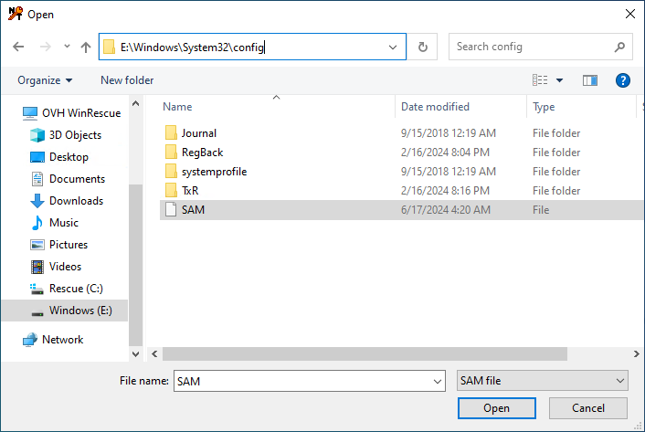

> [!primary]
> Diese Übersetzung wurde durch unseren Partner SYSTRAN automatisch erstellt. In manchen Fällen können ungenaue Formulierungen verwendet worden sein, z.B. bei der Beschriftung von Schaltflächen oder technischen Details. Bitte ziehen Sie im Zweifelsfall die englische oder französische Fassung der Anleitung zu Rate. Möchten Sie mithelfen, diese Übersetzung zu verbessern? Dann nutzen Sie dazu bitte den Button "Beitragen" auf dieser Seite.
>

## Ziel

Diese Anleitung erklärt, wie Sie das Passwort für den Administrator-Account mithilfe der Funktion mit dem **Windows Customer Rescue System** zurückzusetzen.

## Voraussetzungen

- Sie haben einen [Dedicated Server](/links/bare-metal/bare-metal), auf dem eine Version von Microsoft Windows installiert wurde.
- Der Server verfügt über mindestens 16 GB RAM.
- Sie haben Zugriff auf Ihr [OVHcloud Kundencenter](/links/manager).

> [!warning]
>
> Diese Anleitung gilt nicht für den veralteten "Windows PE (WinRescue)" Rescue-Modus.
>
> Befolgen Sie stattdessen [diese Anleitung](/pages/bare_metal_cloud/dedicated_servers/changing-admin-password-on-windows), wenn Sie den Modus `WinPE Rescue` im OVHcloud Kundencenter verwenden.

## In der praktischen Anwendung

### Schritt 1 - Neustart des Servers im Rescue-Modus <a name="step1"></a>

Das System muss im **Windows Customer Rescue System** gestartet werden, bevor das Administratorkennwort geändert werden kann.

Detaillierte Anweisungen finden Sie in der [Anleitung zum Windows Rescue-Modus](/pages/bare_metal_cloud/dedicated_servers/rescue-customer-windows).

### Schritt 2 - Löschen des aktuellen Passworts <a name="step2"></a>

Stellen Sie mithilfe den per E-Mail bereitgestellten Anmeldedaten eine Verbindung mit dem Server über *Remote Desktop* her.

Beachten Sie, dass der Benutzername für den Rescue-Modus "Administrator" ist.

- Wenn der Server Software-RAID auf der Windows-Disk verwendet, müssen Sie die lokale Windows-Disk importieren, um darauf zugreifen zu können: Befolgen Sie die Anweisungen im Abschnitt [A](#sectionA) unten.
- Wenn der Server kein Software-RAID auf der Windows-Disk verwendet, sollten Sie wie im [Abschnitt B](#sectionB) dieser Anleitung beschrieben direkt auf die lokale Windows-Disk zugreifen können.

#### A - Import des lokalen Windows-Datenträgers <a name="sectionA"></a>

##### 1. Zugriff auf Datenträgerverwaltung

Klicken Sie mit der rechten Maustaste auf das Menü `Start`{.action} und wählen Sie `Datenträgerverwaltung`{.action}.

{.thumbnail}

Sie können dann die Disks und Volumes des Servers anzeigen.

{.thumbnail}

Die Windows-Disk Ihres Servers ist wahrscheinlich *Disk 1*. Sie müssen sie importieren, um darauf zugreifen zu können.

Beachten Sie, dass die Anzahl der Windows-Datenträger variieren kann, wenn Sie über mehrere Datenträgergruppen verfügen. Möglicherweise müssen Sie mehrere Datenträger importieren, um die Windows-Disk zu erhalten.

Außerdem müssen Sie die zweite Disk importieren, um Ihr Software-RAID-Volume ordnungsgemäß zu importieren.

##### 2. Lokale Datenträger importieren

Klicken Sie mit der rechten Maustaste auf *Disk 1* und wählen Sie `Online`{.action}.

{.thumbnail}

Führen Sie dasselbe für die zweite Disk (*Disk 2*) aus, um das Software-RAID-Volume ordnungsgemäß zu importieren.

Klicken Sie mit der rechten Maustaste auf *Disk 2* und wählen Sie `Online`{.action}.

{.thumbnail}

Datenträger werden jetzt als "Dynamic" und "Foreign" angezeigt.

Klicken Sie erneut mit der rechten Maustaste auf *Disk 1* und wählen Sie `Fremde Datenträger importieren`{.action}.

{.thumbnail}

Klicken Sie wiederholt auf `OK`{.action}.

{.thumbnail}

{.thumbnail}

Sie sehen, dass jetzt auf den lokalen Datenträger zugegriffen werden kann und dass `(E:)` der Windows-Datenträger ist (verteilt auf zwei Software RAID Datenträger vom Typ *Mirrored Volume*).

{.thumbnail}

> [!primary]
> In diesem Beispiel ist der Volume-Status "*Resynching*", da der Server im Rescue-Modus neu gestartet wurde. Dies ist ein erwarteter Zustand, der nicht vom Rescue-Modus selbst verursacht wird.
>
> Die Daten auf dem Volume sind hiervon nicht betroffen, und die Neusynchronisierung wird fortgesetzt, sobald der Server auf dem installierten Betriebssystem neu gestartet wird.

> [!Warnung]
>
> Sie müssen dann den Pfad Ihres lokalen Windows-Verzeichnisses (hier ist es `E:\Windows`) verwenden, wenn Sie nach der unten stehenden SAM-Konfigurationsdatei suchen.

Sie können das Passwort jetzt zurücksetzen, indem Sie die folgenden Anweisungen ausführen.

#### B - Zurücksetzen des Passworts <a name="sectionB"></a>

Zum Zurücksetzen von Passwörtern ist das Tool NTPWEdit erforderlich.<br>
Sobald Sie über *Remote Desktop* verbunden sind, öffnen Sie den Browser und laden die Software von der [offiziellen Website](http://www.cdslow.org.ru/files/ntpwedit/ntpwed07.zip) herunter.<br>
Navigieren Sie zu dem Ordner, in dem sich die heruntergeladene ZIP-Datei befindet, und extrahieren Sie den Inhalt.<br>
Öffnen Sie anschließend die ausführbare Datei `ntpwedit64`, um die Anwendung zu starten.

In dieser Benutzeroberfläche können Sie die SAM-Datei bearbeiten, um das Kennwort des Administrator-Accounts zu löschen.

Sie müssen das lokale Windows-Laufwerk durchsuchen, um die SAM-Datei Ihres Systems zu finden.

Klicken Sie auf `...`{.action}, um das Laufwerk mit dem lokalen Windows-Ordner Ihres Servers zu durchsuchen.

Normalerweise ist dies das Laufwerk `Windows (E:\)`.

{.thumbnail}

Gehen Sie zu `E:\WINDOWS\SYSTEM32\CONFIG\`.

Öffnen Sie die SAM-Datei, um die Benutzerkonten anzuzeigen, indem Sie auf `Open`{.action} klicken.

{.thumbnail}

Wählen Sie das Benutzerkonto "admin" und klicken Sie auf `Change password`{.action}.

{.thumbnail}

Lassen Sie im Popup-Fenster die Felder leer und klicken Sie auf `OK`{.action}. Klicken Sie zum Abschluss auf `Save changes`{.action} and `Exit`{.action}.

Danach muss der Server mit dem regulären Betriebssystem neu gestartet werden.

### Schritt 3 - Neustart des Servers <a name="step3"></a>

Ändern Sie zuerst den Netboot-Modus im OVHcloud Kundencenter wieder auf "Von Festplatte booten" (siehe [Schritt 1](#step1)).

Wechseln Sie wieder zum Fenster der KVM-Sitzung und wählen Sie die Herunterfahren-Option `Neustart`{.action} über den Windows-Button unten links aus. 

{.thumbnail}

### Schritt 4 - Ein neues Passwort einrichten (IPMI) <a name="step4"></a>

Navigieren Sie in Ihrem OVHcloud Kundencenter zum Tab IPMI, um eine KVM-Sitzung zu öffnen.

{.thumbnail}

#### Für eine neuere Version von Windows

Sobald Sie auf Ihren Server über IPMI zugegriffen haben, klicken Sie auf das Startmenü unten links. Geben Sie `Sign-in options` ein und klicken Sie dann auf `Sign-in options`{.action}

{.thumbnail}

Klicken Sie anschließend unter "Passwort" auf die Schaltfläche `Hinzufügen`{.action}, um Ihr neues Passwort festzulegen.

{.thumbnail}

#### Für eine ältere Version von Windows

Ein Kommandozeilenfenster (`cmd`) sollte sich öffnen, wenn die KVM-Sitzung eingerichtet wird.

Legen Sie das Passwort des aktuellen Benutzers ("Administrator") fest:

```bash
net user Administrator *
```

{.thumbnail}

Wir empfehlen, die virtuelle Tastatur zu verwenden, wenn Sie im Konsolenfenster Passwörter eingeben, um Fehler zu vermeiden.

## Weiterführende Informationen

Treten Sie unserer [User Community](/links/community) bei.