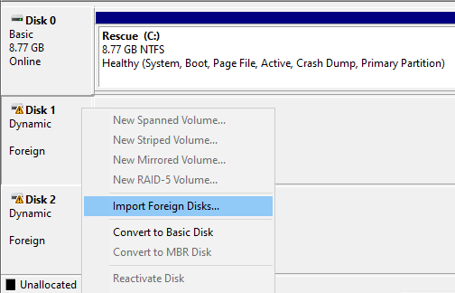
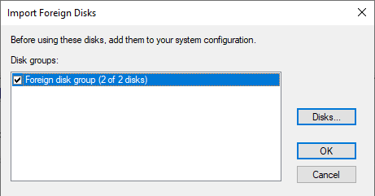
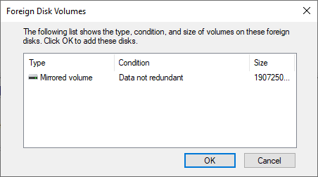
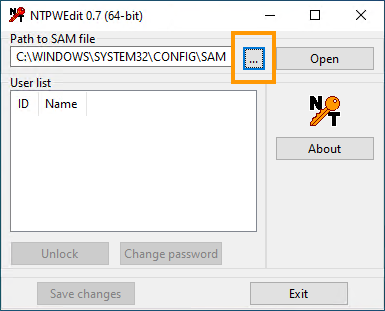

## Objective

This guide will help you to reset your `Administrator`'s password with the __*Windows customer rescue system*__.

## Requirements

- Microsoft Windows installed on your [dedicated server](/links/bare-metal/bare-metal)
- At least 16 GB of RAM installed on the server
- Access to the [OVHcloud Control Panel](/links/manager)

> [!warning]
>
> This guide is not compatible with the `WinPE Rescue` mode.
> Read [this guide](/pages/bare_metal_cloud/dedicated_servers/changing-admin-password-on-windows) if you are using the `WinPe Rescue` mode.
>

## Instructions

### Step 1 - Rebooting the server into rescue mode <a name="step1"></a>

The system has to be started in __*Windows customer rescue system*__ before the admin password can be changed.

For detailed instructions, please refer to the [rescue mode guide](/pages/bare_metal_cloud/dedicated_servers/rescue-customer-windows).

### Step 2 - Clearing the current password <a name="step2"></a>

Connect to your server in Remote Desktop using the credentials provided by email.

Please note that the user name for the rescue is `Administrator`.

- If you server uses software RAID on your Windows disk, you have to import your Windows local disk to be able to access it: follow the instructions of the section [A) Importing your local Windows disk](#sectionA).
- If you server does not use software RAID on your Windows disk, you should be able to access directly access the local Windows disk as explained in the section [B) Resetting the pasword ](#sectionB).

#### A) Importing your local Windows disk <a name="sectionA"></a>

##### 1. Access disk management

Right-click the `Start`{.action} menu and select `Disk Management`{.action}.

{.thumbnail}

You can then see the disks and volumes of the server.

{.thumbnail}

Your server's Windows disk is probably *disk 1*, so you must import it to be able to access it.
Please note that if you have several disk groups, the number of the Windows disk may vary, you may have to import several disks to get the Windows one.

##### 2. Importing local disk

Right-click *Disk 1* and select `Online`{.action}.

{.thumbnail}

Do the same thing for the second disk (Disk 2) to properly import your software raid.

Right-click *Disk 2* and select `Online`{.action}.

{.thumbnail}

Disks are now seen as "Dynamic" and "Foreign".

Right-click *Disk 1* again and select `Import Foreign Disks`{.action}.

{.thumbnail}

Click `OK` twice:

{.thumbnail}

{.thumbnail}

Here, you can see that the local disk is now accessible and the Windows disk is drive `E:` (spreading on two disks because it is in software RAID).

{.thumbnail}

> [!primary]
> In this example, the volume status is "Resynching" because the server was hard-rebooted in rescue mode. This is the normal behaviour and it is not caused by the rescue itself.
> This will not affect data on the volume and resynchronisation will continue after the server is rebooted on its normal OS.

> [!warning]
>
> You must then use the path of your local Windows directory (here it is `E:\Windows`) when browsing to find the "SAM" configuration file below.

You can now reset the password by following the instructions below.

#### B) Resetting the pasword <a name="sectionB"></a>

To reset passwords, the NTPWEdit tool is required.<br>
Once you are connected via Remote Desktop, open the browser and download it from its [official website](http://www.cdslow.org.ru/files/ntpwedit/ntpwed07.zip).<br>
Navigate to the folder where the downloaded ZIP file is located and extract its content.<br>
Next, open the `ntpwedit64` executable to start the application.

In this interface, you can manipulate the SAM file in order to clear the admin user's password.

You must browse the local Windows drive to find your server's SAM file.

Click the three dots button (`...`{.action}) to browse the drive containing your server's local Windows drive

It usually is `Windows (E:\)`

{.thumbnail}

Browse to `E:\WINDOWS\SYSTEM32\CONFIG\`

Open the SAM file to display the list of users by clicking `Open`{.action}.

{.thumbnail}

The relevant user will either be "admin" or "Administrator", depending on the Windows version. If both are present, choose "admin". Then click `Change password`{.action}.

{.thumbnail}

In the pop-up window, leave the fields empty and click `OK`{.action}. Finish by clicking `Save changes and Exit`{.action}.

After this, the server needs to be rebooted again.

### Step 3 - Rebooting the server <a name="step3"></a>

First, change the netboot back to "Boot from the hard disk" in your OVHcloud Control Panel (see [step 1](#step1)).

Then restart the server from the Control Panel.

Click the `...`{.action} button near "Status" in the "Service Status" section and click `Restart`{.action}.

{.thumbnail}

### Step 4 - Setting a new password (IPMI) <a name="step4"></a>

In your OVHcloud Control Panel, navigate to the IPMI tab to open a KVM session.

{.thumbnail}

#### For a newer version of Windows

Once you have accessed your server through IPMI, click the hourglass icon on the bottom-left. Start typing `Sign-in options` and click the `Sign-in options`{.action} button once it pops up.

{.thumbnail}

Next, click the `Add`{.action} button under "Password" to set your new password.

{.thumbnail}

#### For an older version of Windows

A command line window (cmd) should open when the KVM session is established.

Set the password for the current user (`Administrator`):

```bash
net user Administrator *
```

{.thumbnail}

We advise you to use the virtual keyboard when typing passwords in this interface.

## Go further

Join our [community of users](/links/community).
