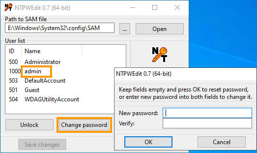

## Objectif

Ce guide va vous aider à reinitialiser le mot de passe `Administrator` grace au __*Windows customer rescue system*__.

## Prérequis

- Microsoft Windows doit être installé sur votre [serveur dédié](/links/bare-metal/bare-metal)
- Avoir au moins 16Go de RAM sur votre serveur
- Accès à [OVHcloud Control Panel](/links/manager)

> [!warning]
>
> Ce guide n'est pas compatible avec `WinPE Rescue`.  
> Suivez [ce guide](/pages/bare_metal_cloud/dedicated_servers/changing-admin-password-on-windows/guide.en-gb.md) si vous utilisez `WinPe Rescue`.
>

## Instructions

### Étape 1: Redémarrez le serveur en mode rescue <a name="step1"></a>

Le système doit être démarré en mode __*Windows customer rescue system*__ avant que le mot de passe puisse être changé.

Pour plus de détails, référez-vous [guide du rescue](/pages/bare_metal_cloud/dedicated_servers/rescue-customer-windows/guide.fr-fr.md).

### Étape 2: Effacer le mot de passe courant <a name="step2"></a>

Connectez-vous au serveur grace à la Connexion Bureau à distance (RDP) et aux informations d'identification transmises par email.

Notez que le nom d'utilisateur est `Administrator`.

- Si votre serveur utilise un RAID logiciel sur le disque système, vous devez d'abord l'importer avant de pouvoir réinitialiser le mot de passe : suivez les instructions de la [section A](#sectionA).
- Si votre serveur n'utilise pas de RAID logiciel sur le disque système: vous pouvez directement réinitialiser le mot de passe en suivant les instructions de la [section B](#sectionB).

#### A) Importer votre disque local Windows <a name="sectionA"></a>

1) __Accéder à la gestion des disques__

Cliquez avec le bouton-droit sur le menu démarrer et selectionnez `Disk Management`{.action}.

{.thumbnail}

Vous pouvez désormais visualiser les disques et volumes du serveur.

{.thumbnail}

Le disque contenant Windows sur votre serveur est probablement le _disk 1_, vous devez donc l'importer pour pouvoir y accéder.
Notez que si votre serveur comporte plusieurs groupes de disques, le numéro de disque contenant Windows peut être différent et vous pourriez avoir à importer plusieurs disques avant de trouver celui-ci.
Vous devez également importer le deuxième disque pour importer correctement le volume de RAID logiciel (appelé .

2) __Importer les disques__

Cliquez avec le bouton-droit sur _Disk 1_ and selectionnez `Online`{.action}.

{.thumbnail}

Faites la même chose avec le deuxième disque (Disk 2) pour importer correctement le volume de RAID logiciel.

Cliquez avec le bouton-droit sur _Disk 2_ and selectionnez "Online".

{.thumbnail}

Les disques sont maintenant vus comme "Dynamic" et "Foreign".

Cliquez avec le bouton-droit sur _Disk 1_ and selectionnez `Import Foreign Disks`{.action}.

{.thumbnail}

Cliquez deux fois sur `OK`.

{.thumbnail}

{.thumbnail}

Le disque local est désormais accessible et le disque Windows correpsond au volume "(E:)" (qui s'étale sur deux disques configurés en RAID logiciel de type Mirrored volume).

{.thumbnail}

__Note__: Dans cet exemple, l'état du volume est "Resynching" car le serveur a été brutalement redémarré en mode rescue. C'est un état normal qui n'est pas causé par le rescue en lui-même.
Cela n'affectera pas les données du volume et la resynchronisation continuera une fois le serveur redémarré sur son système installé.

> [!warning]
>
> Vous devez utiliser le chemin vers votre dossier local Windows (ici c'est E:\Windows) quand vous naviguerez pour trouver le fichier de configuration _SAM_ dans la section suivante.

Vous pouvez maintenant réinitialiser le mot de passe en suivant les instruction de la section suivante.

#### B) Réinitialiser le mot de passe <a name="sectionB"></a>

Pour réinitialiser un mot de passe, l'utilitaire NTPWEdit est nécessaire.
Un fois connecté via le Bureau à distance (RDP) ouvrez le navigateur internet (MS Edge) et téléchargez l'utilitaire à partir du [site web officiel](http://www.cdslow.org.ru/files/ntpwedit/ntpwed07.zip).
Naviguez jusqu'au dossier où se trouve le fichier ZIP téléchargé et extrayez le contenu.
Ouvrez ensuite l'exécutable `ntpwedit64.exe` pour démarrer l'application.

Sur cette interface, vous pouvez manipuler le fichier _SAM_ afin d'effacer le mot de passe de l'utilisateur admin.

Vous devez naviguer dans le dossier local Windows pour y trouver le fichier _SAM_ de votre système.

Cliquez sur le bouton des trois points (`...`{.action}) pour naviguer dans le lecteur ou se trouve le dossier local Windows.

Généralement, c'est le lecteur `Windows (E:\)`

{.thumbnail}

Naviguez jusqu'à `E:\WINDOWS\SYSTEM32\CONFIG\`

Sélectionnez et ouvrez le fichier SAM_ pour voir les comptes utilisateur en sélectionnant `Open`{.action}.


Sélectionnez le compte utilisateur "admin" puis cliquez sur `Change password`{.action}.

{.thumbnail}

Dans la fenêtre qui apparaît, laissez les champs vides et cliquez sur `OK`{.action}. Terminez en cliquant sur `Enregistrer les modifications`{.action} puis sur `Quitter`{.action}.

Le serveur doit alors être redémarré sur le système d'exploitation normal.

### Étape 3: Redémarrer le serveur <a name="step3"></a>

Commencez par remplacer le netboot par Booter sur le disque dur dans l'espace client OVHcloud (voir [Etape 1](#step1)).

Puis redémarrez le serveur à partir de l'espace client:

Click the `...`{.action} button near "Status" in the "Service Status" section and click `Restart`{.action}.
Cliquez sur le bouton (`...`{.action}) près de la section "État des services" et sélectionnez `Redémarrer`{.action}.

{.thumbnail}

### Étape 4: Définir un nouvau mot de passe (IPMI) <a name="step4"></a>

Dans l'[espace client OVHcloud](https://www.ovh.com/auth/?action=gotomanager&from=https://www.ovh.com/fr/&ovhSubsidiary=fr), accédez à l'onglet `IPMI`{.action} pour ouvrir une session KVM.

{.thumbnail}

#### Pour une version récente de Windows

Une fois connecté à votre serveur, cliquez sur l'icone du menu démarrer en bas à gauche.
Commencez à taper "options de connextion" puis cliquez sur "Options de connextion" quand cela apparaît dans le menu.

{.thumbnail}

Ensuite, dans la section ""Mot de passe" cliquez sur le bouton "Ajouter" pour définir votre nouveau mot de passe.

{.thumbnail}

#### Pour une version antérieure de Windows

Une fenêtre de ligne de commande (cmd) doit s'ouvrir lorsque la session KVM est établie.

Définissez le mot de passe de l'utilisateur actuel (« Administrator »):

```bash
net user Administrator *
```

{.thumbnail}

Il est recommandé d'utiliser le clavier virtuel lors de la saisie de mots de passe dans cette interface. 

## Pour aller plus loin

Rejoignez notre [communauté d'utilisateurs](/links/community)
