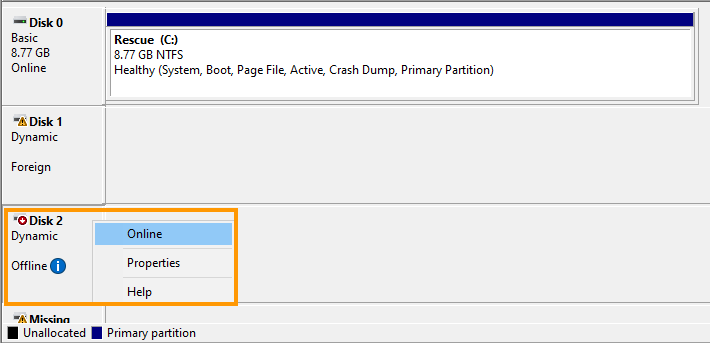
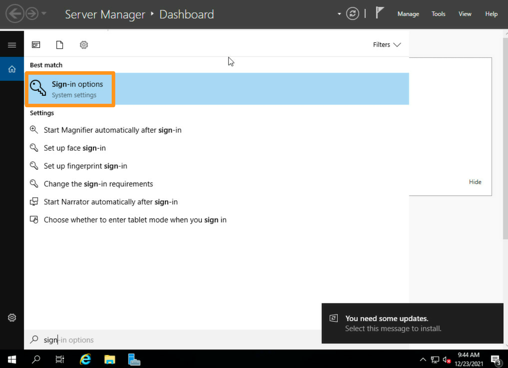

> [!primary]
> Questa traduzione è stata generata automaticamente dal nostro partner SYSTRAN. I contenuti potrebbero presentare imprecisioni, ad esempio la nomenclatura dei pulsanti o alcuni dettagli tecnici. In caso di dubbi consigliamo di fare riferimento alla versione inglese o francese della guida. Per aiutarci a migliorare questa traduzione, utilizza il pulsante "Contribuisci" di questa pagina.
>


## Obiettivo

Questa guida ti mostra come ripristinare la password `Administrator` con **Windows customer rescue system**.

## Prerequisiti

- Microsoft Windows deve essere installato sul tuo [server dedicato](/links/bare-metal/bare-metal)
- Disporre di almeno 16 GB di RAM sul proprio server
- Avere accesso allo [Spazio Cliente OVHcloud](/links/manager)

> [!warning]
>
> Questa guida non è compatibile con la modalità `WinPE Rescue`.
> Consulta [questa guida](/pages/bare_metal_cloud/dedicated_servers/changing-admin-password-on-windows) se utilizzi la modalità `WinPe Rescue`.
>

## Procedura

### Step 1 - Riavvia il server in modalità Rescue <a name="step1"></a>

Per modificare la password è necessario avviare il sistema in modalità **Windows customer rescue system**.

Per maggiori dettagli, consulta la [guida sul Rescue mode](/pages/bare_metal_cloud/dedicated_servers/rescue-customer-windows).

### Step 2 - Cancella la password corrente <a name="step2"></a>

Connettiti al server con la "Connessione desktop remoto" (RDP) e le credenziali trasmesse via email.

Il nome utente è `Administrator`.

- Se il tuo server utilizza un RAID software sul disco di sistema, devi prima importarlo prima di poter reimpostare la password: segui le istruzioni della [sezione A](#sectionA) di questa guida.
- Se il tuo server non utilizza un RAID software sul disco di sistema, puoi reimpostare la password direttamente seguendo le istruzioni della [sezione B](#sectionB) di questa guida.

#### A - Importare il disco locale Windows <a name="sectionA"></a>

##### 1. Accedi alla gestione dei dischi

Clicca con il tasto destro sul menu `Start`{.action} e seleziona `Disk Management`{.action}.

{.thumbnail}

Ora è possibile visualizzare i dischi e i volumi del server.

{.thumbnail}

Il disco che contiene Windows sul tuo server è probabilmente il *disk 1*, quindi è necessario importarlo per potervi accedere.

Si noti che se il server dispone di più gruppi di dischi, il numero di disco contenente Windows potrebbe essere diverso e potrebbe essere necessario importare più dischi prima di trovarli.

È inoltre necessario importare il secondo disco per importare correttamente il volume di RAID software.

##### 2. Importa dischi

Clicca con il tasto destro su *Disk 1* e seleziona `Online`{.action}.

{.thumbnail}

Per importare correttamente il volume del RAID software, fare lo stesso con il secondo disco (Disk 2).

Clicca con il tasto destro su *Disk 2* e seleziona`Online`{.action}.

{.thumbnail}

I dischi vengono ora visualizzati come *Dynamic* e *Foreign*.

Clicca con il tasto destro del mouse su *Disk 1* e seleziona `Import Foreign Disks`{.action}.

{.thumbnail}

Clicca due volte su `OK`{.action}.

{.thumbnail}

{.thumbnail}

Il disco locale è ormai accessibile e il disco Windows corrisponde al volume "(E:)" (che si estende su due dischi configurati in RAID software di tipo Mirrored Volume).

{.thumbnail}

__Note__: In questo esempio, lo stato del volume è "Resynching" perché il server è stato bruscamente riavviato in modalità Rescue. È uno stato normale che non è causato dal rescue stesso.
Questa operazione non avrà alcun impatto sui dati del volume e la risincronizzazione continuerà anche dopo il riavvio del server sul sistema installato.

> [!warning]
>
> È necessario utilizzare il percorso della cartella locale di Windows (in questo caso E:\Windows) quando si naviga per trovare il file di configurazione _SAM_ nella sezione successiva.

A questo punto, è possibile reimpostare la password seguendo le istruzioni riportate nella sezione successiva.

#### B - Reimposta la password <a name="sectionB"></a>

Per reimpostare una password, è necessaria l'utilità NTPWEdit.

Una volta connesso tramite il desktop remoto (RDP), apri il browser Internet (MS Edge) e scarica l’utilità dal [sito Web ufficiale](http://www.cdslow.org.ru/files/ntpwedit/ntpwed07.zip).

Passare alla cartella in cui si trova il file ZIP scaricato ed estrarre il contenuto.

Apri il file eseguibile `ntpwedit64.exe` per avviare l’applicazione.

Tramite questa interfaccia, è possibile modificare il file *SAM* per cancellare la password dell’utente admin.

Per trovare il file *SAM* del sistema, è necessario spostarsi nella cartella locale di Windows.

Fare clic sul pulsante `...`{.action} per spostarsi nell'unità in cui si trova la cartella locale di Windows.

Generalmente è l’unità `Windows (E:\)`

{.thumbnail}

Passare a `E:\WINDOWS\SYSTEM32\CONFIG\`.

Seleziona e apri il file *SAM* per visualizzare gli account utente selezionando `Open`{.action}.


Seleziona l’account utente "admin" e clicca su `Change password`{.action}.

{.thumbnail}

Nella nuova finestra, lascia i campi vuoti e clicca su `OK`{.action}. Clicca su `Salva le modifiche`{.action} e poi su `Esci`{.action}.

Riavviare il server nel normale sistema operativo.

### Step 3 - Riavvia il server <a name="step3"></a>

Inizia sostituendo il netboot con `Avviare da hard disk`{.action} nello Spazio Cliente OVHcloud (vedi [Step 1](#step1)).

Riavvia il server dallo Spazio Cliente. Clicca sul pulsante `...`{.action} vicino alla sezione "Stato dei servizi" e seleziona `Riavvia`{.action}.

{.thumbnail}

### Step 4 - Definisci una nuova password (IPMI) <a name="step4"></a>

Dallo [Spazio Cliente OVHcloud](/links/manager), clicca sulla scheda `IPMI`{.action} per accedere al KVM.

{.thumbnail}

#### Per una versione recente di Windows

Una volta connesso al server, clicca sull’icona del menu `Start`{.action} in basso a sinistra.

Inizia a digitare `opzioni di connessione` e clicca su `Opzioni di connessione`{.action} quando appare nel menu.

{.thumbnail}

Nella sezione "Password", clicca sul pulsante `Aggiungi`{.action} per impostare la nuova password.

{.thumbnail}

#### Per una versione precedente di Windows

Una volta stabilita la sessione KVM, è necessario aprire una finestra della riga di comando (cmd).

Definisci la password dell'utente corrente ("Administrator"):

```bash
net user Administrator *
```

{.thumbnail}

È consigliabile utilizzare la tastiera virtuale quando si immettono le password nell'interfaccia.

## Per saperne di più

Contatta la nostra [Community di utenti](/links/community).