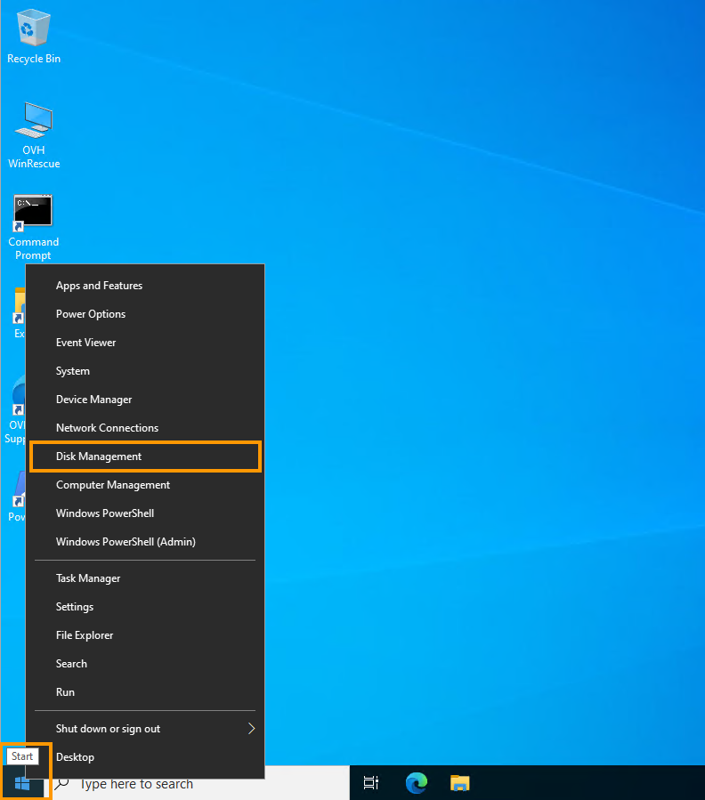

> [!primary]
> Tłumaczenie zostało wygenerowane automatycznie przez system naszego partnera SYSTRAN. W niektórych przypadkach mogą wystąpić nieprecyzyjne sformułowania, na przykład w tłumaczeniu nazw przycisków lub szczegółów technicznych. W przypadku jakichkolwiek wątpliwości zalecamy zapoznanie się z angielską/francuską wersją przewodnika. Jeśli chcesz przyczynić się do ulepszenia tłumaczenia, kliknij przycisk "Zgłoś propozycję modyfikacji” na tej stronie.
>

## Wprowadzenie

Niniejszy przewodnik wyjaśnia, jak zresetować hasło `Administrator` przy użyciu **Windows customer rescue system**.

## Wymagania początkowe

- Posiadanie [serwera dedykowanego](/links/bare-metal/bare-metal) zainstalowanego z wersją systemu Microsoft Windows.
- Serwer musi mieć więcej niż 16 GB pamięci RAM.
- Dostęp do [panelu klienta OVHcloud](/links/manager).

> [!warning]
>
> Ten przewodnik nie jest kompatybilny z trybem `WinPE Rescue`.
> Sprawdź [ten przewodnik](/pages/bare_metal_cloud/dedicated_servers/changing-admin-password-on-windows), jeśli korzystasz z trybu `WinPe Rescue`.
>

## W praktyce

### Etap 1 - Restart serwera w trybie rescue <a name="step1"></a>

Aby można było zmienić hasło, system musi być uruchomiony w trybie **Windows customer rescue system**.

Więcej informacji znajdziesz w [Przewodniku o trybie ratunkowym](/pages/bare_metal_cloud/dedicated_servers/rescue-customer-windows).

### Krok 2 - Usuń bieżące hasło <a name="step2"></a>

Połącz się z serwerem za pomocą polecenia "Połączenie pulpitu zdalnego" (RDP) oraz danych do logowania przesłanych pocztą e-mail.

Pamiętaj, że nazwa użytkownika to `Administrator`.

- Jeśli Twój serwer korzysta z programowej macierzy RAID na dysku systemowym, musisz najpierw zaimportować to hasło, aby móc zresetować hasło: postępuj zgodnie z instrukcjami zawartymi w [sekcji A](#sectionA) tego przewodnika.
- Jeśli Twój serwer nie używa programowej macierzy RAID na dysku systemowym, możesz bezpośrednio zresetować hasło, postępując zgodnie z instrukcjami zawartymi w [sekcji B](#sectionB) niniejszego przewodnika.

#### A - Importuj dysk lokalny systemu Windows <a name="sectionA"></a>

##### 1. Dostęp do zarządzania dyskami

Kliknij prawym przyciskiem myszy menu `Start`{.action} i wybierz pozycję `Disk Management`{.action}.

{.thumbnail}

Teraz możesz wyświetlać dyski i woluminy serwera.

{.thumbnail}

Dysk zawierający system Windows na Twoim serwerze to prawdopodobnie *disk 1*, więc aby uzyskać do niego dostęp, należy go zaimportować.

Jeśli na serwerze jest kilka grup dysków, numer dysku zawierający system Windows może się różnić. W takim przypadku konieczne może być zaimportowanie kilku dysków przed ich znalezieniem.

Aby poprawnie zaimportować wolumin programowej macierzy RAID, należy również zaimportować drugi dysk.

##### 2. Importuj dyski

Kliknij prawym przyciskiem myszy *Disk 1* i wybierz `Online`{.action}.

{.thumbnail}

Zrób to samo z drugim dyskiem (Disk 2), aby poprawnie zaimportować wolumin programowej macierzy RAID.

Kliknij prawym przyciskiem myszy *Disk 2* i wybierz Online`{.action}.

{.thumbnail}

Dyski są teraz wyświetlane jako "*Dynamic*" i "*Foreign*".

Kliknij prawym przyciskiem myszy *Disk 1* i wybierz `Import Foreign Disks`{.action}.

{.thumbnail}

Kliknij dwukrotnie przycisk `OK`{.action}.

{.thumbnail}

{.thumbnail}

Dysk lokalny jest teraz dostępny, a dysk systemu Windows odpowiada woluminowi "(E:)" (występującemu na dwóch dyskach skonfigurowanych w programowej macierzy RAID typu Mirrored Volume).

{.thumbnail}

__Note__: W tym przykładzie stan woluminu to "Resynching", ponieważ serwer został zrestartowany w trybie rescue. Jest to normalny stan, który nie jest spowodowany przez sam rescue.
Nie wpłynie to na dane woluminu, a ponowna synchronizacja będzie kontynuowana po ponownym uruchomieniu serwera w zainstalowanym systemie.

> [!warning]
>
> Należy użyć ścieżki do folderu lokalnego systemu Windows (tutaj jest E:\Windows), gdy nawigujesz, aby znaleźć plik konfiguracyjny _SAM_ w następnej sekcji.

Możesz teraz zresetować hasło, postępując zgodnie z instrukcjami w następnej sekcji.

#### B - Resetuj hasło <a name="sectionB"></a>

Aby zresetować hasło, konieczne jest użycie narzędzia NTPWEdit.

Po zalogowaniu się przez zdalny pulpit (RDP) otwórz przeglądarkę internetową (MS Edge) i pobierz narzędzie z [oficjalnej strony internetowej](http://www.cdslow.org.ru/files/ntpwedit/ntpwed07.zip).

Przejdź do folderu, w którym znajduje się pobrany plik ZIP i wyodrębnij zawartość.

Następnie otwórz plik wykonywalny `ntpwedit64.exe`, aby uruchomić aplikację.

Interfejs ten pozwala na manipulowanie plikiem *SAM* w celu usunięcia hasła użytkownika admin.

Należy przejść do folderu lokalnego systemu Windows, aby odnaleźć w nim plik *SAM* systemu.

Kliknij przycisk `...`{.action} aby nawigować w dysku, na którym znajduje się lokalny folder Windows.

Zwykle jest to czytnik `Windows (E:\)`

{.thumbnail}

Przejdź do `E:\WINDOWS\SYSTEM32\CONFIG\`.

Wybierz i otwórz plik *SAM*, aby wyświetlić konta użytkowników, wybierając opcję `Open`{.action}.

{.thumbnail}

Wybierz konto użytkownika "admin" i kliknij `Change password`{.action}.

{.thumbnail}

W oknie, które się pojawi, pozostaw pola puste i kliknij na `OK`{.action}. Na koniec kliknij `Zapisz zmiany`{.action}, a następnie `Zakończ`{.action}.

Serwer musi zostać zrestartowany w normalnym systemie operacyjnym.

### Etap 3 - Restart serwera <a name="step3"></a>

Rozpocznij od zmiany netbootu na `Boot from the hard disk`{.action} w Panelu klienta OVHcloud (patrz [Etap 1](#step1)).

Następnie zrestartuj serwer z poziomu panelu klienta. Kliknij przycisk `...`{.action} w pobliżu sekcji "Status usług" i wybierz `Restartuj`{.action}.

{.thumbnail}

### Etap 4 - Ustaw nowe hasło (IPMI) <a name="step4"></a>

W panelu [klienta OVHcloud](/links/manager) przejdź do zakładki `IPMI`{.action}, aby zalogować się do KVM.

{.thumbnail}

### W przypadku nowszej wersji systemu Windows

Po połączeniu z serwerem kliknij ikonę menu `Start`{.action} na dole po lewej stronie.

Zacznij wpisywać `Opcje połączenia`, a następnie kliknij `Opcje połączenia`{.action}, gdy pojawi się to w menu.

{.thumbnail}

Następnie w sekcji "Hasło" kliknij przycisk `Dodaj`{.action}, aby ustawić nowe hasło.

{.thumbnail}

### Dla starszej wersji systemu Windows

Po ustanowieniu sesji KVM powinno się otworzyć okno wiersza poleceń (cmd).

Ustaw hasło dla bieżącego użytkownika ("Administrator"):

```bash
net user Administrator *
```

{.thumbnail}

Zalecamy używanie klawiatury wirtualnej podczas wprowadzania haseł w tym interfejsie.

## Sprawdź również

Dołącz do [grona naszych użytkowników](/links/community).