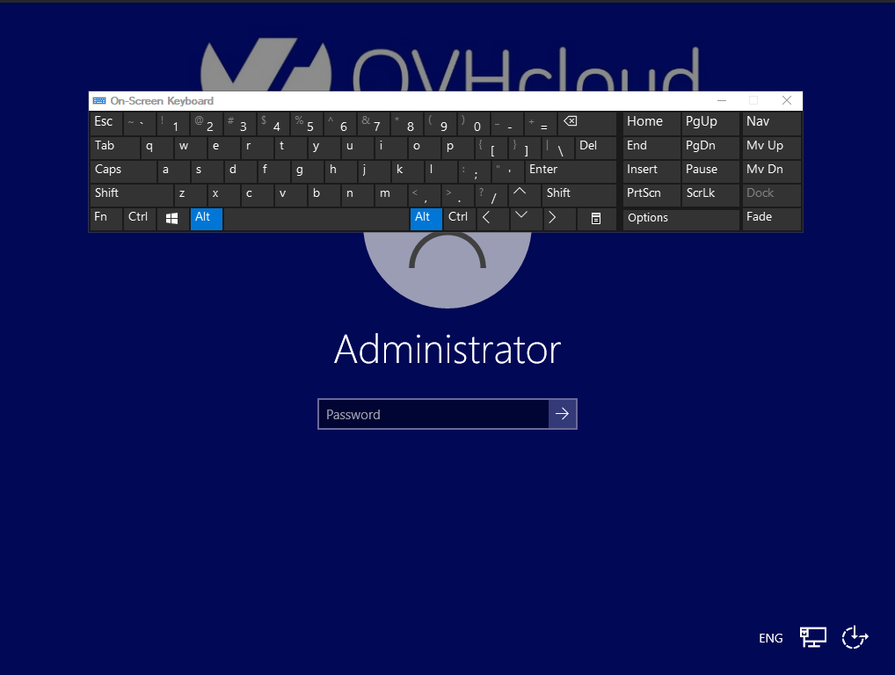

> [!primary]
> Diese Übersetzung wurde durch unseren Partner SYSTRAN automatisch erstellt. In manchen Fällen können ungenaue Formulierungen verwendet worden sein, z.B. bei der Beschriftung von Schaltflächen oder technischen Details. Bitte ziehen Sie im Zweifelsfall die englische oder französische Fassung der Anleitung zu Rate. Möchten Sie mithelfen, diese Übersetzung zu verbessern? Dann nutzen Sie dazu bitte den Button "Beitragen" auf dieser Seite.
>

## Ziel

Der Modus *rescue-customer-windows* ist ein von OVHcloud zur Verfügung gestelltes Tool für Ihren dedizierten Server, das dazu dient, den Server mithilfe eines temporären Betriebssystems zu booten. Damit haben Sie Zugriff auf den Server und können Probleme diagnostizieren und beheben.

Der Rescue-Modus ist generell für folgende Aufgaben einzusetzen:

- [Administrator-Passwort zurücksetzen](/pages/bare_metal_cloud/dedicated_servers/changing-admin-password-on-windows)
- Reparatur eines beschädigten Betriebssystems
- Korrektur einer fehlerhaften Konfiguration einer Software-Firewall

> [!warning]
>
> Falls Sie nicht schon über aktuelle Backups verfügen, sollte der erste Schritt im Troubleshooting, auch im Rescue-Modus, immer darin bestehen, ein Backup Ihrer Daten zu erstellen.
>
> Wenn Sie Dienste auf Ihrem Dedicated Server im laufenden Betrieb haben, wird der Rescue-Modus diese Dienste unterbrechen, da er in das Hilfsbetriebssystem neu gestartet wird.
> 

**Diese Anleitung erklärt, wie Sie einen Server im Modus *rescue-customer-windows* neu starten.**

## Voraussetzungen

- Sie haben einen [Dedicated Server](/links/bare-metal/bare-metal), auf dem eine Version von Microsoft Windows installiert wurde.
- Der Server verfügt über mindestens 16 GB RAM.
- Sie haben Zugriff auf Ihr [OVHcloud Kundencenter](/links/manager).

## Informationen zur Funktion

Der Modus *rescue-customer-windows* läuft in einer virtuellen Maschine (VM), die vom Rescue-System (basierend auf Debian GNU/Linux) gestartet wird. 
Die Disks des Servers sind mit der VM per *Passthrough* verbunden, sodass Sie darauf zugreifen können. 
Auf die anderen Serverkomponenten (CPU, RAM, Netzwerkkarte, RAID-Karte) kann nicht zugegriffen werden. 
Das Netzwerk ist mit *Passthrough* gemountet, ohne direkten Zugriff auf die Netzwerkkarte. Das bedeutet, dass die VM die IP-Adresse und die MAC-Adresse des Bare-Metal-Servers trägt.

> [!warning]
>
> Neustart oder Herunterfahren der VM in *rescue-customer-windows* führt nicht zu einem Neustart des Servers mit seinem ursprünglichen Betriebssystem.
> Um in das installierte Betriebssystem zu starten, folgen Sie den unten stehenden Schritten.

## In der praktischen Anwendung

Der Windows Rescue-Modus kann nur über Ihr [OVHcloud Kundencenter](/links/manager) aktiviert werden. Wählen Sie Ihren Server aus, indem Sie in den Bereich `Bare Metal Cloud`{.action} wechseln und ihn dann unter `Dedicated Server`{.action} anklicken.

Suchen Sie "Boot" im Bereich **Allgemeine Informationen** und klicken Sie auf `...`{.action} und dann auf `Bearbeiten`{.action}.

{.thumbnail}

Auf der nächsten Seite wählen Sie **Im Rescue-Modus booten**.

Wählen Sie `rescue-customer-windows`{.action}. Geben Sie eine andere E-Mail-Adresse an, wenn Sie **nicht** möchten, dass die Login-Daten an die Hauptadresse Ihres OVHcloud Accounts gesendet werden.

Klicken Sie auf `Weiter`{.action} und `Bestätigen`{.action}.

{.thumbnail}

Wenn die Änderung abgeschlossen ist, klicken Sie auf `...`{.action}. rechts neben "Status" im Bereich **Dienstleistungsstatus**.

Klicken Sie auf `Neu starten`{.action} und der Server wird im Rescue-Modus neu gestartet. Die Durchführung dieser Operation kann einige Minuten dauern.

Sie können den Fortschritt im Tab `Tasks`{.action} überprüfen. Es wird automatisch eine E-Mail mit einigen zusätzlichen Informationen und den Logindaten des Benutzers "Administrator" für den Rescue-Modus.

{.thumbnail}

Wenn Sie Ihre Tasks im Rescue-Modus beendet haben, denken Sie daran, den Netboot-Modus wieder auf `Von Festplatte booten`{.action} umzustellen **bevor** Sie Ihren Server neu starten.

### Einloggen im Modus *rescue-customer-windows*

Sobald das Passwort versendet wurde haben Sie drei Möglichkeiten, sich mit dem Server zu verbinden:

- Remote Desktop Protocol (RDP)
- SSH (offizielle Komponente von Windows Server OpenSSH)
- KVM over IP (falls Ihr Server dies erlaubt)

> [!warning]
>
> In jedem Fall werden Sie nach dem Passwort gefragt.
>
> Der Benutzer, der sich anmeldet, ist `Administrator`.
>
> Das Passwort wird Ihnen über einen Link als `secret-as-a-service` übermittelt.

#### Verwendung von KVM over IP

Sie können im KVM-Login-Bildschirm eine andere Tastatursprache auswählen.

{.thumbnail}

{.thumbnail}

Sie können die Eingabehilfen ändern und die virtuelle Tastatur aktivieren.

{.thumbnail}

{.thumbnail}

### Disks mounten

Es ist möglich, dass angehängte Disks als `Dynamic Volumes` angezeigt werden. Um darauf zuzugreifen, folgen Sie der [offiziellen Dokumentation von Microsoft](https://learn.microsoft.com/en-us/troubleshoot/windows-server/backup-and-storage/troubleshoot-disk-management#a-dynamic-disks-status-is-foreign).

### Empfohlene Dienstprogramme

> [!warning]
>
> Unten finden Sie eine Liste empfohlener Software für verschiedene Anwendungsfälle.
> Diese Software wird standardmäßig nicht auf dem *rescue* Image installiert und ist über das Internet verfügbar.

| Software | Beschreibung |
| --- | --- |
| CrystalDiskInfo | Datenträgerdiagnosetool |
| 7zip | Archivverwaltungstool |
| FileZilla | Open Source FTP Client |

## Weiterführende Informationen

[Rescue-Modus aktivieren und verwenden](/pages/bare_metal_cloud/dedicated_servers/rescue_mode)

Für den Austausch mit unserer User Community gehen Sie auf <https://community.ovh.com/en/>.
