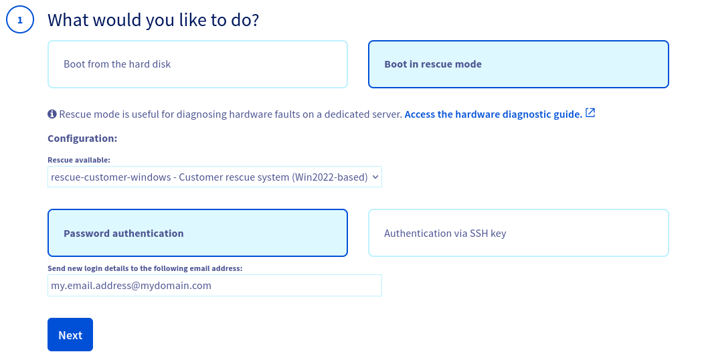

> [!primary]
> Esta traducción ha sido generada de forma automática por nuestro partner SYSTRAN. En algunos casos puede contener términos imprecisos, como en las etiquetas de los botones o los detalles técnicos. En caso de duda, le recomendamos que consulte la versión inglesa o francesa de la guía. Si quiere ayudarnos a mejorar esta traducción, por favor, utilice el botón "Contribuir" de esta página.
>

## Objetivo

El modo *rescue-customer-windows* es una herramienta proporcionada por OVHcloud que le permite arrancar en un sistema operativo temporal con el objetivo de diagnosticar y resolver los problemas en su servidor.

El modo de rescate suele ser adecuado para las siguientes tareas:

- [Restablecimiento de contraseña de administrador](/pages/bare_metal_cloud/dedicated_servers/changing-admin-password-on-windows)
- Reparación de un sistema operativo defectuoso
- Corrección de una configuración incorrecta de un firewall de software

> [!warning]
>
> Asegúrese de realizar una copia de seguridad de sus datos si aún no dispone de copias de seguridad recientes.
>
> Si tiene servicios en producción en su servidor, el modo de rescate los interrumpirá hasta que la máquina se haya reiniciado en modo normal.
>

**Esta guía explica cómo reiniciar un servidor en modo *rescue-customer-windows*.**

## Requisitos

- Tener un [servidor dedicado](/links/bare-metal/bare-metal) instalado con una versión de Microsoft Windows.
- El servidor debe tener más de 16 GB de RAM.
- Estar conectado a su [área de cliente de OVHcloud](/links/manager).

## Información funcional

El *rescue-customer-windows* se ejecuta en una máquina virtual (MV) lanzada desde el sistema *rescue* (basado en Debian GNU/Linux). 
Los discos del servidor están asociados a la MV en *passthrough*, por lo que es posible acceder a ellos. 
Los demás componentes del servidor no serán accesibles (CPU, RAM, tarjeta de red, tarjeta RAID). 
La red está montada en *passthrough* pero sin acceso directo a la tarjeta de red, esto implica que la MV lleva la dirección IP y la dirección MAC del servidor baremetal.

> [!warning]
>
> Reiniciar/apagar la MV del *rescue-customer-windows* no hará reiniciar el servidor en su SO de origen.
> Para reiniciar en el SO de origen, consulte la siguiente documentación.

## En la práctica

El modo de rescate solo puede activarse desde el [área de cliente de OVHcloud](/links/manager). Seleccione su servidor accediendo a la sección `Bare Metal Cloud`{.action} de la columna y, seguidamente, `Servidores dedicados`{.action}.

Busque "Boot" en el cuadro **Información general**, haga clic en el botón `...`{.action} y luego en `Editar`{.action}.

{.thumbnail}

En la siguiente página, seleccione **Arrancar en modo rescue**.

Elija `rescue-customer-windows`{.action}. Especifique una dirección de correo electrónico diferente si no desea **no** que las claves de conexión se envíen a la dirección principal de su cuenta de OVHcloud.

Haga clic en `Siguiente`{.action} y `Confirmar`{.action}.

{.thumbnail}

Una vez finalizada la modificación, haga clic en el botón `...`{.action} situado a la derecha de "Estado" en el cuadro titulado **Estado de los servicios**.

Haga clic en `Reiniciar`{.action} y el servidor se reiniciará en modo de rescate. Esta operación puede tardar unos minutos.

Puede consultar el progreso en la pestaña `Tareas`{.action}. Una vez que el sistema de rescate esté disponible, le enviaremos por correo electrónico las claves de acceso (incluida la contraseña de conexión) del usuario "Administrator" del modo de rescate.

{.thumbnail}

Una vez que haya completado las tareas en modo de rescate, no olvide cambiar el modo de arranque (netboot) a `Arrancar en el disco duro`{.action} y reinicie el servidor.

### Conexión al *rescue-customer-windows*

Una vez que haya recuperado la contraseña, podrá conectarse al servidor de tres formas distintas:

- Remote Desktop Protocol (RDP)
- SSH (componente oficial Windows OpenSSH Server)
- KVM IP (si su servidor lo permite)

> [!warning]
>
> En todos los casos, se le pedirá la contraseña.
>
> El usuario que permite conectarse es `Administrator`.
>
> La contraseña se transmite a través de un enlace `secret-as-a-service`.

#### Uso del KVM IP

En la pantalla de inicio de sesión del KVM, puede seleccionar otro idioma para el teclado.

{.thumbnail}

{.thumbnail}

Puede cambiar las opciones de accesibilidad y activar el teclado virtual:

{.thumbnail}

{.thumbnail}

### Montar los discos

Es posible que los discos adjuntos se vean como `Volúmenes Dinámicos`. Para utilizarlos, consulte la [documentación oficial de Microsoft](https://learn.microsoft.com/en-us/troubleshoot/windows-server/backup-and-storage/troubleshoot-disk-management#a-dynamic-disks-status-is-foreign).

### Utilidades recomendadas

> [!warning]
>
> A continuación se ofrece una lista de programas recomendados para determinados casos prácticos.
> Estos programas no están instalados por defecto en la imagen de *rescue* y están fácilmente disponibles en Internet.

| Software | Descripción |
| --- | --- |
| CrystalDiskInfo | Herramienta de diagnóstico de disco |
| 7Zip | Herramienta de gestión de archivos |
| FileZilla | Cliente FTP de código abierto |

## Más información

- [Activar y utilizar el modo de rescate](/pages/bare_metal_cloud/dedicated_servers/rescue_mode)

Interactúe con nuestra comunidad de usuarios en <https://community.ovh.com/en/>.
