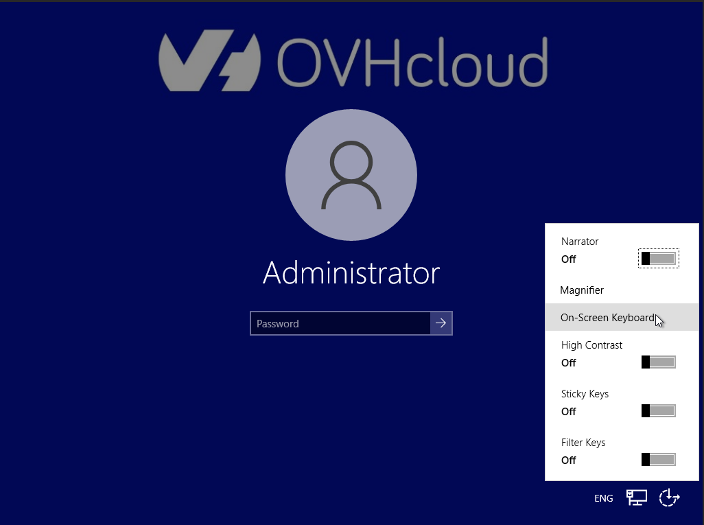

## Objectif

Le mode *rescue-customer-windows* est un outil fourni par OVHcloud qui vous permet de démarrer sur un système d'exploitation temporaire dans le but de diagnostiquer et de résoudre les problèmes sur votre serveur.

Le mode rescue est généralement adapté aux tâches suivantes :

- [Réinitialisation du mot de passe de l'administrateur](/pages/bare_metal_cloud/dedicated_servers/changing-admin-password-on-windows)
- Réparation d'un système d'exploitation défectueux
- Correction d'une configuration incorrecte d'un pare-feu logiciel

> [!warning]
>
> Prenez soin d'effectuer une sauvegarde de vos données si vous ne disposez pas encore de sauvegardes récentes.
>
> Si vous avez des services en production sur votre serveur, le mode rescue les interrompt tant que la machine n’a pas été redémarrée en mode normal.
> 

**Ce guide vous explique comment redémarrer un serveur en mode *rescue-customer-windows*.**

## Prérequis

- Posséder un [serveur dédié](/links/bare-metal) installé avec une version de Microsoft Windows.
- Le serveur doit avoir plus de 16 Go de RAM.
- Être connecté à votre [espace client OVHcloud](/links/manager).

## Informations fonctionnelles

Le *rescue-customer-windows* s'exécute dans une machine virtuelle (VM) lancée à partir du système *rescue* (basé sur Debian GNU/Linux). 
Les disques du serveur sont attachés à la VM en *passthrough*, il est donc possible d'y avoir accès. 
Les autres composants du serveur ne seront pas accessible (CPU, RAM, carte réseau, carte RAID). 
Le réseau est monté en *passthrough* mais sans accès direct à la carte réseau, cela implique que la VM porte l'adresse IP et l'adresse MAC du serveur baremetal.

> [!warning]
>
> Redémarrer/éteindre la VM du *rescue-customer-windows* ne fera pas redémarrer le serveur sur son OS d'origine.
> Pour redémarrer sur l'OS d'origine, veuillez vous référer à la documentation ci-dessous.

## En pratique

Le mode rescue ne peut être activé que depuis votre [espace client OVHcloud](/links/manager). Sélectionnez votre serveur en allant dans la partie `Bare Metal Cloud`{.action}, puis `Serveurs dédiés`{.action}.

Recherchez « Boot » dans la zone **Informations générales**, cliquez sur le bouton `...`{.action} puis sur `Modifier`{.action}.

{.thumbnail}

Dans la page suivante, sélectionnez **Booter en mode rescue**. 

Choisissez `rescue-customer-windows`{.action} (voir la [section du guide ci-dessous](#windowsrescue). Spécifiez une autre adresse de messagerie si vous ne souhaitez **pas** que les identifiants de connexion soient envoyées à l'adresse principale de votre compte OVHcloud.

Cliquez sur `Suivant`{.action} et `Valider`{.action}.

{.thumbnail}

Une fois la modification terminée, cliquez sur le bouton `...`{.action} à droite de « Statut » dans la zone intitulée **État des services**.

Cliquez sur `Redémarrer`{.action} et le serveur redémarrera en mode rescue. Cette opération peut prendre quelques minutes.

Vous pouvez vérifier l'avancement sous l'onglet `Tâches`{.action}. Une fois le système de rescue disponible, un e-mail vous sera envoyé, contenant les identifiants (dont le mot de passe de connexion) de l'utilisateur « Administrator » du mode rescue.

{.thumbnail}

Lorsque vous aurez terminé vos tâches en mode rescue, n'oubliez pas de redéfinir le mode de boot (netboot) sur `Booter sur le disque dur`{.action} puis redémarrez votre serveur.

### Connexion au *rescue-customer-windows*

Une fois le mot de passe récupéré, vous aurez trois possibilités pour vous connecter au serveur :

- Remote Desktop Protocol (RDP)
- SSH (composant officiel Windows OpenSSH Server)
- KVM IP (si votre serveur le permet) 

> [!warning]
>
> Dans tous les cas, le mot de passe vous sera demandé.
>
> L'utilisateur permettant de se connecter est `Administator`.
>
> Le mot de passe est transmis via un lien `secret-as-a-service`.

#### Utilisation du KVM IP

Il est possible, à partir de l'écran de login du KVM, de sélectionner une autre langue pour le clavier.

{.thumbnail}

{.thumbnail}

Vous pouvez changer les options d'accessibilité et activer le clavier virtuel :

{.thumbnail}

{.thumbnail}

### Monter les disques

Il est possible que les disques attachés soient vus comme des `Volumes Dynamiques`. Pour pouvoir les utiliser, veuillez vous référer à la [documentation officielle Microsoft]( https://learn.microsoft.com/en-us/troubleshoot/windows-server/backup-and-storage/troubleshoot-disk-management#a-dynamic-disks-status-is-foreign).

### Utilitaires recommandés

> [!warning]
>
> Vous trouverez ci-dessps nune liste de logiciels recommandés pour certains cas d'usages.
> Ces logiciels ne sont pas installés par défaut sur l'image de *rescue* et sont facilement disponibles sur Internet.

| Logiciel | Description |
| --- | --- |
| CrystalDiskInfo | Outil de diagnostic disque |
| 7Zip | Outil de gestion d'archives |
| FileZilla | Client FTP open source |

## Aller plus loin

- [Activer et utiliser le mode rescue](/pages/bare_metal_cloud/dedicated_servers/rescue_mode)

Échangez avec notre communauté d'utilisateurs sur <https://community.ovh.com/>.
