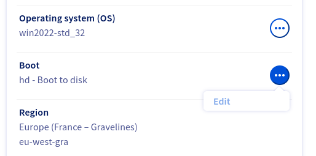
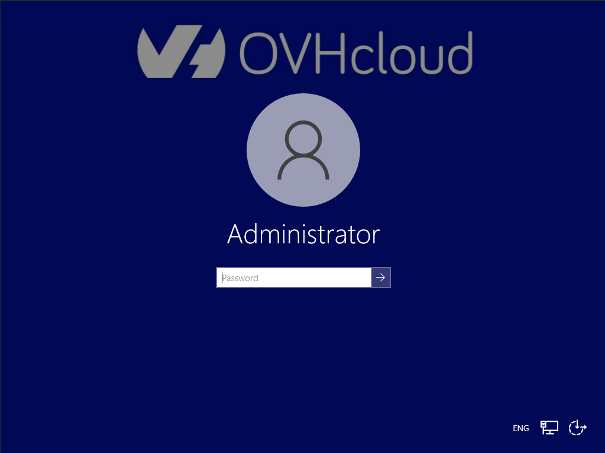
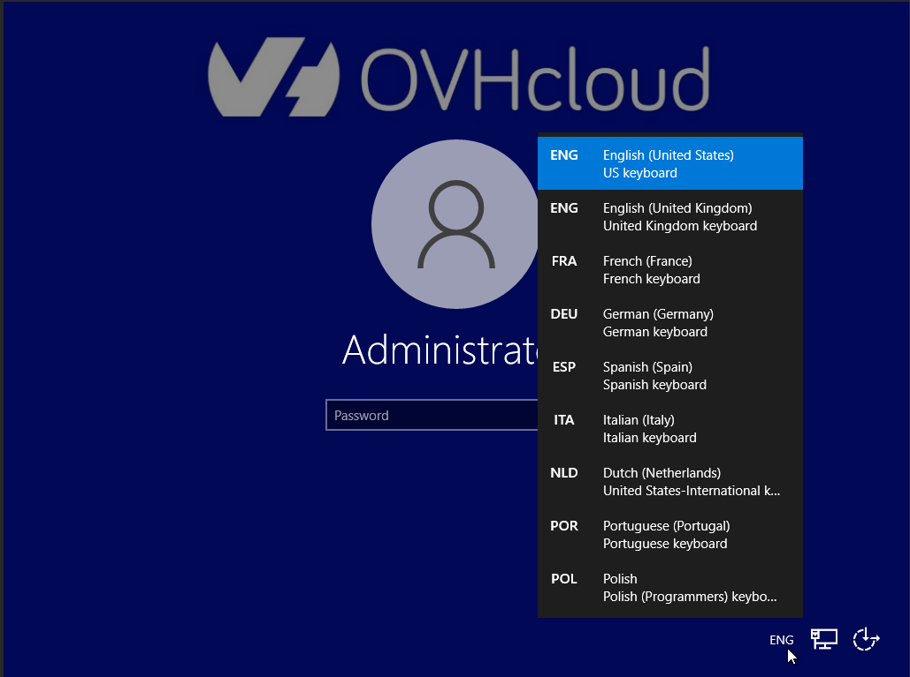

> [!primary]
> Esta tradução foi automaticamente gerada pelo nosso parceiro SYSTRAN. Em certos casos, poderão ocorrer formulações imprecisas, como por exemplo nomes de botões ou detalhes técnicos. Recomendamos que consulte a versão inglesa ou francesa do manual, caso tenha alguma dúvida. Se nos quiser ajudar a melhorar esta tradução, clique em "Contribuir" nesta página.
>

## Objetivo

O modo *rescue-customer-windows* é uma ferramenta fornecida pela OVHcloud que lhe permite iniciar num sistema operativo temporário com o objetivo de diagnosticar e resolver problemas no seu servidor.

O modo rescue é geralmente adaptado às seguintes tarefas:

- [Reinicialização da palavra-passe do administrador](/pages/bare_metal_cloud/dedicated_servers/changing-admin-password-on-windows)
- Reparação de um sistema operativo avariado
- Corrigido uma configuração incorreta de um firewall de software

> [!warning]
>
> Certifique-se de que efetua um backup dos seus dados se ainda não dispõe de backups recentes.
>
> Se tiver serviços em produção no seu servidor, o modo rescue interrompe-os-á enquanto a máquina não for reiniciada em modo normal.
>

**Este manual explica como reiniciar um servidor em modo *rescue-cliente-windows*.**

## Requisitos

- Ter um [servidor dedicado](/links/bare-metal/bare-metal) instalado com uma versão do Microsoft Windows.
- O servidor deve ter mais de 16GB de RAM.
- Ter acesso à [Área de Cliente OVHcloud](/links/manager).

## Informações funcionais

O *rescue-customer-windows* é executado numa máquina virtual (VM) lançada a partir do sistema *rescue* (baseado em Debian GNU/Linux). 
Os discos do servidor estão ligados à VM em *passthrough*. Assim, é possível ter acesso aos mesmos. 
Os outros componentes do servidor não estarão acessíveis (CPU, RAM, NIC, RAID). 
A rede é montada em *passthrough* mas sem acesso direto à placa de rede, isto implica que a VM porta o endereço IP e o endereço MAC do servidor Bare Metal.

> [!warning]
>
> Reiniciar/desligar a VM do *rescue-customer-windows* não fará com que o servidor seja reiniciado no seu SO de origem.
> Para reiniciar no SO de origem, queira consultar a documentação abaixo.

## Instruções

O modo rescue só pode ser ativado a partir da [Área de Cliente OVHcloud](/links/manager). Selecione o seu servidor acedendo à secção `Bare Metal Cloud`{.action} e, em seguida, `Servidores dedicados`{.action}.

Procure "Boot" na zona **Informações gerais**, clique no botão `...`{.action} e depois em `Alterar`{.action}.

{.thumbnail}

Na página seguinte, selecione **Fazer boot em modo rescue**.

Escolha `rescue-customer-windows`{.action}. Especifique outro endereço de e-mail se não pretender **não** que os identificadores de ligação sejam enviados para o endereço principal da sua conta OVHcloud.

Clique em `Seguinte`{.action} e `Validar`{.action}.

{.thumbnail}

Quando a alteração estiver concluída, clique no botão `...`{.action} à direita "Estado" na zona intitulada **Estado dos serviços**.

Clique em `Reiniciar`{.action} e o servidor será reiniciado em modo rescue. Esta operação pode levar alguns minutos.

Pode verificar o progresso no separador `Tarefas`{.action}. Quando o sistema de rescue estiver disponível, ser-lhe-á enviado um e-mail com os dados de acesso (incluindo a palavra-passe de início de sessão) do utilizador "Administrator" do modo rescue.

{.thumbnail}

Quando terminar as suas tarefas em modo rescue, não se esqueça de redefinir o modo de boot (netboot) para `Fazer boot no disco rígido`{.action} e reinicie o seu servidor.

### Ligação ao *rescue-customer-windows*

Quando a palavra-passe for recuperada, terá três possibilidades de aceder ao servidor:

- Remote Desktop Protocol (RDP)
- SSH (componente oficial Windows OpenSSH Server)
- KVM IP (se o seu servidor o permitir)

> [!warning]
>
> Em todo o caso, ser-lhe-á pedida a palavra-passe.
>
> O utilizador de início de sessão é `Administrator`.
>
> A palavra-passe é transmitida através de um link `secret-as-a-service`.

#### Utilização do KVM IP

No ecrã de login do KVM pode selecionar um idioma diferente para o teclado.

{.thumbnail}

{.thumbnail}

Pode alterar as opções de acessibilidade e ativar o teclado virtual:

{.thumbnail}

{.thumbnail}

### Montar os discos

É possível que os discos ligados sejam considerados como "Volumes Dinâmicos". Para as utilizar, queira consultar a [documentação oficial da Microsoft](https://learn.microsoft.com/en-us/troubleshoot/windows-server/backup-and-storage/troubleshoot-disk-management#a-dynamic-disks-status-is-foreign).

### Utilitários recomendados

> [!warning]
>
> Apresentamos a seguir uma lista dos softwares recomendados para determinadas utilizações.
> Este software não é instalado por predefinição na imagem do *rescue* e está facilmente disponível na Internet.

| Software | Descrição |
| --- | --- |
| CrystalDiskInfo | Ferramenta de diagnóstico do disco |
| 7Zip | Ferramenta de gestão de arquivos |
| FileZilla | Cliente FTP open source |

## Quer saber mais?

- [Ativar e utilizar o modo rescue](/pages/bare_metal_cloud/dedicated_servers/rescue_mode)

Fale com nossa comunidade de utilizadores: <https://community.ovh.com/en/>.
