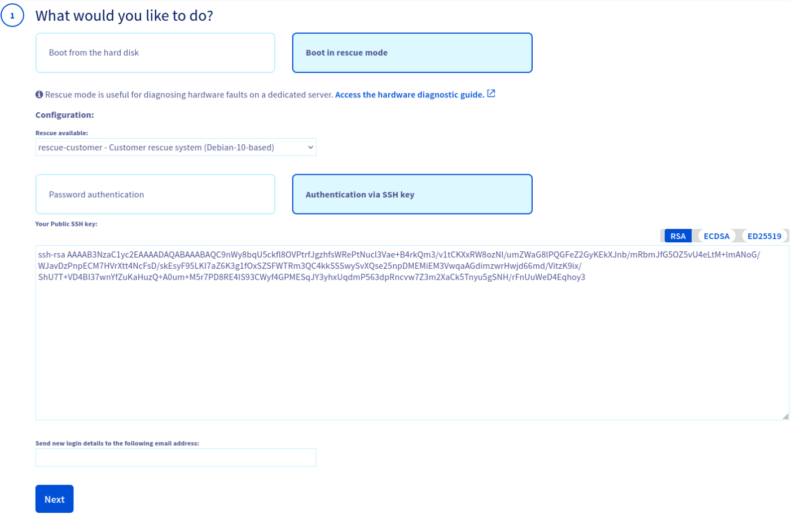
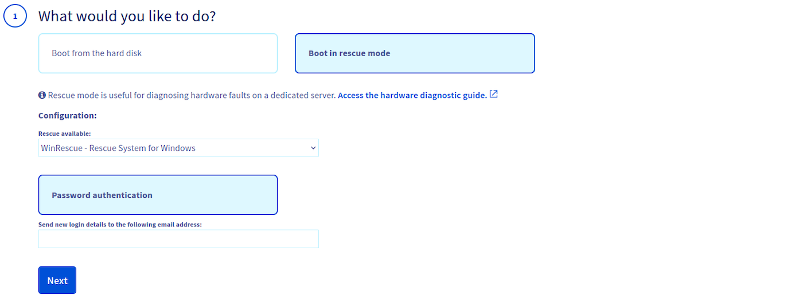

> [!primary]
> Diese Übersetzung wurde durch unseren Partner SYSTRAN automatisch erstellt. In manchen Fällen können ungenaue Formulierungen verwendet worden sein, z.B. bei der Beschriftung von Schaltflächen oder technischen Details. Bitte ziehen Sie im Zweifelsfall die englische oder französische Fassung der Anleitung zu Rate. Möchten Sie mithelfen, diese Übersetzung zu verbessern? Dann nutzen Sie dazu bitte den Button "Beitragen" auf dieser Seite.
>

## Ziel

Der Rescue-Modus ist ein von OVHcloud zur Verfügung gestelltes Tool für Ihren dedizierten Server, das dazu dient, den Server mithilfe eines temporären Betriebssystems zu booten. Damit haben Sie Zugriff auf den Server und können Probleme diagnostizieren und beheben.

Der Rescue-Modus ist generell für folgende Aufgaben einzusetzen:

- [Zurücksetzen Ihres User-Passworts](/pages/bare_metal_cloud/dedicated_servers/replacing-user-password)
- [Diagnose von Netzwerkproblemen](/pages/bare_metal_cloud/dedicated_servers/hardware-diagnose)
- Reparatur eines beschädigten Betriebssystems
- Korrektur einer fehlerhaften Konfiguration einer Software-Firewall
- [Performance-Test von Disks](/pages/bare_metal_cloud/dedicated_servers/hardware-diagnose)
- [Testen des Prozessors und des RAM](/pages/bare_metal_cloud/dedicated_servers/hardware-diagnose)

> [!warning]
>
> Falls Sie nicht schon über aktuelle Backups verfügen, sollte der erste Schritt im Troubleshooting, auch im Rescue-Modus, immer darin bestehen, ein Backup Ihrer Daten zu erstellen.
>
> Wenn Sie Dienste auf Ihrem Dedicated Server im laufenden Betrieb haben, wird der Rescue-Modus diese Dienste unterbrechen, da er in das Hilfsbetriebssystem neu gestartet wird.
> 

**Diese Anleitung erklärt, wie Sie Ihren OVHcloud Dedicated Server im Rescue-Modus neu starten und Partitionen mounten.**

## Voraussetzungen

- Sie haben einen [Dedicated Server](/links/bare-metal/bare-metal) in Ihrem Kunden-Account.
- Sie haben Zugriff auf Ihr [OVHcloud Kundencenter](/links/manager).

## In der praktischen Anwendung

Der Rescue-Modus kann nur über Ihr [OVHcloud Kundencenter](/links/manager){.external} aktiviert werden. Wählen Sie Ihren Server aus, indem Sie in den Bereich `Bare Metal Cloud`{.action} wechseln und ihn dann unter `Dedicated Server`{.action} anklicken.

Suchen Sie "Boot" im Bereich **Allgemeine Informationen** und klicken Sie auf `...`{.action} und dann auf `Bearbeiten`{.action}.

{.thumbnail}

Auf der nächsten Seite wählen Sie **Im Rescue-Modus booten**.

### Linux Rescue

Wenn Ihr Server über ein Linux-Betriebssystem verfügt, wählen Sie im Dropdown-Menü `rescue-customer`{.action} aus.

In diesem Fall stehen Ihnen zwei Authentifizierungsoptionen zur Verfügung:

- Authentifizierung per Passwort
- Authentifizierung per SSH-Schlüssel

#### Authentifizierung mit SSH-Schlüssel

> [!primary]
>
> Wenn Sie sich für die Authentifizierung mit SSH-Schlüssel entscheiden, stellen Sie sicher, dass Ihr öffentlicher SSH-Schlüssel einem der folgenden Formate entspricht: `RSA`, `ECDSA` oder `ED25519`.
>

Wählen Sie die Option "Authentifizierung per SSH-Schlüssel" und geben Sie Ihren **Public** SSH-Schlüssel in das dafür vorgesehene Textfeld ein.

{.thumbnail}

#### Authentifizierung mit Passwort

Wählen Sie die Option "Authentifizierung per Kennwort".<br>
Die Zugangsdaten werden an die primäre E-Mail-Adresse Ihres OVHcloud Kunden-Accounts gesendet. Sie können eine andere Adresse in das Feld `Zugangsdaten an folgende E-Mail-Adresse versenden` eingeben.

{.thumbnail}

### Windows Rescue

Bei einem Server mit Windows Betriebssystem können Sie zusätzlich zum Modus `Rescue-Customer`{.action} die Option `WinRescue`{.action} wählen (siehe [Abschnitt weiter unten](#windowsrescue)). Bitte beachten Sie, dass bei diesem Rescue-Modus nur die Authentifizierung per Passwort möglich ist.

Geben Sie eine andere E-Mail-Adresse an, wenn Sie **nicht** möchten, dass die Login-Daten an die Hauptadresse Ihres OVHcloud Accounts gesendet werden.

{.thumbnail}

### Abschließende Schritte

Klicken Sie auf `Weiter`{.action} und `Bestätigen`{.action}.

Wenn die Änderung abgeschlossen ist, klicken Sie auf `...`{.action}. rechts neben "Status" im Bereich **Dienstleistungsstatus**.
<br>Klicken Sie auf `Neu starten`{.action} und der Server wird im Rescue-Modus neu gestartet. Die Durchführung dieser Operation kann einige Minuten dauern.
<br>Sie können den Fortschritt im Tab `Tasks`{.action} überprüfen. Es wird automatisch eine E-Mail mit einigen zusätzlichen Informationen und den Zugangsdaten des Root-Benutzers für den Rescue-Modus verschickt.

{.thumbnail}

Wenn Sie Ihre Tasks im Rescue-Modus beendet haben, denken Sie daran, den Netboot-Modus wieder auf `Von Festplatte booten`{.action} umzustellen **bevor** Sie Ihren Server neu starten.

### Linux

#### Verwendung des Rescue-Modus (SSH)

> [!primary]
>
> Wenn Sie einen SSH-Schlüssel verwenden (der auch in Ihrem OVHcloud-Kundencenter aktiviert ist), wird Ihnen kein Passwort gesendet. Sobald der Server im Rescue-Modus ist, können Sie sich direkt über Ihren SSH-Schlüssel verbinden.
>

Nach dem Neustart Ihres Servers erhalten Sie eine E-Mail mit Ihren Login-Daten für den Rescue-Modus. Diese E-Mail ist auch in Ihrem [OVHcloud Kundencenter](/links/manager) verfügbar. Klicken Sie in der oberen rechten Ecke Ihres Kundencenters auf den Namen Ihrer Kundenkennung und anschließend auf `E-Mails vom Support`{.action}.

Sie müssen dann über die Befehlszeile oder über ein [SSH-Tool](/pages/bare_metal_cloud/dedicated_servers/ssh_introduction) auf Ihren Server zugreifen, indem Sie das für den Rescue-Modus generierte Root-Passwort verwenden.

Beispiel:

```bash
ssh root@ns3956771.ip-169-254-10.eu
root@ns3956771.ip-169-254-10.eu's password:
```

> [!warning]
>
> Ihr SSH-Client wird die Verbindung wahrscheinlich zunächst blockieren, weil der ECDSA *Fingerprint* nicht mehr übereinstimmt. Dies ist normal, da der Rescue-Modus seinen eigenen temporären SSH-Server verwendet.
>
> Eine Möglichkeit, dieses Problem zu umgehen, besteht im "Auskommentieren" des Server-*Fingerprints*, indem Sie in der Datei `known_hosts` der entsprechenden Zeile ein `#` voranstellen. Vergessen Sie nicht, diese Änderung rückgängig zu machen, bevor Sie den Netboot wieder in den "normalen" Modus versetzen.<br>Sie können alternativ einfach die Zeile aus der Datei löschen. Ihr SSH-Client fügt dann einen neuen *Fingerprint*-Eintrag für den Server hinzu, sobald die Verbindung erneut hergestellt wird. Wenn Sie detaillierte Instruktionen benötigen, konsultieren Sie unsere Anleitung "[Einführung in SSH](/pages/bare_metal_cloud/dedicated_servers/ssh_introduction#login)".
>

#### Mounten von Partitionen

Sofern Sie die Disks des Serves nicht in einer Weise konfigurieren, dass diese abgetrennt sein müssen (nicht gemountet), müssen zuerst die Systempartition gemountet werden.

Partitionen werden über SSH per `mount` Befehl gemountet. Zunächst müssen jedoch Ihre Partitionen aufgelistet werden, um den Namen derjenigen Partition zu ermitteln, die Sie mounten möchten. Im Folgenden finden Sie Codebeispiele, an denen Sie sich orientieren können.

```bash
fdisk -l
```

```console
Disk /dev/hda 40.0 GB, 40020664320 bytes
255 heads, 63 sectors/track, 4865 cylinders, total 41943040 sectors
Units = cylinders of 16065 * 512 = 8225280 bytes

Device Boot Start End Blocks Id System
/dev/hda1 * 1 1305 10482381 83 Linux
/dev/hda2 1306 4800 28073587+ 83 Linux
/dev/hda3 4801 4865 522112+ 82 Linux swap / Solaris

Disk /dev/sda 8254 MB, 8254390272 bytes
16 heads, 32 sectors/track, 31488 cylinders, total 41943040 sectors
Units = cylinders of 512 * 512 = 262144 bytes

Device Boot Start End Blocks Id System
/dev/sda1 1 31488 8060912 c W95 FAT32 (LBA)
```

Wenn Sie den Namen der gewünschten Partition ermittelt haben, verwenden Sie den folgenden Befehl:

```bash
mount /dev/hda1 /mnt/
```

> [!primary]
>
> Ihre Partition wird nun gemountet. Sie können dann Operationen im Dateisystem durchführen.
>
> Wenn Ihr Server über eine Software-RAID-Konfiguration verfügt, muss Ihr RAID-Volume gemountet werden (im Allgemeinen `/dev/mdX`).
>

Um den Rescue-Modus zu verlassen, ändern Sie im [OVHcloud Kundencenter](/links/manager) den Bootmodus wieder auf `Von Festplatte Booten`{.action} und starten Sie den Server über die Kommandozeile neu.

#### VMware - Mounten eines Datastores

Sie können einen VMware Datastore auf ähnliche Weise mounten wie im vorherigen Segment beschrieben.

Listen Sie Ihre Partitionen auf, um den Namen der Partition des Datastores abzurufen:

```bash
fdisk -l
```

Mounten Sie die Partition mit folgendem Befehl, und ersetzen Sie dabei `sdbX` mit dem im vorherigen Schritt identifizierten Wert:

```bash
vmfs-fuse /dev/sdbX /mnt
```

Wenn Sie Datastores vom Typ `VMFS 6` haben, wechseln Sie in den Ordner `sbin`, um den Mount-Ordner zu erstellen:

```bash
cd /usr/local/sbin/
mkdir /mnt/datastore
```

Listen Sie Ihre Partitionen auf, um den Namen der Partition des Datastores abzurufen:

```bash
fdisk -l
```

Mounten Sie die Partition mit folgendem Befehl, und ersetzen Sie dabei `sdbX` mit dem im vorherigen Schritt identifizierten Wert:

```bash
vmfs6-fuse /dev/sdbX /mnt/datastore/
```

Um den Rescue-Modus zu verlassen, ändern Sie im [OVHcloud Kundencenter](/links/manager) den Bootmodus wieder auf `Von Festplatte booten`{.action} und starten Sie den Server über die Kommandozeile neu.

### Windows <a name="windowsrescue"></a>

#### Verwendung der WinRescue-Tools

Nach dem Neustart Ihres Servers erhalten Sie eine E-Mail mit den Login-Daten des Rescue-Modus. Diese E-Mail ist auch in Ihrem [OVHcloud Kundencenter](/links/manager) verfügbar. Klicken Sie in der oberen rechten Ecke Ihres Kundencenters auf den Namen Ihrer Kundenkennung und anschließend auf `E-Mails vom Support`{.action}.

Um die GUI für den Windows-Rescue-Modus zu verwenden, müssen Sie eine VNC-Konsole herunterladen und installieren oder das `IPMI`-Modul in Ihrem [OVHcloud-Kundencenter](/links/manager){.external} verwenden.

{.thumbnail}

Folgende Anwendungen sind bereits in diesem Modus installiert:

|Tool|Beschreibung|
|---|---|
|Mozilla ULight|Ein Webbrowser.|
|Memory Diagnostics Tool|Ein Windows Tool zum Testen des RAM.|
|Explorer_Q-Dir|Ein Dateiexplorer.|
|GSmartControl|Ein Werkzeug zur Überprüfung von Festplatten/SSDs.|
|PhotoRec|Ein Tool zum Abruf potenziell verlorener Dateien auf einer Festplatte.|
|SilverSHielD|Ein SSH2 und SFTP Server.|
|System Recovery|Ein Windows Tool zur Systemwiederherstellung und Fehlerbehebung.|
|TestDisk|Eine leistungsstarke Anwendung zur Datenwiederherstellung. Mit diesem Tool können Sie beschädigte Partitionen wiederherstellen und bearbeiten, verlorene Partitionen wiederfinden, einen Bootsektor reparieren oder sogar einen fehlerhaften MBR rekonstruieren.|
|FileZilla|Ein Open-Source-FTP-Client. Er unterstützt SSH- und SSL-Protokolle und verfügt über ein intuitives Drag-and-Drop-Interface. Es kann verwendet werden, um Ihre Daten auf einen FTP-Server zu übertragen, zum Beispiel das FTP-Backup, das mit den meisten OVHcloud-Servermodellen bereitgestellt wird.|
|7-ZIP|Ein Datenkomprimierungs- und Datenarchivierungstool, das die folgenden Formate liest: ARJ, CAB, CHM, CPIO, CramFS, DEB, DMG, FAT, HFS, ISO, LZH, LZMA, MBR, MSI, NSIS, NTFS, RAR, RPM, SquashFS, UDF, VHD, WIM, XAR und Z. Außerdem können Sie mit diesem Tool Ihre eigenen Archive in den folgenden Formaten anlegen: BZIP2, GZIP, TAR, WIM, XZ, Z und ZIP.|

## Weiterführende Informationen

[Administratorpasswort auf einem Windows Dedicated Server ändern](/pages/bare_metal_cloud/dedicated_servers/changing-admin-password-on-windows)

Für den Austausch mit unserer User Community gehen Sie auf <https://community.ovh.com/en/>.
