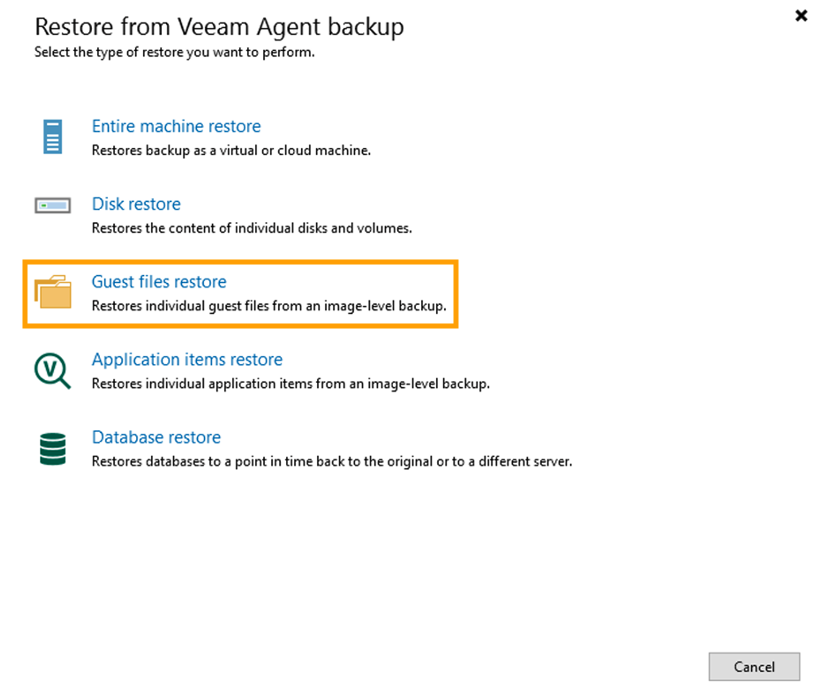
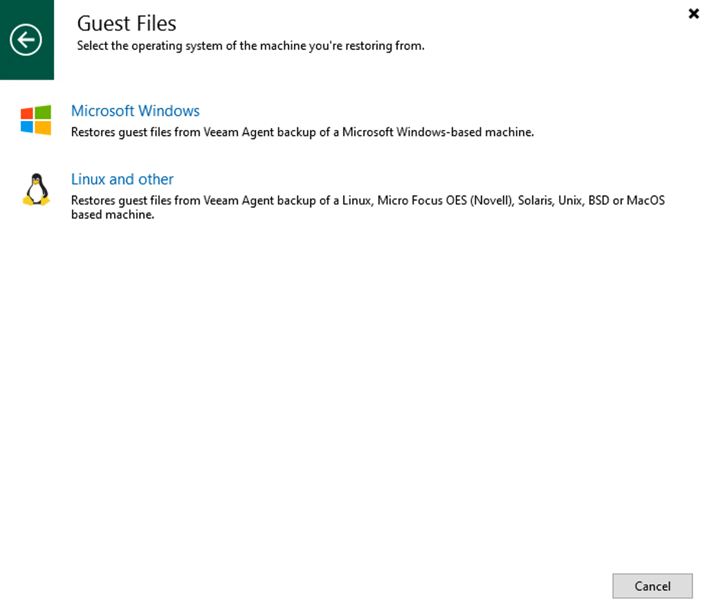
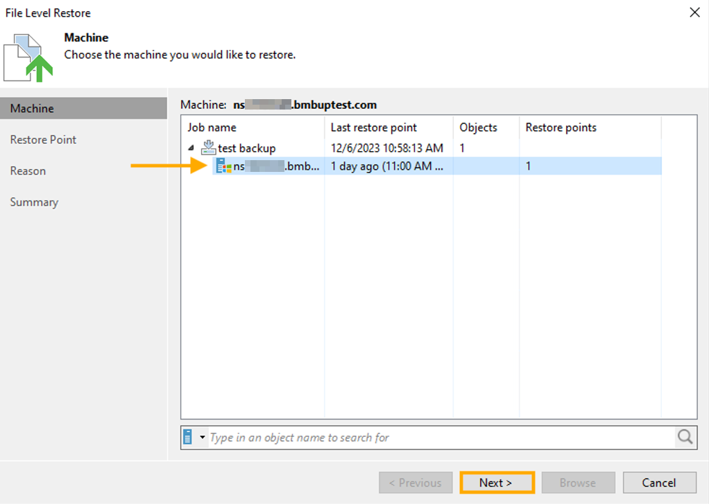

## Objectif

Si vous ne pouvez pas restaurer les données d’une sauvegarde, celle-ci ne sert à rien. Ce guide vous décrit un processus clair pour restaurer un serveur Bare Metal ou un fichier individuel à l'aide de Veeam Backup & Replication.

**Découvrez comment restaurer un serveur Bare Metal à l’aide de l’application Veeam Backup & Replication.**

## Prérequis

- Un [serveur Bare Metal OVHcloud](/links/bare-metal/bare-metal/)
- [Veeam Backup & Replication installé et enregistré](/pages/storage_and_backup/backup_and_disaster_recovery_solutions/veeam/veeam_veeam_backup_replication)

> [!warning]
> Ce guide n'est à suivre que si vous avez préalablement suivi les étapes détaillées dans [nos guides pour sauvegarder un serveur bare metal](/products/bare-metal-cloud-dedicated-servers-backup-restore).

## En pratique

Plusieurs options sont disponibles pour restaurer des données sur un serveur. Dans ce guide, nous allons vous montrer l'option « Guest files restore ».

Dans l'application Veeam Backup & Replication, depuis l'onglet `Home`{.action}, cliquez sur `Restore`{.action} et sélectionnez l'option `Agent...`{.action}.

{.thumbnail}

Dans la fenêtre qui apparaît, sélectionnez `Guest files restore`{.action}.

{.thumbnail}

Choisissez le système d'exploitation de la machine à partir de laquelle vous effectuez la restauration.

{.thumbnail}

Sélectionnez la **Machine** sur laquelle se trouvent les fichiers à restaurer.

Cliquez sur le bouton `Next`{.action}.

{.thumbnail}

Choisissez le **Point de restauration** à partir duquel restaurer les fichiers.

Cliquez sur le bouton `Next`{.action}.

{.thumbnail}

Indiquez le **motif de restauration**.

Cliquez sur le bouton `Next`{.action}.

{.thumbnail}

Dans le résumé qui apparaît, cliquez sur le bouton `Browse`{.action}.

{.thumbnail}

Utilisez le navigateur pour choisir le(s) fichier(s) que vous souhaitez restaurer. Une fois le(s) fichier(s) sélectionné(s), faites un clic droit sur l'un d'eux, pointez votre souris sur `Restore`.action}, puis sélectionnez `Keep`.action}.

{.thumbnail}

Une fenêtre contextuelle s’affiche, indiquant la progression de la restauration. A la fin du processus, le fichier a été restauré et vous pouvez fermer la fenêtre « Backup Browser ».

{.thumbnail}

## Aller plus loin

Échangez avec notre communauté d’utilisateurs sur <https://community.ovh.com/>.
