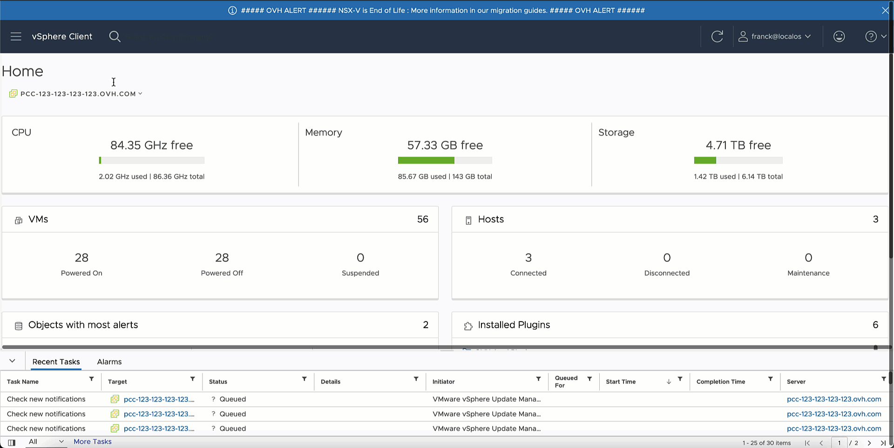

## Objectif

Le composant `NSX-v` ne sera plus maintenu par OVHcloud à compter du **31 Juillet 2024**. 

Ce guide vous aide à analyser votre utilisation des fonctionnalités NSX-v pour vous proposer différents scénarios suite à cette évolution : de la désactivation du composant `NSX-v` jusqu'à la migration vers son successeur `NSX-T` (appelé NSX par VMware depuis la `version 4.0`).

## En pratique

### Identifier votre utilisation de NSX-v

Pour identifier votre utilisation de la fonctionnalité NSX-v dans votre environnement Hosted Private Cloud, vous devez vous poser les questions suivantes :

- Est-ce que j’utilise un VXLAN ?

{.thumbnail}

- Est-ce que j’utilise des règles de Distributed Firewall ?

{.thumbnail}

- Est-ce que j'utilise un Distributed Logical Router  ou une Edge Services Gateway?

{.thumbnail}

- Est-ce que j’utilise un VPN SSL ?

Depuis la derniere version NSX-v, les fonctionnalités étaient désactivées.

#### Je n'utilise aucune des fonctionnalités de NSX-v

Nous désactivons `NSX-V` depuis le 31 mars 2024 si vous n’utilisez aucune de ses fonctionnalités.

Quelle que soit votre gamme Hosted Private Cloud, si vous souhaitez désactiver NSX-V, vous n'aurez pas à migrer vers un nouveau Centre de données. Vous pourrez ainsi conserver vos ressources actuelles, pour que la tâche de maintenance s'exécute correctement et désactive NSX-V. Vous devez vous assurer de bien nettoyer votre environnement NSX-V.

Veillez à bien supprimer tous les `NSX-V EDGES` (DLR or Gateway).

{.thumbnail}

Veillez à bien supprimer les règles distribuées existantes (3 règles existent par défaut avec NSX-V, ou aucune règle).

{.thumbnail}

Veillez à bien déplacer les VM de chaque vXlan vers le vRACK du Portgroup.

Vous pouvez suivre la documentation pour migrer les machines virtuelles.

{.thumbnail}

En dernier lieu, vous pouvez utiliser l'appel API OVHcloud suivant pour vérifier que vous avez supprimé `NSX-V` :

>
> @api {v1} /dedicatedCloud POST /dedicatedCloud/{serviceName}/generateNsxvInventory~POST
>

> **Parametres à utiliser :**
>
> serviceName: la référence de votre PCC sous la forme `pcc-XX-XX-XX-XX`.

> [!primary]
>
> Retrouvez plus d'informations sur l'API OVHcloud dans notre guide [Premiers pas avec l'API OVHcloud](/pages/manage_and_operate/api/first-steps).

Consultez notre page sur le [cycle de vie de la solution VMware on OVHcloud](/pages/hosted_private_cloud/hosted_private_cloud_powered_by_vmware/lifecycle_policy).

#### Je n'utilise que du VXLAN

Si la seule fonctionnalité que vous utilisez est le VXLAN, les choix suivants s'offre à vous :

- Migrer vers NSX (voir les [détails](#migration) ci-dessous),
- Reconfigurer votre réseau afin de remplacer le VXLAN par un [VLAN](/pages/hosted_private_cloud/hosted_private_cloud_powered_by_vmware/creation_vlan).

Si vous souhaitez le migrer vers des VLAN, pour vous aider à configurer votre réseau, vous pouvez utiliser cet appel d'API pour générer une correspondance entre VXLAN et VLAN.

> [!api]
>
> @api {v1} /dedicatedCloud POST /dedicatedCloud/{serviceName}/generateVxlanToVrackMapping
>

> **Paramètres à utiliser :**
>
> serviceName: la référence de votre PCC sous la forme `pcc-XX-XX-XX-XX`.

> [!primary]
>
> Retrouvez plus d'informations sur l'utilisation des API OVHcloud dans notre guide « [Premiers pas avec les API OVHcloud](/pages/manage_and_operate/api/first-steps) ».

Suite à la validation de ce appel API, un e-mail vous sera envoyé. Ce dernier contiendra une proposition de correspondance entre VXLAN et VLAN. 
Il s'agit là uniquement d'une proposition contenant une liste de vos VMs et des réseaux utilisés. Il vous appartient de vérifier que ces VLAN ne sont pas utilisés par d'autres services OVHcloud.

Pour créer vos réseaux VLAN, vous pouvez suivre cette documentation : [Création de VLAN](/pages/hosted_private_cloud/hosted_private_cloud_powered_by_vmware/creation_vlan).

Vous serez notifié lorsque le processus de désactivation sera disponible. Après les opérations précédentes, vous pouvez maintenant migrer vos Machines Virtuelles des VXLAN vers les DVS vRACK.

Depuis la vue `Réseaux`{.action} sur la console vSphere UI, faire un cliv droit sur le portgroup VXLAN où résident vos Machines Virtuelles et sélectionnez `Migrer les VM vers un autre réseau...`{.action}.

> [!primary]
> Dans cet exemple, nous allons migrer les VMs vers le portgroup `VLAN10` qui se trouve sur le vRACK. Vous devez migrer toutes les VM vers des portgroups pour pouvoir désactiver NSX-v (ou pour que OVHcloud détecte un non usage de NSX-v).

{.thumbnail}

Terminez l'opération et reproduisez-la pour chaque portgroup VXLAN utilisé.

Les Machines Virtuelles ne connaîtront qu’une très brève reconnexion. Dans certains cas, il se peut qu'une seule requête ping soit perdue.

#### J'utilise certaines des fonctionnalités de NSX-v

Nous vous recommandons de migrer vers NSX (voir les [détails](#migration) ci-dessous) pour bénéficier de toutes ses fonctionnalités incluses.

Une autre possibilité est de déployer des composants alternatifs (Load Balancer, Firewall, VPN, ...) puis de désactiver NSX-v (vous serez notifié lorsque le processus de désactivation sera disponible).

### Migrer vers NSX 

La solution logicielle NSX est activé eau niveau du Virtual Datacenter (vDC). Afin de migrer de NSX-v vers NSX, vous pouvez commander un nouveau vDC pour votre service Hosted Private Cloud existant (la fonctionnalité est disponible depuis le 18 juillet 2023), ajouter de nouveaux hôtes puis migrer de votre vDC actuel vers le nouveau vDC en utilisant VMware vMotion.

La documentation pour migrer vers NSX est disponible ici: [vDC Migration](/pages/hosted_private_cloud/hosted_private_cloud_powered_by_vmware/service-migration-vdc)

Nos équipes du support et [nos experts de l'équipe Professional Services](https://www.ovhcloud.com/fr-ca/professional-services/) pourront vous fournir une assistance.

## Aller plus loin 

[Premiers pas avec NSX](/pages/hosted_private_cloud/hosted_private_cloud_powered_by_vmware/nsx-01-first-steps)

Si vous avez besoin d'une formation ou d'une assistance technique pour la mise en oeuvre de nos solutions, contactez votre commercial ou cliquez sur [ce lien](https://www.ovhcloud.com/fr-ca/professional-services/) pour obtenir un devis et demander une analyse personnalisée de votre projet à nos experts de l’équipe Professional Services.

Échangez avec notre communauté d'utilisateurs sur <https://community.ovh.com>.
