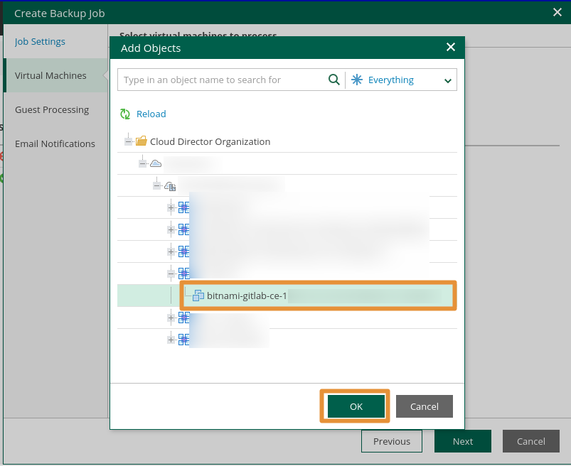
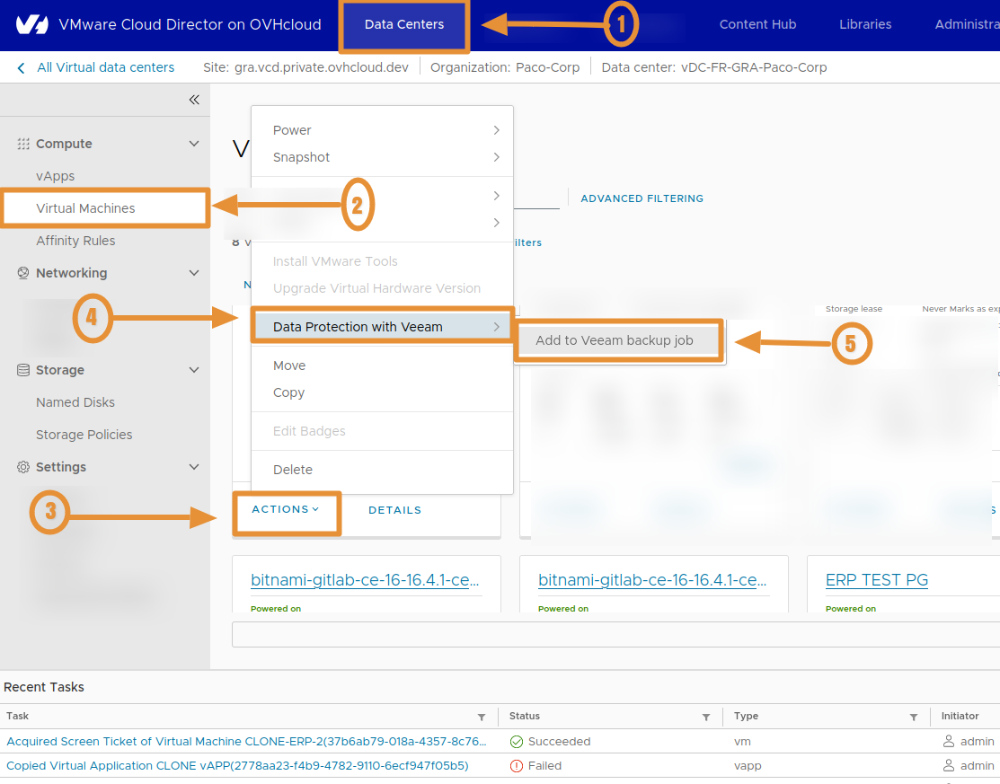
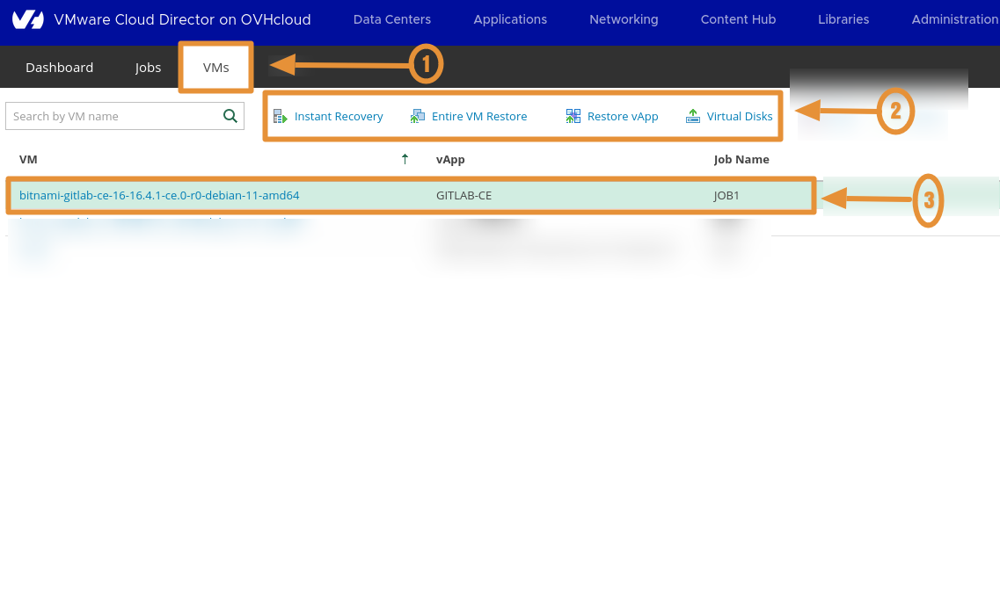

# Table des matières
1. [Objectif](#Objectif)
2. [Prérequis](#Prérequis)
3. [En pratique](#En pratique)
4. [Etape 1 : Les sauvegardes](#Étape 1)
5. [Etape 2 : La supervision](#Étape 2)
6. [Etape 3 : La restauration](#Restauration)
7. [Aller plus loin](#Aller plus loin)

---
## Objectif

Le service Veeam Backup Data Protection est disponible et prêt à l'emploi pour les 3 offres OVHcloud ([voir catalogues des fonctionnalités](https://help.ovhcloud.com/csm/en-ie-vmware-vcd-concepts?id=kb_article_view&sysparm_article=KB0062559#features-of-vmware-cloud-director-at-ovhcloud)).

Ce service s’intègre de manière transparente en tant que solution gérée pour aider votre entreprise à atteindre une haute disponibilité. Il fournit des points de récupération pour vos applications et vos données. En utilisant ce service, vous contrôlez la sauvegarde de toutes les machines virtuelles (VM) et vApp de votre infrastructure directement depuis la console VCD Veeam Data Protection.

Veeam Backup & Replication accompagne VCD. Il utilise l'API VMware Cloud Director pour sauvegarder les vApps et les VMs et les restaurer directement dans la hiérarchie VMware Cloud Director. La principale entité avec laquelle Veeam Backup & Replication travaille lors de la sauvegarde est une vApp.

Dans cette documentation, vous découvrirez :

- Comment créer des sauvegardes de machines virtuelles (VM) avec VEEAM Backup au sein de votre Datacenter Virtuel OVHcloud
- Comment configurer des JOB de sauvegardes
- Comment ajouter un JOB à votre machine virtuelle depuis la console VDC
- Comment restaurer des sauvegardes de VMs

---
## Prérequis

Cette documentation nécessite :

- Un compte VMware Cloud Director administrateur
- Une Organisation VCD
- Un utilisateur avec le rôle Administrateur de l'organisation pour vous connecter au portail libre-service Veeam Data Protection. Le nouvel utilisateur admin d'un datacenter virtuel a le rôle par défaut.

Pour en savoir plus sur l'offre OVHcloud de sauvegarde avec Veeam, vous pouvez accéder à ce lien de la documentation officielle OVHcloud ["Activer et utiliser Veeam Managed Backup"](/pages/hosted_private_cloud/hosted_private_cloud_powered_by_vmware/veeam_backup_as_a_service)
Si vous ne savez pas comment vous connecter à la console d'administration VMware Cloud Director OVHcloud je vous invite à lire ces documentations :

- [VCD - Se connecter à son organisation](/pages/hosted_private_cloud/hosted_private_cloud_powered_by_vmware/vcd-logging)
- [VCD - Découvrez comment utiliser l'interface utilisateur de VCD](/pages/hosted_private_cloud/hosted_private_cloud_powered_by_vmware/vcd-getting-started)
- [VCD - Les concepts fondamentaux de VCD](/pages/hosted_private_cloud/hosted_private_cloud_powered_by_vmware/vcd-get-concepts)

---
## En pratique

Cette documentation est divisée en plusieurs sections :

1. Comment accéder à la console Veeam Data Protection avec VMware Cloud Director (VCD).
2. Comment sauvegarder, créer des JOB.
3. Comment restaurer.

[!primary] Si vous ne savez pas comment vous connecter au portail web de votre organisation, consultez d'abord ce guide.

> [!WARNING]
>
> Pour que les options de traitement d'image et d'indexation du système de fichiers invité (compatibles avec l'application Veeam) fonctionnent avec les machines virtuelles Windows®, les outils VMware les plus récents doivent être installés. Les VMs Linux ne prennent pas en charge la reconnaissance des applications ou l'indexation du système de fichiers invité.
>
> Si vous utilisez le traitement d'images supportant les applications pour les sauvegardes de base de données MS SQL ou Oracle, les options compatibles avec les applications et restaurations d'éléments ne seront pas prises en charge. Une restauration complète de la machine virtuelle doit être réalisée, cela implique une fenêtre de temps d'arrêt pour tous les utilisateurs de la base de données. Il est impossible de relancer manuellement un échec de sauvegarde immuable. Vous devez exécuter une sauvegarde complète active ou attendre l'exécution de la prochaine sauvegarde planifiée ([consultez la documentation Veeam pour en savoir plus](https://helpcenter.veeam.com/docs/backup/vsphere/vcloud_manage_backup.html?ver=120)).

---
### Étape 1 - Les sauvegardes

#### Accéder à la console d'administration Veeam Backup Data Protection

Le service Veeam Backup Data Protection dispose d’une visibilité pour sauvegarder des VMs et des vApp à partir de n’importe quel Virtual Data Center (VDC) de l’organisation. Il est disponible au niveau de l'organisation pour tout utilisateur VMware Cloud Director ayant le rôle d'administrateur de l'organisation

Lorsque vous utilisez l'intégration Veeam Data Protection VCD pour créer des tâches de sauvegarde, vous pouvez choisir n'importe quelle instance de machine virtuelle à partir de n'importe quel datacenter virtuel de l'organisation.

Pour accéder au Portail Veeam Self-Service Backup depuis Cloud Director :

1. Connectez-vous au portail client VMware Cloud Director avec un compte Cloud Director disposant des droits appropriés.
2. Dans le menu de la barre central supérieur, cliquez sur -> `PLUS` puis sélectionnez -> `Data Protection with Veeam`.

La fenêtre du Plugin Veeam VCD s'ouvrira avec un bandeau gris foncé (ici dans la 2eme capture)

{.thumbnail}

{.thumbnail}

### Sauvegarder avec le Pluging Veeam VCD

#### Données incluses dans les sauvegardes

Lorsque Veeam Backup & Replication réalise des sauvegardes de vApp et de VM, il capture en plus les métadonnées de vApp.

Les métadonnées des applications virtuelles (vApp) et VM incluent :

- Les informations générales sur les **vApp** (applications virtuelles)**, où résident les VMs, telles que : **Nom des vApp, descriptions, description des VMs**
- Les informations sur les réseaux **vApp** et les réseaux d'organisation auxquels le vApp est connecté
- Les options de démarrage des **VM** (VM Startup options)
- Les informations utilisateurs
- Le bail (Lease)
- Le quota
- Les Modèles de stockages (Templates)

Les métadonnées vApp/VM sont stockées avec le contenu de la machine virtuelle. La capture des métadonnées vApp/VM est extrêmement importante pour la restauration : sans elle, vous ne serez pas en mesure de restaurer les vApp et les VM vers VMware Cloud Director.

##### Les politiques de sauvegardes

1. **Les dépots**

Avec l'offre que vous avez souscrite vous disposez de 3 depots avec 2 Jobs configurer par défaut :
1. **Bronze Repository** : STD Stockage Objet
2. **Silver Repository** : STD Stockage Objet + Sauvegarde hors Site (Offsite)
3. **Gold Repository** : Haute performance stockage object + Sauvegarde hors site (offsite) + 14 points d'immutabilité (14 points de restauration sur 2 sites differents)

2. **Les politiques de sauvegarde**

En tant que client vCloud Director je suis capable de sauvegarder mes machines virtuelles de production avec une rétention de **30 points de restauration** + une copie hors site + **14 jours d'immuabilité** : **Gold**.

Je suis capable de sauvegarder mes machines virtuelles avec une rétention de 14 points avec seulement 1 site : **Bronze / Silver**.

#### Comment créer un Job de sauvegarde Veeam

Vous allez créer notre première "JOB" depuis Veeam Backup Data Protection avec VMware Cloud Director :

Dans la console VCD Veeam Data Protection, 

1. Cliquez sur -> `JOBS -> CREATE`, une fenêtre va s'ouvrir pour spécifier le nom du Job, la description et la politique de rétention (voir les 2 prochaines captures ci-dessous) :

{.thumbnail .h-600 .w-400}

{.thumbnail .h-600 .w-400}

Une fois les éléments définis (Job name, description, retention), 

2. Cliquez sur `NEXT`.

{.thumbnail .h-600 .w-400}

Vous devrez ensuite choisir votre machine virtuelle (VM), vous pouvez dérouler l'arborescence de votre organisation VMware Cloud Director et cliquer sur votre VM :

3. Cliquer sur `NEXT`.

{.thumbnail .h-600 .w-400}

Votre machine virtuelle apparaitra dans la liste de nom et type (Name/Type)

4. Cliquer sur `NEXT`.

{.thumbnail .h-600 .w-400}

> [!warning]
>
> Cette étape est primordiale, il s'agit d'ajouter les credentials nécessaires à votre VM.
> Si vous utilisez les réglages "Guest OS processing" vous devez ajouter l'identifiant et le mot de passe de votre utilisateur de sauvegarde selon votre type d'OS. Si vous avez des clés SSH à ajouter pour Linux vous pouvez le faire.

Pour Windows vous pouvez choisir un compte standard ou un compte de service managé.

1. Cliquez sur `NEXT`

{.thumbnail .h-600 .w-400}

- Si nécessaire, ajoutez du monitoring pour vos JOBS, puis cliquez sur -> `FINISH`

Le JOB apparait dans la liste.

{.thumbnail .h-600 .w-400}

---

### Comment sauvegarder une machine virtuelle avec Veeam Backup ?

> [!primary]
>
> Aucun agent n'est nécessaire au fonctionnement des sauvegardes avec Veeam Backup Data Protection depuis une machine virtuelle ou une vApp.
>

> [!warning]
> Pour pouvoir ajouter un job depuis la console VCD sur une VM, un JOB doit être pre ????
>
Dans la console VMware Cloud Director :

1. Cliquez sur `CENTRE DE DONNEES` -> `MACHINES VIRTUELLES`.

2. Choisissez une VM et Cliquez sur `ACTION` -> `DATA PROTECTION WITH VEEAM` -> `ADD TO VEEAM BACKUP JOB`(voir capture).

{.thumbnail .h-600 .w-400}

---
### Etape 2 : Restauration

#### Comment restaurer une VM avec le plugin Veeam VCD ?

Veam Backup dispose de plusieurs fonctionnalités de restauration :

- La restauration au niveau des fichiers (File Level Restoration)
- La récupération instantanée (Instant Recovery)
- La connaissance des applications (Application Awarness)
- La stratégie par VM (Policies)
- 3 référentiels avec classe de stockage (repositories)
- L'immutabilité (optionnel)

#### Données incluses dans les restaurations

Veeam Backup & Replication permet une restauration complète des VM vers VMware Cloud Director. Vous pouvez restaurer des VM distinctes vers des vApps, ainsi que des données de VM.

Pour la restauration, Veeam Backup & Replication utilise les métadonnées de la VM enregistrées dans un fichier de sauvegarde et restaure des attributs spécifiques de la VM. En conséquence, vous obtenez une machine virtuelle pleinement opérationnelle dans VMware Cloud Director, vous n'avez pas besoin d'importer la machine virtuelle restaurée dans VMware Cloud Director et d'ajuster les paramètres manuellement.

Les objets sauvegardés peuvent être restaurés dans la même hiérarchie VMware Cloud Director ou dans un environnement VMware Cloud Director différent. Les options de restauration sont les suivantes :

- Récupération instantanée : **Instant Recovery**
- Restauration complète pour les vApps et les VM : **Full restore for vApps and VMs**
- Restauration des disques des VM : **VM files**
- Restauration des fichiers VM : **VM disks**
- Restauration des fichiers du système d'exploitation invité pour les VMs : **Item recovery**

Dans ce cas, faites une restauration de type **Full (entière/complète)**.

#### Restauration entière "Full" d'une VM (machine virtuelle)

Le service backup managé par OVHcloud vous permet de restaurer des VMs classiques qui font partie de `vApps` et des `VM` autonomes qui ont été créées dans votre portail OVHcloud VMware Cloud Director.

Lorsque vous restaurez des VMs normales ou autonomes dans la hiérarchie VMware Cloud Director, le processus de restauration comprend les étapes suivantes :

- Veeam utilise les métadonnées vApp capturées pour définir les paramètres vApp et l'emplacement d'origine de la machine virtuelle dans la hiérarchie VMware Cloud Director. 

- Veeam restaure les VMs du fichier de sauvegarde à leur emplacement d'origine ou à un autre emplacement. De plus, Veeam restaure tous les paramètres des VM.

#### Comment restaurer une machine virtuelle depuis le plugin Veeam Backup Data Protection VCD ?

1. Effectuez une restauration complète, Cliquer sur -> `ENTIRE VM RESTORE`.

{.thumbnail .h-600 .w-400}

2. Depuis la fenêtre que s'affiche, Cliquez sur ->`RESTORE TO THE ORIGINAL LOCATION`, pour la restauration d'une VM complète (full).

3. Puis cliquez sur ->`NEXT`.

{.thumbnail .h-600 .w-400}

4. Dans la dernière étape Cliquez sur -> `FINISH`, lancez la VM en Cliquant sur -> `POWER ON VM AUTOMATICALLY`, si vous le souhaitez.

Ce processus est simplifié grâce à VCD, VEEAM et OVHcloud.

{.thumbnail .h-600 .w-400}

---
## Etape 3 : Supervision

### Comment monitorer un Job de sauvegarde ?

### Comment monitorer un Job de restauration ?

---
## Aller plus loin

Échangez avec notre communauté d'utilisateurs sur <https://community.ovh.com/>.
