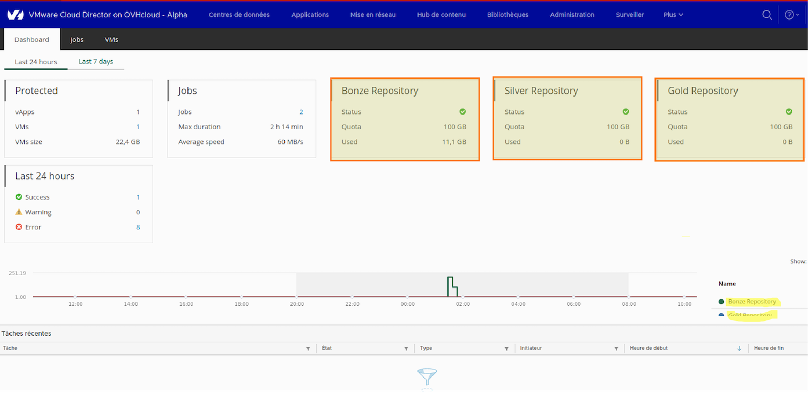
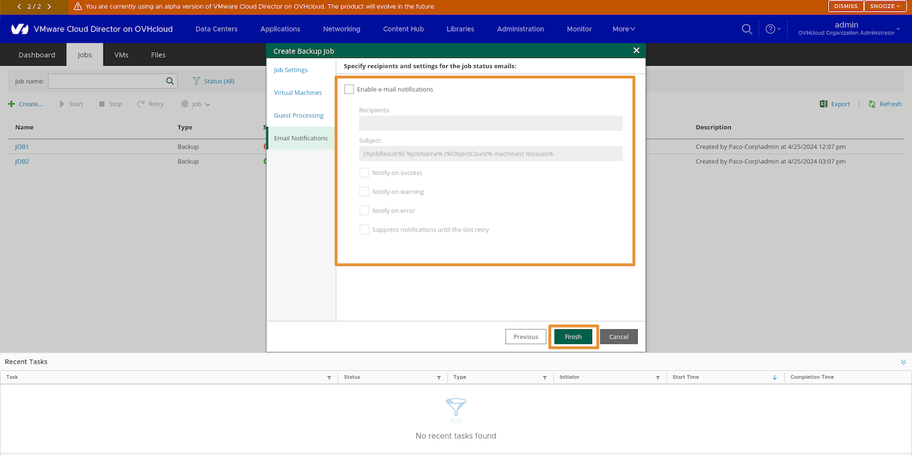
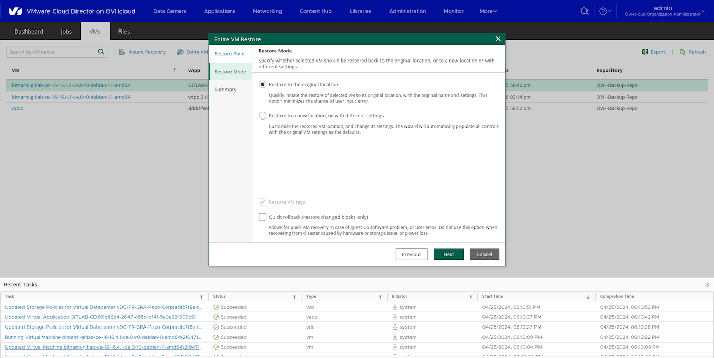

## Objectif

**Nous allons voir dans ce guide les solutions de sauvegarde et de restauration de Veeam pour VMware Cloud Director.**

## Prérequis

- Posséder une offre [Hosted Private cloud](https://www.ovhcloud.com/fr/enterprise/products/hosted-private-cloud/){.external}.
- Un compte vCloud Director administrateur avec une Organisation VCD.
- Un utilisateur avec le rôle Administrateur de l'organisation pour vous connecter au portail en libre-service Veeam Data Protection (le nouvel utilisateur admin d'un datacenter virtuel a le rôle par défaut).
- Avoir lu les guides VCD : [Les concepts fondamentaux](/pages/hosted_private_cloud/hosted_private_cloud_powered_by_vmware/vcd-get-concepts) / [Comment se connecter à son organisation](/pages/hosted_private_cloud/hosted_private_cloud_powered_by_vmware/vcd-logging) / [Comment utiliser l'interface utilisateur](/pages/hosted_private_cloud/hosted_private_cloud_powered_by_vmware/vcd-getting-started)

## En pratique

Veeam Backup & Replication accompagne VCD. 

Il utilise l'API VMware Cloud Director pour sauvegarder les vApps et les VMs et les restaurer directement dans la hiérarchie VMware Cloud Director.

Le service Veeam Backup Data Protection est disponible et prêt à l'emploi pour les 3 offres OVHcloud [(voir catalogue des fonctionnalités).](/pages/hosted_private_cloud/hosted_private_cloud_powered_by_vmware/vcd-get-concepts#fonctionnalites-de-vmware-cloud-director-chez-ovhcloud)

> [!warning]
>
> Pour que les options de traitement d'image et d'indexation du système de fichiers invité (compatibles avec l'application Veeam) fonctionnent avec les machines virtuelles Windows®, les outils VMware les plus récents doivent être installés. Les VMs Linux ne prennent pas en charge la reconnaissance des applications ou l'indexation du système de fichiers invité.
>
> Si vous utilisez le traitement d'images supportant les applications pour les sauvegardes de base de données MS SQL ou Oracle, les options compatibles avec les applications et restaurations d'éléments ne seront pas prises en charge. Une restauration complète de la machine virtuelle doit être réalisée, cela implique une fenêtre de temps d'arrêt pour tous les utilisateurs de la base de données. Il est impossible de relancer manuellement un échec de sauvegarde immuable. Vous devez exécuter une sauvegarde complète active ou attendre l'exécution de la prochaine sauvegarde planifiée (consultez la [documentation Veeam pour en savoir plus](https://helpcenter.veeam.com/docs/backup/vsphere/vcloud_manage_backup.html?ver=120)).

### Étape 1 - Sauvegarde

#### Accéder à la console d'administration Veeam Backup Data Protection

Le service **Protection des données avec Veeam** dispose d’un plugin pour sauvegarder des VMs et des vApp à partir de n’importe quel Virtual Data Center (VDC) de l’organisation. Il est disponible au niveau de l'organisation pour tout utilisateur VMware Cloud Director ayant le rôle d'administrateur de l'organisation.

Lorsque vous utilisez l'intégration VCD Protection des données avec Veeam pour créer des tâches de sauvegarde, vous pouvez choisir n'importe quelle instance de machine virtuelle à partir de n'importe quel datacenter virtuel de l'organisation.

Pour accéder au Portail Protection des données avec Veeam depuis Cloud Director, connectez-vous au portail client VCD avec un compte vCloud Director disposant des droits appropriés.

Dans le menu de la barre centrale supérieure, cliquez sur `Plus`{.action} et sélectionnez `Protection des données avec Veeam`{.action}

{.thumbnail}

La fenêtre du Plugin Veeam VCD s'ouvrira avec un bandeau gris/noir.

{.thumbnail}

### Sauvegarder avec le Pluging Veeam VCD

#### Données incluses dans les sauvegardes

Lorsque Veeam Backup & Replication réalise des sauvegardes de vApp et de VM, il capture en plus les métadonnées de vApp.

Les métadonnées des applications virtuelles (vApp) et VM incluent :

- Les informations générales sur les **vApp** (applications virtuelles), où résident les VMs, telles que : **Nom des vApp**, **descriptions**, **description des VMs**.
- Les informations sur les réseaux **vApp** et les réseaux d'organisation auxquels le vApp est connecté.
- Les options de démarrage des **VM** (VM Startup options).
- Les informations utilisateurs.
- Le bail (Lease).
- Le quota.
- Les Modèles de stockages (Templates).

Les métadonnées vApp/VM sont stockées avec le contenu de la machine virtuelle. La capture des métadonnées vApp/VM est importante pour la restauration : sans elle, vous ne serez pas en mesure de restaurer les vApp et les VM vers VMware Cloud Director.

<!--- proofread stops below this point --->

##### Les politiques de sauvegardes

##### Les depots (repository)

Par défaut, vous avez **les dépots** suivant :

Avec l'offre que vous avez souscrite vous disposer de 3 depots avec 2 Jobs configurés par défaut avec un quota de 100GB :
1. **Bronze Repository** : STD Stockage Objet
2. **Silver Repository** : STD Stockage Objet + Sauvegarde hors Site (Offsite)
3. **Gold Repository** : Haute performance stockage object + Sauvegarde hors site (offsite) + 14 points d'immutabilité (14 points de restaurations sur 2 sites différents)

Les référentiels sont tous configurés avec l'Object Storage Standard. Seul le produit de disponibilité générale répond aux spécifications de référentiel indiquées.

#### Les taches de sauvegardes (Job)

Les taches de sauvegarde nécessitent 4 paramètres par défaut :

1. Les paramètres de taches (job) : Nom / Dépot ou Quota (Bronze/Silver/Gold : 100GB) / Description / Rétention (Jours/point de restauration)
2. Machines virtuelles (VM) : Ajout ou exclusion de machines virtuelles / vApp / vCloud Organisation
3. Traitement invité : Traitement prenant en charge les applications / Indexation du système de fichiers invité / Informations d'identification du système d'exploitation invité (credentials)
4. Notifications E-Mail : Activation de notifications E-Mail

Pour les machines virtuelles gérées par VMware Cloud Director, Veeam Backup & Replication offre un type spécial de travail de sauvegarde : le travail de sauvegarde VMware Cloud Director. Les tâches de sauvegarde de VMware Cloud Director traitent les objets VMware Cloud Director, assurent leur restauration correcte et la prise en charge des fonctionnalités spécifiques à Cloud Director.

Il est recommandé d'utiliser les tâches de sauvegarde de VMware Cloud Director pour sauvegarder les machines virtuelles gérées par VMware Cloud Director. Si vous sauvegardez des machines virtuelles gérées par VMware Cloud Director à l'aide d'un travail de sauvegarde régulier, Veeam Backup & Replication effectuera une sauvegarde au niveau du serveur vCenter sous-jacent et ne capturera pas les métadonnées vApp. Par conséquent, vous ne serez pas en mesure de restaurer une machine virtuelle pleinement opérationnelle sur VMware Cloud Director.

#### Comment créer une tache de sauvegarde Veeam ?

Vous allez créer votre premiere tache de sauvegarde depuis le plugin VCD Veeam Backup Data Protection :

Dans la console VCD Veeam, cliquez sur `Plus`{.action} et sélectionnez `Protection des données avec Veeam`{.action}

{.thumbnail}

Cliquez sur `Jobs`{.action} puis sur `Create`{.action}

{.thumbnail}

Dans la fenêtre qui s'ouvre, spécifiez le nom du Job, la description et la politique de rétention. Une fois les éléments définis (Job name, description, retention), cliquez sur `Next`{.action}.

{.thumbnail}

Vous devez ensuite choisir votre machine virtuelle (VM). Pour cela, cliquez sur `Add.`{.action}

{.thumbnail}

Vous pouvez dérouler l'arborescence de votre organisation VMware Cloud Director et sélectionner votre VM.

Cliquez sur `Next.`{.action}

{.thumbnail}

Votre machine virtuelle apparait alors dans la liste.

Cliquez sur `Next.`{.action}

{.thumbnail}

> [!warning]
>
> L'étape suivante est primordiale car il s'agit d'ajouter les *credentials* nécessaires à votre VM.
> Si vous utilisez les réglages "Guest OS processing", vous devez ajouter l'identifiant et le mot de passe de votre utilisateur de sauvegarde selon votre type d'OS.
>
> Si vous avez des clés SSH à ajouter pour Linux, vous pouvez le faire.
>
> Pour Windows vous pouvez choisir un compte standard ou un compte de service managé.

Cliquez sur `Next`{.action}

{.thumbnail}

Si nécessaire, vous pouvez ajouter des options de monitoring pour vos JOBS. Cliquez enfin sur `Finish`{.action}.

{.thumbnail}

Le JOB apparait dans la liste.

### Comment sauvegarder une machine virtuelle avec Veeam ?

> [!primary]
>
> Aucun agent n'est nécessaire au fonctionnement des sauvegardes avec Veeam Backup Data Protection depuis une machine virtuelle ou une vApp.
>

> [!warning]
> Pour pouvoir ajouter un job depuis une VM (.. action -> ... Ajouter une tache à Veeam), il doit être préalablement créé.
>

Dans la console VMware Cloud Director, cliquez sur `Centre de données`{.action} puis sur `Machines virtuelles`{.action}.

Choisissez une VM. Cliquez sur `Actions`{.action}, puis sur `Protection des données avec Veeam`{.action} et enfin sur `Ajouter une tâche à Veeam`{.action}.

{.thumbnail}

### Etape 2 - Restauration

#### Comment restaurer une VM avec le Plugin Veeam VCD ?

Veeam Backup dispose de plusieurs fonctionnalités de restauration :

- La restauration au niveau des fichiers (File Level Restoration)
- La récupération instantanée (Instant Recovery)
- La connaissance des applications (Application Awareness)
- La stratégie par VM (Policies)
- Les 3 référentiels avec classe de stockage (repositories)
- L'immutabilité (optionnel)

#### Données incluses dans les restaurations

Veeam Backup & Replication permet une restauration complète des VM vers VMware Cloud Director. Vous pouvez restaurer des VM distinctes vers des vApps, ainsi que des données de VM.

Pour la restauration, Veeam Backup & Replication utilise les métadonnées de la VM enregistrées dans un fichier de sauvegarde et restaure des attributs spécifiques de la VM. En conséquence, vous obtenez une machine virtuelle pleinement opérationnelle dans VMware Cloud Director, vous n'avez pas besoin d'importer la machine virtuelle restaurée dans VMware Cloud Director et d'ajuster les paramètres manuellement.

Les objets sauvegardés peuvent être restaurés dans la même hiérarchie VMware Cloud Director ou dans un environnement VMware Cloud Director différent. Les options de restauration sont les suivantes :

- Récupération instantanée : **Instant Recovery**
- Restauration complète pour les vApps et les VM : **Full restore for vApps and VMs**
- Restauration des disques des VM : **VM files**
- Restauration des fichiers VM : **VM disks**
- Restauration des fichiers du système d'exploitation invité pour les VMs : **Item recovery**

Dans ce cas, faites une restauration de type **Full (entière/complète)**.

#### Restauration entière "Full" d'une VM (machine virtuelle)

Le service backup managé par OVHcloud vous permet de restaurer des VMs classiques qui font partie de vApps et des VM autonomes qui ont été créées dans votre portail OVHcloud VMware Cloud Director.

Lorsque vous restaurez des VMs normales ou autonomes dans la hiérarchie vCloud Director, le processus de restauration comprend les étapes suivantes :

- Veeam utilise les métadonnées vApp capturées pour définir les paramètres vApp et l'emplacement d'origine de la machine virtuelle dans la hiérarchie VMware Cloud Director. 
- Veeam restaure les VMs du fichier de sauvegarde à leur emplacement d'origine ou à un autre emplacement. De plus, Veeam restaure tous les paramètres des VM.

#### Comment restaurer une machine virtuelle depuis le plugin Veeam Backup Data Protection VCD ?

Pour effectuer une restauration complète, cliquez sur `Entire VM Restore`{.action}

{.thumbnail}

Depuis la fenêtre que s'affiche, cliquez sur `Restore to the original location`{.action} pour la restauration d'une VM complète (full).

Puis cliquez sur `Next.`{.action}.

{.thumbnail}

Dans la dernière étape, cliquez sur `Finish`{.action}. Si vous le souhaitez, vous pouvez aussi lancer la VM en cochant la case `Power on VM automatically`{.action}.

{.thumbnail}

Ce processus est simplifié grâce à VCD, Veeam et OVHcloud.

## Aller plus loin

Échangez avec notre communauté d'utilisateurs sur <https://community.ovh.com/>.
