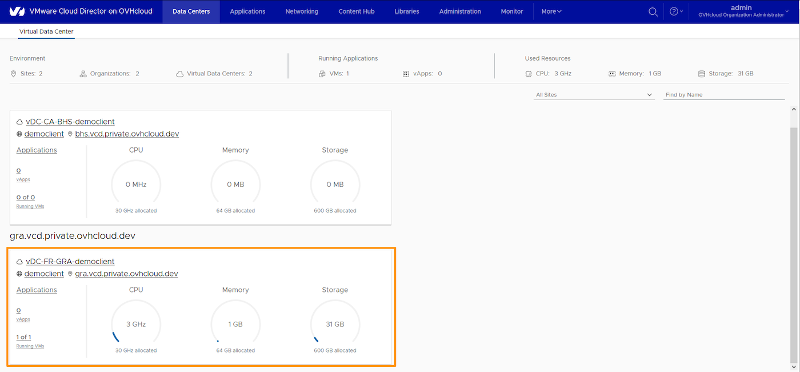
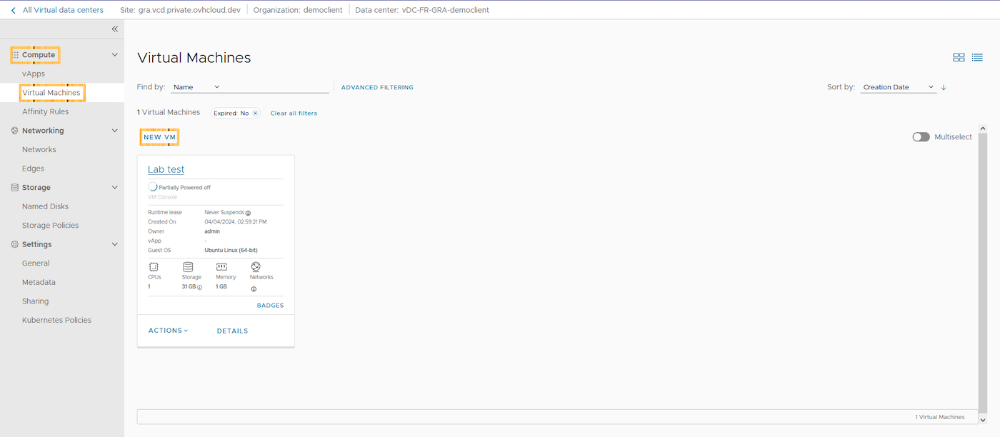
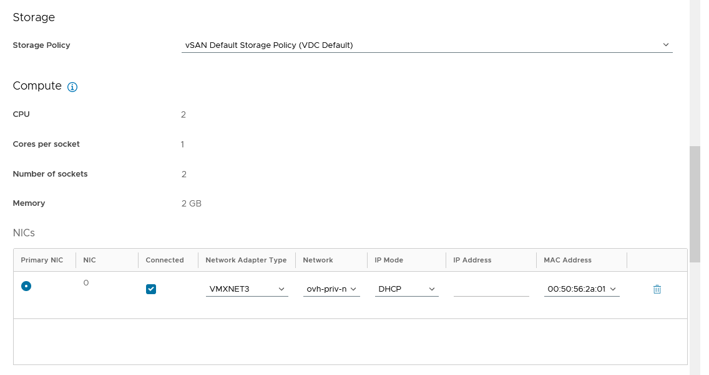
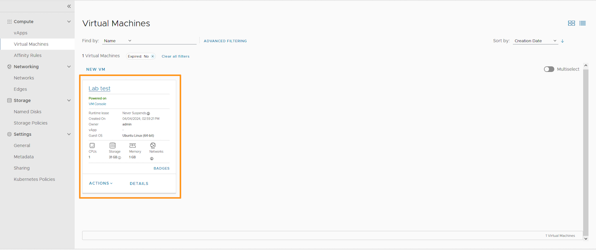

## Objectif

**Ce guide vous détaille comment créer votre première machine virtuelle de deux méthodes :**
**- Création d'une machine virtuelle à partir d'un iso**
**- Création d'une machine virtuelle grâce à un template**

## Prérequis

- Avoir un vCD
- Un iso d'un systeme d'exploitation

## En pratique

### Création d'une machine virtuelle 

Pour créer votre machine virtuelle, accédez d'abord au datacenter où vous prévoyez de la déployer. Ensuite, naviguez vers la section `Compute` > `Virtual Machine` > `NEW VM`.

> [!tabs]
> **From Template**
>> Qu’est-ce qu’un **template** ? Un template est une machine virtuelle préconfigurée qui est utilisée pour en créer de nouvelles. Le nombre de mémoire, de vCPU, de cartes réseau (NIC) et d'espace de stockage sont déjà définis et ne peuvent pas être modifiés pendant le déploiement. Ne vous inquiétez pas, vous pourrez le modifier une fois le processus de déploiement terminé. Il s'agit d'un déploiement OVA basique.
>> Retournons à la création de notre machine virtuelle. Remplissez les champs requis, puis assurez-vous de sélectionner l'option `Type` comme `From Template`. Vous verrez alors un menu déroulant des différents modèles disponibles.
>> 
>> Les templates disponibles ci-dessous font partie du catalogue OVHcloud pré-provisionné et peuvent être utilisés selon vos besoins. Nous fournissons un tas de différentes distributions Linux avec et sans applications déjà installées, nous avons également importé quelques modèles du catalogue Bitnami (https://bitnami.com/stacks/virtual-machine).
>> Dans la section `Propriétés personnalisées`, vous avez la possibilité de personnaliser différentes propriétés de votre machine virtuelle, telles qu'un utilisateur spécifique, le nom de domaine, son adresse IP, et bien d'autres.
> **From scratch**
>> Comme pour la création à partir d'un template remplissez les champs requis, cependant pour l'option `Type` veuillez selectionner `New`.
>> Dans la section `Boot image`, vous trouverez des ISO préconfigurés qui vous sont fournis.
>> 
>> La section `Compute` vous permet de configurer la quantité de vCPU et de mémoire souhaitée pour cette machine virtuelle.

Pour la section NIC, vous avez la possibilité de choisir le type de carte réseau en fonction de vos besoins. Le type par défaut (VMXNET3) est souvent un bon choix si vous n'avez pas d'exigences particulières.
En ce qui concerne la sélection du réseau, vous trouverez tous les réseaux disponibles dans votre organisation. Dans notre exemple, nous utiliserons "ovh-net-priv", un réseau que nous avons préalablement créé pour vous. Nous avons activé un service DHCP sur ce réseau et l'avons configuré avec le sous-réseau 192.168.0.0/24.

La liste déroulante Mode IP vous propose différents modes d'attribution d'IP :

    DHCP - Utiliser le serveur DHCP (votre VM doit gérer le DHCP même si vous le sélectionnez).
    Pool IP : sélectionne une IP dans le pool IP du réseau.
    IP Manuelle - Vous devez définir l'IP manuellement

>[!warning]
> Attention, ce mode IP vous permet d'organiser votre inventaire VCD uniquement mais vous devrez tout de même configurer l'IP (ou DHCP) à >l'intérieur même de la VM.
>

En ce qui concerne la section `Storage Policies`, vous ne trouverez qu'une seule possibilité : la politique de stockage par défaut de vSAN.

Vous pouvez également ajouter des disques virtuels dans cette section si vous en avez besoin de plusieurs.

Pour conclure, veuillez examiner toutes les informations fournies pour vous assurer de leur exactitude. Ensuite, cliquez sur "Ok" pour lancer le déploiement de la machine virtuelle. Une fois le déploiement terminé, vous verrez la nouvelle VM répertoriée dans le centre de données virtuel sélectionné.

Pour conclure, veuillez examiner toutes les informations fournies pour vous assurer de leur exactitude. Ensuite, cliquez sur `Ok` pour lancer le déploiement de la machine virtuelle. Une fois le déploiement terminé, vous verrez la nouvelle VM répertoriée dans le centre de données virtuel sélectionné.

Si vous avez utilisez la méthode **from scratch** il ne vous reste plus qu'à allumé votre serveur et de lancer l'installation de votre OS.

## Aller plus loin

Échangez avec notre communauté d'utilisateurs sur <https://community.ovh.com>.