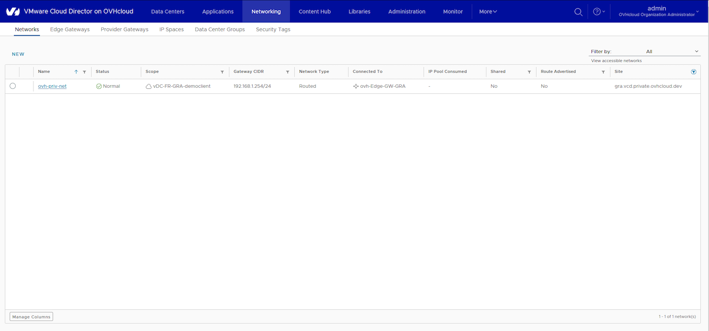
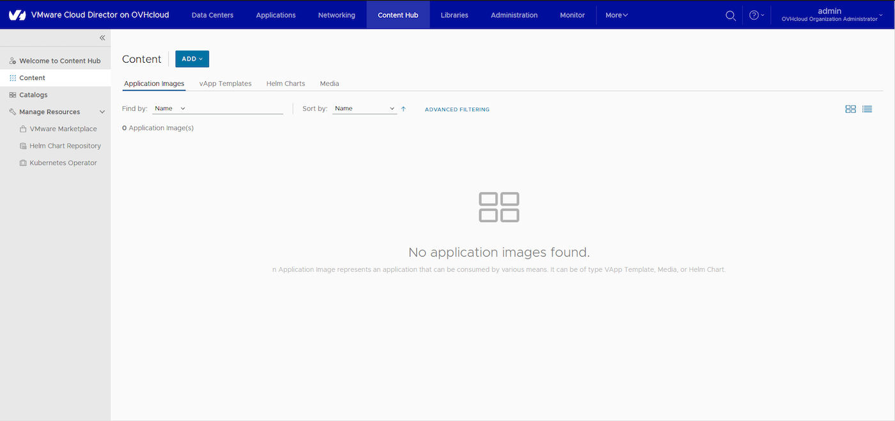
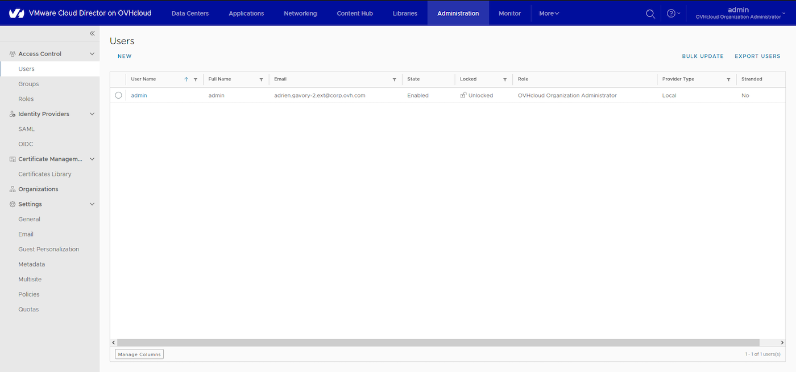
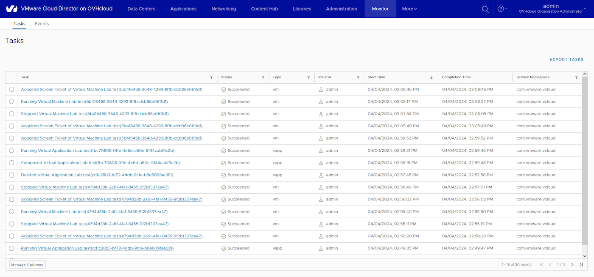
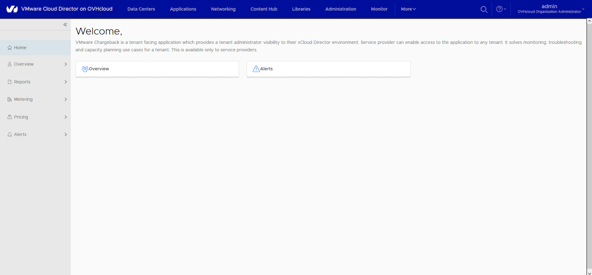
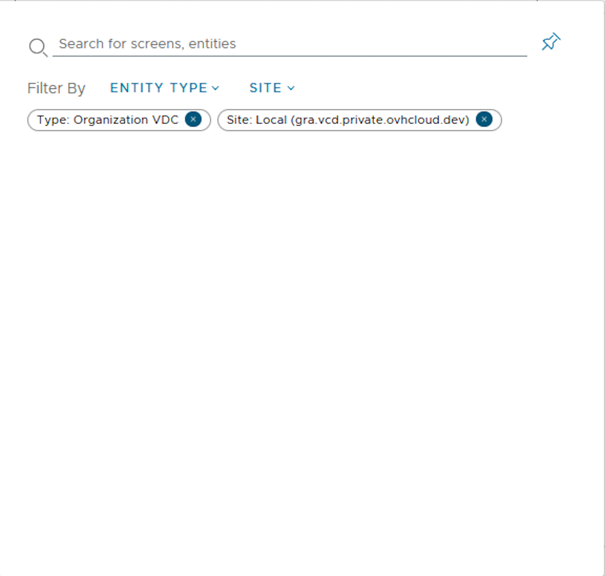

## Objective

**This guide will walk you through the different sections of the vCD interface.**

## Requirements

>[!primary]
> If you are unsure how to log in to your organization’s web portal, read [this guide](/pages/hosted_private_cloud/hosted_private_cloud_powered_by_vmware/vcd-logging) first.

- a VMware Cloud Director account

## Instructions

VMware vCloud Director (vCD) is a cloud computing management platform. vCD enables the creation, management and deployment of virtualized computing resources on a large scale, and offers an agile and scalable infrastructure. With an easy-to-use user interface and advanced features such as resource management, automated billing, and enhanced security, vCloud Director simplifies the management of complex cloud environments. 

This solution enables you to provision and efficiently manage virtual machines, virtual networks, and other resources, providing increased operational agility and flexibility to meet changing business needs.

>[!primary]
> Once you have logged in to your web interface, you will be greeted by a dashboard displaying your **vDC**, as well as a detailed summary of your resource usage (10). At the top of the screen, you will also find a navigation bar with the different settings options available for vCloud Director (vCD).

{.thumbnail}

The different sections available are the following:

1. **Data Centers**
2. **Applications**
3. **Networking**
4. **Content Hub**
5. **Admin**
6. **Monitor**
7. **More**
8. **Magnifier**
9. **Completed tasks**
10. **Resources used**

### Datacentres

{.thumbnail}

In this section, you will find all of your virtual datacentres (**vDC**) ordered in different datacentre locations, a brief overview of your resource usage, and the number of vApps/VMs currently running.

### Applications

In this section, get a comprehensive overview of all your vApps and virtual machines on your virtual datacentres (vcds): create, access and delete vApps or virtual machines with ease.

{.thumbnail}

### Networking

{.thumbnail}

In this section, you can find all the network components of your vCD environments: networks, Edge Gateways, Provider Gateways, IP address ranges, datacentre groups, and security tags.

### Content Hub

{.thumbnail}

In this section, you can manage your catalogs: create, delete or download ISO files, OVA templates, or simply use the preconfigured templates available in the OVHcloud catalog.

### Administration

{.thumbnail}

In this section, you can manage users in your organization, create roles and groups, and configure an identification provider (OIDC/SAML). You can also set up email alerts and expiration policies for your applications.

### Monitoring

{.thumbnail}

In this section, you can access the complete history of all tasks and events that have occurred in your organization. You can filter to find the tasks/events you want more easily.

### More

{.thumbnail}

In this section, access the essential plugins: Veeam for data protection to back up your infrastructure, and the Operations Manager for an exhaustive breakdown of your usage.

### Magnifier

{.thumbnail}

Use this feature to search for components within your organization. The vertical dots give you the ability to log out, change your password, and manage your user preferences.

### Tasks Completed

{.thumbnail}

See here for all recent actions in your organization.

## Go further

If you need training or technical assistance to implement our solutions, contact your sales representative or click on [this link](https://www.ovhcloud.com/en-au/professional-services/) to get a quote and ask our Professional Services experts for a custom analysis of your project.

Join our community of users on <https://community.ovh.com/en/>.
