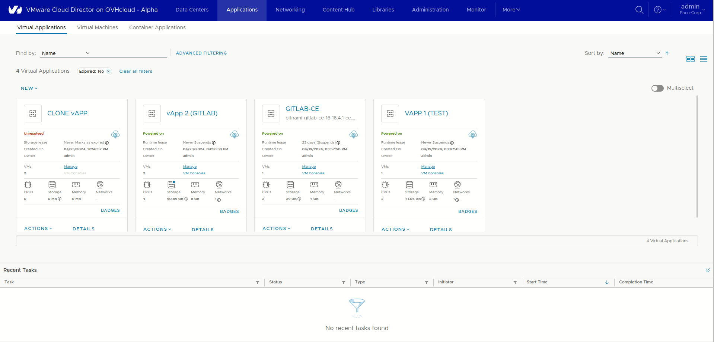
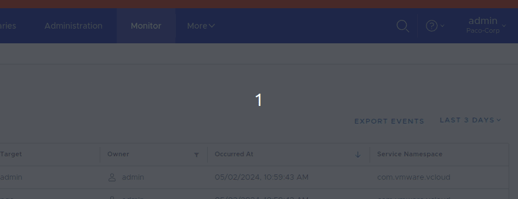

## Objective

**This guide will walk you through the different sections of the VCD interface.**

The version used for all our VMware Cloud Director (VCD) products is `version 10.5`.

## Requirements

- A working knowledge of Linux, vSphere, Windows and IP networks is required to configure and manage vCD
- a VMware Cloud Director administrator account

> [!primary]
> If you are unsure how to log in to your organization’s web portal, read [this guide](/pages/hosted_private_cloud/hosted_private_cloud_powered_by_vmware/vcd-logging) first.

## Instructions

> [!primary]
> Once you have logged in to your web interface, you will be greeted by a dashboard displaying your **vDC**, as well as a detailed summary of your resource usage (10). At the top of the screen, you will also find a navigation bar with the different settings options available for vCloud Director (VCD).

VMware vCloud Director (VCD) is a cloud computing management platform. VCD enables the creation, management and deployment of virtualized computing resources on a large scale, and offers an agile and scalable infrastructure. With an easy-to-use user interface and advanced features such as resource management, automated billing, and enhanced security, vCloud Director simplifies the management of complex cloud environments.

This solution enables you to provision and efficiently manage virtual machines, virtual networks, and other resources, providing increased operational agility and flexibility to meet changing business needs.

{.thumbnail}

The different sections available are the following:

1. **Data Centers**
2. **Applications**
3. **Networking**
4. **Content Hub**
5. **Admin**
6. **Monitor**
7. **More**
8. **Magnifier**
9. **Completed tasks**
10. **Resources used**

### Data Centers

In this section, you will find all of your virtual data centres (vDC) ordered in different data centre locations, a brief overview of your resource usage, and the number of vApps/VMs currently running.

In this section, you will see a banner on your left, the same as when you click on one of your: `Virtual applications | Virtual machines | Container applications `{.action} from the **"Application"** section:

Compute:

- `vApps`{.action}
- `Virtual Machines`{.action}
- `Affinity Rules`{.action}

Networking:

- `Networks`{.action}
- `Edges`{.action}

Storage:

- `Named Dlisks`{.action}
- `Storage Policies`{.action}

Settings:

- `General`{.action}
- `Metadata`{.action}
- `Sharing`{.action}
- `Kubernetes Policies`{.action}

{.thumbnail}

### Applications

This section gives you a comprehensive overview of all your vApps and virtual machines in your virtual datacentres (vcd): create, access and delete vApps or virtual machines with ease.

Using vApps is a unique feature of Vcloud Director (VCD). This allows you to create and group a set of virtual machines, containers within the same Virtual Application (vApp), but also to go granularly to create affinity/anti-affinity rules within these vApps (network, firewall, templating etc.).
As settings for these vApps, we find the same vSphere/NSX features for the network and storage that can be applied to this centralized web console (an orchestrator).

For example, you can copy a vApp from one Data Center to another, and also migrate an application from one site to another.

Here is the global view of the "Application" section in this screenshot:

{.thumbnail}

Here are the 3 main elements of the Application section, you can also see that when you click on one of your vApps, you will be redirected to the Data Center section:

- `Virtual Applications`{.action}
- `Virtual Machines`{.action}
- `Container Applications`{.action}

{.thumbnail}

### Networking

VMware Cloud Director networking allows the organization’s provider and customer to create and consume networking resources from a vSphere or NSX environment.
As a result, clients can create network segments and configure services finely with or without DHCP, perform NAT firewall but also use load balancing integrations for example.

You can see in the screenshot below that the most advanced features offered by VMware in all these years are present in Vcloud Director (VCD) within a single central administration console.

{.thumbnail}

In this section, you can find all the network components of your VCD environments:

Networking:

- `Networks`{.action}
- `Edge Gateways`{.action}
- `Provider Gateways`{.action}
- `IP Spaces`{.action}
- `Data Center Groups`{.action}
- `Security Tags`{.action}

**VMware Cloud Director supports three types of networks:**

- External networks
- Organization of Virtual Datacentre Networks
- vApp networks

### Content Hub

In this section, you can manage your catalogs: create, delete or download ISO files, OVA templates, or simply use the preconfigured templates available in the OVHcloud catalog.

{.thumbnail}

Content Hub:

- `Welcome to the Content Hub`{.action}
- `Content`{.action}
- `Catalogs`{.action}
- `Manage resources: VMware Marketplace / Helm Chart repository / Kubernetes Operator`{.action}

### Libraries

{.thumbnail}

Libraries:

- `Content Libraries`{.action}.
- `Services`{.action}.

### Administration

In this section, you can manage users in your organization, create roles and groups, and configure an identification provider (OIDC/SAML). You can also set up email alerts and expiration policies for your applications.

Access Control:

- `Users`{.action}
- `Groups`{.action}
- `Roles`{.action}

Identity Providers:

- `SAML`{.action}
- `OIDC`{.action}

Certificate Management:

- `Certificate Management`{.action}

Settings:

- `General`{.action}
- `Email`{.action}
- `Guest Personalization`{.action}
- `Metadata`{.action}
- `Multisite`{.action}
- `Policies`{.action}
- `Quotas`{.action}

{.thumbnail}

### Monitoring

In this section, you can access the complete history of all tasks and events that have occurred in your organization. You can filter to find the tasks/events you want more easily.

{.thumbnail}

### More

In this section, access the essential plugins: Veeam for data protection to back up your infrastructure, and the Operations Manager for an exhaustive breakdown of your usage.

{.thumbnail}

### Magnifier

Use this feature to search for components within your organization. The vertical dots give you the ability to log out, change your password, and manage your user preferences.

{.thumbnail}

### Tasks Completed

See here for all recent actions in your organization.

{.thumbnail}

## Go further

If you need training or technical assistance to implement our solutions, contact your sales representative or click on [this link](/links/professional-services) to get a quote and ask our Professional Services experts for a custom analysis of your project.

Join our community of users on <https://community.ovh.com/en/>.
