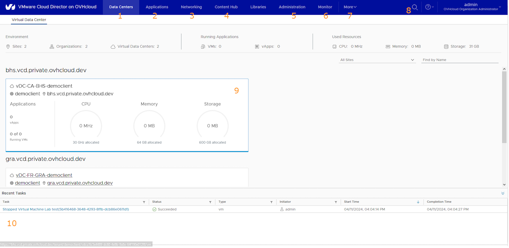
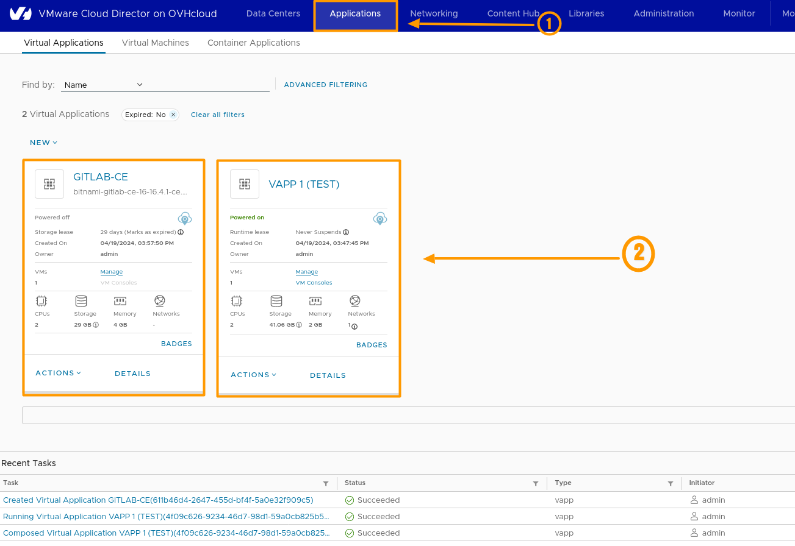
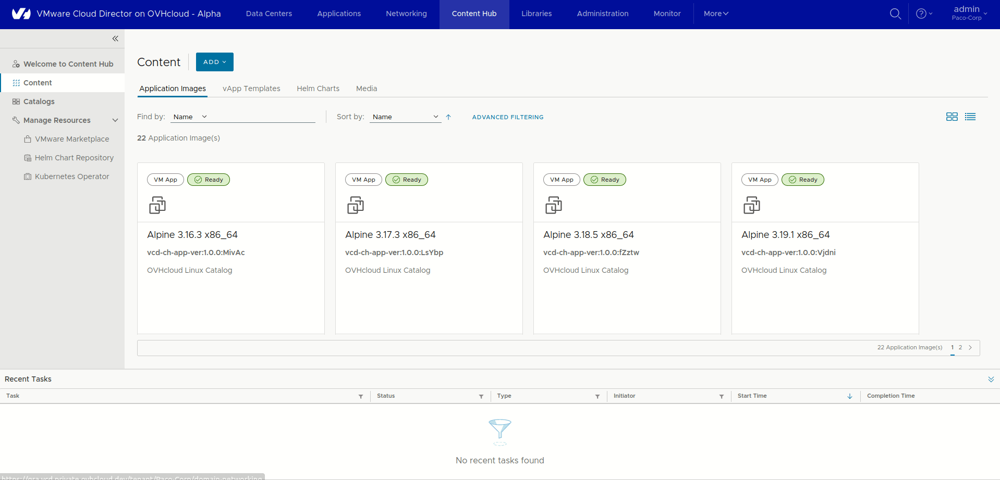
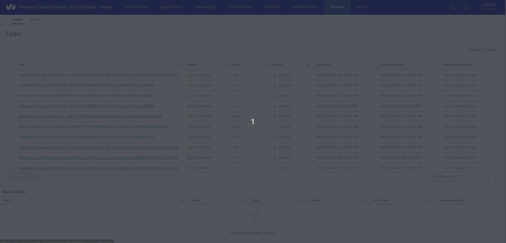
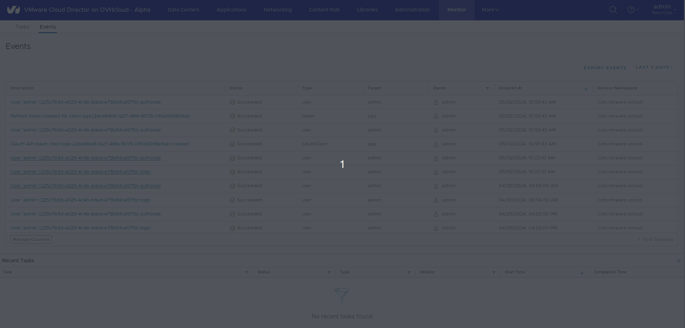

## Objectif

**Ce guide vous présente les différentes sections de l'interface de VMware Cloud Director.**

La version utilisée pour l'ensemble de nos produits VMware Cloud Director (VCD) est la `version 10.5`.

## Prérequis

- Une connaissance pratique des réseaux Linux, vSphere, Windows et IP est nécessaire pour configurer et gérer vCD
- Avoir un compte VMware Cloud Director administrateur

>[!primary]
> Si vous ne savez comment vous connecter au portail web de votre organisation, consultez d'abord [ce guide](/pages/hosted_private_cloud/hosted_private_cloud_powered_by_vmware/vcd-logging).

## En pratique

> [!primary]
> Une fois connecté à votre interface web, vous serez accueillis par un tableau de bord affichant vos **vDC**, ainsi qu'un résumé détaillé de votre utilisation des ressources (10). En haut de l'écran, vous trouverez également une barre de navigation regroupant les différentes options de paramétrage disponibles pour vCloud Director (VCD).

VMware vCloud Director (VCD) est une plateforme de gestion de cloud computing. Celle-ci permet la création, la gestion et le déploiement de ressources informatiques virtualisées à grande échelle. VCD offre une infrastructure agile et évolutive. Grâce à son interface utilisateur conviviale et à ses fonctionnalités avancées telles que la gestion des ressources, du réseau logiciel, et la sécurité renforcée, vCloud Director simplifie la gestion des environnements cloud complexes.

Cette solution vous permet de provisionner et de gérer efficacement des machines virtuelles, des réseaux virtuels et d'autres ressources, en offrant une agilité opérationnelle et une flexibilité accrues pour répondre à l'évolution des besoins de l'entreprise.

{.thumbnail}

Les différentes sections disponibles :

1. **Centre de données**
2. **Applications**
3. **Mise en réseau**
4. **Hub de contenu**
5. **Administration**
6. **Surveiller**
7. **Plus**
8. **Loupe**
9. **Tâches effectuées**
10. **Ressources utilisées**

### Centres de données

Retrouvez dans cette section tous vos centres de données virtuels (**vDC**) commandés avec différents emplacements de datacenters, un bref suivi de votre consommation de ressources et du nombre de vApps/VM en cours d’exécution.

Dans cette section vous retrouvez un bandeau sur votre gauche, le même que quand vous cliquez sur une de vos : `Applications virtuelles | Machines virtuelles | Applications de conteneur `{.action} depuis la section **"Application"** :

Calcul :

- `vApp`{.action}.
- `Machines virtuelles`{.action}.
- `Règles d'affinité`{.action}.

Mise en réseau :

- `Réseaux`{.action}.
- `Dispositifs Edge`{.action}.

Stockage :

- `Disques nommés`{.action}.
- `Stratégies de stockage`{.action}.

Paramètres :

- `Génèral`{.action}.
- `Métadonnées`{.action}.
- `Partage`{.action}.
- `Stratégies Kubernetes`{.action}.

{.thumbnail}

### Applications

Cette section vous permet de profiter d'une vision d'ensemble complète de tous vos vApps et machines virtuelles sur vos centres de données virtuels (vcd) : créez, accédez et supprimez des vApps ou des machines virtuelles en toute simplicité.

L'utilisation des vApps est une des fonctionnalités uniques de Vcloud Director (VCD). Cela permet de créer et grouper un ensemble de machines virtuelles, de conteneurs au sein de la même Virtual Application (vApp), mais aussi d'aller granulairement créer des rêgles d'affinités/anti-affinités au sein de ces vApp (réseau, firewall, templating etc).
Nous retrouvons comme réglages pour ces vApp, les mêmes fonctionnalités de vSphere/NSX pour la partie réseau et le stockage que l'on peut appliquer à cette console Web centralisée (un orchestrateur).

Il est par exemple possible de copier une vApp d'un Data Center à un autre et aussi pour une migration d'application d'un site à un autre.

Voici la vue globale de la section "Application" dans cette capture :

{.thumbnail}

Voici les 3 éléments principaux de la section Application, vous pouvez aussi voir que quand vous cliquez sur l'une de vos vApp, vous serez redirigé dans la section Data Center :

- `Applications virtuelles`{.action}.
- `Machines virtuelles`{.action}.
- `Applications de conteneur`{.action}.

{.thumbnail}

### Réseau

La mise en réseau de VMware Cloud Director permet au fournisseur et au client de l'organisation de créer et de consommer des ressources de mise en réseau à partir d'un environnement vSphere ou NSX.
Par conséquent, les clients peuvent créer des segments réseaux et configurer des services finement avec ou sans DHCP, effectuer du pare-feu NAT mais aussi utiliser les intégrations de load-balancing par exemple.

Vous pouvez voir sur la capture d'écran ci-dessous que les fonctionnalités les plus avancées proposées par VMware depuis toutes ces années sont présentes dans Vcloud Director (VCD) au sein d'une même console centrale d'administration.

{.thumbnail}

Dans cette section, vous retrouvez tous les composants réseau de vos environnements VCD :

Réseaux :

- `Réseaux`{.action}.
- `Passerelles Edge`{.action}.
- `Passerelles de fournisseur`{.action}.
- `Espaces IP`{.action}.
- `Groupes de centres de données`{.action}.
- `Balises de sécurité`{.action}.

**VMware Cloud Director supporte trois types de réseaux :**

- Réseaux externes
- Organisation de Réseaux de Datacenters virtuels
- Réseaux vApp

### Hub de contenu

Cette section vous permet d'administrer vos catalogues : créez, supprimez ou téléchargez des fichiers ISO, des modèles OVA, ou bien utilisez tout simplement les modèles préconfigurés disponibles dans le catalogue OVHcloud.

{.thumbnail}

Hub de contenu :

- `Bienvenue dans le Hub de contenu`{.action}
- `Contenu`{.action}
- `Catalogues`{.action}
- `Gérer des ressources : VMware Marketplace / Référentiel Helm Chart / Kubernetes Operator`{.action}

### Bibliothèques

{.thumbnail}

Libraries :

- `Bibliothèques de contenu`{.action}.
- `Services`{.action}.

### Administration

Vous avez la possibilité de gérer ici les utilisateurs de votre organisation, de créer des rôles et des groupes et de configurer un fournisseur d'identification (OIDC/SAML). Vous pouvez également paramétrer des stratégies d'alertes et d'expiration par e-mail pour vos applications.

Dans cette section, vous retrouvez tous les composants d'administration de votre organisation VCD :

Contrôle d'accès :

- `Utilisateurs`{.action}
- `Groupes`{.action}
- `Rôles`{.action}

Fournisseur d'identités :

- `SAML`{.action}
- `OIDC`{.action}

Gestion des certificats :

- `Bibliothèque de certificats`{.action}

Paramètres :

- `Général`{.action}
- `E-mail`{.action}
- `Personnalisation invité`{.action}
- `Métadonnées`{.action}
- `Multisite`{.action}
- `Stratégies`{.action}
- `Quotas`{.action}

{.thumbnail}

### Surveiller

{.thumbnail}

Dans cette section, vous pouvez accéder à l'historique complet de toutes les tâches et événements survenus dans votre organisation. Vous pouvez utiliser les filtres pour retrouver plus facilement les tâches/événements souhaités.

### Plus

{.thumbnail}

Dans cette section, accédez aux plugins essentiels : Veeam pour la protection des données afin de sauvegarder votre infrastructure, et le *Operations Manager* pour obtenir un détail exhaustif de votre consommation.

### Loupe

{.thumbnail}

Utilisez cette fonction pour rechercher des composants au sein de votre organisation. Les points verticaux vous offrent la possibilité de vous déconnecter, de modifier votre mot de passe et de gérer vos préférences utilisateur.

### Tâches effectuées

{.thumbnail}

Consultez ici toutes les actions récentes effectuées au sein de votre organisation.

## Aller plus loin

Si vous avez besoin d'une formation ou d'une assistance technique pour la mise en oeuvre de nos solutions, contactez votre commercial ou cliquez sur [ce lien](https://www.ovhcloud.com/fr/professional-services/) pour obtenir un devis et demander une analyse personnalisée de votre projet à nos experts de l’équipe Professional Services.

Échangez avec notre communauté d'utilisateurs sur <https://community.ovh.com>.