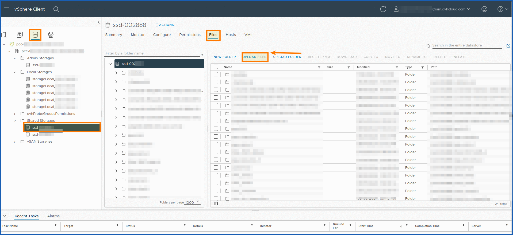

 
## Objectif
 
**L'objectif est d'uploader des fichiers (iso, fichier etc..) avec le client vSphere datastore dédié.**
 

## Prérequis

- Être connecté à [l'espace client OVHcloud](/links/manager)
- Être administrateur technique de l'infrastructure [VMware on OVHcloud](https://www.ovhcloud.com/fr/enterprise/products/hosted-private-cloud/).

## En pratique

### Étape 1 - Comment accéder au datastore

#### Via l'espace client

Suivez le guide suivant pour vous connecter l'interface web vSphere : [Se connecter à la console web vSphere](/pages/hosted_private_cloud/hosted_private_cloud_powered_by_vmware/vsphere_interface_connexion)

### Étape 2 - Upload d'un ISO dans le datastore

Cliquez sur `Stockage`{.action} dans l'inventaire VMware Host Client et cliquez sur `Banques de données`{.action}

{.thumbnail}

{.thumbnail}

Cliquez sur `Explorateur de banque de données`{.action}

Sélectionnez la banque de données dans laquelle vous souhaitez stocker le fichier.

(Facultatif) Cliquez sur Créer un répertoire pour créer un répertoire de banque de données où stocker le fichier.

Sélectionnez le dossier cible et cliquez sur `Télécharger`{.action}

{.thumbnail}

Localisez l'élément à télécharger depuis votre ordinateur local (un fichier `XXX.iso`) et cliquez sur `Ouvrir`{.action}

Le fichier se télécharge dans la banque de données sélectionnée.

(Facultatif) Actualisez l'explorateur de fichiers de la banque de données pour afficher le fichier téléchargé dans la liste.

Cliquez sur `Fermer`{.action} pour quitter le navigateur.

Vous pouvez ainsi lancer cette ISO depuis une VM et lancer l'installation. Il est recommandé d'utiliser les modèle de déploiement OVHcloud.

## Aller plus loin

Si vous avez besoin d'une formation ou d'une assistance technique pour la mise en œuvre de nos solutions, contactez votre Technical Account Manager ou rendez-vous sur [cette page](/links/professional-services) pour obtenir un devis et demander une analyse personnalisée de votre projet à nos experts de l’équipe Professional Services.

Posez des questions, donnez votre avis et interagissez directement avec l’équipe qui construit nos services Hosted Private Cloud sur le [channel Discord dédié](<https://discord.gg/ovhcloud>).

Échangez avec notre [communauté d'utilisateurs OVHcloud](/links/community).
