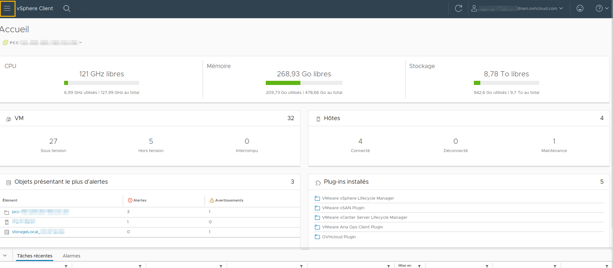

## Objectif

**L'objectif est de télécharger des fichiers (ISO, VMDK, OVA etc..) dans un répértoire du Datastore avec le client HTML vSphere on OVHcloud.**

## Prérequis

- Être connecté à [l'espace client OVHcloud](/links/manager)
- Être administrateur technique de l'infrastructure [VMware on OVHcloud](https://www.ovhcloud.com/fr/enterprise/products/hosted-private-cloud/)
- Si vous utilisez IAM verifier bien d'avoir les droits, rôles et les actions nécessaires pour téléverser des fichiers ou créer des répertoires dans le Datastore. Vous pouvez vous référer à la partie du guide "#Allez plus loin" pour plus d'informations.

## En pratique

### Étape 1 - Accéder au Datastores

#### Via l'espace client

Suivez le guide suivant pour vous connecter l'interface web vSphere : [Se connecter à la console Web vSphere on OVHcloud](/pages/hosted_private_cloud/hosted_private_cloud_powered_by_vmware/vsphere_interface_connexion)

### Étape 2 - Upload de fichiers (ISO) dans un Datastore

**Comment accéder au Datastore** ?

Vous devez ensuite accéder aux repertoires sur lequel vous voulez stocker vos fichiers (ISO par exemple). L'objectif étant de créer une arboréscence afin de retrouver facilement vos éléments au sein de votre vSphere managé.

{.thumbnail}

Vous disposez de 2 façons d'y accéder :

1. Depuis `Inventaire` :

|                                   **Image**                                    | **Texte**                                                                     |
|:------------------------------------------------------------------------------:|:------------------------------------------------------------------------------|
|  {.thumbnail}  | - Cliquez sur `Inventaire`{.action}                                           |
|        {.thumbnail}        | - Puis cliquez sur `Banques de données`{.action} et sur `Datastores`{.action} |

Vous retrouverez l'ensemble de vos Datastores listés.

{.thumbnail}

Vous allez vous retrouver dans la section `Fichier` ou vous pourrez importer des données dans vos Datastores.

Cliquez ensuite sur `TÉLÉCHARGER DES FICHIERS`{.action} pour sélectionner le fichier à téléverser depuis votre machine local (ISO ou autres).

{.thumbnail}

2. Depuis `Listes d'inventaires globaux` :

Qui vous renvoie aussi ensuite à l'interface `Fichers` de téléversement (libre à vous de choisir celle qui vous convient le mieux) :

|                                         **Image**                                         | **Texte**                                             |
|:-----------------------------------------------------------------------------------------:|:------------------------------------------------------|
|           {.thumbnail}            | - Cliquez sur `Listes d'inventaires globaux`{.action} |
| {.thumbnail} | - Puis sur `Banques de données`{.action}              |             

{.thumbnail}

Cliquez également sur le `Datastore` souhaité.

Vous allez vous retrouver dans la section `Fichier` ou vous pourrez importer des données dans vos Datastores.

Cliquez ensuite sur `TELECHARGER DES FICHIERS`{.action} pour sélectionner le fichier à téléverser depuis votre machine local (ISO ou autres).

{.thumbnail}

**Comment créer un repertoire** (Facultatif) ?

Si vous n'avez pas de préférence, cliquez sur `NOUVEAU DOSSIER`{.action} pour créer un répertoire de banque de données où stocker vos fichiers depuis votre datastore `pcc-XXX-XXX-XXX-XXX`.

Vous avez plusieurs choix :

- `Nouvel hôte et dossier de cluster`
- `Nouveau dossier réseau`
- `Nouveau dossier de stockage`
- `Nouvelle VM et dossiers de stockage`

Vous aussi la possibilité de les créer avec un clic droit `pcc-XXX-XXX-XXX-XXX_datastoreXXX > Clic Droit > Nouveau dossier`{.action} 

Ou depuis `SSD-XXX > Banque de données > Fichiers > Nouveau dossier`{.action}.

Une fois votre arborescence créée, sélectionnez le répertoire cible et cliquez sur `TÉLÉCHARGER DES FICHIERS`{.action} ou `TÉLÉCHARGER DES DOSSIERS`{.action}

Vous devez disposer des droits suffisants pour effectuer d'autres actions, tel que `DÉPLACER VERS`{.action} ou `COPIER DANS`{.action} par exemple.

{.thumbnail}

Localisez l'élément à télécharger depuis votre ordinateur local (un fichier `XXX.iso`) et cliquez sur `Ouvrir`{.action}

Le fichier ISO se télécharge dans la banque de données sélectionnée.

(Facultatif) Actualisez l'explorateur de fichiers de la banque de données pour afficher le fichier téléchargé dans la liste.

Cliquez sur `Fermer`{.action} pour quitter le navigateur.

Vous pouvez ainsi lancer cette ISO depuis un périphérique CD/DVD au sein de vote VM et lancer l'installation de l'OS en suivant le processus d'installation. Il est cependant recommandé d'utiliser des modèles de déploiement OVHcloud ou des clones de VM templaté par vos soins.

## Aller plus loin

**IAM pour VMware on OVHcloud - Index des guides :**

- Guide 1 : [IAM pour VMware on OVHcloud - Présentation et FAQ](/pages/hosted_private_cloud/hosted_private_cloud_powered_by_vmware/vmware_iam_getting_started)
- Guide 2 : [IAM pour VMware on OVHcloud - Comment activer IAM](/pages/hosted_private_cloud/hosted_private_cloud_powered_by_vmware/vmware_iam_activation)
- Guide 3 : [IAM pour VMware on OVHcloud - Comment créer un rôle vSphere IAM](/pages/hosted_private_cloud/hosted_private_cloud_powered_by_vmware/vmware_iam_role)
- Guide 4 : [IAM pour VMware on OVHcloud - Comment associer un rôle vSphere à une politique IAM](/pages/hosted_private_cloud/hosted_private_cloud_powered_by_vmware/vmware_iam_role_policy)
- Guide 5 : [IAM pour VMware on OVHcloud - Comment associer un utilisateur à une politique IAM globale](/pages/hosted_private_cloud/hosted_private_cloud_powered_by_vmware/vmware_iam_user_policy)

Si vous avez besoin d'une formation ou d'une assistance technique pour la mise en œuvre de nos solutions, contactez votre Technical Account Manager ou rendez-vous sur [cette page](/links/professional-services) pour obtenir un devis et demander une analyse personnalisée de votre projet à nos experts de l’équipe Professional Services.

Posez des questions, donnez votre avis et interagissez directement avec l’équipe qui construit nos services Hosted Private Cloud sur le [channel Discord dédié](<https://discord.gg/ovhcloud>).

Échangez avec notre [communauté d'utilisateurs OVHcloud](/links/community).
