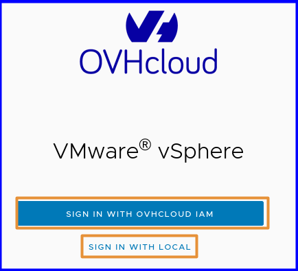

# Table des matières
1. [Objectif - Liens des guides IAM avec VMware](#Objectif)
2. [Etape 1 - En pratique](#Enpratique)
3. [Etape 2 - FAQ](#FAQ)
4. [A suivre](#Asuivre)
5. [Fin - Aller plus loin](#Allerplusloin)

---
## Objectif
**Dans ce guide, nous allons vous expliquer comment démarrer avec IAM dans votre Cloud Privée VMware sur OVHcloud** 

---
## Etape 1 : En pratique

## Premiers pas avec IAM et mon cloud privée VMware managé par OVHcloud

Pour utiliser IAM dans votre cloud privé, il va faut : 

- [x] Activer IAM.

- [x] Créer une politique IAM globale liée à mon identité OVHcloud.

Des étapes supplémentaires sont nécessaires, nous allons les détailler dans la suite de ce guide.

### Comment fonctionne IAM dans un cloud privée VMware sur OVHcloud ?
> [!IMPORTANT]
>
> Un rôle IAM Vsphere ne peut (à ce jour) pas être ajouté grâce aux groupes de permissions managées.
> Mais uniquement manuellement, voir le guide : [Comment ajouter un rôle IAM manuellement à une politique globale](/pages/hosted_private_cloud/hosted_private_cloud_powered_by_vmware/vmware_iam_role_policy)

Gérer les identités de vos utilisateurs et de vos applications, ainsi que leurs droits d’accès dans une interface unique pour tous vos services. OVHcloud IAM permet de gérer finement l’ensemble des autorisations des produits OVHcloud et d’obtenir un meilleur niveau de sécurité avec une vision centralisée de vos accès.

Pour simplifier, un rôle IAM remplace ainsi un utilisateur local Vsphere au sein de notre cloud privée. Et une politique permet d'associer votre identité OVHcloud à ce rôle.

Voici les éléments nécessaires à une politique globale :
- Produits : **Vsphere / VMware (hosted private cloud, service pack)**
- Ressources : **PCC-XXX**
- Actions : **Groupes de permissions, Ajoutées manuellement -> Rôle Vsphere/IAM**
- Utilisateurs : **Utilisateur 1/2/3**

Voir le diagramme du fonctionnement de IAM avec un cloud privé OVHcloud :

{.thumbnail}

## Etape 2 : FAQ

## Dans quelle scope applicable puis-je utiliser IAM au sein de mon cloud privé OVHcloud et quelles sont ses limitations ?

IAM est actuellement dans une version BETA sur la plateforme OVHcloud, les infrastructures bénéficiant d'options de sécurité renforcée ou d'un service certifié (HDS, PCI-DSS ou SNC) ne peuvent actuellement pas utiliser l'IAM OVHcloud.

**SNC : SecNumCloud**
**HDS : Hébergement de santé**
**PCI-DSS: Hébergement de données bancaires**

Un role IAM ne peut qu'uniquement être ajouté manuellement dans une politique (action : assumrole -> role_iam), vous pouvez suivre le guide [Comment créer un rôle IAM das Vsphere](/pages/hosted_private_cloud/hosted_private_cloud_powered_by_vmware/vmware_iam_role) pour la solution.

## Est-ce que je peux activer IAM facilement ?

Oui, je peux activer IAM en cliquant sur un seul bouton depuis mon cloud privé VMware (voir guide : [Comment activer IAM](/pages/hosted_private_cloud/hosted_private_cloud_powered_by_vmware/vmware_iam_activation)).

## Comment sont gérés les utilisateurs d'IAM avec Vsphere ?

L'activation de l'IAM OVHcloud ne désactive pas vos utilisateurs Hosted Private Cloud existants (Vsphere locaux), vous pourrez toujours les utiliser pour vous connecter localement, sans utiliser IAM. Choisissez alors un utilisateur local et non IAM.

# Est-ce que je peux choisir entre un utilisateur local et un utilisateur IAM lors de la connexion à Vsphere ?

Oui, lorsque IAM est activé vous avez la possibilité de choisir entre IAM et un utilisateur local Vphere, grâce à la fenêtre qui s'affiche ci-dessous :

{.thumbnail .h-250 .w-140}

{.thumbnail}

## Comment est-ce que j'accède à la délégation des droits Vsphere avec IAM ?

La gestion des **Identités associées**, des **Ressources**, **Groupes de ressources** et leurs autorisations dans les politiques s'effectue depuis [l'espace client](https://www.ovh.com/manager/#/dedicated/useraccount/dashboard) OVHcloud dans **Mon Profil (Support standard) > Identités et accès (IAM)**. Alors que les rôles IAM et les utilisateurs Vsphere locaux s'effectue depuis la section **Hosted Private Cloud > VMware > PCC-XX > Utilisateurs/Rôles (IAM-OVHcloud)**.

## Y-aura t'il une gestion avancée des roles modifiés à l'avenir ?

Oui, la version suivante de IAM permettra d'aller plus loin dans la gestion des droits avec les roles IAM modifiés.

## Est-ce que je peux ajouter un rôle automatiquement à une politique IAM ?

Non, il n'est pas possible à ce jour d'ajouter un rôle grâce aux groupes de permissions managées automatique.

## Que représente un rôle IAM Vsphere dans une politique ?

Chaque rôle IAM de votre environnement VMware correspond à une action s'écrivant sous la forme `pccVMware:vSphere:assumeRole?nom_du_role`{.action} dans une politique IAM.

Par exemple, pour le rôle **iam-admin** d'un PCC, l'action est -> `pccVMware:vSphere:assumeRole?iam-admin.`{.action}

Un rôle peut être considéré comme un modèle utilisateur avec lequel vous definissez des droits PCC (Vsphere) et vous appliquez ainsi ces droits (ce rôle) sur un utilisateur de votre espace client OVHcloud (IAM, si vous avez lié votre utilisateur à une politique).

## A suivre 
Je vous invite maintenant à activer IAM dans votre PCC en suivant les instructions du tutoriel : 
- [Comment activer IAM dans un cloud privé VMware managé par OVH](/pages/hosted_private_cloud/hosted_private_cloud_powered_by_vmware/vmware_iam_activation)

---
## Aller plus loin

Pour aller plus loin avec IAM, vous pouvez lire ces guides :

- [Comment utiliser les politiques IAM avec vSphere](https://help.ovhcloud.com/csm/fr-vmware-use-iam-vsphere?id=kb_article_view&sysparm_article=KB0059059){.external}
- [Liste des groupes de permissions OVHcloud](https://help.ovhcloud.com/csm/fr-customer-iam-permissionsgroup?id=kb_article_view&sysparm_article=KB0060254){.external}
- [Comment utiliser les politiques IAM depuis votre espace client](https://help.ovhcloud.com/csm/fr-customer-iam-policies-ui?id=kb_article_view&sysparm_article=KB0058730){.external}
- [Comment utiliser les politiques IAM via l’API OVHcloud](https://help.ovhcloud.com/csm/fr-customer-iam-policies-api?id=kb_article_view&sysparm_article=KB0056808){.external}
- [Gérer et exploiter - IAM](https://help.ovhcloud.com/csm/fr-documentation-manage-operate-iam?id=kb_browse_cat&kb_id=3d4a8129a884a950f07829d7d5c75243&kb_category=f9734072c014f990f0785f572a5744ed&spa=1){.external}
- [Comment analyser les résultats de politiques IAM](https://help.ovhcloud.com/csm/fr-iam-troubleshooting?id=kb_article_view&sysparm_article=KB0060455){.external}

Échangez avec notre communauté d'utilisateurs sur <https://community.ovh.com>.

