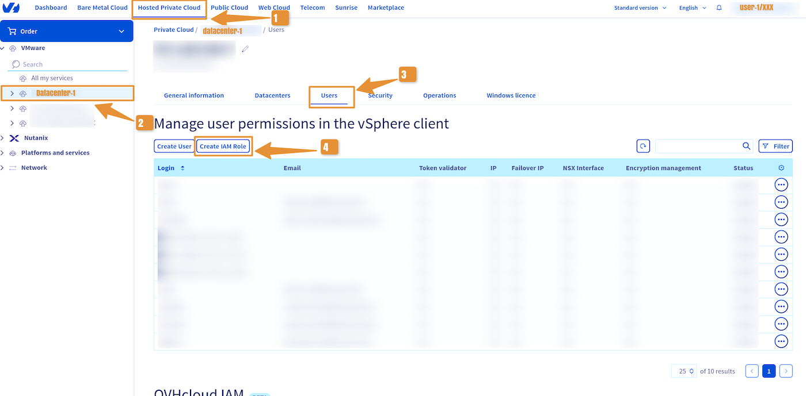

> [!warning]
> La fonctionnalité IAM pour VMware on OVHcloud est actuellement en phase bêta.
> Ce guide peut donc être incomplet. Notre équipe reste disponible sur notre canal Discord dédié. N’hésitez pas à nous rejoindre et à nous contacter : <https://discord.gg/ovhcloud>. Posez des questions, donnez votre avis et interagissez directement avec l’équipe qui construit nos services Hosted Private Cloud.

## Objectif

**Dans ce guide, nous allons vous expliquer comment créer un role IAM dans Hosted Private Cloud - VMware on OVHcloud**.

## Prérequis

- Disposer d'un [compte OVHcloud](/pages/account_and_service_management/account_information/ovhcloud-account-creation)
- Avoir un ou plusieurs produits Hosted Private Cloud - VMware on OVHcloud liés à ce compte (Hosted Private Cloud powered by VMware, Service Pack VMware).
- Avoir activé IAM pour votre service Hosted Private Cloud - VMware on OVHcloud. Suivez les étapes du guide « [IAM pour VMware on OVHcloud - Comment activer IAM](/pages/hosted_private_cloud/hosted_private_cloud_powered_by_vmware/vmware_iam_activation) »

## En pratique

Par défaut, vous disposez de 2 rôles IAM vSphere. La création d'un rôle supplémentaire est donc facultative.

Nous allons vous expliquer comment créer un rôle supplémentaire.

### Créer un rôle IAM via l'espace client OVHcloud

Connectez-vous à votre [espace client OVHcloud](/links/manager) et cliquez sur l'onglet `Hosted Private Cloud`{.action}.

Cliquez sur la rubrique `VMware`{.action}, sélectionnez votre infrastructure puis rendez-vous dans l'onglet `Utilisateurs`{.action}.

Cliquez sur `Créer un rôle IAM`{.action}.

{.thumbnail}

Dans la fenêtre qui s'affiche, définissez le nom de votre rôle puis cliquez sur `Confirmer`{.action}.

> [!primary]
> Les rôles IAM sont automatiquement préfixés par `iam-`.
>

{.thumbnail}

Vous pouvez ensuite éditer les droits du groupe de la même manière qu'avec un utilisateur local vSphere.

#### Créer un rôle IAM via l'API OVHcloud

> [!success]
> Consultez le guide [Premiers pas avec les API OVHcloud](/pages/manage_and_operate/api/first-steps) pour vous familiariser avec l'utilisation des APIv6 OVHcloud.


Exécutez l'appel API suivant :

> [!api]
>
> @api {v1} /dedicatedCloud POST /dedicatedCloud/{serviceName}/iam/addRole
>

> [!warning]
> Veillez à remplacer le `serviceName` par la référence de votre service PCC, sous la forme `pcc-XXX-XXX-XXX-XXX`.

Retour de l'API :

```shell
{
  "userId": null,
  "maintenanceDateTo": null,
  "parentTaskId": null,
  "datacenterId": null,
  "network": null,
  "createdBy": null,
  "state": "todo",
  "hostId": null,
  "endDate": null,
  "networkAccessId": null,
  "maintenanceDateFrom": null,
  "name": "addUser",
  "vlanId": null,
  "description": null,
  "filerId": null,
  "executionDate": "2024-05-15T14:21:17+02:00",
  "createdFrom": null,
  "taskId": 56446627,
  "orderId": null,
  "type": "generic",
  "progress": 0,
  "lastModificationDate": "2024-05-15T14:21:17+02:00"
}
```

> [!primary]
> Les rôles IAM sont automatiquement préfixés par `iam-`.
>

## Aller plus loin

Vous pouvez maintenant suivre les étapes du guide « [IAM pour VMware on OVHcloud - Comment associer un rôle à une politique IAM globale](/pages/hosted_private_cloud/hosted_private_cloud_powered_by_vmware/vmware_iam_role_policy) ».

**IAM pour VMware on OVHcloud - Index des guides :**

- Guide 1 : [IAM pour VMware on OVHcloud - Présentation et FAQ](/pages/hosted_private_cloud/hosted_private_cloud_powered_by_vmware/vmware_iam_getting_started)
- Guide 2 : [IAM pour VMware on OVHcloud - Comment activer IAM](/pages/hosted_private_cloud/hosted_private_cloud_powered_by_vmware/vmware_iam_activation)
- Guide 3 : IAM pour VMware on OVHcloud - Comment créer un rôle vSphere IAM
- Guide 4 : [IAM pour VMware on OVHcloud - Comment associer un rôle vSphere à une politique IAM](/pages/hosted_private_cloud/hosted_private_cloud_powered_by_vmware/vmware_iam_role_policy)
- Guide 5 : [IAM pour VMware on OVHcloud - Comment associer un utilisateur à une politique IAM globale](/pages/hosted_private_cloud/hosted_private_cloud_powered_by_vmware/vmware_iam_user_policy)

Si vous avez besoin d'une formation ou d'une assistance technique pour la mise en oeuvre de nos solutions, contactez votre commercial ou cliquez sur [ce lien](https://www.ovhcloud.com/fr/professional-services/) pour obtenir un devis et demander une analyse personnalisée de votre projet à nos experts de l’équipe Professional Services.

Échangez avec notre communauté d'utilisateurs sur <https://community.ovh.com>.
