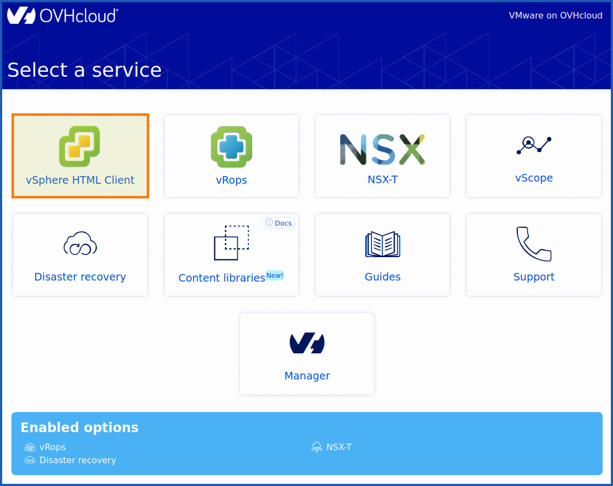

## Objective

**This guide will show you how to log in to your managed vSphere Web interface from the HPC VMware on OVHcloud control panel.**

## Requirements

- You must be the administrator of the [Hosted Private Cloud](/links/hosted-private-cloud/vmware) infrastructure.
- IP addresses added in the `Security`{.action}  section of your [OVHcloud Control Panel](/links/manager). For more information, please read our guide on [Authorizing IPs to connect to vCenter](/pages/hosted_private_cloud/hosted_private_cloud_powered_by_vmware/autoriser_des_ip_a_se_connecter_au_vcenter).

To use IAM, you must enable the feature in order to delegate rights management with a role. Please read the guides:

- Guide 1: [IAM for VMware on OVHcloud - Introduction and FAQ](/pages/hosted_private_cloud/hosted_private_cloud_powered_by_vmware/vmware_iam_getting_started)
- Guide 2: [IAM for VMware on OVHcloud - How to enable IAM](/pages/hosted_private_cloud/hosted_private_cloud_powered_by_vmware/vmware_iam_activation)
- Guide 3: [IAM for VMware on OVHcloud - How to create an IAM vSphere role](/pages/hosted_private_cloud/hosted_private_cloud_powered_by_vmware/vmware_iam_role)

## Instructions

To log in to the managed vSphere Web interface, you need OVHcloud login credentials. It can be either a vSphere user (with a local user), or a vSphere rôle (with IAM).

### Step 1 - Users management with vSphere and OVHcloud

#### From the OVHcloud Control Panel

You can manage your login credentials via the OVHcloud Control Panel for your VMware product managed on OVHcloud.

Log in to the [OVHcloud Control Panel](/links/manager) and click the `Hosted Private Cloud`{.action} tab.

Click on the `VMware`{.action} section, select your infrastructure, then go to the `Users`{.action} tab.

Under the `Manage user permissions in the vSphere client`{.action} section, click `Create a user`{.action} or `Edit`{.action} an existing user.

{.thumbnail}

When clicking  the `...`{.action} button to the right of a user, you can modify the users or the IAM roles, modify the permissions per DC, change the password or delete a user.

{.thumbnail}

#### From the OVHcloud API

You can manage users via the OVHcloud API.

> [!primary] 
> If you are not familiar with using the OVHcloud API, please refer to our guide on [Getting started with the OVHcloud API](/pages/manage_and_operate/api/first-steps).
>

Here are some examples of API calls:

- Creating a user:

> [!api]
>
> @api {v1} /dedicatedCloud POST /dedicatedCloud/{serviceName}/user
>

> **Parameters**:
>
> - `serviceName`: your service in the form of pcc-XX-XX-XX-XX.
> - `name`: the name of your user in the form below.
>
> **Example**:
>
> ```shell
> {
> "name": "User name"
> }
> ```

- Changing a user password:

> [!api]
>
> @api {v1} /dedicatedCloud POST /dedicatedCloud/{serviceName}/user/{userId}/changePassword
> 

> **Parameters**:
>
> - `serviceName`: your service in the form of pcc-XX-XX-XX-XX.
> - `userId`: the ID of your user in the form XXXXX.
>
> **Example**:
>
> ```shell
> {
> "password": "XXX"
> }
> ```

### Step 2 - Log in to the managed vSphere Web interface

**Using the HTML5 Web Client**

The HTML5 web client link is available on your Hosted Private Cloud VMware on OVHcloud control panel at this url: <https://pcc-xxx-xxx-xxx-xxx.ovh.xxx/ui> (replace pcc-xxx-xx-xx-xxx.ovh.xxx) with your IP and region.

{.thumbnail}

You will then access this Web interface:

{.thumbnail}

With an IAM user:

{.thumbnail}

With a local user:

{.thumbnail}

On the `Home`{.action} page, you can view your managed vSphere's main menus.

{.thumbnail}

**Glossary**

- **HPC** : Hosted Private Cloud

## Go further

To ensure access, please refer to the VMware documentation, in which the different ports to be opened in your firewall are listed: [Client access](https://kb.vmware.com/kb/1012382){.external}.

If you require training or technical support to implement our solutions, please contact your Technical Account Manager or visit [this page](/links/professional-services) to get a quote and request a custom analysis of your project from our Professional Services team experts.

Join our [community of users](/links/community).
