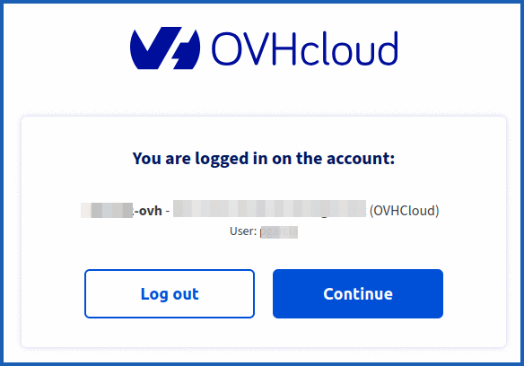

## Objectif

**L'objectif est de vous montrer comment vous connecter à votre interface Web vSphere managée depuis l'espace client HPC* VMware on OVHcloud.**

## Prérequis

- Être administrateur de l'infrastructure [Hosted Private Cloud](/links/hosted-private-cloud/vmware).
- Avoir ajouté des adresses IP dans la section `Sécurité` de votre [espace client OVHcloud](/links/manager). Pour plus d'informations, consultez notre guide « [Autoriser des IP à se connecter au vCenter](/pages/hosted_private_cloud/hosted_private_cloud_powered_by_vmware/autoriser_des_ip_a_se_connecter_au_vcenter) ».

Pour utiliser IAM, vous devez activer la fonctionnalité afin de déléguer la gestion des droits avec un rôle. Veuillez lire les guides :

- Guide 1 : [IAM pour VMware on OVHcloud - Présentation et FAQ](/pages/hosted_private_cloud/hosted_private_cloud_powered_by_vmware/vmware_iam_getting_started)
- Guide 2 : [IAM pour VMware on OVHcloud - Comment activer IAM](/pages/hosted_private_cloud/hosted_private_cloud_powered_by_vmware/vmware_iam_activation)
- Guide 3 : [IAM pour VMware on OVHcloud - Comment créer un rôle vSphere IAM](/pages/hosted_private_cloud/hosted_private_cloud_powered_by_vmware/vmware_iam_role)

## En pratique

Pour se connecter à la console web vSphere managé, vous avez besoin d'identifiants de connexion OVHcloud. Un utilisateur vSphere (avec utilisateur local), ou un rôle vSphere (avec IAM).

### Étape 1 - Gestion des utilisateurs avec vSphere et OVHcloud

#### Via l'espace client OVHcloud

Vous pouvez gérer vos identifiants de connexion depuis l'espace client OVHcloud de votre produit VMware managé on OVHcloud.

Connectez-vous à votre [espace client OVHcloud](/links/manager) et cliquez sur l'onglet `Hosted Private Cloud`{.action}.

Cliquez sur la rubrique `VMware`{.action}, sélectionnez votre infrastructure puis rendez-vous dans l'onglet `Utilisateurs`{.action}.

Sous la section `Gestion des autorisations utilisateur dans le vSphere client`{.action}, cliquez sur `Créer un utilisateur`{.action} ou `Modifier`{.action} un utilisateur.

{.thumbnail}

Pour information, en cliquant sur le bouton `...`{.action} à droite d'un utilisateur, vous pouvez modifier les utilisateurs ou les rôles IAM, modifier les droits par DC, changer le mot de passe ou supprimer les utilisateurs.

{.thumbnail}

#### Via l'API OVHcloud

La gestion des utilisateurs est possible depuis l'API OVHcloud au sein de Hosted Private Cloud.

> [!primary]
> Si vous n'êtes pas familier avec l'utilisation de l'API OVHcloud, consultez notre guide « [Premiers pas avec les API OVHcloud](/pages/manage_and_operate/api/first-steps)».

Voici quelques exemples d'appels API :

- Créer un utilisateur :

> [!api]
>
> @api {v1} /dedicatedCloud POST /dedicatedCloud/{serviceName}/user
>

> **Paramètres** :
> 
> - `serviceName` : votre service sous la forme pcc-XX-XX-XX-XX.
> - `name` : le nom de votre utilisateur sous la forme ci-dessous.
> 
> Exemple :
>
> ```shell
> {
> "name": "User name"
> }
> ```
> 

- Changer le mot de passe de votre utilisateur :

> [!api]
>
> @api {v1} /dedicatedCloud POST /dedicatedCloud/{serviceName}/user/{userId}/changePassword
>

> **Paramètres** :
>
> - `serviceName` : votre service sous la forme pcc-XX-XX-XX-XX.
> - `userId` : le nom de votre utilisateur sous la forme ci-dessous.
>
> Exemple :
>
> ```shell
> {
> "password": "XXX"
> }
> ```

### Étape 2 - Connexion à l'interface Web vSphere managé

#### Via l'espace client OVHcloud

**Utilisation du Web client HTML5**

Le lien du client Web HTML5 est disponible depuis l’espace client de votre Hosted Private Cloud VMware on OVHcloud à l’adresse url : <https://pcc-xxx-xxx-xxx-xxx.ovh.xxx/ui> (remplacez pcc-xxx-xx-xx-xxx.ovh.xxx) par votre IP et région.

{.thumbnail}

Vous accéderez ensuite à cette interface :

{.thumbnail}

Via un utilisateur IAM :

{.thumbnail}

Via un utilisateur local :

{.thumbnail}

La page `Home`{.action} permet de retrouver les grands menus de votre vCenter.

{.thumbnail}

**Glossaire**

- **HPC** : Hosted Private Cloud

## Aller plus loin

Ce document de VMware répertorie les différents ports que vous devez ouvrir sur votre pare-feu pour, par exemple, [accéder à la console](https://kb.vmware.com/kb/1012382).

Si vous avez besoin d'une formation ou d'une assistance technique pour la mise en œuvre de nos solutions, contactez votre Technical Account Manager ou rendez-vous sur [cette page](/links/professional-services) pour obtenir un devis et demander une analyse personnalisée de votre projet à nos experts de l’équipe Professional Services.

Échangez avec notre [communauté d'utilisateurs](/links/community).
