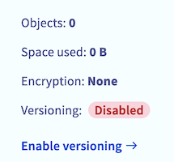
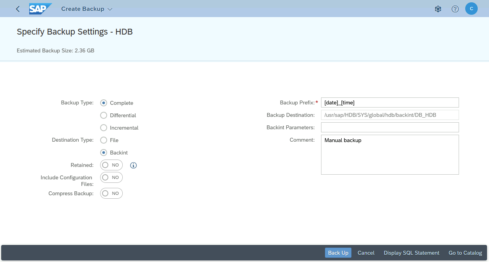

## Objective

This guide provides the details of using OVHcloud Backint Agent for SAP HANA with several S3 Object Storage buckets.

OVHcloud Backint Agent for SAP HANA allows you to back up and recover your SAP HANA database on one or many OVHcloud S3 Object Storage buckets.

Using several S3 Object Storage buckets can be useful to:

- separate the data backup named `databackup` from the log backup named `log_backup` ;
- store into S3 Object Storage buckets with a different retention policy ;
- use different locations.

{.thumbnail}

OVHcloud Backint Agent for SAP HANA has been certified by SAP, you can find certification information here:

- [SAP Certified Solutions Directory](https://www.sap.com/dmc/exp/2013_09_adpd/enEN/#/solutions?search=backint&id=s:c5927e8a-cf79-40c1-84ad-cdd354554389)
- [SAP Note 2031547](https://me.sap.com/notes/0002031547)
- [SAP Note 3344150](https://me.sap.com/notes/3344150)

## Requirements

- Access to the [OVHcloud Control Panel](/links/manager).
- [A Public Cloud project](/pages/public_cloud/compute/create_a_public_cloud_project) in your OVHcloud account with:
    - Two [S3 Object Storage buckets](/pages/storage_and_backup/object_storage/s3_create_bucket) and an [S3 user](/pages/storage_and_backup/object_storage/s3_identity_and_access_management#creating-a-user) with the read and write rights.
- A SAP HANA database installed.
- [OVHcloud Backint Agent for SAP HANA installed](/pages/hosted_private_cloud/sap_on_ovhcloud/cookbook_install_ovhcloud_backint_agent).

## Instructions

### S3 Object Storage

The S3 Object Storage bucket versioning must be enabled to ensure the correct operation of OVHcloud Backint Agent. The versioning allows you to keep several versions of a same object in your S3 Object Storage bucket.

With SAP HANA backups, the versioning allows you to trigger several backups with the same name (for example "COMPLETE_DATA_BACKUP") and keeping the capacity to recover a specific version of the backup named "COMPLETE_DATA_BACKUP". If the versioning is not enabled, only the latest version of the backup named "COMPLETE_DATA_BACKUP" can be recovered.

You can check the versioning status of your Object Storage S3 bucket by following these steps:

1. Access to the [OVHcloud Control Panel](/links/manager).
2. Click `Public Cloud`{.action} and select your Public Cloud project. Then click `Object Storage`{.action}.
3. Click on the S3 Object Storage bucket that will host backups of your SAP HANA database.
4. Check the value of the `Versioning`{.action} parameter, it must have the value `Enabled`{.action}. If the value of this parameter is `Disabled`{.action}, click on `Enable versioning`{.action}.

| Versioning enabled | Versioning disabled |
| --- | --- |
| {.thumbnail} | {.thumbnail} |

### Configuration

Edit the content of the `hdbbackint.cfg` file and replace all values between chevrons by your first S3 Object Storage bucket information. Below, an example of its content after edition.

```ini
[trace]
default = INFO
destination = outputfile

[ovhcloud]
endpoint_url = https://s3.rbx.io.cloud.ovh.net
bucket = my-sap-hana-bucket-data
region = rbx
access_key = 12345678901234567890123456789012
secret_key = 12345678901234567890123456789012
max_concurrency = 10
multipart_chunksize = 1GB
multipart_threshold = 1GB
```

The `multipart_chunksize` and `multipart_threshold` parameters can be set with values in byte (example: 52428800 equal 50MB), in KB, in GB, or in TB. If the value is set without unit, the default unit is byte.

- The `multipart_threshold` parameter triggers the upload of an object in multipart.
- The `multipart_chunksize` parameter sets the size of each part to be uploaded.

The default values for `multipart_chunksize` and `multipart_threshold` parameters in the `hdbbackint.cfg` file offer an optimal performance in many cases, but you can increase or decrease it, depending on your environment.

Create a copy of the `hdbbackint.cfg` file with another name, for example `hdbbackint-log.cfg` and replace its values by the details of your second S3 Object Storage bucket.

```ini
[trace]
default = INFO
destination = outputfile

[ovhcloud]
endpoint_url = https://s3.rbx.io.cloud.ovh.net
bucket = my-sap-hana-bucket-log
region = rbx
access_key = 12345678901234567890123456789012
secret_key = 12345678901234567890123456789012
max_concurrency = 10
multipart_chunksize = 1GB
multipart_threshold = 1GB
```

> [!warning]
>
> The following commands modify the backup configuration of your SAP HANA database, please execute these commands with caution.
>
> We recommend triggering a full backup of your SAP HANA database after this operation to validate the configuration.
>

Execute the following SQL commands to update the backup configuration of your SAP HANA database.

*Replace in the following SQL commands the* `<SID>` *characters by the SID of your SAP HANA database.*

```SQL
ALTER SYSTEM ALTER CONFIGURATION('global.ini','SYSTEM') SET('backup','catalog_backup_parameter_file')='/usr/sap/<SID>/SYS/global/hdb/opt/hdbbackint.cfg' WITH RECONFIGURE;
ALTER SYSTEM ALTER CONFIGURATION('global.ini','SYSTEM') SET('backup','catalog_backup_using_backint')='true' WITH RECONFIGURE;
ALTER SYSTEM ALTER CONFIGURATION('global.ini','SYSTEM') SET('backup','data_backup_parameter_file')='/usr/sap/<SID>/SYS/global/hdb/opt/hdbbackint.cfg' WITH RECONFIGURE;
ALTER SYSTEM ALTER CONFIGURATION('global.ini','SYSTEM') SET('backup','log_backup_parameter_file')='/usr/sap/<SID>/SYS/global/hdb/opt/hdbbackint-log.cfg' WITH RECONFIGURE;
ALTER SYSTEM ALTER CONFIGURATION('global.ini','SYSTEM') SET('backup','log_backup_using_backint')='true' WITH RECONFIGURE;
```

> [!primary]
>
> To discover all backup parameters for SAP HANA, we recommend the [SAP documentation](https://help.sap.com/docs/SAP_HANA_PLATFORM/009e68bc5f3c440cb31823a3ec4bb95b/e28fbdf1024c40e1a97fca48380aad98.html?locale=en-US). In the column "Section", set "Backup".
>

### Backup

To validate the configuration, you can trigger manual backups with the following commands via SSH access:

*Replace in the following commands the* `<SID>` *characters by the SID of your SAP HANA database and* `<NI>` *characters by the instance number of your SAP HANA database.*

```bash
# SYSTEMDB Backup
/usr/sap/<SID>/HDB<NI>/exe/hdbsql -u SYSTEM -d SYSTEMDB "BACKUP DATA USING BACKINT ('MANUAL_COMPLETE_BACKUP');"

# TENANTDB Backup
/usr/sap/<SID>/HDB<NI>/exe/hdbsql -u SYSTEM -d SYSTEMDB "BACKUP DATA FOR <SID> USING BACKINT ('MANUAL_COMPLETE_BACKUP');"
```

You also have the possibility to trigger these backups via the SAP HANA Cockpit. Select `Backint`{.action} in the `Destination Type`{.action} category.

{.thumbnail}

After the execution of these backups, several files named `_databackup_` are now present in your first S3 Object Storage bucket, these files correspond to backups of your SAP HANA database via the OVHcloud Backint Agent.

Two files named `log_backup_0_0_0_0` and which have `DB_<SID>` and `SYSTEMDB` prefixes are also present in your first S3 Object Storage bucket. These files correspond to backups of the SAP HANA backup catalog, allowing you to list backups known by SAP HANA.

{.thumbnail}

In your second S3 Object Storage bucket,  some files named `log_backup` are present and correspond to logs backups.

{.thumbnail}

If these backups have not been done as expected, check the content of the following files to search for errors:

- backint.log
- backup.log

Both files are present in the repository `/usr/sap/<SID>/HDB<NI>/<hostname>/trace` for the SYSTEMDB backup and in the repository `/usr/sap/<SID>/HDB<NI>/<hostname>/trace/DB_<SID>` for the TENANTDB backup.

The `backint.log` file gives you information about the OVHcloud Backint Agent execution. For example, a permission issue with the S3 Object Storage bucket:

```log
2024-02-08 14:10:41.266 backint started:
  command: /usr/sap/HDB/SYS/global/hdb/opt/hdbbackint -f backup -p /usr/sap/HDB/SYS/global/hdb/opt/hdbbackint.cfg -i /var/tmp/hdbbackint_HDB.kwu3jY -o /var/tmp/hdbbackint_HDB.N1KX90 -u HDB -s 1707397841205 -c 2 -l COMPLETE
  pid: 3702
  input:
  #SOFTWAREID "backint 1.04" "HANA HDB server 2.00.071.00.1687900751"
  #PIPE "/usr/sap/HDB/SYS/global/hdb/backint/SYSTEMDB/FULL_BACKUP_databackup_0_1"
2024-02-08 14:10:41.967 backint terminated:
  pid: 3702
  exit code: 1
  output:
  exception:
  exception  1: no.110507  (Backup/Destination/Backint/impl/BackupDestBackint_Executor.cpp:250)
      Backint exited with exit code 1 instead of 0. console output: Bucket information error in hdbbackint.cfg - 403 Forbidden
```

The `backup.log` file gives you information about the backup execution through SAP HANA, its progress and its encountered errors.

```log
INFO    BACKUP   state of service: nameserver, <hostname>:30001, volume: 0, BackupExecuteTopologyAndSSFSBackupInProgress
INFO    BACKUP   state of service: nameserver, <hostname>:30001, volume: 0, BackupError
INFO    BACKUP   state of service: nameserver, <hostname>:30001, volume: 1, BackupAbortSavepointInProgress
INFO    BACKUP   state of service: nameserver, <hostname>:30001, volume: 1, BackupAbortSavepointFinished
ERROR   BACKUP   SAVE DATA finished with error: [447] backup could not be completed
```

You have the possibility to create more S3 Object Storage buckets and apply on it different parameters as the retention policy or the managing object immutability.

In order to target the right S3 Object Storage bucket, OVHcloud Backint Agent needs the corresponding `hdbbackint.cfg` file during the backup execution.

### Scheduling

About the backups scheduling, please refer to our guide [Install and use OVHcloud Backint Agent for SAP HANA](/pages/hosted_private_cloud/sap_on_ovhcloud/cookbook_install_ovhcloud_backint_agent#scheduling).

### Recovery

About the recovery of your SAP HANA database, please refer to our guide [Install and use OVHcloud Backint Agent for SAP HANA](/pages/hosted_private_cloud/sap_on_ovhcloud/cookbook_install_ovhcloud_backint_agent#recovery).

The steps are the same, even if you use different S3 Object Storage buckets for your `DATA` and `LOG` backups.

## Go further

To improve the security of your backups, we advise you to set the [object immutability](/pages/storage_and_backup/object_storage/s3_managing_object_lock).

If you need training or technical assistance to implement our solutions, contact your sales representative or click on [this link](https://www.ovhcloud.com/en-au/professional-services/) to get a quote and ask our Professional Services experts for assisting you on your specific use case of your project.

Join our community of users on <https://community.ovh.com/en/>.
