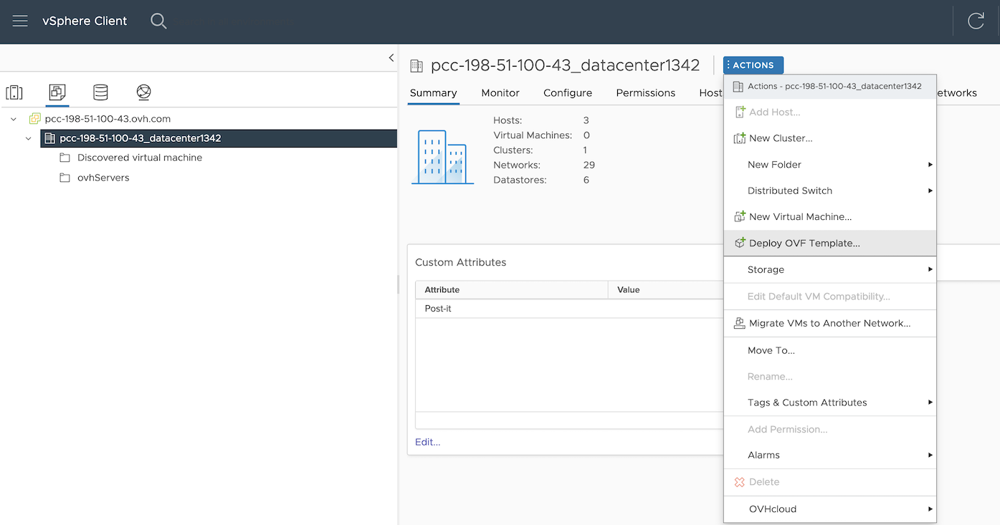
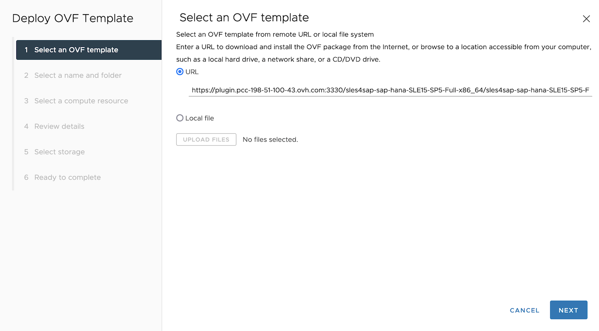
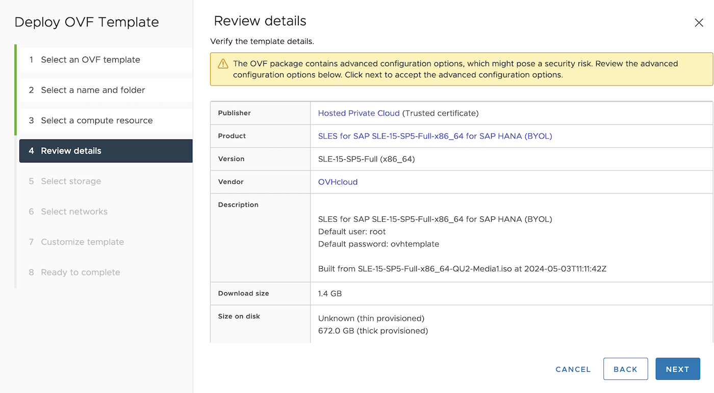
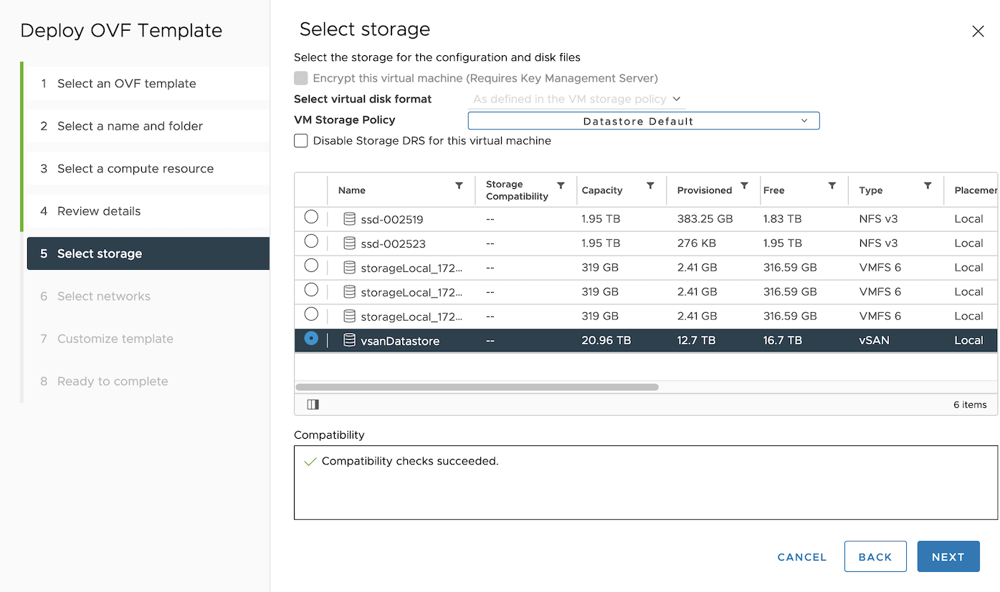
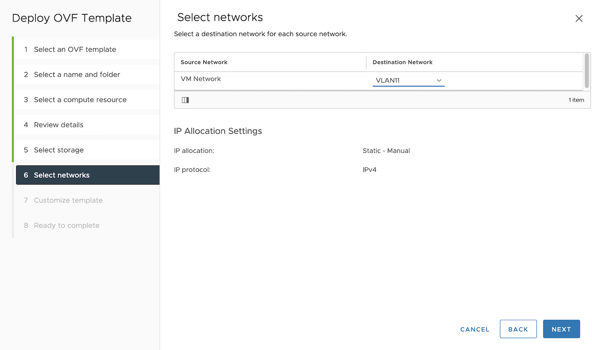
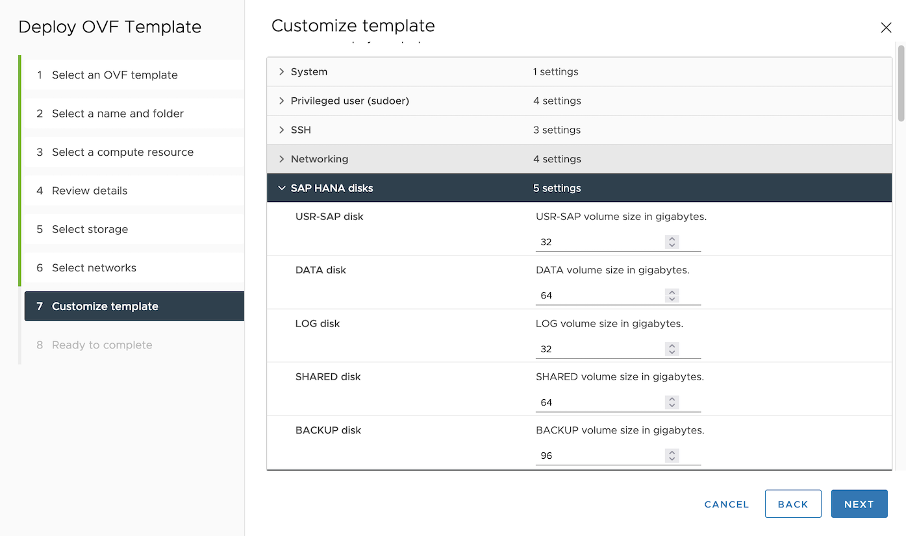
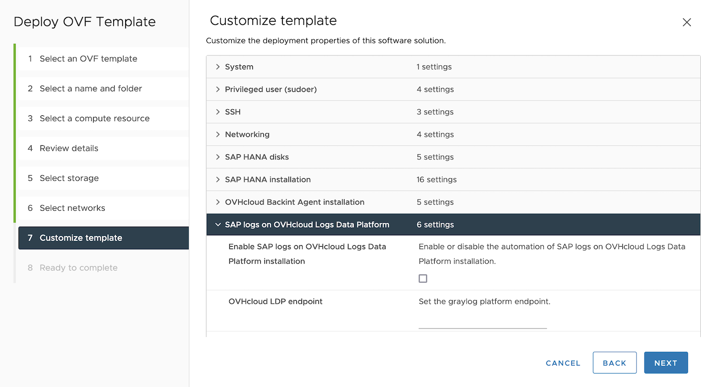
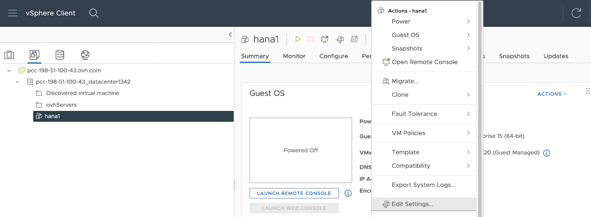

## Objectif

Ce guide vous détaille les étapes pour le déploiement d'une machine virtuelle SUSE Linux Enterprise Server for SAP Applications avec SAP HANA, OVHcloud Backint Agent for SAP HANA et SAP logs on OVHcloud Logs Data Platform pré-installés sur la solution VMware on OVHcloud en utilisant un template OVF fournit par OVHcloud.

## Prérequis

- Un accès à l’[espace client OVHcloud](https://www.ovh.com/auth/?action=gotomanager&from=https://www.ovh.com/fr/&ovhSubsidiary=fr)
- Une [solution SAP HANA on Private Cloud](https://www.ovhcloud.com/fr/hosted-private-cloud/sap-hana/) déployée
- [Un projet Public Cloud](/pages/public_cloud/compute/create_a_public_cloud_project) dans votre compte OVHcloud avec :
    - [Un bucket Object Storage S3](/pages/storage_and_backup/object_storage/s3_create_bucket) et [un utilisateur S3](/pages/storage_and_backup/object_storage/s3_identity_and_access_management#creation-dun-utilsateur) avec le droit de lecture
    - [Un second bucket Object Storage S3](/pages/storage_and_backup/object_storage/s3_create_bucket) et [un utilisateur S3](/pages/storage_and_backup/object_storage/s3_identity_and_access_management#creation-dun-utilsateur) avec les droits de lecture et d'écriture

## En pratique

> [!primary]
>
> [**Accès rapide à l'URL du template OVF**](#ovf_link)
>

### Déploiement

OVHcloud met à disposition un template OVF comprenant le système d'exploitation SUSE Linux Enterprise Server for SAP Applications pré-configuré pour accueillir une installation SAP HANA.

Afin de respecter le ratio vCPU/RAM pour les charges de travail OLAP et OLTP dans un environnement de production, OVHcloud recommande trois modèles de machines virtuelles.

| Host               | vCPU   | Socket  | Mémoire   |
|--------------------|--------|---------|-----------|
| SAP HANA vSAN 1536 | 24     | 0.5     | 384 GB    |
| SAP HANA vSAN 1536 | 48     | 1       | 768 GB    |
| SAP HANA vSAN 1536 | 96     | 2       | 1436 GB<sup>1</sup>  |

<sup>[1] Nous conseillons de réserver 100 GB de mémoire pour le host ESXi.</sup>

Ce template OVF offre la possibilité d'installer automatiquement SAP HANA, OVHcloud Backint Agent for SAP HANA, ainsi que SAP logs on OVHcloud Logs Data Platform, réduisant ainsi le temps de mise à disposition d'une base de données SAP HANA.

Vous devez dans un premier temps déposer les sources nécessaires à l'installation de SAP HANA sur votre premier bucket Object Storage S3 demandé dans les prérequis. Les sources doivent être déposées sous la même forme qu'elles ont été téléchargées, soit par exemple « 51056821.ZIP ».

> [!warning]
>
> Les SAP HANA Components (tels que AFL, EML, LCAPPS, EPMMDS, etc.) ne sont pas pris en charge par cette automatisation. Ils devront être installés et gérés en post-installation.
>

Nous vous recommandons de suivre notre [guide Object Storage S3](/pages/storage_and_backup/object_storage/s3_getting_started_with_object_storage), si ce sont vos premiers pas avec un bucket Object Storage S3.

Une fois les sources SAP HANA déposées dans votre bucket Object Storage S3, vous pouvez à présent vous rendre sur l'interface vSphere de votre solution VMware on OVHcloud solution.

> [!warning]
>
> Une problématique actuelle sur la Content Library et la fonctionnalité de disque dynamique (comme documenté [KB85842](https://kb.vmware.com/s/article/85842)) nous oblige à passer via le lien direct du template OVF.
>

1\. Pour démarrer le processus de déploiement, allez sur votre interface vSphere etsélectionnez votre datacenter. Puis, cliquez sur le menu `Action`{.action} et sélectionnez `Déployer un modèle OVF`{.action}.

{.thumbnail}

2\. Entrez l'URL suivante dans le champ « URL » pour accéder à notre template OVF pour SAP HANA, puis cliquez sur `Next`{.action}.
<a name="ovf_link"></a>  

```console
https://templates-pcc-for-hana.s3.sbg.perf.cloud.ovh.net/sles4sap-sap-hana-SLE15-SP5-Full-x86_64/sles4sap-sap-hana-SLE15-SP5-Full-x86_64.ovf
```

{.thumbnail}

3\. Donnez un nom à votre machine virtuelle et sélectionnez votre datacenter. Puis, cliquez sur `Next`{.action} pour continuer.

{.thumbnail}

4\. Sélectionnez « Cluster1 ». Puis, cliquez sur `Next`{.action} pour continuer.

{.thumbnail}

5\. Vérifiez que le modèle sélectionné a bien pour nom « SLES for SAP SLE-15-SP5-Full-x86_64 for SAP HANA (BYOL) ». Puis, cliquez sur `Next`{.action} pour continuer.

Le bloc d'avertissement qui s'affiche concerne les configurations avancées intégrées au template OVF.

{.thumbnail}

6\. Sélectionnez « vsanDatastore » pour le stockage de votre machine virtuelle SAP HANA, afin de respecter les recommandations SAP et VMware. Puis, cliquez sur `Next`{.action} pour continuer.

{.thumbnail}

7\. Sélectionnez le réseau dans lequel vous souhaitez déployer votre base de données SAP HANA. Puis, cliquez sur `Next`{.action} pour continuer.

À la fin du déploiement, vous aurez la possibilité d'éditer la machine virtuelle pour ajouter d'autres cartes réseaux si vous le désirez.

{.thumbnail}

8\. Le modèle « SLES for SAP SLE-15-SP5-Full-x86_64 for SAP HANA (BYOL) » offre de nombreuses options de personnalisations pour votre machine virtuelle. Vous pouvez ajuster la taille des disques, activer l'installation de SAP HANA, OVHcloud Backint Agent ou encore SAP logs on OVHcloud Logs Data Platform.

Dans ce guide, nous nous focalisons sur les trois catégories suivantes :

- SAP HANA disks ;
- SAP HANA installation ;
- OVHcloud Backint Agent installation ;
- SAP logs on OVHcloud Logs Data Platform.

Dans la catégorie `SAP HANA disks`{.action}, vous devez renseigner les tailles des disques qui seront créés.

Notre template OVF est configuré par défaut pour déployer une machine virtuelle de 8 vCPUs et 128 GB de RAM. Les valeurs pré-remplies correspondent aux recommandations SAP de stockage pour ce modèle.

{.thumbnail}

Voici un tableau des recommandations SAP pour les tailles des disques :

| Disque     | Taille                                                |
|------------|-------------------------------------------------------|
| usrsap     | MIN(32 GB)                                            |
| hanadata   | 1 x RAM                                               |
| hanalog    | [RAM ≤ 512 GB] = 1/2 x RAM<br>[RAM > 512 GB] = 512 GB |
| hanashared | MIN(1 x RAM; 1 TB)                                    |
| hanabackup | hanadata + hanalog                                    |

9\. Si vous souhaitez bénéficier de l'installation automatisée de votre base de données SAP HANA, cochez l'activation de l'installation et renseignez les informations de la catégorie `SAP HANA installation`{.action}.

> [!primary]
>
> Veuillez prendre connaissance de la [SAP Note 1979280](https://me.sap.com/notes/1979280/) qui liste les SID SAP HANA ne pouvant pas être utilisés.
>

{.thumbnail}

10\. Si vous souhaitez bénéficier de l’installation automatisée d'OVHcloud Backint Agent for SAP HANA pour sauvegarder votre base de données sur un Object Storage S3, cochez l'activation de l'installation et renseignez les informations de la catégorie `OVHcloud Backint Agent installation`{.action}.

> [!warning]
>
> Cette option est uniquement disponible dans le cas où vous avez activé l'installation de SAP HANA dans la précédente catégorie.
>

{.thumbnail}

11\. Si vous souhaitez bénéficier de l’installation automatisée SAP logs on OVHcloud Logs Data Platform afin d'externaliser vos logs sur notre solution Logs Data Platform, cochez l'activation de l'installation et renseignez les informations de la catégorie `SAP logs on OVHcloud Logs Data Platform`{.action}.

{.thumbnail}

Une fois ces étapes réalisées, le déploiement de votre machine virtuelle à partir du template OVF créé par OVHcloud s'exécute.

Nous vous conseillons de prendre connaissance et de réaliser les actions du chapitre [Configuration des paramètres avancés](#advanced-settings) avant de démarrer votre machine virtuelle.

<a name="advanced-settings"></a>

### Configuration des paramètres avancés

Bien que le template OVF créé par OVHcloud prend en compte de nombreux paramètres, des paramètres additionnels doivent être configurés après déploiement afin de pleinement répondre à vos besoins.

1\. Pour réaliser cet ajout de paramètres, sélectionnez votre machine virtuelle. Puis, cliquez sur le menu `Action`{.action} et sélectionnez `Modifier les paramètres`{.action}.

{.thumbnail}

2\. Depuis l'interface `Modifier les paramètres`{.action}, cliquez sur l'onglet `Options VM`{.action} afin d'accéder aux options de configuration supplémentaires. Puis, développez le menu `Avancé`{.action} et cliquez sur `Modifier la configuration`{.action}.

{.thumbnail}

3\. Les paramètres suivants sont inclus dans le template OVF :

| Paramètre                     | Valeur |
|-------------------------------|--------|
| tools.guestlib.enableHostInfo | TRUE   |
| numa.memory.gransize          | 32768  |

Pour plus de détails à propos de ces paramètres, nous vous invitons à prendre connaissance de la [SAP Note 1606643](https://me.sap.com/notes/1606643/E), ainsi que la [documentation VMware](https://core.vmware.com/resource/sap-hana-vmware-vsphere-best-practices-and-reference-architecture-guide).

4\. Dans le cas où votre machine virtuelle SAP HANA utilise un demi socket ou un socket, il est recommandé d'appliquer le paramètre suivant :

| Paramètre          | Valeur |
|--------------------|--------|
| numa.vcpu.preferHT | TRUE   |

5\. Nous vous recommandons d'appliquer une stratégie de stockage VM en provisionnement statique. Pour créer une stratégie de stockage VM, cliquez sur `vSphere Client`{.action} et sélectionnez l'icône `Stratégies de stockage VM`{.action}. Cela ouvrira l'assistant de stratégie de stockage de machine virtuelle, où vous pouvez configurer les paramètres de stockage pour votre machine virtuelle SAP HANA.

Ci-dessous, les paramètres de la règle que nous conseillons de créer pour SAP HANA :

| Paramètre                                  | Valeur                            |
|--------------------------------------------|-----------------------------------|
| Type de stockage                           | VSAN                              |
| Tolérance aux pannes du site               | Aucun - cluster standard          |
| Pannes tolérées                            | 1 panne : RAID-1 (mise en miroir) |
| Nombre de bandes de disque par objet       | 6*                                |
| Limite d'IOPS pour un objet                | 0                                 |
| Réservation d'espace d'objet               | Provisionnement statique          |
| Réservation de Flash Read Cache            | 0 %                               |
| Désactiver le total de contrôle de l'objet | Non                               |
| Forcer le provisionnement                  | Non                               |
| Services de chiffrement                    | Aucune préférence                 |
| Efficacité de l'utilisation de l'espace    | Déduplication et compression      |
| Niveau de stockage                         | Intégralement Flash               |

<sup>* Pour la solution SAP HANA on Private Cloud.</sup>  
<sup>Cette valeur va dépendre du nombre de disques (vSAN Capacity) dans votre cluster vSAN.</sup>

Cette stratégie de stockage VM est à appliquer pour les disques hébergeant les volumes
/hana/data (Hard disk 4) et /hana/log (Hard disk 5) de votre machine virtuelle.

6\. Vous pouvez à présent démarrer votre machine virtuelle.

Dans le cas où vous avez activé l'installation SAP HANA à minima, l'installation démarrera lors du premier démarrage de votre machine virtuelle. L'installation dure un peu plus de 15 minutes, veillez à ne réaliser aucune action sur votre machine virtuelle durant le processus d'installation.

Vous serez informé de l'avancée de l'installation par l'affichage d'un statut lors de votre connexion SSH à votre machine virtuelle, ainsi que par des messages une fois connecté.

### Post-configuration

Nous vous recommandons fortement de réaliser ces actions avant la mise en production de votre base de données SAP HANA.

1\. Enregistrez votre système d'exploitation SUSE Linux Enterprise Server for SAP Applications et récupérez les dernières mises à jour en exécutant la commande suivante :

```bash
zypper update -y
```

2\. Installez la licence de votre base de données SAP HANA.

3\. Configurez votre planification de sauvegarde SAP HANA. Nous présentons des exemples de planification avec OVHcloud Backint Agent for SAP HANA dans [notre guide](/pages/hosted_private_cloud/sap_on_ovhcloud/cookbook_install_ovhcloud_backint_agent).

4\. Nous vous recommandons de configurer les mêmes serveurs de temps (NTP) au niveau de votre OS que ceux utilisés par vos hosts ESXi de votre solution VMware on OVHcloud.

Cette information est disponible dans votre interface vSphere en sélectionnant un host ESXi, en allant dans l'onglet `Configurer`{.action}, puis en sélectionnant `Configuration de l'heure`{.action} dans le menu..

Sur SLES, éditez le fichier /etc/chrony.conf et ajoutez les adresses IP des serveurs de temps :

```console
# Allow NTP client access from local network.
# Use public servers from the pool.ntp.org project.
# Please consider joining the pool (https://www.pool.ntp.org/join.html).
server {ip-ntp-server1}
server {ip-ntp-server2}
server {ip-ntp-server3}
server {ip-ntp-server4}
```

Démarrez le service et activez le pour les prochains démarrages :

```bash
systemctl start chronyd.service
systemctl enable chronyd.service
```

## Aller plus loin

- [Installer et utiliser OVHcloud Backint Agent pour SAP HANA](/pages/hosted_private_cloud/sap_on_ovhcloud/cookbook_install_ovhcloud_backint_agent)
- [Utiliser OVHcloud Backint Agent avec plusieurs buckets Object Storage S3](/pages/hosted_private_cloud/sap_on_ovhcloud/cookbook_configure_ovhcloud_backint_agent_several_buckets)
- [SAP HANA on VMware vSphere Best Practices and Reference Architecture Guide](https://core.vmware.com/resource/sap-hana-vmware-vsphere-best-practices-and-reference-architecture-guide)
- [SAP Note 1606643 - Linux: VMware vSphere host monitoring interface](https://me.sap.com/notes/1606643)
- [SAP Note 2470289 - FAQ: SAP HANA Non-Uniform Memory Access (NUMA)](https://me.sap.com/notes/2470289)
- [SAP Note 2779240 - Workload-based sizing for virtualized environments](https://me.sap.com/notes/2779240)
- [SAP HANA on VMware vSphere](https://wiki.scn.sap.com/wiki/display/VIRTUALIZATION/SAP+HANA+on+VMware+vSphere)

Si vous avez besoin d'une formation ou d'une assistance technique pour la mise en oeuvre de nos solutions, contactez votre commercial ou cliquez sur [ce lien](https://www.ovhcloud.com/fr/professional-services/?_gl=1*39h6u1*_gcl_au*MzU3MTAzMzA5LjE2ODY1NTk4MTE.) pour obtenir un devis et demander une analyse personnalisée de votre projet à nos experts de l’équipe Professional Services.

Échangez avec notre communauté d'utilisateurs sur <https://community.ovh.com>.
