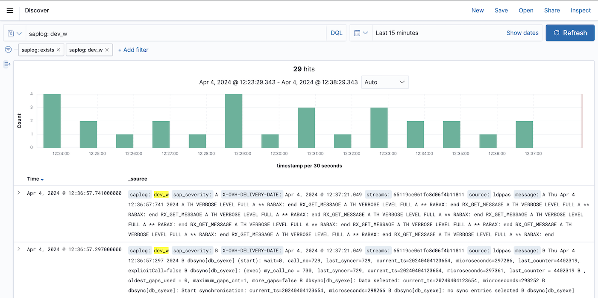
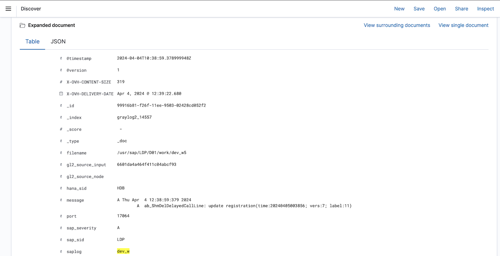
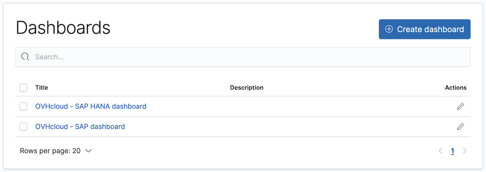

## Objective

This guide is designed to assist you in retrieving and exploiting your SAP logs on the OVHcloud Logs Data Platform service.

If you haven't configured your OVHcloud Logs Data Platform service, use the below guide to get started: [SAP logs on OVHcloud Logs Data Platform - Solution Setup](/pages/hosted_private_cloud/sap_on_ovhcloud/cookbook_sap_logs_on_ovhcloud_logs_data_platform_solution_setup)

## Requirement
- [SAP logs on OVHcloud Logs Data Platform configured](/pages/hosted_private_cloud/sap_on_ovhcloud/cookbook_sap_logs_on_ovhcloud_logs_data_platform_solution_setup)

## Instructions

### View your logs

With the implementation of SAP logs on OVHcloud Logs Data Platform, a collection of logs should be accessible in your Data Stream. In order to visualize your logs, you have the option to use Graylog or OpenSearch Dashboards. OpenSearch Dashboards allows you to create customized dashboards and searches that can help you to response to your different use case.

OVHcloud manages a standard list of SAP files which are pre-configured and can be directly used. You can access to these SAP files on [OVHcloud GitHub](https://github.com/ovh/sap-logs-on-ovhcloud-logs-data-platform).

### Filter your logs

Certain fields have been created as default. These pre-defined fields are present to make your navigation through your logs easier.

Please find a summary of the default pre-registered fields:

| Field name  | Description |
| ----------  | ----------- |
| filename    | Refers to the location of the file that has been tracked. |
| hana_sid    | HANA SID of your SAP HANA system or the reference of the HANA SID used by your AS. |
| hana_tenant |	SAP HANA tenant in a multi-tenanted environment. |
| message     | Log raw message. |
| sap_sip	  | SAP SID of your SAP system or the reference of the primary AS that you would use as reference for your HANA. |
| saplog	  | Field that defines the category of your message. Examples: syslog, security_audit, dev_w, nameserver... |
| source	  | Hostname of the server providing the log. |
| timestamp	  | Timestamp of your logs in UTC timezone. |
| type	      | Name system that provides the log, mostly syslog in the case of SAP logs OVHcloud on OVHcloud Logs Data Platform. |

Examples of filters usages:

Logs of the work process trace files (dev_w*)

{.thumbnail}
{.thumbnail}

Logs of the server ldphan with the hana_sid HDB

{.thumbnail}
{.thumbnail}

Logs of all servers with name starting by ldp* and coming from the dev_rfc files

{.thumbnail}
{.thumbnail}

With those pre-configured fields available you can as well create your own saved searches to ease the navigation in your logs.

### Use saved searches

In the OpenSearch Dashboard, you have the possibility to save searches for later use. To create a new saved search, navigate to the search bar on the Discover page, and make your desired search query. If you would like to save a search query for future use, click on the button  then "Save current query". You can re-use your search by clicking on the same button and search your previously query created.

> [!primary]
>
> You can access pre-defined search queries on the [OVHcloud GitHub](https://github.com/ovh/sap-logs-on-ovhcloud-logs-data-platform). These basic searches are provided for your convenience.

{.thumbnail}

### Use imported dashboards

Following the import of your dashboards, you can select them on the Dashboards page. This page displays all your current saved dashboards and the dashboards you imported, as well.

{.thumbnail}

You simply have to click on your dashboard to open it. Once the dashboard is displayed, you will be able to view all of the information related to your logs that is presented on your dashboard.

You have the possibility to filter on a specific SAP SID or hostname.

{.thumbnail}

### Add a custom metric in the Solution

SAP logs on OVHcloud Logs Data Platform let you configure your own logs. To set up a new log, you will need to make a new input() on your rsyslog configure file (/etc/rsyslog.d/ovhcloud-sa-rsyslog.conf) and choose the appropriate ruleset() that will forward your log. After saving your changes, you must restart the rsyslog service for the new input to take effect.

The log displayed on your dashboard comes pre-formatted with a header to effectively present the principal information contained in the log. You have the option to re-configure your Data-gathering tool on the filter block to add any necessary plugins in order to achieve the desired level of precision when interpreting your log data.

### Retrieve archived logs

If you have opted to archive your logs during the setup of your Data Stream, you can also retrieve your archived logs by following the instructions in the [guide](/pages/manage_and_operate/observability/logs_data_platform/archive_cold_storage#retrieving-the-archives).

Upon obtaining your archived logs from the Data Stream, you can work with them using your favorite text editor, as they will be presented in a GELF / JSON-like format, complete with all the fields as shown on the Graylog platform.

As the data is a JSON-like format you can as well send your logs in a Big Data analysis platform.

The OVHcloud API available at api.ovh.com can helps you to retrieve your data to use them. In the guide, you will find numerous API calls that can assist you in retrieving and utilizing your logs.

## Go further
- [Archiving your logs - Cold-storage](/pages/manage_and_operate/observability/logs_data_platform/archive_cold_storage/guide.en-gb.md)
- [Logs Data Platform - Archive mirror](https://github.com/ovh/ldp-archive-mirror)

Join our community of users on <https://community.ovh.com/en/>.