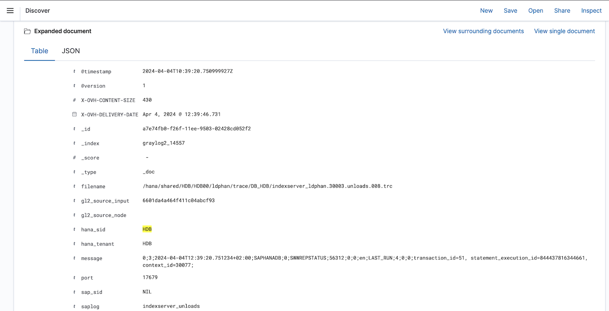
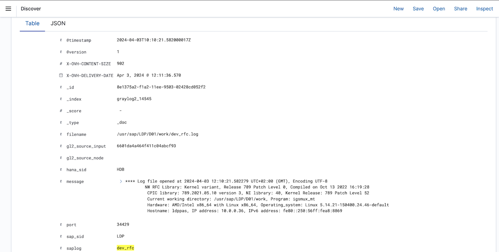

## Objective

This guide is designed to assist you in retrieving and exploiting your SAP logs on the OVHcloud Logs Data Platform feature.

If you haven't configured the SAP logs on OVHcloud Logs Data Platform feature, please use our guide [SAP logs on OVHcloud Logs Data Platform - Solution Setup](/pages/hosted_private_cloud/sap_on_ovhcloud/cookbook_sap_logs_on_ovhcloud_logs_data_platform_solution_setup) to get started.

## Requirement

- [SAP logs on OVHcloud Logs Data Platform configured](/pages/hosted_private_cloud/sap_on_ovhcloud/cookbook_sap_logs_on_ovhcloud_logs_data_platform_solution_setup)

## Instructions

### View your logs

With the implementation of SAP logs on OVHcloud Logs Data Platform feature, a collection of logs is accessible in your data stream.

To visualize your logs, you have the option to use Graylog or OpenSearch Dashboards. OpenSearch Dashboards allows you to create customized dashboards and searches that can help you to response to your different use cases.

OVHcloud manages a list of SAP files which are pre-configured and can be directly used. You can access to these SAP files on [GitHub repository](https://github.com/ovh/sap-logs-on-ovhcloud-logs-data-platform).

### Filter your logs

Several pre-defined fields have been created in order to make easier your navigation through your logs.

Below, a summary of pre-defined fields:

| Field name  | Description |
| ----------  | ----------- |
| filename    | Refers to the location of the file that has been tracked. |
| hana_sid    | HANA SID of your SAP HANA system or the reference of the HANA SID used by your SAP system. |
| hana_tenant | SAP HANA tenant in a multi-tenanted environment. |
| message     | Raw log. |
| sap_sip     | SAP SID of your SAP system or the reference of SAP SID used for this SAP HANA database. |
| saplog      | Defines the category of your log. Examples: syslog, security_audit, dev_w, nameserver, etc. |
| source      | Hostname of the server which forwarded the log. |
| timestamp   | Timestamp (UTC). |

Examples of filters usages:

Logs of the work process trace files (dev_w*)

{.thumbnail}
{.thumbnail}

Logs of the server ldphan with the hana_sid HDB

{.thumbnail}
{.thumbnail}

Logs of all servers with name starting by ldp and coming from the RFC trace files (dev_rfc*)

{.thumbnail}
{.thumbnail}

With those pre-configured fields available you can as well create your own saved searches to ease the navigation in your logs.

### Use saved searches

In the OpenSearch Dashboards, you have the possibility to save searches for later use. To create a new saved search, navigate to the search bar on the Discover page, and make your desired search query. If you would like to save a search query for future use, click on the button  then `Save current query`{.action}. You can re-use your search by clicking on the same button and search your previously query created.

> [!primary]
>
> OVHcloud provides pre-defined SAP search queries on our [GitHub repository](https://github.com/ovh/sap-logs-on-ovhcloud-logs-data-platform).
>

{.thumbnail}

### Use imported dashboards

Following the import of your dashboards or OVHcloud dashboards, the Dashboards tab gathers all dashboards available in your OpenSearch Dashboards solution.

{.thumbnail}

The SAP OVHcloud dashboards allow you to filter on an SAP SID and/or a specific hostname.

{.thumbnail}

### Add a new logs file

SAP logs on OVHcloud Logs Data Platform let you configure your own logs. To set up a new log, you will need to make a new input() on your rsyslog configuration file `/etc/rsyslog.d/ovhcloud-sap-rsyslog.conf` and choose the appropriate ruleset() that will forward your log. After saving your changes, you must restart the rsyslog service for the new input to take effect.

The log displayed on your dashboard comes pre-formatted with a header to effectively present the principal information contained in the log. You have the option to re-configure your data-gathering tool on the filter block to add any necessary plugins in order to achieve the desired level of precision when interpreting your log.

### Retrieve archived logs

If you have opted to archive your logs during the setup of your data stream, you can also retrieve your archived logs by following the instructions in our [documentation](/pages/manage_and_operate/observability/logs_data_platform/archive_cold_storage#retrieving-the-archives).

Upon obtaining your archived logs from the data stream, you can work with them using your favorite text editor, as they will be presented in a GELF / JSON-like format, complete with all the fields as shown on the Graylog platform.

As the data is a JSON-like format you can as well send your logs in a Big Data analysis platform.

The OVHcloud API available at [api.ovh.com](https://ca.api.ovh.com/console-preview/) can helps you to retrieve your data to use them. In the guide, you will find numerous API calls that can assist you in retrieving and utilizing your logs.

## Go further

- [Archiving your logs - Cold-storage](/pages/manage_and_operate/observability/logs_data_platform/archive_cold_storage/guide.en-gb.md)
- [Logs Data Platform - Archive mirror](https://github.com/ovh/ldp-archive-mirror)
- [SAP logs on OVHcloud Logs Data Platform - Index of SAP logs](/pages/hosted_private_cloud/sap_on_ovhcloud/cookbook_sap_logs_on_ovhcloud_logs_data_platform_index_of_sap_logs)

If you need training or technical assistance to implement our solutions, contact your sales representative or click on [this link](https://www.ovhcloud.com/en/professional-services/) to get a quote and ask our Professional Services experts for assisting you on your specific use case of your project.

Join our community of users on <https://community.ovh.com/en/>.
