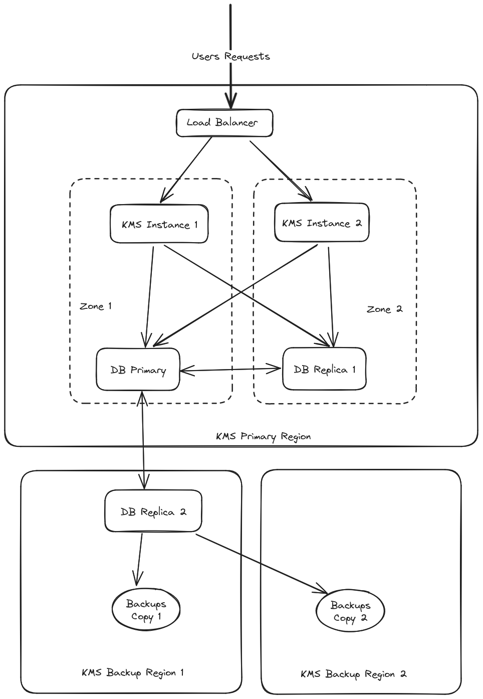

> [!warning]
>
> OVHcloud KMS sera bientôt disponible en bêta. Ce guide peut être incomplet et sera mis à jour lors de la bêta.
> N’hésitez pas à nous faire part de vos feedbacks sur le canal Discord dédié : <https://discord.gg/ovhcloud>.
>

## Objectif

Ce guide explique comment nous gérons la résilience du service de gestion de clés KMS (*Key Management Service*) OVHcloud.

## En pratique

L’architecture KMS d’OVHcloud poursuit 3 objectifs principaux :

- **Confidentialité** : vous assurer que personne d'autre que vous ne puisse accéder à votre clé.
- **Disponibilité** : vous offrir un haut niveau de résilience et donc une haute disponibilité.
- **Intégrité** : vous assurer que les clés ne peuvent pas être perdues ou altérées.

### Gestion des accès

L’accès aux clés est contrôlé par l'[IAM OVHcloud](/pages/account_and_service_management/account_information/iam-policy-ui)
Seuls les utilisateurs autorisés par une stratégie IAM peuvent gérer les clés ou les utiliser pour chiffrer ou signer des données.

Même les employés OVHcloud n’ont pas accès à vos clés.

### Architecture KMS

Le KMS OVHcloud est par conception répliqué sur plusieurs centres de données.

{.thumbnail}

### Emplacement des composants KMS

Chaque région KMS se compose de plusieurs hôtes dans une seule région OVHcloud.

Ces hôtes sont partitionnés en deux zones différentes, de sorte qu'une panne matérielle unique rendant indisponible les deux zones en même temps est aussi peu probable que possible.

#### Résilience des données

- **Réplication de base de données**

Le service de gestion de clés ne renvoie pas d'état de réussite pour la création ou l'importation de matériel clé, sauf si les données ont été répliquées avec succès dans les deux zones. Cela permet de s'assurer qu'en cas de perte de l'une des bases de données, aucune clé ne sera perdue. En conséquence, si une zone devient indisponible, le KMS refusera de créer de nouvelles clés. Toutefois, les clés existantes resteront disponibles pour effectuer des opérations de chiffrement.

Le matériel clé est également répliqué dans une troisième base de données, dans une région différente. La réplication vers une région distante ayant une latence plus élevée, nous n'attendons pas que cette réplication soit terminée avant de renvoyer un état de réussite à l'utilisateur. La réplication vers la région distante prend généralement au maximum quelques secondes de retard par rapport à la région principale.

- **Sauvegarde de base de données**

Des sauvegardes régulières sont effectuées à partir de la réplication toutes les 5 minutes. Chaque sauvegarde est stockée dans deux régions différentes de la région principale du KMS. 
Ces sauvegardes sont conservées pendant 30 jours.

#### Sécurité des données

Toutes les données des clients sont toujours stockées chiffrées dans les bases de données et dans les sauvegardes.

#### Emplacement de sauvegarde

L'emplacement de la sauvegarde dépend de l'emplacement du KMS OVHcloud.

- **EU_WEST_RBX**
    - KMS Backup Region 1 : EU_WEST_SBG
    - KMS Backup Region 2 : EU_WEST_GRA
- **EU_WEST_SBG**
    - KMS Backup Region 1 : EU_WEST_RBX
    - KMS Backup Region 2 : EU_WEST_GRA

### Scenarios d'incidents

#### Que se passe-t-il en cas de perte d’un hôte dans une zone ?

Les clés restent disponibles et le trafic est redirigé vers l’autre zone. 
Les demandes en cours de traitement peuvent expirer ou retourner des erreurs. 
Si la base de données est indisponible, le service de gestion de clés refusera de créer ou d'importer de nouvelles clés.

#### Que se passe-t-il en cas de perte d’une zone ?

Les clés restent disponibles. 
L'autre zone reste disponible pour répondre aux requêtes des utilisateurs mais refusera de créer ou d'importer de nouvelles clés.

#### Que se passe-t-il en cas de perte de la région principale ?

Les clés créées au cours des dernières secondes peuvent être perdues et le KMS devient indisponible. 
La réplication de la base de données sera utilisée lors de la reconstruction de la région pour récupérer les clés stockées.

#### Que se passe-t-il en cas de perte de la région principale et de la réplication distante ?

Les clés créées au cours des 5 dernières minutes peuvent être perdues et le KMS devient indisponible. 
La sauvegarde de la base de données sera utilisée lors de la reconstruction de la région pour récupérer les clés stockées.

## Aller plus loin

Échangez avec notre communauté d’utilisateurs sur <https://community.ovh.com/>.