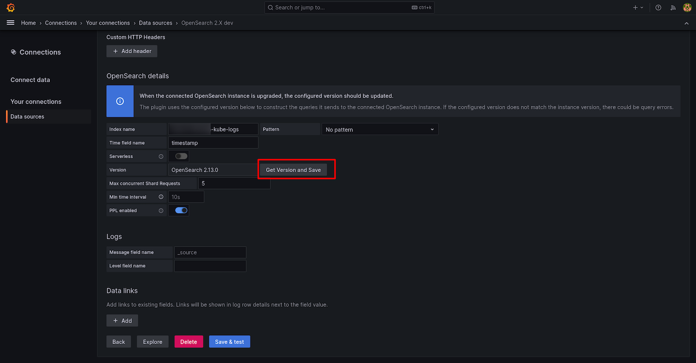

## Objective

This guide will help you to understand what the upcoming upgrade of OpenSearch from 1.3 to 2.X means for you and which actions you must take.

## Why do we upgrade ?

OpenSearch is one of the core components of the Logs Data Platform, allowing you to index logs at scale while providing the most complete query system for logs available today. The first release of OpenSearch 2 appeared in 2024. Since then, we have been monitoring the project. Now that the 1.X branch of OpenSearch will not have any new features, we need to upgrade our stack to this version to allow the platform to continue evolving. OpenSearch 2.X will bring performance improvements and new ways to interact with your logs.

## OpenSearch API 2.X Breaking changes

The main change for OpenSearch 2.X in terms of API is the [removal of type parameters](https://opensearch.org/docs/latest/breaking-changes/#200){.external}. This means you cannot use the "\_type" meta field anymore. This means you can no longer use the "\_type" meta field. This field has been fixed to the value "\_doc," and all official OpenSearch libraries have been updated to accommodate this change for some time now. The APIs using "\_doc" in their path have not changed, making the upgrade straightforward.

> [!warning]
>
> If you still use any ElasticSearch library relying on ElasticSearch 7.10 compatibility, the library will NOT work.
>

Another change for the OpenSearch API is the [Wildcard query behavior](https://opensearch.org/docs/latest/breaking-changes/#250){.external}. This change only affects users using the [wildcard query](https://opensearch.org/docs/latest/query-dsl/term/wildcard/){.external}.

## Graylog

For users using only Graylog to query their logs, the upgrade will have no impact on their queries. There will be no impact on Graylog Dashboards.

## OpenSearch Dashboards

All OpenSearch Dashboards instances will be upgraded to the corresponding version of OpenSearch 2.X. You will retain your Dashboards and visualizations setup before the upgrade.

## Grafana Datasources

[Grafana](/pages/manage_and_operate/observability/logs_data_platform/visualization_grafana) Datasources should only use OpenSearch Datasources with the Logs Data Platform. Grafana has an official OpenSearch Datasource that you can use with the Logs Data Platform. The only change to support OpenSearch 2.X is to use the Get Version and Save button at the bottom of the configuration page. This will allow the datasource to detect the version of OpenSearch and use the best APIs for it.

{.thumbnail}

## Go further

- Getting Started: [Quick Start](/pages/manage_and_operate/observability/logs_data_platform/getting_started_quick_start)
- Documentation: [Guides](/products/observability-logs-data-platform)
- Community hub: [https://community.ovh.com](https://community.ovh.com/en/c/Platform/data-platforms){.external}
- Create an account: [Try it!](https://www.ovh.com/fr/order/express/#/express/review?products=~(~(planCode~'logs-account~productId~'logs))){.external}
