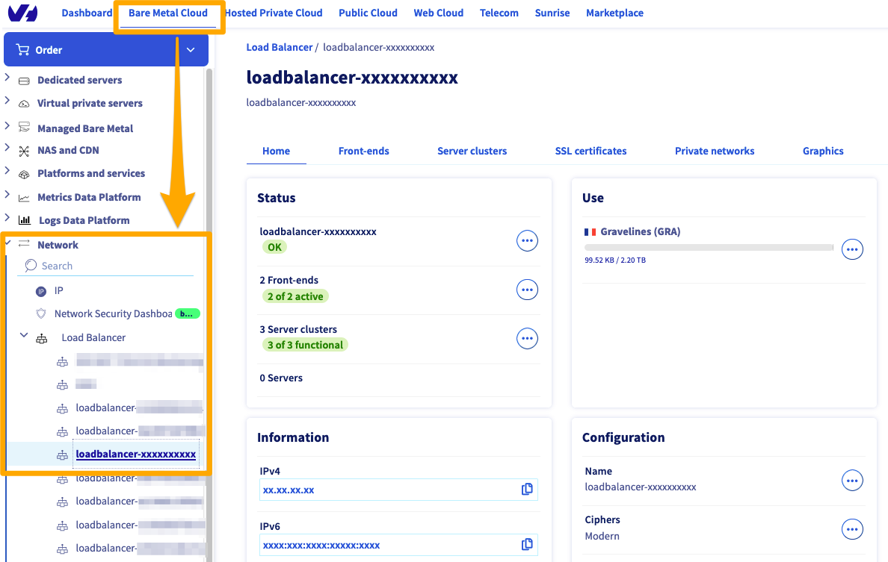

## Objective

The goal of this guide is to assist you when you first operate your Load Balancer by introducing the solution’s main features.

## Requirements

- Access to your customer control panel
- Owning a [Load Balancer](https://www.ovh.com/asia/solutions/load-balancer/)

## In practice

### Managing your Load Balancer from the customer control panel

To manage your Load Balancer via the Control Panel, go to the `Bare Metal Cloud`{.action} section, click `Network`{.action} and `Load Balancer`{.action}. The main page for the service will then appear:

{.thumbnail}

On this home page, you will find the following information:

|Element|Function|
|---|---|
|Status|Summary of your Load Balancer with IP, front-ends, operational farms and added servers|
|Usage|A summary of your LoadBalancer usage|
|Graphs|Here you will find the graphs in relation to your service and based on simultaneous connections or the number of requests per minute|
|Details|Your IPv4 and the Additional IPs attached as well as the number of outbound IPv4 (details available by clicking on the ellipsis)|
|Configuration|This is where you can customize the name of your service (which will appear at the top in the left column) The cipher(s), which are customizable, as well as the data centre where your Load Balancer is located|
|Subscription|You will find below all the administrative details pertaining to your offer|

To add a `front-end`{.action} or some `server farms`{.action}, simply click on their respective buttons. A context menu will then help you to configure each part of your service.

### Managing your frontends

In order to add front-ends, all you need to do is go to the `Frontends`{.action} section and click on `Add a front-end`{.action}. You will then gain access to the following menu:

{.thumbnail}

Details of a front-end component

|Element|Function|
|---|---|
|Name|You can name your frontend if you wish; this can be very useful when you have several of them to identify them quickly|
|Protocol|You can choose between HTTP, HTTPS, TCP, SSL TCP (or TLS) and UDP|
|Port|Choose which listening port to use|
|Data centre|You can choose between your data centre or all of them to create your front-end|
|Default farm|If you have several configured farms, you can choose one by default for each front-end|

You also have access to advanced settings:

{.thumbnail}

|Element|Function|
|---|---|
|Dedicated Additional IP|List of Additional IPs for remote servers|
|Restricting access to some IPs|List that allows restricting remote access to the Load Balancer, only in IPv4|
|HTTP redirection|Adding an HTTP redirect URL|
|HTTP header|Add an HTTP header here|

### Managing your server cluster

In order to add a server cluster, all you need to do is go to the `Server clusters`{.action} section and click on `Add a server cluster`{.action}. You will gain access to the same main features as for the frontend However, advanced options will be different:

{.thumbnail}

|Element|Function|
|---|---|
|Distribution mode|Choice between Round-robin, First, Last, Source or URI for your IP balancing|
|Session tracking|Session tracking can be done through Cookie or IP Source, to be determined here|
|Probe|Probe choice and activation|

### Managing your servers

Once your server farm has been created, you need to add servers to it. Below are the details for advanced options:

{.thumbnail}
{.thumbnail}
{.thumbnail}

|Element|Function|
|---|---|
|Name|You can name your server if you wish; this can be very useful when you have several of them to identify them quickly|
|IPv4 address|Adding the IP of the service that will be used as a server|
|Port|Server port|
|Backup server|Making sure to specify that this is a backup server|
|Use the farm’s availability probe|Choosing the probe that was approved during the creation of the farm|
|Encrypting requests with SSL|Encrypting requests with an SSL certificate|
|Cookie|Adding a customized session cookie|
|Certificate chain|Adding a certificate chain|
|Load balancing weight|Choosing the balancing weight for load distribution|

### Managing SSL Certificates

An SSL certificate can be added to the Load Balancer in the `SSL Certificate`{.action} section You will then have two possibilities: either ordering an SSL certificate through OVH or adding an external certificate.

#### OVH SSL certificate

To order an SSL certificate, simply go to the `SSL Certificate`{.action} section, then click on `Order an SSL Certificate`{.action} and let us guide you:

{.thumbnail}

|Element|Function|
|---|---|
|Types of certificate|Free (Let's Encrypt), Comodo DV or Comodo EV (find details here: https://www.ovh.com/asia/web-hosting/shared-ssl.xml)|
|Fully Qualified Domain Name (FQDN)|Affected domains|

#### Adding an external SSL certificate

If you already have your own SSL certificate, you can add it directly:

{.thumbnail}

|Element|Function|
|---|---|
|Name|You can name your certificate if you wish; this can be very useful when you have several of them to identify them quickly|
|Private key|Field where a private key can be added to the service|
|Certificate|Certificate field|
|Chain|Field where a root certificate can be added if necessary|

## Going further

Discuss with our user community at <https://community.ovh.com> .