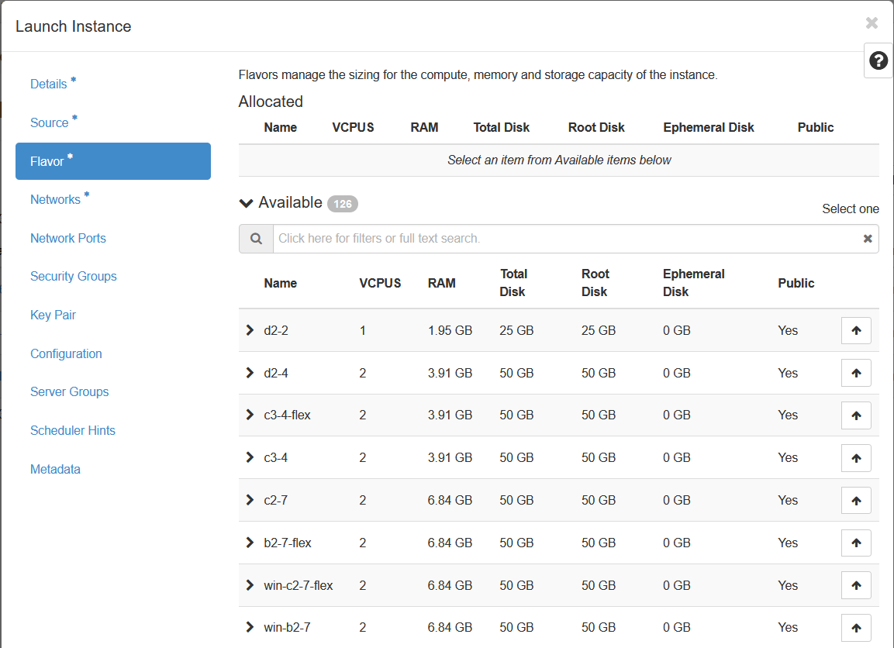

## Objective

You can create multiple Instances directly in the Horizon interface, and also configure a security group to apply to your Instances.

**Find out how to create an Instance via the Horizon interface.**

## Requirements

- A [Public Cloud project](https://www.ovhcloud.com/asia/public-cloud/) in your OVHcloud account
- [Access to the Horizon interface](/pages/public_cloud/compute/introducing_horizon)

## Instructions

To start creating an Instance, log in to the Horizon interface. If you are unsure about how to do this, please refer to our [guide](/pages/public_cloud/compute/introducing_horizon).

Next, click `Compute`{.action} in the left-hand menu, then `Instances`{.action}.

{.thumbnail}

The page that opens can be used to view the Instances that are currently launched. To launch a new one, click the `Launch Instance`{.action} button.

{.thumbnail}

You will then need to fill in the information requested. Please note that this grid is not exhaustive.

**Details**

{.thumbnail}

|Information|Details|
|---|---|
|Instance name|Specify the name you want for the Instance that will be launched.|
|Description|This is Optional. Set a description if applicable.|
|Availability zone|Leave "nova" (default choice).|
|Count|Specify the number of Instances to launch.|

**Source**

{.thumbnail}

|Information|Details|
|---|---|
|Select Boot Source|Click on the drop-down arrown to select the source for launching an instance (e.g. "Image" or "Instance snapshot").|
|Create New Volume|You may choose to check this option if you wish to create a volume into which the specified operating system image is copied.|
|Volume size (GB)|If you have choosen to create a volume, all the system to determine the size for you.|
|Delete Volume on Instance Delete|You can leave the default option **No**. If **Yes** is selected, when the instance is deleted, so is the volume.|
|Image name (only when launching from an image)|Select the Instance image by clicking on the upward arrow next to the image of your choice. In our example, we use selected Centos 7.|
|Instance snapshot (only for launching from a snapshot)|Choose an Instance snapshot by clicking on the upward arrow next to the instance snapshot image of your choice.|

**Flavor**

{.thumbnail}

Pre-built flavors are available for you, select the flavor of your choice underneath the `Available` tab.

**Networks**

{.thumbnail}

|Information|Details|
|---|---|
|Network|Select the network(s) for the Instance you want to create, from the list of available networks.|
|Custom script source|Specify the source between a "direct entry" or a "file".|
|Script data|Enter the script code in the input field (16KB maximum).|
|Script file|Click ‘browse’ to select the post-installation script.|
|Disk partitioning|Choose between "automatic" or "manual".|
|Configuration disk|Configure OpenStack to write metadata on to a specific configuration disk that will be attached to the Instance when it is launched.|

> [!warning] 
>
> Although the "Key Pair" field is not mandatory in the Horizon interface when creating an instance, registering an SSH key is absolutely necessary to be able to connect to an instance. Without an SSH key, you will be required to reboot the instance in rescue mode to either create a password or add an SSH key to the appropriate file (for more information, please refer to the guide on [Replacing your lost SSH key pair](/pages/public_cloud/compute/replacing_lost_ssh_key#instructions)).
>

Once you are ready to launch the Instances, click the `Launch Instance`{.action} button.

{.thumbnail}

## Go further

Join our community of users on <https://community.ovh.com/en/>.
