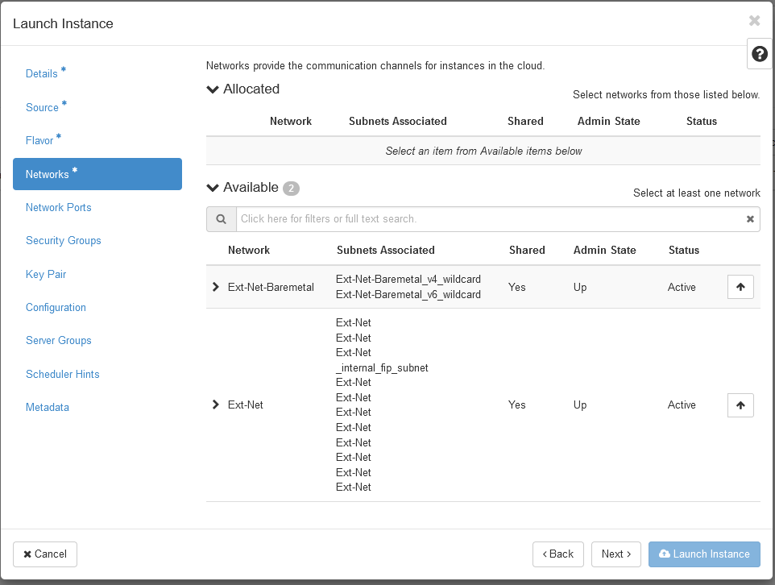
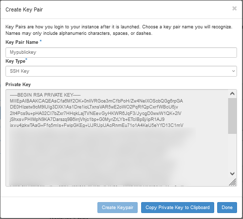

> [!primary]
> Questa traduzione è stata generata automaticamente dal nostro partner SYSTRAN. I contenuti potrebbero presentare imprecisioni, ad esempio la nomenclatura dei pulsanti o alcuni dettagli tecnici. In caso di dubbi consigliamo di fare riferimento alla versione inglese o francese della guida. Per aiutarci a migliorare questa traduzione, utilizza il pulsante "Contribuisci" di questa pagina.
>

## Obiettivo

In alcuni casi potrebbe essere necessario creare istanze direttamente dall’interfaccia Horizon: questa operazione permette, ad esempio, di aggiungere più istanze contemporaneamente o configurare gruppi di sicurezza specifici da applicare alle istanze.

**Questa guida ti mostra come creare un’istanza dall’interfaccia Horizon**.

## Prerequisiti

- Disporre di un progetto [Public Cloud OVHcloud](/pages/public_cloud/compute/create_a_public_cloud_project)
- [Essere connesso all’interfaccia Horizon](/pages/public_cloud/compute/introducing_horizon)

## Procedura

### Creare una rete privata

Prima di creare un’istanza, consigliamo di creare una rete privata. Successivamente sarà possibile associare la rete alla propria istanza.

Per iniziare, accedi all’interfaccia Horizon. Per maggiori informazioni, consulta la [nostra guida](/pages/public_cloud/compute/introducing_horizon).

Clicca su `Network`{.action} nel menu a sinistra e poi su `Networks`{.action}.

{.thumbnail}

Clicca su `Create Network`{.action}

{.thumbnail}

> [!tabs]
> 1. **Network (Rete)**
>>
>> **Network Name:** Immettere un nome per la rete. 
>> **Enable Admin State:** Selezionare questa opzione per attivare la rete. 
>> **Create Subnet:** Selezionare questa opzione per creare la sottorete. 
>> **Availability Zone Hints:** Lasciare l'opzione predefinita.  
>>{.thumbnail} 
>>
> 2. **Subnet (Sottorete)**
>>
>> **Subnet Name:** Immettere un nome per la sottorete. 
>> **Network Address:** Scegli un intervallo di rete privato. Ad esempio: `192.168.0.0/24`. 
>> **IP Version:** Lascia questo valore a IPv4. 
>> **Gateway IP:** Facoltativo. Se non viene definito, viene selezionato automaticamente un indirizzo Gateway IP. 
>> **Disable Gateway:** Disattivare questa opzione.  
>>{.thumbnail} 
>>
> 3. **Subnet Details (Dettagli sottorete)**
>>
>> **Enable DHCP:** Lascia questa opzione abilitata. 
>> **Allocation Pools:** Facoltativo. È possibile specificare l'intervallo in cui vengono selezionati gli indirizzi IP. 
>> **DNS Name Server:** Facoltativo. È possibile specificare qualsiasi server dei nomi DNS. 
>> **Host Routes:** Facoltativo. È possibile specificare qualsiasi route host.  
>>{.thumbnail} 
>>

### Crea un'istanza

Nell’interfaccia Horizon, clicca su `Compute`{.action} nel menu a sinistra e seleziona `Instances`{.action}.

{.thumbnail}

Visualizzi una pagina con tutte le istanze in esecuzione. Per avviarne una nuova, clicca sul pulsante `Launch Instance`{.action}.

{.thumbnail}

A questo punto completa i campi con le informazioni richieste aiutandoti, se necessario, con la tabella qui sotto (la lista non è esaustiva).

**Details**

{.thumbnail}

|Informazioni|Descrizione|
|---|---|
|Instance name|Specificare il nome che si desidera assegnare all'istanza che verrà avviata.|
|Description|Facoltativo. Se necessario, aggiungi una descrizione.|
|Availability zone|Lascia "nova" (scelta predefinita).|
|Count|Specificare il numero di istanze da creare.|

**Source**

{.thumbnail}

|Informazioni|Descrizione|
|---|---|
|Select Boot Source|Fare clic sulla freccia a discesa per selezionare l'origine di avvio di un'istanza (ad esempio, "Image" o "Instance snapshot").|
|Create New Volume|È possibile selezionare questa opzione per creare un volume in cui copiare l'immagine del sistema operativo specificata.|
|Volume size (GB)|Se si sceglie di creare un volume, lasciare che sia il sistema a stabilire le dimensioni del volume.|
|Delete Volume on Instance Delete|È possibile mantenere l’opzione predefinita **No**. Se **Yes** è selezionato, quando l'istanza viene eliminata, viene eliminato anche il volume.|
|Image name|Selezionare l'immagine dell'istanza (solo in caso di avvio da un'immagine) facendo clic sulla freccia rivolta verso l'alto accanto all'immagine desiderata. Nel nostro esempio, utilizziamo una selezione di CentOS 7.|
|Instance snapshot|Scegli un’istantanea di un’istanza (solo in caso di avvio da uno Snapshot) cliccando sulla freccia verso l’alto accanto al fotogramma di istantanea di un’istanza di tua scelta.|

**Flavor**

{.thumbnail}

*flavor* precostruiti sono disponibili per te, seleziona la *flavor* che preferisci nella scheda `Available`.

**Networks**

{.thumbnail}

|Informazioni|Dettagli|
|---|---|
|Network|Seleziona, nell’elenco delle reti disponibili, le reti che vuoi creare |
|Ext-Net|Rappresenta la rete pubblica.|
|Mynewnetwork|Rappresenta la rete privata creata all'inizio di questa guida.|

**Security Groups (Gruppi di sicurezza)**

{.thumbnail}

Per maggiori informazioni, consulta [questa guida](/pages/public_cloud/compute/setup_security_group).

**Key Pairs (Coppia di chiavi)**

> [!warning] 
>
> Anche se il campo "Key Pair" non è obbligatorio nell'interfaccia Horizon durante la creazione di un'istanza, la registrazione di una chiave SSH è assolutamente necessaria per potersi connettere a un'istanza. Senza chiave SSH, dovrai riavviare l'istanza in modalità Rescue per creare una password o aggiungere una chiave SSH nel file appropriato (per maggiori informazioni, consulta la guida [Sostituisci la tua chiave SSH in caso di perdita](/pages/public_cloud/compute/replacing_lost_ssh_key#procedura)).
>

In questa sezione è possibile creare una coppia di chiavi, importare una coppia di chiavi o utilizzare una coppia di chiavi esistente.

Per maggiori informazioni sulla creazione di una chiave SSH, consulta [questa guida](/pages/public_cloud/compute/public-cloud-first-steps#create-ssh).

> [!tabs]
> **+ Create Key Pair**
>>
>> Per creare una coppia di chiavi, clicca sul pulsante `+ Create Key Pair`{.action}. Ti ricordiamo che, con questa opzione, dovrai effettuare alcuni step supplementari prima di poter accedere all’istanza, soprattutto se utilizzi il software Putty per connetterti alla tua istanza. Consulta [questa sezione](/pages/public_cloud/compute/public-cloud-first-steps#connect-instance) della guida corrispondente.
>>
>> **Key Pair Name:** Immettere un nome per la chiave. 
>> **Key Type:** Fare clic sulla `freccia a discesa`{.action} e selezionare `SSH Key`{.action}. 
>> Clicca su `Create Keypair`{.action} per iniziare a creare la chiave. 
>>
>> Una volta creata la coppia di chiavi, clicca su `Copy Private Key to Clipboard`{.action} e poi su `Done`{.action}.   
>>{.thumbnail} 
>>
>> Una volta effettuata questa operazione, la chiave appena creata verrà selezionata automaticamente. Clicca su `Launch Instance`{.action} per avviare la creazione dell’istanza.  
>>
>>{.thumbnail} 
>>
> **Import Key Pair (Importa coppia di chiavi)**
>>
>> Per importare una chiave SSH creata precedentemente, clicca sul pulsante `Import Key Pair`{.action}.
>>
>> **Key Pair Name:** Immettere un nome per la chiave. 
>> **Key Type (Tipo di chiave):** Fare clic sulla `freccia a discesa`{.action} e selezionare `SSH Key`{.action}. 
>> **Load Public Key from a file (Carica chiave pubblica da file):** Fare clic su `Browse`{.action} per specificare la posizione della chiave pubblica nel computer. 
>> **Public Key:** Copia e incolla la chiave pubblica qui. 
>> Fare clic su `Import Key Pair`{.action} per importare la chiave.  
>>{.thumbnail} 
>>
>> Al termine dell'operazione, la chiave importata verrà selezionata automaticamente. Clicca su `Launch Instance`{.action} per avviare la creazione dell’istanza.  
>>
>>{.thumbnail} 

**Altre opzioni**

Attenzione: queste opzioni non sono obbligatorie per la creazione di un’istanza di base. Per maggiori informazioni su queste opzioni, consulta la [documentazione ufficiale OpenStack](https://docs.openstack.org/horizon/latest/user/launch-instances.html){.external}.

|Informazioni|Dettagli|
|---|---|
|Custom script source|Specificare l'origine tra direct entry o file.|
|Script data|Immettere il codice di script nel campo di input (massimo 16 KB).|
|Script file|Fare clic su `Browse`{.action} per selezionare lo script di post-installazione.|
|Disk partitioning|Scegli tra "automatic" e "manual".|
|Configuration disk|Configura OpenStack per scrivere metadati su un disco di configurazione specifico che sarà associato all'Istanza all'avvio.|

## Per saperne di più

Contatta la nostra Community di utenti all’indirizzo <https://community.ovh.com/en/>.