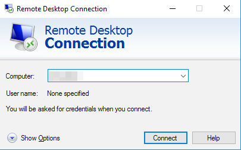

## Obiettivo

Le istanze GPU sono tecnicamente simili alle istanze della gamma 2017 ma dispongono anche di una scheda grafica (Graphic Processing Unit o GPU). La tecnologia utilizzata (*pci_passthrough*) permette al sistema operativo dell’istanza di controllare la GPU esattamente come su una macchina fisica.

Le GPU proposte da OVHcloud sono le NVIDIA Tesla V100 e V100s. 

> [!warning]
>
> Per il momento, la maggior parte delle nostre istanze GPU precedenti sono disponibili solo nelle Region GRA7, GRA9, GRA11 e BHS5. I modelli più recenti sono attualmente disponibili solo nell'area GRA11.
> 

**Questa guida ti mostra come creare un’istanza GPU con Linux o Windows.**

## Prerequisiti

- Aver creato un progetto Public Cloud con accesso alle Region in cui è disponibile la maggior parte delle GPU (GRA7, GRA9, GRA11 e BHS5).
- [Una chiave SSH](/pages/public_cloud/compute/public-cloud-first-steps#step-1-creating-ssh-keys) creata per implementare un’istanza GPU Linux.

## Procedura

Di seguito troverai le informazioni necessarie per creare un’istanza GPU utilizzando Linux o Windows.
Ricordati che non è possibile modificare il sistema operativo dell’istanza da Linux a Windows o viceversa. Pertanto, assicurati di creare l’istanza con il sistema operativo corretto, di default.

### Linux

Tutte le immagini proposte da OVHcloud sono compatibili con le istanze GPU.

> [!primary]
>
> Se preferisci non compilare manualmente il modulo del kernel, ti consigliamo di utilizzare una distribuzione ufficialmente supportata da Nvidia e per la quale esistono dei driver *pronti all’uso*: <https://developer.nvidia.com/cuda-downloads>
> 

Una volta connesso allo [Spazio Cliente OVHcloud](/links/manager), clicca sulla scheda `Public Cloud`{.action}. Seleziona il tuo progetto Public Cloud e clicca su `Instances`{.action} nel menu a sinistra sotto la scheda **Compute**. Clicca su `Crea un’istanza`{.action} e seleziona un’istanza GPU compatibile:

{.thumbnail}

Segui gli step rimanenti, come descritto in [questa guida](/pages/public_cloud/compute/public-cloud-first-steps#step-3-creating-an-instance). Questo processo potrebbe richiedere alcuni minuti.

Una volta consegnata l’istanza, è possibile collegarsi ad essa e verificare la presenza della scheda grafica:

```bash
lspci | grep -i nvidia
00:05.0 3D controller: NVIDIA Corporation GV100GL [Tesla V100 PCIe 16GB] (rev a1)
```

La scheda grafica è presente ma non ancora utilizzabile. A questo punto, è necessario installare i driver NVIDIA. La lista dei pacchetti è disponibile al seguente indirizzo: [Lista dei pacchetti Linux disponibili](https://developer.download.nvidia.com/compute/cuda/repos/){.external}.

Successivamente, inserisci i seguenti comandi:

```sh
wget URL_of_packet_to_download
sudo dpkg -i cuda-repo-XXXX-XXXXXX
sudo apt-get update
sudo apt-get upgrade
sudo apt-get install cuda
sudo reboot
```

> [!primary]
>
> Il comando Linux può variare in base alla distribuzione utilizzata. In caso di dubbi, consulta la documentazione ufficiale della tua versione Linux. 
> 

Una volta riavviata l’istanza, la scheda grafica compare all’interno del programma NVIDIA:

```sh
nvidia-smi
Fri Dec  6 12:32:25 2019       
+-----------------------------------------------------------------------------+
| NVIDIA-SMI 418.67       Driver Version: 418.67       CUDA Version: 10.1     |
|-------------------------------+----------------------+----------------------+
| GPU  Name        Persistence-M| Bus-Id        Disp.A | Volatile Uncorr. ECC |
| Fan  Temp  Perf  Pwr:Usage/Cap|         Memory-Usage | GPU-Util  Compute M. |
|===============================+======================+======================|
|   0  Tesla V100-PCIE...  On   | 00000000:00:05.0 Off |                    0 |
| N/A   26C    P0    35W / 250W |      0MiB / 16130MiB |      5%      Default |
+-------------------------------+----------------------+----------------------+
                                                                               
+-----------------------------------------------------------------------------+
| Processes:                                                       GPU Memory |
|  GPU       PID   Type   Process name                             Usage      |
|=============================================================================|
|  No running processes found                                                 |
+-----------------------------------------------------------------------------+
```

Da questo momento l’istanza GPU è pienamente operativa e pronta per essere utilizzata.

### Windows

A causa di alcune incompatibilità tra il driver Nvidia e la soluzione di virtualizzazione *KVM/pci_passthrough*, **le immagini Windows standard non funzionano.**
OVHcloud fornisce immagini speciali, basate su un BIOS virtuale UEFI, che permettono al driver di funzionare correttamente:

{.thumbnail}

> [!warning]
>
> Offriamo la possibilità di installare le immagini speciali su alcuni modelli selezionati (T1-45, T1-90, T1-180, T2-45, T2-90, T2-180). Inoltre, a seconda della regione selezionata, queste immagini speciali potrebbero non essere disponibili.
>

Una volta connesso al [tuo Spazio Cliente OVHcloud](/links/manager), accedi al tuo progetto Public Cloud e clicca su `Instances`{.action} nel menu a sinistra sotto la scheda **Compute**. Clicca su `Crea un’istanza`{.action} e seleziona un’istanza GPU compatibile:

{.thumbnail}

Nel passaggio successivo, vai alla scheda `Distribuzioni Windows` e clicca sulla freccia a discesa per selezionare l’immagine Windows compatibile:

{.thumbnail}

Segui gli step rimanenti, come descritto in [questa guida](/pages/public_cloud/compute/public-cloud-first-steps#step-3-creating-an-instance). Questo processo potrebbe richiedere alcuni minuti.

#### Connettersi a un’istanza Windows

Una volta creata l’istanza, è necessario completare l’installazione di Windows (_sysprep_). Per farlo, clicca sul pulsante con i tre puntini `...`{.action} e quindi su `Dettagli dell’istanza`{.action}. Clicca sulla scheda `Console VNC`{.action}. La console dovrebbe già mostrare l’interfaccia di installazione.

{.thumbnail}

Nel primo step, scegli i parametri di localizzazione, selezionando la regione, la lingua e il layout della tastiera. Clicca su `Avanti`{.action} per continuare.

{.thumbnail}

Il secondo step richiede la configurazione dell’account predefinito "Administrator". Inserisci la tua passphrase per due volte e clicca su `Finish`{.action} per completare il processo di installazione. Clicca sul simbolo dell'occhio per controllare se tutti i caratteri inseriti nei campi corrispondono alla configurazione effettiva della tua tastiera.

L’istanza si riavvierà e sarà possibile accedere con queste credenziali tramite un client Desktop remoto. 

##### **Da Windows**

Se necessario, utilizza Windows Search e apri l’applicazione client “Remote Desktop Connection”. 

{.thumbnail}

Inserisci l’indirizzo IPv4 della tua istanza e seleziona l’utente “Amministrator”. A questo punto, inserisci la tua passphrase. Trattandosi di un certificato sconosciuto, potresti visualizzare un messaggio di avviso per confermare la connessione. Clicca `Sì`{.action} per accedere all’istanza.

> [!primary]
>
In caso di difficoltà, verifica che il tuo dispositivo autorizzi la connessione RDP. Per farlo, controlla le impostazioni di sistema, le regole del firewall e le eventuali limitazioni della rete.
>

Una volta connesso all’istanza, è necessario installare il driver NVIDIA dal [sito ufficiale](https://www.nvidia.com/Download/index.aspx){.external}.

Non ti resta che installare il driver necessario, che successivamente comparirà qui:

{.thumbnail}

{.thumbnail}

> [!warning]
>
> Non siamo in grado di garantire che la soluzione funzionerà con tutte le versioni future del driver NVIDIA.
>
> Prima di effettuare qualsiasi aggiornamento del driver NVIDIA, ti consigliamo di effettuare uno Snapshot della tua istanza, per ripristinare l’immagine all’occorrenza.
>

## Per saperne di più

Contatta la nostra Community di utenti all’indirizzo <https://community.ovh.com/en/>.
