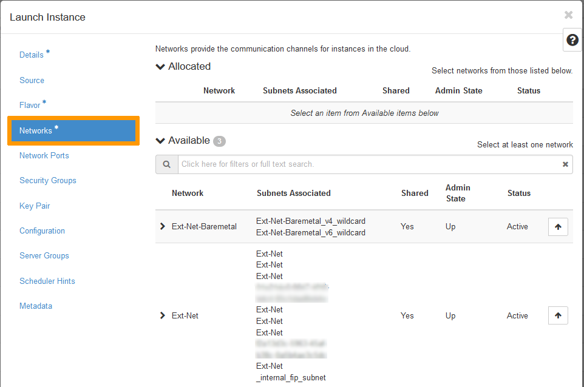
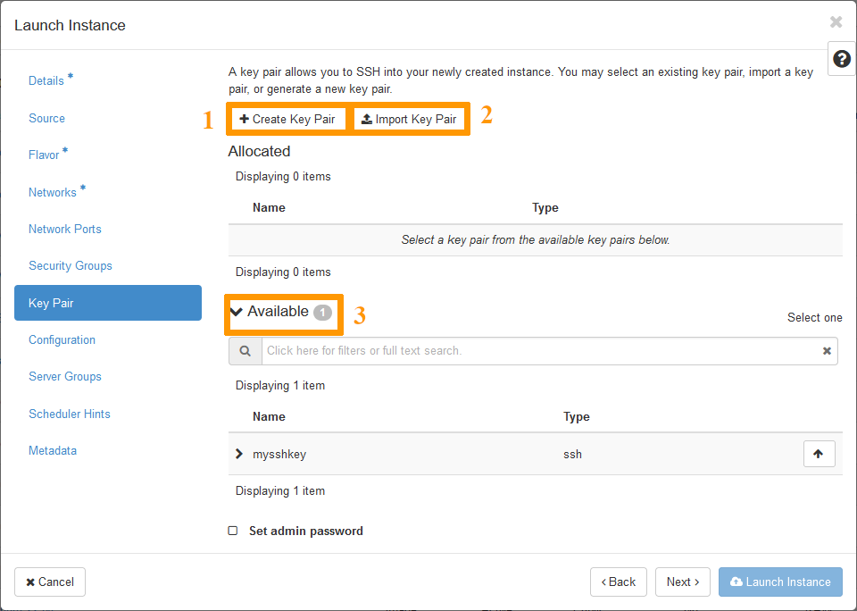

## Objective

During your activity, you will probably need to back up your data, configurations and even your entire instances. To do this, you can create snapshots of your instances. These can be used to restore a later configuration on your instance, or to create an exact copy of an instance.

**This guide explains how to manage snapshots from the OpenStack Horizon interface.**

## Requirements

- An [OVHcloud Public Cloud instance](/pages/public_cloud/compute/public-cloud-first-steps#create-instance) 
- [Access to the Horizon interface](/pages/public_cloud/compute/introducing_horizon)

## Instructions

### Snapshot creation

Log into the Horizon interface, and ensure that you are in the correct region. You can verify this on the top left corner.

{.thumbnail}

Next, click on the `Compute`{.action} menu on the left side and select `Instances`{.action}. Select `Create Snapshot`{.action} next to the corresponding instance.

{.thumbnail}

In the pop-up window, enter the required information:

Snapshot Name: Set a name for the snapshot and click on `Create Snapshot`{.action}.

{.thumbnail}

The snapshot will then be listed in the `Images`{.action} section. For this reason, we recommend naming each snapshot explicitly.

### Restore a snapshot

To restore a snapshot, a new instance needs to be created from it.

In the horizon interface, click on the `Compute`{.action} menu on the left side, then click on `Images`{.action}.

Next, click on `Launch`.

{.thumbnail}

In the pop-up windows, a few options need to be selected to complete the restoration of the snapshot.

> [!tabs]
> **Details**
>>
>> **Instance Name:** Specify the name you want for the instance. 
>> **Count:** Select the amount of instances you want to launch from the snapshot.  
>>{.thumbnail} 
>>
> **Flavor**
>>
>> Select the flavor you want. Make sure to select one with equal or more resources than the image size (snapshot).  
>>{.thumbnail} 
>>
> **Network**
>>
>> Select a public network (Ext-Net) to attach to the instance.  
>>{.thumbnail} 
>>
> **Keypair**
>>
>> Select, create or import a key pair. Adding an ssh key to an instance facilates the connection to it.  
>>{.thumbnail} 
>>

Once done, click on `Launch Instance`{.action} to begin the creation of your instance.

### Deleting a snapshot

In the horizon interface, click on the `Compute`{.action} menu on the left side, then click on `Images`{.action}.

Next, click the drop-down arrow next to the snapshot you want to delete and click on `Delete Image`{.action}. Confirm the deletion of the snapshot.

{.thumbnail}

## Go further

Join our [community of users](/links/community).