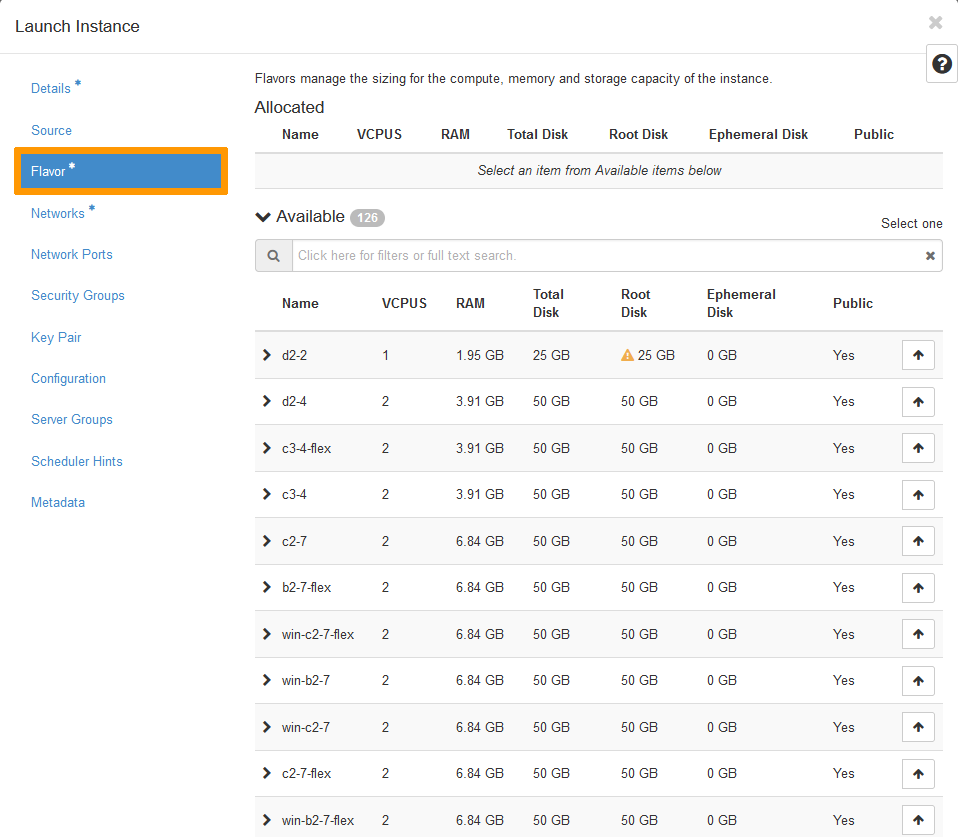

## Objectif

Lors de votre activité, vous serez probablement amené à effectuer une sauvegarde de vos données, de vos configurations, et même de vos instances au complet. Pour cela, il est possible de créer des snapshots de vos instances. Ceux ci pourront être utilisés pour restaurer une configuration ultérieure sur votre instance, ou encore pour créer une copie exacte d'une instance.

**Ce guide vous explique comment gérer ces snapshots depuis l'interface OpenStack Horizon.**

## Prérequis

- Avoir [créé une instance Public Cloud](/pages/public_cloud/compute/public-cloud-first-steps) dans votre compte OVHcloud
- [Accéder à l'interface Horizon](/pages/public_cloud/compute/introducing_horizon)

## En pratique

### Création du snapshot

Connectez-vous à l'interface Horizon et assurez-vous d’être dans la bonne région. Vous pouvez le vérifier en haut à gauche. 

{.thumbnail}

Cliquez sur le menu `Compute`{.action} à gauche puis sur `Instances`{.action}. Cliquez ensuite sur `Create Snapshot`{.action} sur la ligne de l'instance correspondante.

{.thumbnail}

Dans la fenêtre qui s'affiche, saisissez les informations requises :

* Nom du snapshot (*Snapshot Name*): définissez un nom pour le snapshot et cliquez sur `Create Snapshot`{.action}.

{.thumbnail}

Le snapshot sera ensuite listé dans la section `Images`{.action}. Il est donc conseillé d'attribuer un nom explicite à chaque snapshot.

### Restauration d'un snapshot

Il est possible de restaurer un snapshot en créant une nouvelle instance à partir de celui-ci.

Dans l'interface de Horizon, cliquez sur le menu `Compute`{.action} à gauche puis sur `Images`{.action}.

Cliquez sur `Launch`{.action} à côté du snapshot sélectionné.

{.thumbnail}

Dans la fenêtre contextuelle, un certain nombre d'options doivent être sélectionnées pour terminer la restauration du snapshot.

> [!tabs]
> **Details**
>>
>> **Nom de l'instance (*Instance name*) :** Indiquez le nom souhaité pour l'instance. 
>> **Count:** Sélectionnez le nombre d'instances à lancer à partir du snapshot.  
>>{.thumbnail} 
>>
> **Flavor**
>>
>> Sélectionnez la flavor souhaitée. Assurez-vous de sélectionner une version dont les ressources sont égales ou supérieures à la taille de l’image (instantané).  
>>{.thumbnail} 
>>
> **Réseau (*Network*)**
>>
>> Sélectionnez un réseau public (Ext-Net) à attacher à l’instance.  
>>{.thumbnail} 
>>
> **Keypair**
>>
>> Sélectionnez (3), créez (1) ou importez (2) une paire de clés.  
>>{.thumbnail} 
>>

### Supression d'un snapshot

Dans l'inteface horizon, cliquez sur le menu `Compute`{.action} à gauche puis sur `Images`{.action}.

Cliquez ensuite sur la flèche déroulante à côté du snapshot à supprimer et cliquez sur `Delete Image`{.action}. Confirmez la suppression du snapshot.

{.thumbnail}

## Aller plus loin

Échangez avec notre [communauté d'utilisateurs](/links/community).