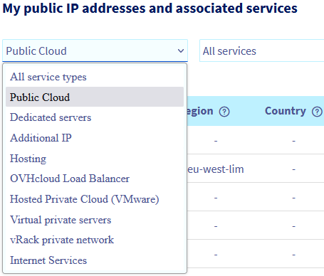

## Objectif

Le **Reverse DNS** (*rDNS*) est le complément de la résolution "classique" des DNS qui permet de convertir un nom de domaine en une adresse IP (enregistrement de type **A**). Grâce à une requête de ce type, une adresse IP peut être résolue en nom de domaine (enregistrement de type **PTR**). Ce qui signifie que les requêtes DNS sur l'adresse IP concernée renverront un nom de domaine.

Configurer la résolution **Reverse DNS** d’une instance est particulièrement utile pour l’envoi d’e-mails. Le risque que vos messages soient rejetés par un système de protection contre le spam sera diminué si l'adresse IP de votre serveur d'envoi se résout correctement en votre nom de domaine.

**Découvrez comment configurer le reverse DNS pour la ou les adresses IP de votre instance Public Cloud.**

## Prérequis

- Avoir une [instance Public Cloud](https://www.ovhcloud.com/fr-ca/public-cloud/) dans votre compte OVHcloud
- Un nom de domaine avec son champ `A` pointant vers l'instance
- Être connecté à votre [espace client OVHcloud](https://ca.ovh.com/auth/?action=gotomanager&from=https://www.ovh.com/ca/fr/&ovhSubsidiary=qc)

## En pratique

Connectez-vous à votre [espace client OVHcloud](/links/manager), accédez à la section `Bare Metal Cloud`{.action} et ouvrez `Network`{.action}. Cliquez ensuite sur `IP`{.action}.

Le menu déroulant sous « **Mes adresses IP publiques et services associés** » vous permet de filtrer vos services par catégorie.

{.thumbnail}

Cliquez sur `...`{.action} dans la ligne de l'adresse IP concernée et sélectionnez `Modifier le reverse`{.action}.

{.thumbnail}

Dans la nouvelle fenêtre, renseignez votre reverse et cliquez sur `Valider`{.action}.

{.thumbnail}

Vous pouvez également éditer le reverse directement via l'icône de la colonne **Reverse** du tableau.
> [!primary]
>
Si la modification ne fonctionne pas comme prévu, vérifiez que le champ `A` est bien configuré dans la zone DNS de votre nom de domaine. Attention, la modification de la [zone DNS](/pages/web_cloud/domains/dns_zone_edit#comprendre-la-notion-de-dns) peut prendre jusqu'à 24 heures si vous n'avez modifié que récemment le champ `A`.
>

## Aller plus loin 

[Créer une première instance Public Cloud et s’y connecter](/pages/public_cloud/compute/public-cloud-first-steps)

Échangez avec notre [communauté d'utilisateurs](/links/community).
