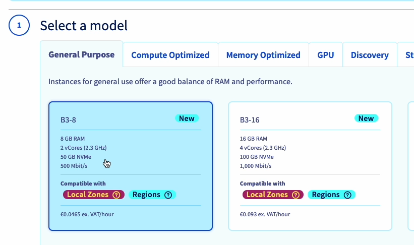
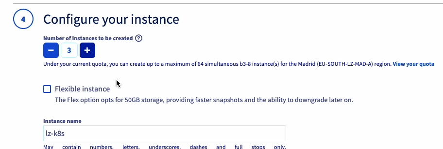
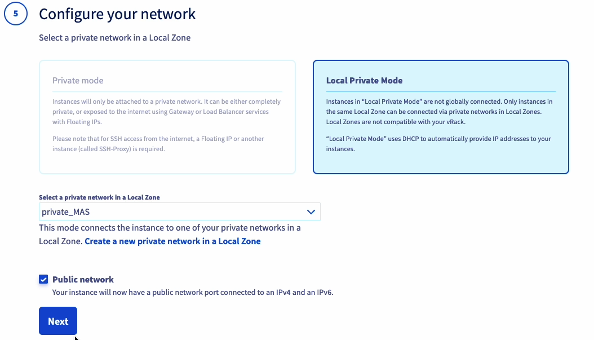

## Objective

**Discover how to deploy a Kubernetes cluster using Rancher in an OVHcloud Local Zone.**

## Requirements

- Have an OVHcloud project with available instances.
- Have an existing Rancher setup. Refer to the following guide for creating a Managed Rancher service:
  - [Getting Started with Managed Rancher Service](/pages/public_cloud/containers_orchestration/managed_rancher_service/getting-started/)
- Refer to the following guide for creating instances:
  - [OVHcloud Public Cloud Compute Getting Started](/pages/public_cloud/compute/public-cloud-first-steps)

### Pre-Configuration

#### Understanding the Process

In this guide, we will create instances in an OVHcloud Local Zone, which will then be used by Rancher to deploy a Kubernetes cluster in "custom cluster" mode. This involves a few key steps:

1. **Create Instances in Local Zone**: We will start by creating virtual machine instances in a specific Local Zone within OVHcloud. A Local Zone is a specific geographical area with its own dedicated resources and infrastructure, offering low-latency and high-performance computing.

2. **Deploy Managed Rancher**: After creating the instances, we will deploy a Managed Rancher service. Rancher is a powerful open-source platform that provides a comprehensive suite of tools to manage Kubernetes clusters.

3. **Set Up a Custom Kubernetes Cluster**: Using Rancher, we will set up a Kubernetes cluster in custom mode. This involves registering our previously created instances with Rancher, which will configure them as Kubernetes nodes.

#### Why This Approach?

This method is a temporary workaround until a dedicated Local Zone driver becomes available. A Local Zone driver would allow Rancher to directly manage and deploy resources and instances within the Local Zone without manual intervention. Until then, this step-by-step process ensures that you can still leverage the benefits of Local Zones for your Kubernetes clusters.

#### Benefits of Using Local Zones

- **Low Latency**: By running workloads in a Local Zone, you benefit from reduced latency, which is crucial for real-time applications and services.
- **High Performance**: Local Zones are designed to offer high-performance computing with dedicated resources.
- **Geographical Proximity**: They allow you to place your applications closer to your users, enhancing user experience.

#### Future Improvements

In the future, with the introduction of a Local Zone driver, the process will become more streamlined:
- Rancher will be able to directly manage the lifecycle of instances within Local Zones.
- Automated scaling and management of resources will be possible, reducing manual intervention.

By following this guide, you can set up a robust Kubernetes environment in an OVHcloud Local Zone, leveraging the current capabilities while anticipating future enhancements.

## Instructions

### Step 1: Create Instances

1. Log in to the OVHcloud control panel and open the **Public Cloud** section.
2. Go to **Instances** under the **Compute** section.
3. Click on the **Create an instance** button.
4. Follow the instructions in the [OVHcloud Public Cloud Compute Getting Started](/pages/public_cloud/compute/public-cloud-first-steps) guide to create your SSH key if necessary.
5. Choose an instance model.



6. Select a Local Zone.


7. Choose an image.


8. Select your SSH key.


9. Indicate the number of instances to create and rename the instances (e.g., `lz-kube`).
    - For a demo, you can use a single instance for the control plane.
    - For production, it is recommended to follow Kubernetes best practices and use at least 3 instances for the control plane. Refer to [Kubernetes Best Practices](https://kubernetes.io/docs/setup/best-practices/) for more information.



10. Check the **Private network** and **Public network** boxes (to have a public IP).



11. The instances will take a few minutes to create.


### Step 2: Configure Rancher to Deploy a Kubernetes Cluster

#### Create a Cluster

1. In the Rancher interface, click on the **Create** button then on the **Custom** driver.
2. Fill in a cluster name (e.g., `lz-k3s`).
3. In the list of Kubernetes versions, choose the `1.27.14` version of k3s.
4. Click on the **Create** button.


#### Configure the Cluster

- **For the control plane and etcd nodes:**
  - For a demo setup, you can use a single node for both control plane and etcd.
  - For production, follow best practices and use at least 3 nodes for the control plane and etcd.
  - Check the **etcd** and **control plane** boxes.
  - Copy the registration command provided by Rancher.

1. Retrieve the public IP of the first instance in the OVHcloud control panel.
2. SSH into the first instance from your local terminal and run the registration command.


```bash
$ ssh root@xxx.xxx.xxx.xxx
The authenticity of host 'xxx.xxx.xxx.xxx (xxx.xxx.xxx.xxx)' can't be established.
ED25519 key fingerprint is SHA256:dqsdqsdqsdqsd/dqsdqsdqsdqsdqsdqsdq.
This key is not known by any other names
Are you sure you want to continue connecting (yes/no/[fingerprint])? yes
...
root@lz-kube-1:~# curl -fL https://dsqdsqdqsd.p7mg.rancher.ovh.net/system-agent-install.sh | sudo sh -s - --server https://dsqdsqdqsd.p7mg.rancher.ovh.net --label 'cattle.io/os=linux' --token kbv5k48vc8thhgqqhmtd8tn55qtlpgw7jp4llm4m4tvnp9sznscmpf --etcd --controlplane
  % Total    % Received % Xferd  Average Speed   Time    Time     Time  Current
                                 Dload  Upload   Total   Spent    Left  Speed
100 30794    0 30794    0     0   156k      0 --:--:-- --:--:-- --:--:--  157k
[INFO]  Label: cattle.io/os=linux
...

```

### For the worker nodes:

1. Uncheck the boxes and check only the **Worker** box.
2. Copy the registration command provided by Rancher.
3. Retrieve the public IPs of the other two instances in the OVHcloud control panel.
4. SSH into each instance from your local terminal and run the registration command for the worker nodes.

```bash
$ ssh root@xxx.xxx.xxx.xxx
The authenticity of host 'xxx.xxx.xxx.xxx (xxx.xxx.xxx.xxx)' can't be established.
ED25519 key fingerprint is SHA256:dqsdqsdqsdqsd/dqsdqsdqsdqsdqsdqsdq.
This key is not known by any other names
Are you sure you want to continue connecting (yes/no/[fingerprint])? yes
...

root@lz-kube-2:~# curl -fL https://dsqdsqdqsd.p7mg.rancher.ovh.net/system-agent-install.sh | sudo sh -s - --server https://dsqdsqdqsd.p7mg.rancher.ovh.net --label 'cattle.io/os=linux' --token kbv5k48vc8thhgqqhmtd8tn55qtlpgw7jp4llm4m4tvnp9sznscmpf --worker
  % Total    % Received % Xferd  Average Speed   Time    Time     Time  Current
                                 Dload  Upload   Total   Spent    Left  Speed
100 30794    0 30794    0     0   156k      0 --:--:-- --:--:-- --:--:--  157k
[INFO]  Label: cattle.io/os=linux
...
```
1. Wait for the cluster to be in **Active** state.

### Step 4: Connect to the Cluster with the kubectl CLI

1. In the Rancher interface, click on the **lz-k3s** cluster.
2. Click on the **Download KubeConfig** icon to download the kubeconfig file and save the kubeconfig path in an environment variable.

```bash
export KUBE_CLUSTER=$(pwd)/lz_k3s.yml
```

3. Test the connection to the Kubernetes cluster:

```bash
kubectl --kubeconfig=$KUBE_CLUSTER cluster-info
```
4. List the nodes to verify the configuration

kubectl --kubeconfig=$KUBE_CLUSTER get no


```bash
NAME        STATUS   ROLES                       AGE     VERSION
lz-kube-1   Ready    control-plane,etcd,master   9m9s    v1.27.14+k3s1
lz-kube-2   Ready    worker                      8m59s   v1.27.14+k3s1
lz-kube-3   Ready    worker                      9m      v1.27.14+k3s1
```
5. Check the deployed resources in the cluster:

```bash
kubectl --kubeconfig=$KUBE_CLUSTER get all
```

You should see a list of pods, services, and other resources deployed in your Kubernetes cluster.

## Go Further

Join our community of users on <https://community.ovh.com/>.

