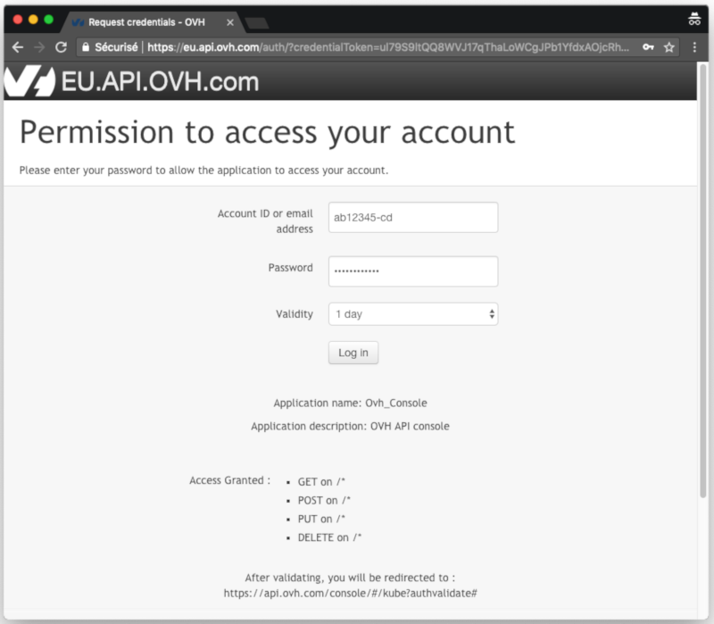
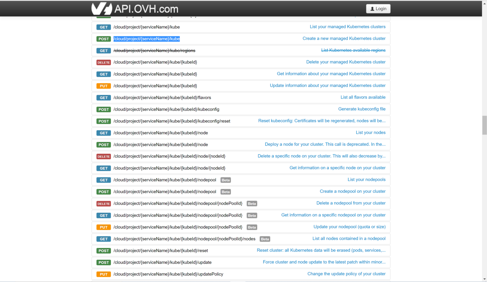

## Objective

The OVHcloud Managed Private Registry service, a cloud-native registry built on Harbor, allows you to store, manage and access your container images (OCI artifacts) and Helm charts.

This guide will cover the feature that allows you to manage access to the HMI of your OVHcloud Managed Private Registry and to the registry itself. Thanks to that you can add IP restrictions in a cluster.

## Requirements

- A [Public Cloud project](https://www.ovhcloud.com/en/public-cloud/) in your OVHcloud account
- Access to the [OVHcloud Control Panel](https://ca.ovh.com/auth/?action=gotomanager&from=https://www.ovh.com/world/&ovhSubsidiary=we)
- An OVHcloud Managed Private Registry (see the [creating a private registry](/pages/public_cloud/containers_orchestration/managed_private_registry/creating-a-private-registry) guide for more information)

## Instructions

The IP restrictions feature allows you to add whitelisted IP for two parts of the OVHcloud Managed Private Registry:

- `/management` -> HMI/Harbor user interface
- `/registry` -> Client/CLI side: docker login/pull/push, helm...

This means that you can configure different IP blocks (CIDR) for the HMI and the registry part, depending on your teams, environments, needs...

### Adding IP restrictions through the API

#### The API Explorer

To simplify things, we are using the [API Explorer](https://api.ovh.com/) which allows to explore, learn and interact with the API in an interactive way.

Log in to the API Explorer using your OVHcloud customer ID (NIC handle).

{.thumbnail}

If you go to the [Kubernetes section](https://api.ovh.com/console/#/cloud/project/%7bservicename%7d/kube~get) of the API Explorer, you will see the available endpoints:

{.thumbnail}

#### API endpoints

- Get an existing IP restriction on management endpoint:

> [!api]
>
> @api {v1} /cloud GET /cloud/project/{serviceName}/containerRegistry/{registryID}/ipRestrictions/management
>

**Result:**

```json
[
  {
    "createdAt": "2024-01-10T09:53:28.839586Z",
    "description": "string",
    "ipBlock": "192.0.2.0/24",
    "updatedAt": "2024-01-10T09:53:28.839586Z"
  }
]
```

- Add or update an IP restriction on management endpoint:

> [!api]
>
> @api {v1} /cloud PUT /cloud/project/{serviceName}/containerRegistry/{registryID}/ipRestrictions/management
>

```json
[
  {
    "description": "production environment",
    "ipBlock": "192.0.2.0/24"
  }
]
```

**Result:**

```json
[
  {
    "createdAt": "2024-02-01T15:15:06.436256Z",
    "description": "production environment",
    "ipBlock": "192.0.2.0/24",
    "updatedAt": "2024-02-01T15:15:06.436256Z"
  }
]
```

> [!primary]
>
> The list of specified IPs override the existing IP restrictions if there are any, always specify the complete list of IPs.
>

> [!primary]
>
> If you specify an IP address instead of an IP block/CIDR, we will add `/32` at the end of the IP.
>

After adding IP restrictions for the `management` endpoint, an unauthorized IP will have an "UNAUTHENTICATED" error message on the Harbor user interface:


> [!primary]
>
> Wait about 30 seconds for the IP restriction to propagate.
>

- Get an existing IP restriction on registry endpoint:

> [!api]
>
> @api {v1} /cloud GET /cloud/project/{serviceName}/containerRegistry/{registryID}/ipRestrictions/registry
>

**Result:**

```json
[]
```

- Add or update an IP restriction on registry endpoint:

> [!api]
>
> @api {v1} /cloud PUT /cloud/project/{serviceName}/containerRegistry/{registryID}/ipRestrictions/registry
>

```json
[
  {
    "description": "Q/A environment",
    "ipBlock": "192.0.1.0/24"
  }
]
```

**Result:**

```json
[
  {
    "createdAt": "2024-02-01T15:18:05.611221Z",
    "description": "Q/A environment",
    "ipBlock": "192.0.1.0/24",
    "updatedAt": "2024-02-01T15:18:05.611221Z"
  }
]
```

> [!primary]
>
> The list of specified IPs override the existing IP restrictions if there are any, always specify the complete list of IPs.
>

> [!primary]
>
> If you specify an IP address instead of an IP block/CIDR, we will add `/32` at the end of the IP.
>

After adding IP restrictions for the `registry` endpoint, an unauthorized IP will have an error message:

- For Docker CLI:

```bash
$ docker pull xxxxx.c1.gra9.container.registry.ovh.net/library/ubuntu:10.04
Error response from daemon: error parsing HTTP 403 response body: Invalid character '<' looking for begining of value...
```

- For Helm CLI:

```bash
$ helm registry login xxxxx.c1.gra9.container.registry.ovh.net
Username: xxx
Password:
Error: login attempt to https://xxxxx.c1.gra9.container.registry.ovh.net/v2/ failed with status: 403 Forbidden
```

> [!primary]
>
> Wait about 30 seconds for the IP restriction to propagate.
>

## Go further

To have an overview of OVHcloud Managed Private Registry service, read the [OVHcloud Managed Private Registry documentation](/products/public-cloud-containers-orchestration-managed-private-registry).

If you need training or technical assistance to implement our solutions, contact your sales representative or click on [this link](https://www.ovhcloud.com/en/professional-services/) to get a quote and ask our Professional Services experts for assisting you on your specific use case of your project.

Join our community of users on <https://community.ovh.com/en/>.
