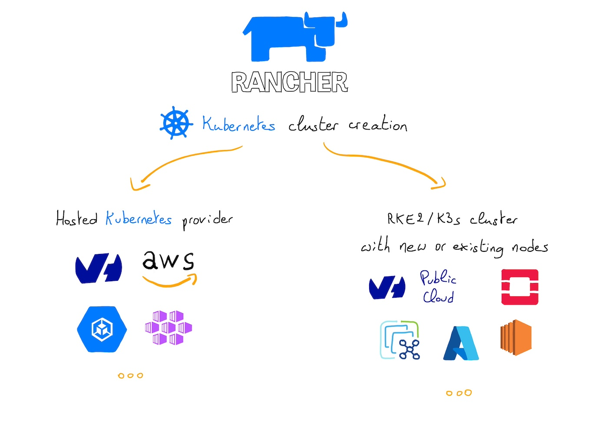
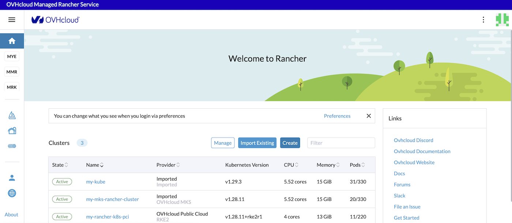
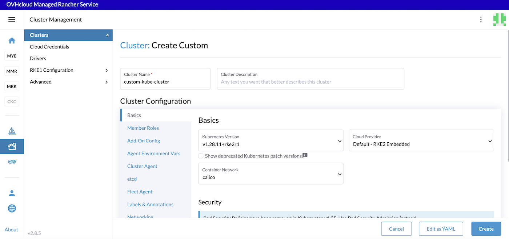
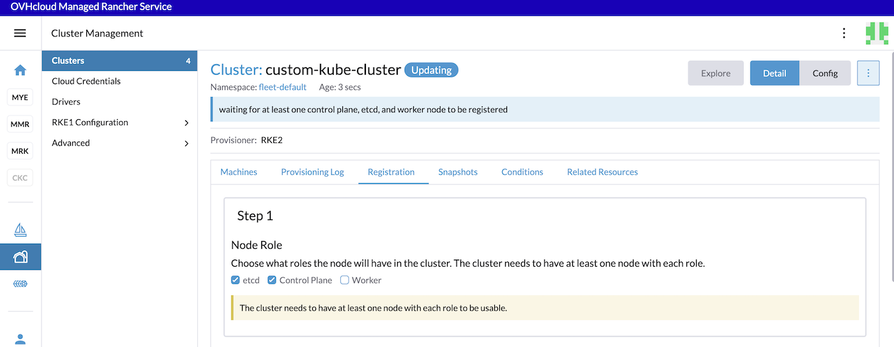
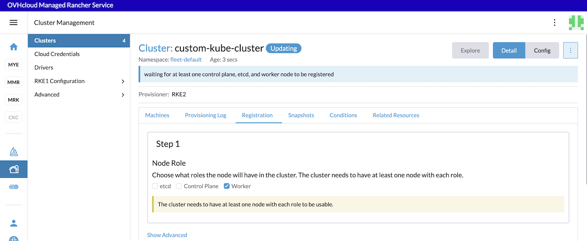

> [!warning]
>
> Usage of [Managed Rancher Service](https://labs.ovhcloud.com/en/managed-rancher-service/) is currently in Beta phase.
> This guide may be incomplete and will be extended during the beta phase. Our team remains available on our dedicated Discord Channel, do not hesitate to join and reach us : <https://discord.gg/ovhcloud>. Ask questions, provide feedback and interact directly with the team that builds our Container and Orchestration services.
>

## Objective

Managed Rancher Service by OVHcloud provides a powerful platform for orchestrating Kubernetes clusters seamlessly. You can use Rancher to deploy a Kubernetes cluster on any platform and location including:

- Hosted Kubernetes provider (e.g. OVHcloud Managed Kubernetes Service, AWS EKS, GCP GKE, etc).
- Infrastructure Provider - Public Cloud or Private Cloud (vSphere, Nutanix, etc).
- Bare-metal servers, cloud hosted or on premise.
- Virtual machines, cloud hosted or on premise

{.thumbnail}

In this guide we will explore how to create a RKE2 or K3s Kubernetes cluster using existing nodes through the **Custom** driver.

## Requirements

- A [Public Cloud project](https://www.ovhcloud.com/de/public-cloud/) in your OVHcloud account
- An OVHcloud Managed Rancher Service (see the [creating a Managed Rancher Service](/pages/public_cloud/containers_orchestration/managed_rancher_service/create-update-rancher) guide for more information)
- An access to the Rancher UI to operate it (see the [connecting to the Rancher UI](/pages/public_cloud/containers_orchestration/managed_rancher_service/create-update-rancher) guide for more information)
- Existing machines accessible through SSH

## Instructions

You should have existing machines (virtual or physical) accessible through SSH.

Follow this guide if you want to [create OVHcloud Compute Instances](https://help.ovhcloud.com/csm/en-gb-public-cloud-compute-getting-started?id=kb_article_view&sysparm_article=KB0051017).

### Creating a Kubernetes cluster with existing nodes 

Log in your Managed Rancher Service UI.

{.thumbnail}

Click on `Create`{.action} button.

{.thumbnail}

Click on the **Custom** driver 

Fill a cluster name (`custom-kube-cluster` for example).

In the Kubernetes version list, choose the latest version of the wanted OS. You can choose between K3s and RKE2. For production needs we recommend RKE2.
Choose the container network (`calico` by default).

{.thumbnail}

Clik on the different tabs to configure your cluster depending on your needs.

Click on the `Create`{.action} button.

### Configuring a Kubernetes cluster with existing nodes 

> [!primary]
>
> In Rancher when you configure a node, there are three roles that can be assigned to nodes: `etcd`, `Control Plane` and `Worker`.

There are some good practices:

- At least 3 nodes with the role `etcd` are needed to survive a loss of 1 node and have a minimum high availability configuration for `etcd`. 3 `etcd` nodes are generally sufficient for smaller and medium clusters, and 5 `etcd` nodes for large clusters.
- At least 2 nodes with the role `Control Plane` for master component high availability.
- You can set both the `etcd` and `Control Plane` roles for one instance.
- The `Worker` role should not be used or added to nodes with the `etcd` or `controlplane` role.
- At least 2 nodes with the role `Worker` for workload rescheduling upon node failure.

For the configuration of our `etcd` + `Control Plane` nodes, check only the `etcd` and `Control Plane` Nodes Roles:

{.thumbnail}
{.thumbnail}

SSH to your machines/nodes you created for `etcd` and `Control Plane` and copy/paste the registration command.

```bash
ssh xxxxx@xxx.xxx.xxx.xxx

curl -fL https://xxxxxx.xxxx.rancher.ovh.net/system-agent-install.sh | sudo  sh -s - --server https://xxxxxx.xxxx.rancher.ovh.net --label 'cattle.io/os=linux' --token z2r458coqudhfilgdsifgdsqilgfqsdigfidsufgoisdnvzj --etcd --controlplane
```

For the configuration of our `Worker` nodes, uncheck the checkboxes and check only the Worker checkbox:

{.thumbnail}
{.thumbnail}

SSH to your machines/nodes you created for `etcd` and `controlpane` and copy/paste the registration command.

```bash
ssh xxxxx@xxx.xxx.xxx.xxx

curl -fL https://xxxxxx.xxxx.rancher.ovh.net/system-agent-install.sh | sudo  sh -s - --server https://xxxxxx.xxxx.rancher.ovh.net --label 'cattle.io/os=linux' --token z2r458coqudhfilgdsifgdsqilgfqsdigfidsufgoisdnvzj --worker
```

After executing these commands to the machines/nodes, wait until the cluster is in `Active` state in the Rancher UI.

## Go further

- To have an overview of OVHcloud Managed Rancher Service, you can go to the [OVHcloud Managed Rancher Service page](https://www.ovhcloud.com/de/public-cloud/managed-rancher-service/).

- If you need training or technical assistance to implement our solutions, contact your sales representative or click on [this link](https://www.ovhcloud.com/de/professional-services/) to get a quote and ask our Professional Services experts for assisting you on your specific use case of your project.

- Join our community of users on <https://community.ovh.com/en/>.