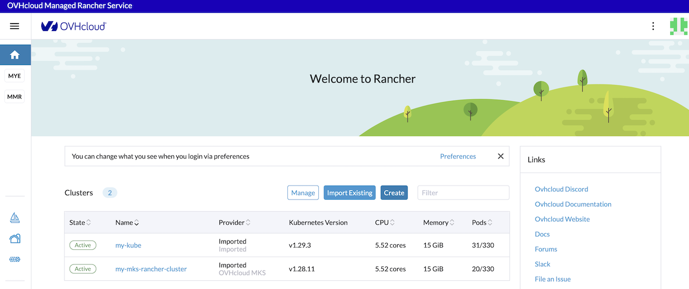
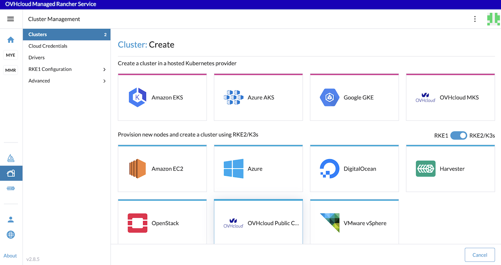
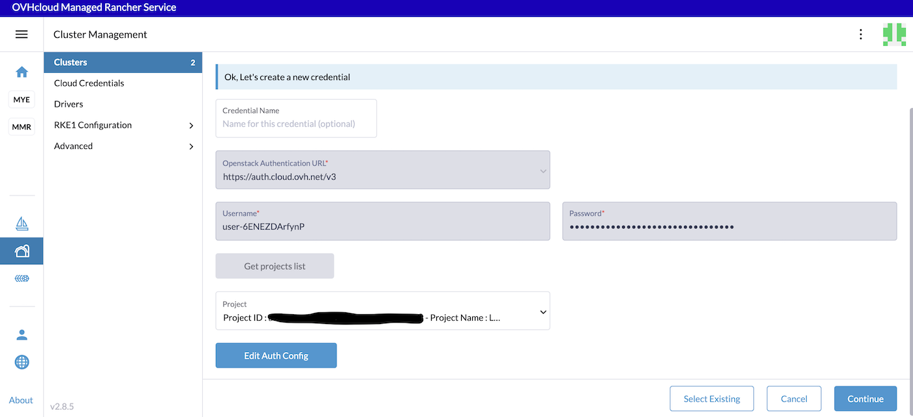
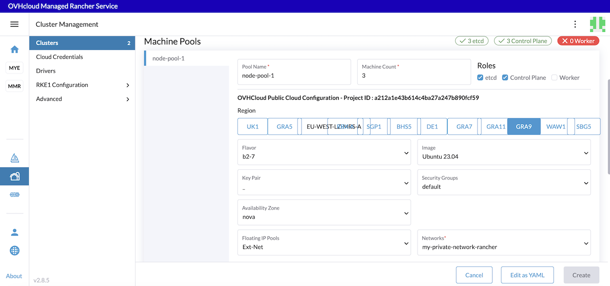
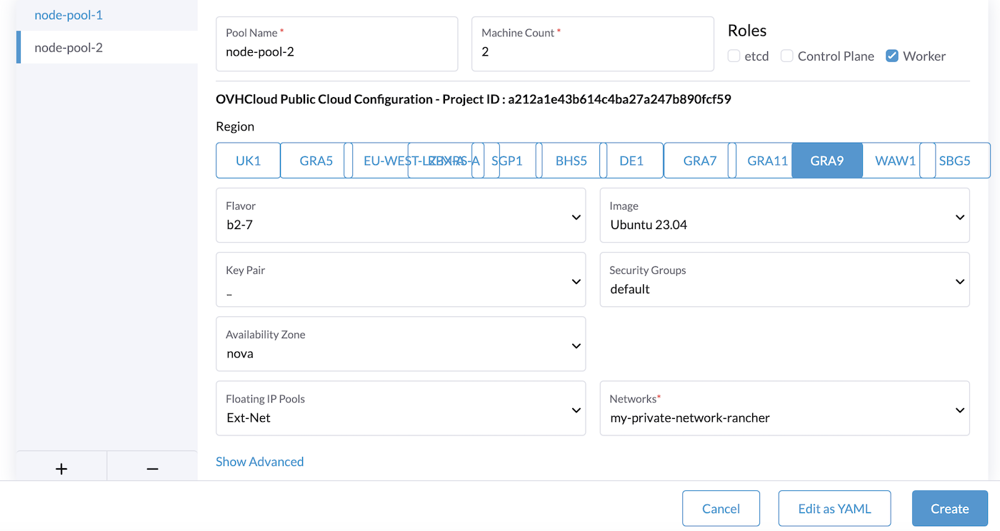
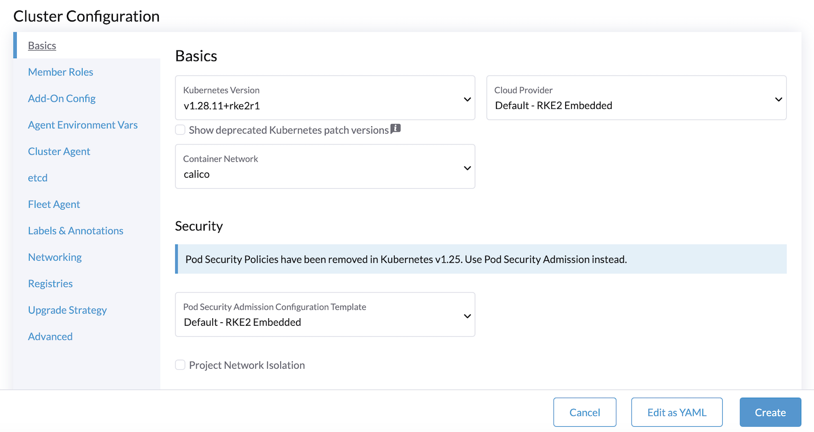

> [!warning]
>
> Usage of [Managed Rancher Service](https://labs.ovhcloud.com/en/managed-rancher-service/) is currently in Beta phase.
> This guide may be incomplete and will be extended during the beta phase. Our team remains available on our dedicated Discord Channel, do not hesitate to join and reach us : <https://discord.gg/ovhcloud>. Ask questions, provide feedback and interact directly with the team that builds our Container and Orchestration services.
>

## Objective

Managed Rancher Service by OVHcloud provides a powerful platform for orchestrating Kubernetes clusters seamlessly. You can use Rancher to launch a Kubernetes cluster on any platform and location including:

- Hosted Kubernetes provider (e.g. OVHcloud Managed Kubernetes Service, AWS EKS, GCP GKE, etc).
- Infrastructure Provider - Public Cloud or Private Cloud (vSphere, Nutanix, etc).
- Bare-metal servers, cloud hosted or on premise.
- Virtual machines, cloud hosted or on premise

In this guide we will explore how to **use OVHcloud as an Infrastructure Provider** and create a Kubernetes cluster based on [OVHcloud Compute Instances](https://www.ovhcloud.com/asia/public-cloud/compute/).

## Requirements

- A [Public Cloud project](https://www.ovhcloud.com/asia/public-cloud/) in your OVHcloud account
- An OVHcloud Managed Rancher Service (see the [creating a Managed Rancher Service](/pages/public_cloud/containers_orchestration/managed_rancher_service/create-update-rancher) guide for more information)
- An access to the Rancher UI to operate it (see the [connecting to the Rancher UI](/pages/public_cloud/containers_orchestration/managed_rancher_service/create-update-rancher) guide for more information)
- An [OpenStack user](https://help.ovhcloud.com/csm/en-gb-public-cloud-compute-openstack-users?id=kb_article_view&sysparm_article=KB0050636)
- A [private network with a Gateway](https://help.ovhcloud.com/csm/en-public-cloud-network-create-private-network-gateway?id=kb_article_view&sysparm_article=KB0050213)

## Instructions

### Creating a Kubernetes cluster on Compute Instances

Log in your Managed Rancher Service UI.

{.thumbnail}

Click on `Create`{.action} button.

{.thumbnail}

In Rancher you can create a Kubernetes cluster in different manner. To create a Kubernetes cluster running in Compute Instances, use the **Provision new nodes and create a cluster using RKE2/K3s** way and click on `OVHcloud Public Cloud`{.action} driver.

To create cloud credential, you need to have an existing **OpenStack user** with `` and `` roles in minimum. Please follow this guide to [create an OpenStack user](https://help.ovhcloud.com/csm/en-gb-public-cloud-compute-openstack-users?id=kb_article_view&sysparm_article=KB0050636) if you don't have one yet. 

Fill the OpenStack user's username and password and click on `Get projects list`{.action} button.

{.thumbnail}

Select your Public Cloud Project in this list and then click on `Continue`{.action} button.

{.thumbnail}

> [!warning]
>
> You don't have to click on the `Edit Auth Config`{.action} button.

Once created, the cloud credentials will be used to provision nodes in your cluster. You can reuse these credentials for other node templates or in other clusters.

Define the cluster name.

{.thumbnail}

In the **Machine Pools** section you will configure your cluster.

> [!primary]
>
> In Rancher when you configure a machine pool, there are three roles that can be assigned to nodes: `etcd`, `Control Plane` and `Worker`.

There are some good practices:

- At least 3 machines/nodes with the role `etcd` are needed to survive a loss of 1 node and have a minimum high availability configuration for etcd. 3 `etcd` nodes are generally sufficient for smaller and medium clusters, and 5 `etcd` nodes for large clusters.
- At least 2 machines/nodes with the role `Control Plane` for master component high availability.
- You can set both the `etcd` and `Control Plane` roles for one instance.
- The `Worker` role should not be used or added to nodes with the `etcd` or `Control Plane` role.
- At least 2 machines/nodes with the `Worker` role for workload rescheduling upon node failure.

In this guide we will:

- Create a machine pool with 3 compute instances for `etcd` and `Control Plane`
- Create a machine pool with 2 compute instances for `Worker` 

For each of the machine pool, you have to define:
- the pool name (`node-pool-1` for example for the first machine pool)
- machine count (3 for example for the first machine pool)
- select roles (check `etcd` and `Control Plane` for the first machine pool)
- choose the region (`GRA9` for exmple for the first machine pool). If you want to check the availability of specific products that you plan to use alongside Kubernetes, you can refer to the [Availability of Public Cloud Product](https://www.ovhcloud.com/asia/public-cloud/regions-availability/) page.
- choose the flavor (`b2-7` for example for ). You can refer to the [OVHcloud Flavor list](https://www.ovhcloud.com/asia/public-cloud/prices/).
- choose the image for the Operating System (OS) used for your machines/nodes. Please refer to [Rancher Operating Systems and Container Runtime Requirements](https://ranchermanager.docs.rancher.com/how-to-guides/new-user-guides/kubernetes-clusters-in-rancher-setup/node-requirements-for-rancher-managed-clusters).
- choose a Key Pair (optionnal). It's the SSH Key Pair that will be used to access your nodes. Please refer to this guide on [how to create a SSH KeyPair and add it to your Public Cloud project](https://help.ovhcloud.com/csm/en-gb-public-cloud-compute-getting-started?id=kb_article_view&sysparm_article=KB0051017). If you leave this field empty, a new keypair will be generated automatically.
- choose the Security Group that will be applied to created instances. You can leave the field empty.
- choose the Availability Zone (Only `nova` is supported at the moment).
- choose the Floating IP Pools (Only `Ext-Net` is supported at the moment)
- choose the Networks. You need to choose a private network (with a gateway). The compute instances will be created in this private network.

{.thumbnail}

At the bottom of the **Machine Pools** section, click on the `+`{.action} button to add the second machine pool with 2 `workers` machines/nodes and the same configuration.

{.thumbnail}

In the **Cluster Configuration** section, choose the Kubernetes version. You need to choose between RKE2 and K3s Kubernetes Operating System (OS). For production environment, we recommend to choose RKE2.
Select the `Container Network`, choose if you want to activate a Project Network isolation and the System Services tooling you want to isntall in your cluster.

{.thumbnail}

> [!primary]
>
> Follow the [RKE2 cluster configuration reference](https://ranchermanager.docs.rancher.com/reference-guides/cluster-configuration/rancher-server-configuration/rke2-cluster-configuration) for the Cluster Configuration.

In the **Member Roles** tab, you can add member for users that need to access the cluster.
After creating the cluster, you can also add members.

Finally, click on the `Create`{.action} button to create your Kubernetes cluster with OVHcloud PCI driver.

The cluster creation can take several minutes.

{.thumbnail}

### Testing the Kubernetes cluster 

To test your cluster, on the Rancher UI, in the **Cluster** menu, after selecting your cluster, you can simply click on the `Kubectl Shell`{.action} icon to open a terminal.

{.thumbnail}

List the nodes:

```bash
kubectl get nodes
```

{.thumbnail}

List the namespaces:

```bash
kubectl get ns
```

You can now install applications in your Kubernetes cluster though the `kubectl` CLI or the Rancher UI.

## Go further

- To have an overview of OVHcloud Managed Rancher Service, you can go to the [OVHcloud Managed Rancher Service page](https://www.ovhcloud.com/asia/public-cloud/managed-rancher-service/).

- If you need training or technical assistance to implement our solutions, contact your sales representative or click on [this link](https://www.ovhcloud.com/asia/professional-services/) to get a quote and ask our Professional Services experts for assisting you on your specific use case of your project.

- Join our community of users on <https://community.ovh.com/en/>.