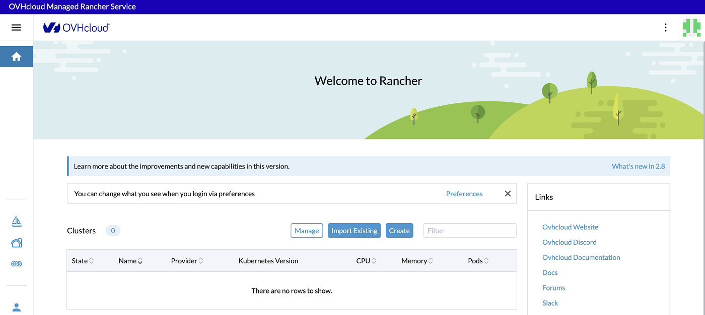
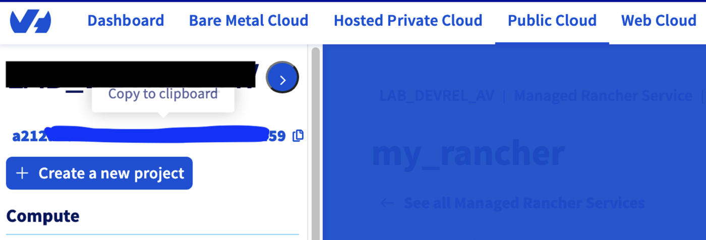

> [!warning]
>
> Usage of [Managed Rancher Service](https://labs.ovhcloud.com/en/managed-rancher-service/) is currently in Beta phase.
> This guide may be incomplete and will be extended during the beta phase. Our team remains available on our dedicated Discord Channel, do not hesitate to join and reach us : <https://discord.gg/ovhcloud>. Ask questions, provide feedback and interact directly with the team that builds our Container and Orchestration services.
>

## Objective

Managed Rancher Service by OVHcloud provides a powerful platform for orchestrating Kubernetes clusters seamlessly. In this guide we will explore how to create a Managed Kubernetes Service (MKS) cluster.

## Requirements

- A [Public Cloud project](https://www.ovhcloud.com/fr-ca/public-cloud/) in your OVHcloud account
- An OVHcloud Managed Rancher Service (see the [creating a Managed Rancher Service](/pages/public_cloud/containers_orchestration/managed_rancher_service/create-update-rancher) guide for more information)
- An access to the Rancher UI to operate it (see the [connecting to the Rancher UI](/pages/public_cloud/containers_orchestration/managed_rancher_service/create-update-rancher) guide for more information)

## Instructions

##### Creating a Managed Kubernetes Service (MKS) cluster

You can create your [OVHcloud Managed Kubernetes Service](https://www.ovhcloud.com/fr-ca/public-cloud/kubernetes/) clusters through the OVHcloud Control Panel, OVHcloud API, OVHcloud Terraform provider but managing several Kubernetes clusters can be complicated so let's discover how to create MKS cluster through Managed Rancher Service (MRS).

Log in your Managed Rancher Service UI.

{.thumbnail}

Click on `Create`{.action} button.

{.thumbnail}

In Rancher you can create a Kubernetes cluster in different manner. To create a MKS cluster, use the **hosted Kubernetes provider** way and click on `OVHcloud MKS`{.action} driver.

First, enter a MKS cluster name, for example `my-mks-cluster`:

{.thumbnail}

(Optionnal) You can configure **Member Roles** to control who has access to the cluster and what permission they have to change it. If you want to change the default parameters, click the `Add Member`{.action} button to add users that can access the cluster and use the Role drop-down menu to set permissions for each user.

(Optionnal) You can add **Labels & Annotations** on your cluster. If you want, click on `Add Label`{.action} button if you want to add some labels and on `Add Annotation`{.action} button if you want to add some annotations.

For the **Account Configuration** you need to provide your OVH API credentials (`Application Key`, `Application Secret` and `Consumer Key`).
If you don't have OVHcloud API credentials, you can follow our guide on how to [Generate your OVHcloud API keys](/pages/manage_and_operate/api/first-steps#advanced-usage-pair-ovhcloud-apis-with-an-application).

Provide also your `Public Cloud project ID`. The project ID is where your Managed Kubernetes Service (MKS) cluster will be deployed. You can follow the guide on [How to create your first Project](/pages/public_cloud/compute/create_a_public_cloud_project) or if already existing, you can copy/paste it from the OVHcloud Control Panel or [API](https://eu.api.ovh.com/console-preview/?section=%2Fcloud&branch=v1#get-/cloud/project).

{.thumbnail}

Finally, for this step, choose an `OVH API Endpoint`, depending on your location (EU, US or CA).

For the **Cluster Configuration**, you need to select the `Region` where your cluster will be deployed. Then, select the `Kubernetes Version`. Note that only versions supported by Rancher current version are listed (you can refer to the [Official Support Matrix](https://www.suse.com/suse-rancher/support-matrix/all-supported-versions)). Then, select `Update Policy` information. If you want further infirmation, refet to the [Managed Kubernetes Update Policies](/pages/public_cloud/containers_orchestration/managed_kubernetes/change-security-update) guide).

{.thumbnail}

For the **Network Configuration**, in the `Private Network ID` field, select an existing OVHcloud Public Cloud private network or choose `None` if you want to create a cluster with nodes using only public interfaces.

{.thumbnail}

For the **NodePools Configuration**, for every NodePool you want:
- Enter the **Name** of the NodePool. The name must be unique inside a same MKS cluster.
- Choose an OVHcloud Instance **Flavor** used by this NodePool.
- Enable or disable the Autoscaling.
- Enter the number of nodes you want, it's the **Size** of your NodePool. If the autoscaling is enabled, then choose the minimum and maximum number of nodes.
- Enable the **Monthly Billing** (Hourly billing by default).
- click on the `Add Node Pool`{.action} button to add the node pool in the list below.

You can add multiple Node Pools and then manage your list of Node Pools. Note that the "Delete" button (represented by a garbage icon) of your first NodePool is grayed out until a second one is created.

{.thumbnail}

Click on `Finish & Create Cluster`{.action} button.

Your MKS cluster is provisioning, the creation will take several minutes. 

{.thumbnail}

{.thumbnail}

When the MKS cluster become `Active`, click on the name of your cluster in order to jump into the **Cluster** view and have more information.

{.thumbnail}

You can click on the `Explore`{.action} button to manage your MKS Cluster.

> [!warning]
>
> Deploying to OVHcloud will incur charges. For more information, refer to the [MKS](https://www.ovhcloud.com/fr-ca/public-cloud/prices/#568) and [Compute](https://www.ovhcloud.com/fr-ca/public-cloud/prices/) pricing pages.
> Once your Managed Kubernetes clusters are created, we do recommend performing all actions (upgrade, nodepool management, cluster modification) from the Rancher console and not performing any action directly via the OVHcloud API, OVHcloud Terraform provider or the OVHcloud Control Panel as this can lead to desynchronizations.
>

## Go further

- To have an overview of OVHcloud Managed Rancher Service, you can go to the [OVHcloud Managed Rancher Service page](https://www.ovhcloud.com/fr-ca/public-cloud/managed-rancher-service/).

- If you need training or technical assistance to implement our solutions, contact your sales representative or click on [this link](https://www.ovhcloud.com/fr-ca/professional-services/) to get a quote and ask our Professional Services experts for assisting you on your specific use case of your project.

- Join our community of users on <https://community.ovh.com/en/>.