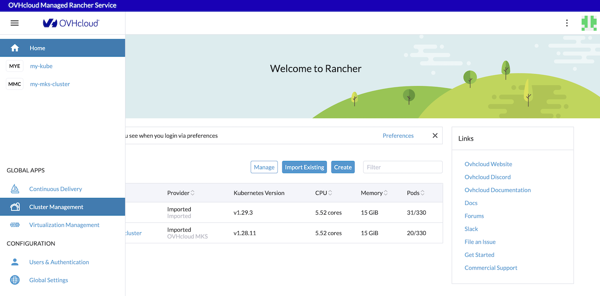
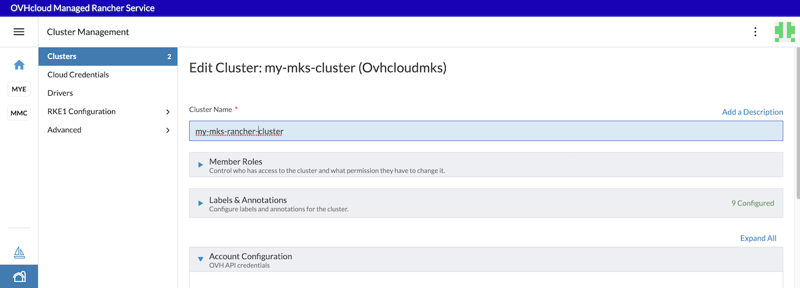
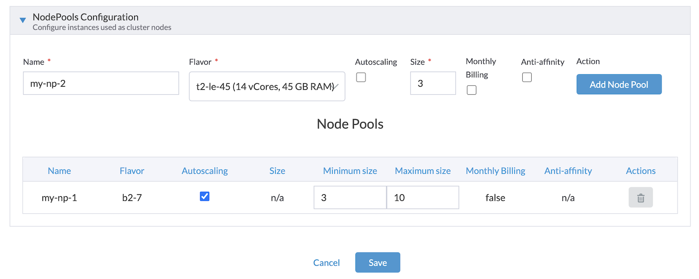

> [!warning]
>
> Usage of [Managed Rancher Service](https://labs.ovhcloud.com/en/managed-rancher-service/) is currently in Beta phase.
> This guide may be incomplete and will be extended during the beta phase. Our team remains available on our dedicated Discord Channel, do not hesitate to join and reach us : <https://discord.gg/ovhcloud>. Ask questions, provide feedback and interact directly with the team that builds our Container and Orchestration services.
>

## Objective

Managed Rancher Service by OVHcloud provides a powerful platform for orchestrating Kubernetes clusters seamlessly. In this guide we will explore how to edit the configuration of a Kubernetes cluster including the name, labels and annotations, the OVHcloud API credentials and even the update policy.

## Requirements

- A [Public Cloud project](https://www.ovhcloud.com/pt/public-cloud/) in your OVHcloud account
- An OVHcloud Managed Rancher Service (see the [creating a Managed Rancher Service](/pages/public_cloud/containers_orchestration/managed_rancher_service/create-update-rancher) guide for more information)
- An access to the Rancher UI to operate it (see the [connecting to the Rancher UI](/pages/public_cloud/containers_orchestration/managed_rancher_service/create-update-rancher) guide for more information)
- An existing Kubernetes cluster you created or imported in Managed Rancher Service (MRS)

## Instructions

Through the Rancher UI you can edit several information about a Kubernetes cluster you created or imported.

Log in your Managed Rancher Service UI.
In the menu, click on the `Cluster Management`{.action} button: 

{.thumbnail}

For the Kubernetes cluster you wanted, click on the three dots button and then on `Edit Config`{.action} button.

{.thumbnail}

You can now edit the name of the cluster. In this example we changed `my-mks-cluster` to `my-mks-rancher-cluster`:

{.thumbnail}

You can also change **Member Roles**, in order to control who have access and with which permissions to your cluster, by adding or removing members.

{.thumbnail}

You can see **Labels & Annotations** added automatically by Rancher, and add new one if you want.

{.thumbnail}

**OVH API credentials** can be modified too in this page. Edit them if you defined credentials that have expired.

{.thumbnail}

You can change the Kubernetes version and the Update Policy:

{.thumbnail}

You can also add new Node Pool or edit existing ones:

{.thumbnail}

Finally, click on the `Save`{.action} button to save the changes to your cluster.

The cluster will be in `Updating` state during the changing period and `Active` again after the changes.

## Go further

- To have an overview of OVHcloud Managed Rancher Service, you can go to the [OVHcloud Managed Rancher Service page](https://www.ovhcloud.com/pt/public-cloud/managed-rancher-service/).

- If you need training or technical assistance to implement our solutions, contact your sales representative or click on [this link](https://www.ovhcloud.com/pt/professional-services/) to get a quote and ask our Professional Services experts for assisting you on your specific use case of your project.

- Join our community of users on <https://community.ovh.com/en/>.